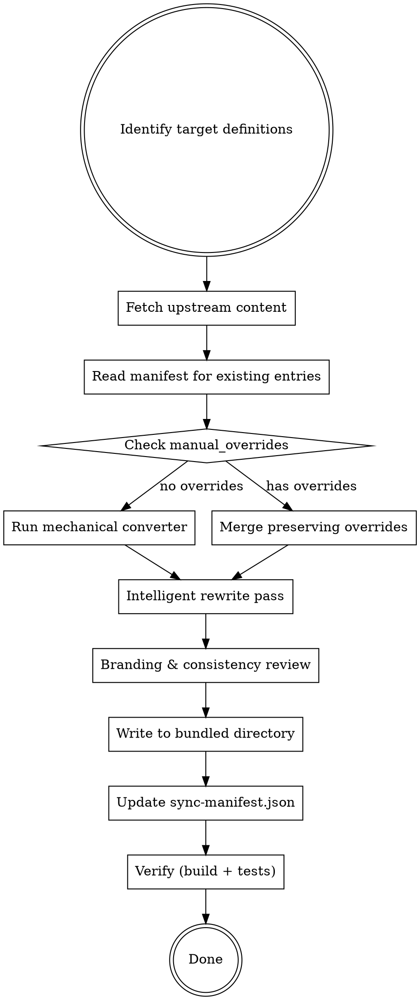

# Convert CC Definitions

Import and convert agent, skill, and command definitions written in Claude Code (CC) format — primarily from the Compound Engineering Plugin (CEP) upstream — into Systematic's bundled assets. Applies mechanical conversion via the converter pipeline, then intelligent LLM-powered rewrites to ensure definitions work correctly in OpenCode.

**This is NOT a copy-paste operation.** Systematic is a cohesive OpenCode plugin, not a mirror. Every imported definition must be evaluated, adapted, and branded for the Systematic ecosystem.

## When to Use

- Importing new definitions from CEP or Superpowers upstream repos
- Re-syncing existing bundled definitions after upstream changes
- Converting a one-off CC definition file for inclusion in Systematic
- Populating `sync-manifest.json` entries for existing bundled content

## When NOT to Use

- Writing new Systematic-native skills/agents/commands (use `creating-agent-skills` skill instead)
- Editing existing bundled content that has no upstream source
- Converting definitions for a different project (use the CLI: `systematic convert`)

## Core Workflow



## Phase 1: Identify and Fetch

### 1a. Identify Upstream Sources

Determine what to import. Supported sources:

| Source | Repo | Content |
|--------|------|---------|
| **CEP** | `EveryInc/compound-engineering-plugin` | Agents, skills, commands |
| **Superpowers** | `obra/superpowers` | Skills (personal workflow skills) |
| **Local file** | N/A | Single CC-format .md file |

For GitHub repos, use `gh` CLI to fetch content:

```bash
# Fetch a specific file from CEP
gh api repos/EveryInc/compound-engineering-plugin/contents/agents/review/security-sentinel.md \
  --jq '.content' | base64 -d > /tmp/upstream-security-sentinel.md

# Get the latest commit SHA for the file
gh api repos/EveryInc/compound-engineering-plugin/commits?path=agents/review/security-sentinel.md\&per_page=1 \
  --jq '.[0].sha'

# Get content hash for change detection
shasum -a 256 /tmp/upstream-security-sentinel.md | cut -d' ' -f1
```

### 1b. Check Existing Manifest

Read `sync-manifest.json` to determine if this is a new import or an update:

```bash
# Check if definition already exists in manifest
cat sync-manifest.json | jq '.definitions["agents/review/security-sentinel"]'
```

If updating an existing definition:
- Compare `upstream_content_hash` with current upstream to detect changes
- Check `manual_overrides` — these fields/sections MUST be preserved
- Review `rewrites` log — these intelligent rewrites should be re-applied

### 1c. Evaluate Fit

**STOP and evaluate before converting.** Not all upstream definitions belong in Systematic. Present your evaluation to the user before proceeding.

**Evaluation criteria (ALL must pass):**

1. **Gap analysis:** Does this fill a gap in Systematic's current capabilities? Run `bun src/cli.ts list <type>` to check.
2. **Philosophy fit:** Is it consistent with Systematic's opinionated workflow approach? (Structured phases, explicit deliverables, skill-driven discipline)
3. **Overlap check:** Does it duplicate an existing bundled definition? If partial overlap, propose enhancing the existing definition instead.
4. **Dependency check:** Does the definition reference agents, skills, or commands that don't exist in Systematic? List any missing dependencies — note as WARN (they can be imported later using this skill, and references should be kept).
5. **User value:** Would a Systematic plugin user actually invoke this? Niche CC-specific tools (e.g., `feature-video`, `test-browser`) may not translate.

**Present your evaluation as a table:**

```markdown
| Criterion | Pass/Fail | Notes |
|-----------|-----------|-------|
| Gap analysis | PASS | No existing code review simplification agent |
| Philosophy fit | PASS | Structured review methodology |
| Overlap check | PASS | No overlap with existing review agents |
| Dependencies | WARN | References `resolve_todo_parallel` command (not in Systematic) |
| User value | PASS | General-purpose, not framework-specific |
```

If any criterion fails, document why and **do not proceed** unless the user explicitly overrides.

## Phase 2: Mechanical Conversion

**Consult `docs/CONVERSION-GUIDE.md` for the authoritative field mapping reference.** That document has the complete tables for frontmatter fields, tool names, paths, and edge cases.

Apply the existing converter pipeline. This handles:
- Tool name mappings (`Task` -> `task`, `TodoWrite` -> `todowrite`, etc.)
- Path replacements (`.claude/` -> `.opencode/`, `CLAUDE.md` -> `AGENTS.md`)
- Prefix conversions (`compound-engineering:` -> `systematic:`)
- Frontmatter field mapping (tools array->map, permissionMode->permission, maxSteps->steps, etc.)
- Model normalization (provider prefix)

**For a single file via CLI:**

```bash
bun src/cli.ts convert agent /tmp/upstream-security-sentinel.md
```

> **Tip:** Use `bun src/cli.ts` for local development instead of `bunx systematic` to avoid slow resolution.

**For programmatic use:**

```typescript
import { convertContent } from './lib/converter.js'
const converted = convertContent(upstreamContent, 'agent')
```

**What mechanical conversion does NOT handle** (requires intelligent rewrite):
- Description enhancement with trigger conditions
- Branding beyond regex patterns (contextual references to "Claude Code", "Claude", "CEP")
- Content restructuring for Systematic's style
- Removing CC-specific features with no OC equivalent (`${CLAUDE_SESSION_ID}`)
- Adding Systematic-specific sections (integration points, skill cross-references)
- **Tool/path references inside code blocks** — the converter skips fenced code blocks to avoid false positives, so `Task()`, `TodoWrite`, `CLAUDE.md`, `.claude/skills/` inside ``` blocks must be fixed manually
- **Attribution badges and footers** inside heredoc code blocks (commit messages, PR bodies)
- **CC-specific features with no OC equivalent** (Swarm Mode / `Teammate` API, "remote" execution via Claude Code web)
- **Frontmatter quoting normalization** — the converter may change double quotes to single quotes in `argument-hint` and other frontmatter string values. This is cosmetic but verify quoting consistency after conversion.

## Phase 3: Intelligent Rewrite

This is the critical step that distinguishes a good import from a broken one. Every converted definition MUST go through intelligent rewrite.

### 3a. Description Rewrite

CC descriptions are typically short and capability-focused. OC descriptions must include **trigger conditions** for auto-invocation.

**CC style (bad for OC):**
```yaml
description: Reviews code for unnecessary complexity and suggests simplifications
```

**OC/Systematic style (good):**
```yaml
description: "Use this agent when you need a final review pass focused on simplicity, YAGNI principles, and removing unnecessary complexity. <example>...</example>"
```

**Rewrite rules for descriptions:**
- Start with "Use this agent/skill/command when..." or "This skill should be used when..."
- Include specific trigger symptoms and situations
- For agents: include `<example>` blocks showing context + user message + assistant response + commentary
- Max 1024 characters total for skill descriptions
- Write in third person (injected into system prompt)

### 3b. Branding Audit

The mechanical converter catches regex-matchable patterns. You must catch contextual ones:

| Pattern to find | Replacement |
|-----------------|-------------|
| "Claude Code" (the product) | "OpenCode" |
| "Claude" (the AI model, in instructions) | Keep — model name is fine |
| "CEP" or "Compound Engineering Plugin" | "Systematic" |
| "claude-code" (in paths not caught by converter) | "opencode" |
| References to CC-specific behavior | Adapt or remove |
| `Task agent-name("prompt")` patterns | `task` tool or `@agent-name` |
| `TodoWrite` in prose (not just tool calls) | `todowrite` or "update your task list" |

### 3c. Content Adaptation

Review and adapt the body content for Systematic's style:

**For agents:**
- Ensure the system prompt is self-contained (agent definitions are the full prompt)
- Add structured output format if missing (numbered phases, deliverables)
- Reference Systematic tools and skill cross-references where appropriate
- Match temperature/mode conventions (see `docs/CONVERSION-GUIDE.md`)

**For skills:**
- Add "When to Use" / "When NOT to Use" sections if missing
- Add integration points with other Systematic workflows
- Add cross-references to related bundled skills/commands
- Ensure progressive disclosure (SKILL.md + references/ if content is heavy)

**For commands:**
- Verify slash command sequences use `systematic:` prefix
- Ensure `$ARGUMENTS` and positional args are correct (OC is 1-indexed)
- Verify referenced agents and skills exist in Systematic's bundled set
- **Keep references to not-yet-imported agents/skills** — they will be brought over later using this same skill and will keep their names. Only apply mechanical CC→OC tool/path conversion, not removal.

### 3d. Code Block Audit

The mechanical converter intentionally skips content inside fenced code blocks to avoid false positives. You MUST manually audit all code blocks for:

| Pattern in code blocks | Action |
|------------------------|--------|
| `Task(agent-name)` or `Task({ ... })` | → `task(agent-name)` / `task({ ... })` |
| `TodoWrite` | → `todowrite` |
| `CLAUDE.md` | → `AGENTS.md` |
| `.claude/skills/` or `.claude/` paths | → `.opencode/skills/` or `.opencode/` |
| `Teammate({ operation: ... })` | Add aspirational note or adapt to `task` with background execution |
| Attribution badges/footers (`Compound Engineered`, `Claude Code` links) | → Systematic branding |
| `AskUserQuestion` | → `question tool` |

### 3e. CC-Specific Features

Some CC features have no direct OC equivalent. For each, make a case-by-case decision:

| CC Feature | OC Equivalent | Recommendation |
|------------|---------------|----------------|
| `Teammate` API (spawnTeam, requestShutdown, cleanup) | None — `task` with `run_in_background` is partial | Keep as aspirational reference with explanatory note |
| "Remote" execution (Claude Code web background) | None | Remove — no OC equivalent exists |
| `${CLAUDE_SESSION_ID}` | None | Remove |
| `AskUserQuestion` with complex schemas | `question` tool (simpler) | Adapt to OC's question tool format |

Present CC-specific feature decisions to the user before proceeding.

### 3f. Quality Checklist

Before writing the file, verify:

- [ ] Frontmatter parses without errors
- [ ] Description includes trigger conditions (not just capability summary)
- [ ] No stale references to Claude Code, CEP, `.claude/` paths
- [ ] Tool references use OC names (`task`, `todowrite`, `google_search`, `systematic_skill`)
- [ ] **Code blocks audited** — tool names, paths, and branding inside ``` blocks are fixed
- [ ] Attribution badges/footers in heredoc code blocks updated to Systematic branding
- [ ] CC-specific features with no OC equivalent handled (removed, adapted, or noted as aspirational)
- [ ] Cross-referenced agents/skills/commands exist in Systematic (or are marked for future import)
- [ ] Content matches Systematic's style (structured phases, explicit deliverables)
- [ ] Agent `mode` field is set (`subagent`, `primary`, or `all`)
- [ ] Agent `temperature` is appropriate for the agent's purpose

## Phase 4: Write and Register

### 4a. Place the File

| Type | Location | Naming |
|------|----------|--------|
| Agent | `agents/<category>/<name>.md` | kebab-case, category from purpose |
| Skill | `skills/<name>/SKILL.md` | kebab-case directory |
| Command | `commands/<name>.md` or `commands/workflows/<name>.md` | kebab-case, `workflows/` for workflow commands |

Categories for agents: `design/`, `research/`, `review/`, `workflow/`

### 4b. Update sync-manifest.json

**Every imported definition MUST have a manifest entry.** This is not optional.

**Use the `date` CLI to generate the `synced_at` timestamp in ISO 8601 UTC format:**

```bash
date -u +'%Y-%m-%dT%H:%M:%SZ'
```

Run this once at the start of a batch import and use the same timestamp for all entries in that batch.

```json
{
  "definitions": {
    "agents/review/security-sentinel": {
      "source": "cep",
      "upstream_path": "agents/review/security-sentinel.md",
      "upstream_commit": "abc123def456...",
      "synced_at": "<run: date -u +'%Y-%m-%dT%H:%M:%SZ'>",
      "notes": "Imported from CEP. Enhanced description with trigger examples. Updated tool references.",
      "upstream_content_hash": "sha256-of-upstream-content",
      "rewrites": [
        {
          "field": "description",
          "reason": "CC description lacked OC trigger conditions and examples",
          "original": "Security audits, vulnerability assessment, OWASP compliance"
        },
        {
          "field": "body:branding",
          "reason": "Contextual reference to Claude Code in analysis instructions"
        }
      ],
      "manual_overrides": []
    }
  }
}
```

**Manifest key format:** Repo-relative path without file extension.
- Agents: `agents/<category>/<name>`
- Skills: `skills/<name>`
- Commands: `commands/<name>` or `commands/workflows/<name>`

**Ensure `sources` has an entry for the upstream repo:**

```json
{
  "sources": {
    "cep": {
      "repo": "EveryInc/compound-engineering-plugin",
      "branch": "main",
      "url": "https://github.com/EveryInc/compound-engineering-plugin"
    },
    "superpowers": {
      "repo": "obra/superpowers",
      "branch": "main",
      "url": "https://github.com/obra/superpowers"
    }
  }
}
```

### 4c. Record Rewrites

**Every intelligent rewrite MUST be logged in the `rewrites` array.** This is how future syncs know what to re-apply.

Each rewrite entry needs:
- `field`: What was changed (`description`, `body:branding`, `body:tool-references`, `body:structure`, `frontmatter:<field>`)
- `reason`: Why (one sentence)
- `original`: The original value before rewrite (optional but recommended for descriptions)

### 4d. Respect Manual Overrides

If `manual_overrides` contains field names, those fields/sections were customized by a human. On re-import:
1. Read the current bundled file
2. Extract the overridden fields/sections
3. Apply conversion to non-overridden content
4. Merge overrides back in
5. Update manifest `synced_at` and `upstream_commit` but keep `manual_overrides` intact

**To mark a field as manually overridden** (done by a human contributor, not by this skill):
```bash
# Edit sync-manifest.json directly
jq '.definitions["agents/review/security-sentinel"].manual_overrides += ["description"]' sync-manifest.json > tmp.json && mv tmp.json sync-manifest.json
```

## Phase 5: Verify

### 5a. Build and Test

```bash
bun run build && bun run typecheck && bun run lint && bun test
```

### 5b. Validate Converted Content

```bash
# Check the definition loads via the plugin
bun src/cli.ts list agents
bun src/cli.ts list skills
bun src/cli.ts list commands

# For agents: verify frontmatter extracts correctly
bun test tests/unit/agents.test.ts

# For skills: verify skill loading
bun test tests/unit/skills.test.ts

# Integration: verify conversion round-trip
bun test tests/integration/converter-validation.test.ts
```

### 5c. Manual Spot-Check

For each converted definition, verify:
1. `systematic_skill` tool lists it (for skills)
2. Agent config merges correctly (for agents)
3. Command is available via slash prefix (for commands)

## Re-Sync Workflow (Updating Existing Definitions)

When pulling upstream changes for an already-imported definition:

1. **Read manifest entry** — Get `upstream_content_hash`, `rewrites`, `manual_overrides`
2. **Fetch upstream** — Get current content and compute hash
3. **Compare hashes** — If unchanged, skip (idempotent)
4. **Diff upstream changes** — Use `git diff` or text diff to understand what changed
5. **Re-apply mechanical conversion** on the new upstream content
6. **Re-apply rewrites** from the manifest log — same fields, same reasons, adapted to new content
7. **Preserve manual_overrides** — Merge from current bundled file
8. **Update manifest** — New commit SHA, hash, timestamp (`date -u +'%Y-%m-%dT%H:%M:%SZ'`). Update rewrites if they changed.
9. **Verify** — Build, test, spot-check

## Batch Import

For importing multiple definitions at once:

1. List target definitions (files to import)
2. For each definition, run Phases 1-4 sequentially
3. Run Phase 5 once at the end (build/test covers all)
4. Commit all changes together with a descriptive message:

```bash
git add agents/ skills/ commands/ sync-manifest.json
git commit -m "feat: import N definitions from CEP upstream (commit abc123)"
```

## Red Flags — STOP If You Think This

| Thought | Reality |
|---------|---------|
| "The converter handles everything" | Converter is mechanical only — you MUST do intelligent rewrite |
| "The description is fine as-is" | CC descriptions lack trigger conditions. Always rewrite. |
| "I'll update the manifest later" | Manifest update is part of the workflow, not a follow-up |
| "This is just a quick import" | Every import requires evaluation, conversion, rewrite, manifest, verification |
| "I don't need to check for branding" | Regex misses contextual references. Always audit manually. |
| "I'll skip the evaluation since the user asked for it" | User request != automatic fit. Evaluate and present findings. |
| "Manual overrides don't apply — this is a new import" | Check anyway. Previous imports may have been customized since. |

## Anti-Patterns

| Anti-Pattern | Correct Approach |
|--------------|-----------------|
| Copy file and only run converter | Always do intelligent rewrite pass |
| Import everything from upstream | Curate — evaluate fit before importing |
| Skip manifest update | Every import MUST have a manifest entry |
| Overwrite human edits on re-sync | Check `manual_overrides` first |
| Leave CC descriptions as-is | Rewrite with OC trigger conditions |
| Forget to log rewrites | Every intelligent change goes in `rewrites[]` |
| Import definition that duplicates existing | Enhance existing instead |
| Skip branding audit | Always check for contextual Claude/CEP references |

## Handling Upstream Deletions

If an upstream file was deleted but the manifest still has an entry:

1. The `findStaleEntries()` function in `src/lib/manifest.ts` detects these
2. Do NOT auto-remove the bundled definition — it may have been intentionally kept
3. Flag to the user: "Upstream deleted `<path>`. Keep local copy or remove?"
4. If removing: delete the bundled file AND the manifest entry
5. If keeping: add `"manual_overrides": ["*"]` to indicate full local ownership

## Reference: Existing Bundled Content

**Always check live inventory** — this list may be stale:

```bash
bun src/cli.ts list agents
bun src/cli.ts list skills
bun src/cli.ts list commands
```

## Reference: Key Files

| File | Purpose |
|------|---------|
| `src/lib/converter.ts` | Mechanical conversion pipeline |
| `src/lib/manifest.ts` | Manifest types and read/write/validate |
| `sync-manifest.json` | Provenance data (repo root) |
| `sync-manifest.schema.json` | JSON Schema for manifest |
| `docs/CONVERSION-GUIDE.md` | Full field mapping reference |
