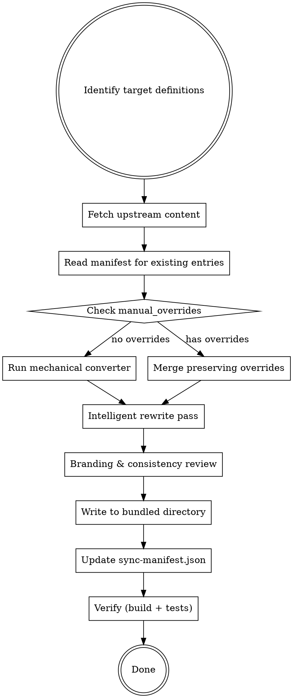

# Convert CC Definitions

Import and convert agent, skill, and command definitions written in Claude Code (CC) format — primarily from the Compound Engineering Plugin (CEP) upstream — into Systematic's bundled assets. Applies mechanical conversion via the converter pipeline, then intelligent LLM-powered rewrites to ensure definitions work correctly in OpenCode.

**This is NOT a copy-paste operation.** Systematic is a cohesive OpenCode plugin, not a mirror. Every imported definition must be evaluated, adapted, and branded for the Systematic ecosystem.

## When to Use

- Importing new definitions from CEP or Superpowers upstream repos
- Re-syncing existing bundled definitions after upstream changes
- Converting a one-off CC definition file for inclusion in Systematic
- Populating `sync-manifest.json` entries for existing bundled content

## When NOT to Use

- Writing new Systematic-native skills/agents/commands (use `create-agent-skills` skill instead)
- Editing existing bundled content that has no upstream source
- Converting definitions for a different project (use the CLI: `systematic convert`)

## Core Workflow



## Phase 1: Identify and Fetch

### 1a. Identify Upstream Sources

Determine what to import. Supported sources:

| Source | Repo | Content |
|--------|------|---------|
| **CEP** | `EveryInc/compound-engineering-plugin` | Agents, skills, commands |
| **Superpowers** | `obra/superpowers` | Skills (personal workflow skills) |
| **Local file** | N/A | Single CC-format .md file |

For GitHub repos, use `gh` CLI to fetch content. Note: CEP content lives under `plugins/compound-engineering/` — always use the full path:

```bash
# Fetch a specific file from CEP (note the full path under plugins/)
gh api repos/EveryInc/compound-engineering-plugin/contents/plugins/compound-engineering/agents/review/security-sentinel.md \
  --jq '.content' | base64 -d > /tmp/upstream-security-sentinel.md

# Get the latest commit SHA for the agents directory
gh api "repos/EveryInc/compound-engineering-plugin/commits?path=plugins/compound-engineering/agents&per_page=1" \
  --jq '.[0].sha'

# Get content hash for change detection
shasum -a 256 /tmp/upstream-security-sentinel.md | cut -d' ' -f1
```

**Batch fetch pattern** — for importing multiple files, loop over a list:

```bash
mkdir -p /tmp/cep-upstream
AGENTS=("review/architecture-strategist" "research/best-practices-researcher" "workflow/bug-reproduction-validator")
for agent_path in "${AGENTS[@]}"; do
  name=$(basename "$agent_path")
  gh api "repos/EveryInc/compound-engineering-plugin/contents/plugins/compound-engineering/agents/${agent_path}.md" \
    --jq '.content' | base64 -d > "/tmp/cep-upstream/${name}.md"
  shasum -a 256 "/tmp/cep-upstream/${name}.md"
done
```

**Recursive file listing** — the contents API fails on subdirectories. Use the git tree API for a complete one-shot listing:

```bash
# List ALL files under skills/ recursively (one API call)
gh api "repos/EveryInc/compound-engineering-plugin/git/trees/<COMMIT_SHA>?recursive=1" \
  --jq '.tree[] | select(.path | startswith("plugins/compound-engineering/skills/")) | select(.type == "blob") | .path' \
  | sed 's|plugins/compound-engineering/skills/||'
```

**Skill folders** — Skills are directories, not just SKILL.md files. A skill folder may contain references/, templates/, workflows/, scripts/, assets/, and schema files. The CLI converter (`bun src/cli.ts convert skill`) ONLY processes SKILL.md files. All other files in the skill folder must be:
1. Fetched from upstream individually via the contents API
2. Copied to the local skill directory, preserving the folder structure
3. Manually rewritten with CC→OC text replacements (`.claude/` → `.opencode/`, `CLAUDE.md` → `AGENTS.md`, `Claude Code` → `OpenCode`, `compound-engineering:` → `systematic:`, etc.)
4. `${CLAUDE_PLUGIN_ROOT}/skills/<name>/...` paths simplified to relative paths (skills are bundled in the plugin — no env var prefix needed)

### Discovering Sub-Files for New Skills

When importing a **new** skill (not yet in the manifest), you must discover ALL files in the skill directory before fetching. There are two ways to get the file list:

**Option A: Use precheck `newUpstreamFiles` (automated sync)** — When running via the sync-cep workflow, the precheck summary includes a `newUpstreamFiles` map that lists all files for each new definition:

```json
{
  "newUpstreamFiles": {
    "skills/every-style-editor": ["SKILL.md", "references/EVERY_WRITE_STYLE.md"],
    "skills/gemini-imagegen": ["SKILL.md", "requirements.txt", "scripts/generate.py", "scripts/setup.sh"]
  }
}
```

Use this file list directly — it was collected from the upstream git tree and is authoritative.

**Option B: Query the git tree API (manual import)** — When importing outside the sync-cep workflow, discover files yourself:

```bash
# Get the full tree and filter for the skill directory
gh api "repos/EveryInc/compound-engineering-plugin/git/trees/main?recursive=1" \
  --jq '.tree[] | select(.path | startswith("plugins/compound-engineering/skills/<name>/")) | select(.type == "blob") | .path' \
  | sed 's|plugins/compound-engineering/skills/<name>/||'
```

**After discovering the file list**, fetch each file individually using the contents API:

```bash
for file in SKILL.md references/guide.md scripts/setup.sh; do
  mkdir -p "/tmp/cep-upstream/<skill-name>/$(dirname "$file")"
  gh api "repos/EveryInc/compound-engineering-plugin/contents/plugins/compound-engineering/skills/<skill-name>/${file}" \
    --jq '.content' | base64 -d > "/tmp/cep-upstream/<skill-name>/${file}"
done
```

**CRITICAL**: Failing to discover sub-files results in incomplete skill imports — only SKILL.md gets copied while references/, scripts/, assets/ etc. are silently dropped. This renders many skills non-functional.

### 1b. Check Existing Manifest

Read `sync-manifest.json` to determine if this is a new import or an update:

```bash
# Check if definition already exists in manifest
cat sync-manifest.json | jq '.definitions["agents/review/security-sentinel"]'
```

If updating an existing definition:
- Compare `upstream_content_hash` with current upstream to detect changes
- Check `manual_overrides` — these fields/sections MUST be preserved
- Review `rewrites` log — these intelligent rewrites should be re-applied

### 1c. Evaluate Fit

**STOP and evaluate before converting.** Not all upstream definitions belong in Systematic. Present your evaluation to the user before proceeding.

**Evaluation criteria (ALL must pass):**

1. **Gap analysis:** Does this fill a gap in Systematic's current capabilities? Run `bun src/cli.ts list <type>` to check.
2. **Philosophy fit:** Is it consistent with Systematic's opinionated workflow approach? (Structured phases, explicit deliverables, skill-driven discipline)
3. **Overlap check:** Does it duplicate an existing bundled definition? If partial overlap, propose enhancing the existing definition instead.
4. **Dependency check:** Does the definition reference agents, skills, or commands that don't exist in Systematic? List any missing dependencies — note as WARN (they can be imported later using this skill, and references should be kept).
5. **Phantom check:** If importing agents or skills referenced by commands, verify they actually exist upstream. Commands may reference definitions that were never created upstream ("phantoms"). Fetch the upstream directory listing to confirm:
   ```bash
   # Check agents
   gh api repos/EveryInc/compound-engineering-plugin/contents/plugins/compound-engineering/agents/review \
     --jq '.[].name'
   # Check skills
   gh api "repos/EveryInc/compound-engineering-plugin/git/trees/<COMMIT_SHA>?recursive=1" \
     --jq '.tree[] | select(.path | startswith("plugins/compound-engineering/skills/")) | select(.type == "tree") | .path' \
     | sed 's|plugins/compound-engineering/skills/||' | grep -v '/'
   ```
6. **User value:** Would a Systematic plugin user actually invoke this? Niche CC-specific tools (e.g., `feature-video`, `test-browser`) may not translate.

**Present your evaluation as a table:**

```markdown
| Criterion | Pass/Fail | Notes |
|-----------|-----------|-------|
| Gap analysis | PASS | No existing code review simplification agent |
| Philosophy fit | PASS | Structured review methodology |
| Overlap check | PASS | No overlap with existing review agents |
| Dependencies | WARN | References `resolve_todo_parallel` command (not in Systematic) |
| User value | PASS | General-purpose, not framework-specific |
```

If any criterion fails, document why and **do not proceed** unless the user explicitly overrides.

## Phase 2: Mechanical Conversion

**Consult `docs/CONVERSION-GUIDE.md` for the authoritative field mapping reference.** That document has the complete tables for frontmatter fields, tool names, paths, and edge cases.

Apply the existing converter pipeline. This handles:
- Tool name mappings (`Task` -> `task`, `TodoWrite` -> `todowrite`, etc.)
- Path replacements (`.claude/` -> `.opencode/`, `CLAUDE.md` -> `AGENTS.md`)
- Prefix conversions (`compound-engineering:` -> `systematic:`)
- Frontmatter field mapping (tools array->map, permissionMode->permission, maxSteps->steps, etc.)
- Model normalization (provider prefix)

> **Note:** The `color` field in CC agent frontmatter (e.g., `color: violet`) is passed through by the converter. OpenCode does not currently use this field, but it is harmless to keep.

**For a single file via CLI:**

```bash
bun src/cli.ts convert agent /tmp/upstream-security-sentinel.md
```

> **Tip:** Use `bun src/cli.ts` for local development instead of `bunx systematic` to avoid slow resolution.

**For programmatic use:**

```typescript
import { convertContent } from './lib/converter.js'
const converted = convertContent(upstreamContent, 'agent')
```

**What mechanical conversion does NOT handle** (requires intelligent rewrite):
- Description enhancement with trigger conditions
- Branding beyond regex patterns (contextual references to "Claude Code", "Claude", "CEP")
- Content restructuring for Systematic's style
- Removing CC-specific features with no OC equivalent (`${CLAUDE_SESSION_ID}`)
- Adding Systematic-specific sections (integration points, skill cross-references)
- **Skill path patterns in body text** — the converter handles `.claude/` -> `.opencode/` in general, but does NOT handle `~/.claude/skills/` -> `~/.config/opencode/skills/` or bare `.claude/skills/` -> `.opencode/skills/` references embedded in skill-discovery instructions. Audit these manually.
- **Tool/path references inside code blocks** — the converter skips fenced code blocks to avoid false positives, so `Task()`, `TodoWrite`, `CLAUDE.md`, `.claude/skills/` inside ``` blocks must be fixed manually
- **Attribution badges and footers** inside heredoc code blocks (commit messages, PR bodies)
- **CC-specific features with no OC equivalent** (Swarm Mode / `Teammate` API, "remote" execution via Claude Code web)
- **CC-specific exclusion rules** — some agents reference `compound-engineering pipeline artifacts` or other CC-specific content (e.g., `docs/plans/*.md` exclusions) that should be removed as they're not applicable to Systematic
- **Frontmatter quoting normalization** — the converter may change double quotes to single quotes in `argument-hint` and other frontmatter string values. This is cosmetic but verify quoting consistency after conversion.

## Phase 3: Intelligent Rewrite

This is the critical step that distinguishes a good import from a broken one. Every converted definition MUST go through intelligent rewrite.

### 3a. Description Rewrite

CC descriptions are typically short and capability-focused. OC descriptions must include **trigger conditions** for auto-invocation.

**CC style (bad for OC):**
```yaml
description: Reviews code for unnecessary complexity and suggests simplifications
```

**OC/Systematic style (good):**
```yaml
description: "Use this agent when you need a final review pass focused on simplicity, YAGNI principles, and removing unnecessary complexity. <example>...</example>"
```

**Rewrite rules for descriptions:**
- Start with "Use this agent/skill/command when..." or "This skill should be used when..."
- Include specific trigger symptoms and situations
- For agents: include `<example>` blocks showing context + user message + assistant response + commentary
- Max 1024 characters total for skill descriptions
- Write in third person (injected into system prompt)

### 3b. Branding Audit

The mechanical converter catches regex-matchable patterns. You must catch contextual ones:

| Pattern to find | Replacement |
|-----------------|-------------|
| "Claude Code" (the product) | "OpenCode" |
| "Claude" (the AI model, in instructions) | Keep — model name is fine |
| "CEP" or "Compound Engineering Plugin" | "Systematic" |
| "claude-code" (in paths not caught by converter) | "opencode" |
| References to CC-specific behavior | Adapt or remove |
| `Task agent-name("prompt")` patterns | `task` tool or `@agent-name` |
| `TodoWrite` in prose (not just tool calls) | `todowrite` or "update your task list" |
| "the built-in grep tool" (lowercase tool name) | "the built-in Grep tool" (OC capitalizes tool names) |
| `compound-engineering pipeline artifacts` | Remove or replace with "systematic pipeline artifacts" |
| Version attribution footers (e.g., `*Based on Claude Code v2.1.19*`) | **Remove entirely** — CC version numbers are not applicable to Systematic. Blind `Claude Code` → `OpenCode` rewrite turns these into nonsensical `Based on OpenCode v2.1.19`. |
| Source attribution URLs (e.g., `claude.com`, `docs.anthropic.com`) | **Keep as-is** — these are upstream source references, not branding |

### 3c. Content Adaptation

Review and adapt the body content for Systematic's style:

**For agents:**
- Ensure the system prompt is self-contained (agent definitions are the full prompt)
- Add structured output format if missing (numbered phases, deliverables)
- Reference Systematic tools and skill cross-references where appropriate
- Match temperature/mode conventions (see `docs/CONVERSION-GUIDE.md`)

**For skills:**
- Add "When to Use" / "When NOT to Use" sections if missing
- Add integration points with other Systematic workflows
- Add cross-references to related bundled skills/commands
- Ensure progressive disclosure (SKILL.md + references/ if content is heavy)

**For commands:**
- Verify slash command sequences use `systematic:` prefix
- Ensure `$ARGUMENTS` and positional args are correct (OC is 1-indexed)
- Verify referenced agents and skills exist in Systematic's bundled set
- **Keep references to not-yet-imported agents/skills** — they will be brought over later using this same skill and will keep their names. Only apply mechanical CC→OC tool/path conversion, not removal.

### 3d. Code Block Audit

The mechanical converter intentionally skips content inside fenced code blocks to avoid false positives. You MUST manually audit all code blocks for:

| Pattern in code blocks | Action |
|------------------------|--------|
| `Task(agent-name)` or `Task({ ... })` | → `task(agent-name)` / `task({ ... })` |
| `TodoWrite` | → `todowrite` |
| `CLAUDE.md` | → `AGENTS.md` |
| `.claude/skills/` or `.claude/` paths | → `.opencode/skills/` or `.opencode/` |
| `Teammate({ operation: ... })` | Add aspirational note or adapt to `task` with background execution |
| Attribution badges/footers (`Compound Engineered`, `Claude Code` links) | → Systematic branding |
| `AskUserQuestion` | → `question tool` |

> **High-risk pattern:** Long skills with many code examples (e.g., orchestrating-swarms has 47 `Task({` calls across 1700+ lines). After mechanical conversion, run a targeted search for capitalized tool names inside code blocks: `grep -n "Task(\|TodoWrite\|AskUserQuestion" <file>`. Fix all occurrences — users copying broken examples will get runtime errors.

### 3e. CC-Specific Features

Some CC features have no direct OC equivalent. For each, make a case-by-case decision:

| CC Feature | OC Equivalent | Recommendation |
|------------|---------------|----------------|
| `Teammate` API (spawnTeam, requestShutdown, cleanup) | None — `task` with `run_in_background` is partial | Keep as aspirational reference with explanatory note |
| "Remote" execution (Claude Code web background) | None | Remove — no OC equivalent exists |
| `${CLAUDE_SESSION_ID}` | None | Remove (keep in upstream API spec docs as-is) |
| `${CLAUDE_PLUGIN_ROOT}` | None — bundled skills use relative paths | Simplify to relative paths (e.g., `scripts/worktree-manager.sh` not `${CLAUDE_PLUGIN_ROOT}/skills/git-worktree/scripts/worktree-manager.sh`) |
| `AskUserQuestion` with complex schemas | `question` tool (simpler) | Adapt to OC's question tool format |

Present CC-specific feature decisions to the user before proceeding.

### 3f. Quality Checklist

Before writing the file, verify:

- [ ] Frontmatter parses without errors
- [ ] Description includes trigger conditions (not just capability summary)
- [ ] No stale references to Claude Code, CEP, `.claude/` paths
- [ ] Tool references use OC names (`task`, `todowrite`, `google_search`, `systematic_skill`)
- [ ] **Code blocks audited** — tool names, paths, and branding inside ``` blocks are fixed
- [ ] Attribution badges/footers in heredoc code blocks updated to Systematic branding
- [ ] CC-specific features with no OC equivalent handled (removed, adapted, or noted as aspirational)
- [ ] Cross-referenced agents/skills/commands exist in Systematic (or are marked for future import)
- [ ] Content matches Systematic's style (structured phases, explicit deliverables)
- [ ] Agent `mode` field is set (`subagent`, `primary`, or `all`)
- [ ] Agent `temperature` is appropriate for the agent's purpose

## Phase 4: Write and Register

### 4a. Place the File

| Type | Location | Naming |
|------|----------|--------|
| Agent | `agents/<category>/<name>.md` | kebab-case, category from purpose |
| Skill | `skills/<name>/SKILL.md` | kebab-case directory |
| Command | `commands/<name>.md` or `commands/workflows/<name>.md` | kebab-case, `workflows/` for workflow commands |

Categories for agents: `design/`, `research/`, `review/`, `workflow/`

### 4b. Update sync-manifest.json

**Every imported definition MUST have a manifest entry.** This is not optional.

**Use the `date` CLI to generate the `synced_at` timestamp in ISO 8601 UTC format:**

```bash
date -u +'%Y-%m-%dT%H:%M:%SZ'
```

Run this once at the start of a batch import and use the same timestamp for all entries in that batch.

```json
{
  "definitions": {
    "agents/review/security-sentinel": {
      "source": "cep",
      "upstream_path": "plugins/compound-engineering/agents/review/security-sentinel.md",
      "upstream_commit": "abc123def456...",
      "synced_at": "<run: date -u +'%Y-%m-%dT%H:%M:%SZ'>",
      "notes": "Imported from CEP. Enhanced description with trigger examples. Updated tool references.",
      "upstream_content_hash": "sha256-of-upstream-content",
      "rewrites": [
        {
          "field": "description",
          "reason": "CC description lacked OC trigger conditions and examples",
          "original": "Security audits, vulnerability assessment, OWASP compliance"
        },
        {
          "field": "body:branding",
          "reason": "Contextual reference to Claude Code in analysis instructions"
        }
      ],
      "manual_overrides": []
    }
  }
}
```

**Manifest key format:** Repo-relative path without file extension.
- Agents: `agents/<category>/<name>`
- Skills: `skills/<name>`
- Commands: `commands/<name>` or `commands/workflows/<name>`

**Multi-file skills MUST include a `files` array** listing all files in the skill directory (relative to the skill's upstream path). This is how the precheck script knows which files to hash for change detection. Without it, sub-file changes go undetected:

```json
{
  "skills/my-skill": {
    "files": ["SKILL.md", "references/guide.md", "scripts/setup.sh"],
    ...
  }
}
```

**Ensure `sources` has an entry for the upstream repo:**

```json
{
  "sources": {
    "cep": {
      "repo": "EveryInc/compound-engineering-plugin",
      "branch": "main",
      "url": "https://github.com/EveryInc/compound-engineering-plugin"
    },
    "superpowers": {
      "repo": "obra/superpowers",
      "branch": "main",
      "url": "https://github.com/obra/superpowers"
    }
  }
}
```

### 4c. Record Rewrites

**Every intelligent rewrite MUST be logged in the `rewrites` array.** This is how future syncs know what to re-apply.

Each rewrite entry needs:
- `field`: What was changed (`description`, `body:branding`, `body:tool-references`, `body:structure`, `frontmatter:<field>`)
- `reason`: Why (one sentence)
- `original`: The original value before rewrite (optional but recommended for descriptions)

### 4d. Respect Manual Overrides

If `manual_overrides` contains entries, those fields/sections were customized after import. On re-import:
1. Read the current bundled file
2. Extract the overridden fields/sections
3. Apply conversion to non-overridden content only
4. Merge overrides back in
5. Update manifest `synced_at` and `upstream_commit` but keep `manual_overrides` intact

**Override entries MUST be structured objects (string arrays are invalid):**

```json
{
  "manual_overrides": [
    {
      "field": "description",
      "reason": "Customized triggers for our auth-heavy codebase",
      "original": "Security audits, vulnerability assessment, OWASP compliance",
      "overridden_at": "2026-02-10T06:30:00Z"
    }
  ]
}
```

Each entry has:
- `field`: Same naming convention as `rewrites[].field` (e.g., `description`, `body:section-name`, `frontmatter:<field>`, `*` for full local ownership)
- `reason`: Why the override exists — one sentence
- `original`: Pre-override value (for conflict detection and rollback; truncate to 500 chars for large sections)
- `overridden_at`: ISO 8601 UTC timestamp (`date -u +'%Y-%m-%dT%H:%M:%SZ'`)

**Override vs rewrite precedence:** If a field appears in both `rewrites` and `manual_overrides`, the manual override takes precedence. The rewrite is kept for historical record but will NOT be re-applied to that field on re-sync.

### 4e. Record Manual Edit

When you make a targeted edit to an already-imported definition file (NOT during initial import — this is for post-import customization):

1. **Before editing**: Read and store the current value of the field(s) you will change
2. **Make your edit** to the bundled definition file
3. **Update `sync-manifest.json`**:
   a. Read the current manifest entry for this definition
   b. For each field you changed:
      - If field is already in `manual_overrides`: update `reason` if it changed, keep the `original` from the FIRST override (don't overwrite history), keep `overridden_at` unchanged
      - If field is NOT in `manual_overrides`: add new entry with `field`, `reason`, `original` (value from step 1), and `overridden_at` (current UTC timestamp)
   c. Write the updated manifest
4. **Validate**: `cat sync-manifest.json | python3 -m json.tool > /dev/null` (confirm valid JSON)

**Idempotency rules:**
- Running this workflow twice for the same edit MUST NOT duplicate entries (check `field` name before adding)
- MUST NOT overwrite the `original` value (first override's original is canonical)
- MUST NOT change `overridden_at` if the field was already overridden

| Thought | Reality |
|---------|---------|
| "I'll update the manifest later" | Update NOW, in the same operation as the edit |
| "The reason is obvious" | Future agents can't read your mind. Write it. |
| "I don't need to store the original" | Without it, you can't detect conflicts on re-sync |
| "This field is too small to track" | If you changed it, track it. No exceptions. |

## Phase 5: Verify

### 5a. Build and Test

```bash
bun run build && bun run typecheck && bun run lint && bun test
```

### 5b. Validate Converted Content

```bash
# Check the definition loads via the plugin
bun src/cli.ts list agents
bun src/cli.ts list skills
bun src/cli.ts list commands

# For agents: verify frontmatter extracts correctly
bun test tests/unit/agents.test.ts

# For skills: verify skill loading
bun test tests/unit/skills.test.ts

# Integration: verify conversion round-trip
bun test tests/integration/converter-validation.test.ts
```

### 5c. Manual Spot-Check

For each converted definition, verify:
1. `systematic_skill` tool lists it (for skills)
2. Agent config merges correctly (for agents)
3. Command is available via slash prefix (for commands)

## Re-Sync Workflow (Updating Existing Definitions)

When pulling upstream changes for an already-imported definition:

1. **Read manifest entry** — Get `upstream_content_hash`, `rewrites`, `manual_overrides`
2. **Fetch upstream** — Get current content and compute hash
3. **Compare hashes** — If unchanged, skip (idempotent)
4. **Diff upstream changes** — Use `git diff` or text diff to understand what changed
5. **Re-apply mechanical conversion** on the new upstream content
6. **Re-apply rewrites** from the manifest log — same fields, same reasons, adapted to new content (skip fields that have manual overrides — overrides take precedence)
7. **Handle manual overrides** using the merge matrix below
8. **Update manifest** — New commit SHA, hash, timestamp (`date -u +'%Y-%m-%dT%H:%M:%SZ'`). Update rewrites if they changed.
9. **Verify** — Build, test, spot-check

### Issue/PR Dedupe and Reporting

When running automated syncs, always:
- Reuse branch `chore/sync-cep` for all sync PRs.
- If a PR exists for that branch, update it instead of creating a new one.
- Use or create a tracking issue labeled `sync-cep` and append run summaries as comments.

Include the following sections in both issue and PR bodies:
- Summary
- Hash changes table (definition, old hash, new hash)
- Conflicts (manual overrides)
- New upstream definitions (report-only)
- Upstream deletions (report-only, include keep/remove prompt)
- Rewrite failures
- Phantom references (commands referencing missing agents/skills)

### Override Merge Matrix

| Scenario | Detection | Agent Behavior |
|----------|-----------|----------------|
| Upstream unchanged + override exists | New upstream hash matches stored hash | **Preserve override.** No action needed. |
| Upstream changed + override on SAME field | Changed upstream field overlaps `manual_overrides[].field` | **Flag conflict.** Present both versions to user. Do NOT auto-merge. |
| Upstream changed + override on DIFFERENT field | Changed fields don't intersect with override fields | **Apply upstream changes normally**, preserve override fields. |
| Override is `"*"` (full local ownership) | Any upstream change | **Skip re-sync entirely.** Log that upstream was skipped. |

### Conflict Presentation

When upstream changes conflict with a manual override, present to the user:

```markdown
CONFLICT: `agents/review/security-sentinel` field `description`

**Your override** (overridden_at: 2026-02-15T10:30:00Z):
> "Use when auditing authentication flows for OWASP Top 10..."

**Upstream change** (commit abc123):
> "Security audits with enhanced SAST integration..."

**Override reason**: "Customized triggers for our auth-heavy codebase"

Options:
1. Keep override (skip upstream change for this field)
2. Accept upstream (remove override entry from manifest)
3. Merge manually (edit the field, then record as new override via Phase 4e)
```

## Batch Import

For importing multiple definitions at once:

1. **Get shared metadata** — fetch the upstream commit SHA and generate a UTC timestamp (`date -u +'%Y-%m-%dT%H:%M:%SZ'`) once at the start. Use the same values for all entries in the batch.
2. **Fetch all upstream files** — use the batch fetch pattern from Phase 1a to download all targets in one pass.
3. List target definitions (files to import)
4. For each definition, run Phases 1-4 sequentially (converter + intelligent rewrite + write + manifest)
5. Run Phase 5 once at the end (build/test covers all)
6. Commit all changes together with a descriptive message:

```bash
git add agents/ skills/ commands/ sync-manifest.json
git commit -m "feat: import N definitions from CEP upstream (commit abc123)"
```

## Red Flags — STOP If You Think This

| Thought | Reality |
|---------|---------|
| "The converter handles everything" | Converter is mechanical only — you MUST do intelligent rewrite |
| "The description is fine as-is" | CC descriptions lack trigger conditions. Always rewrite. |
| "I'll update the manifest later" | Manifest update is part of the workflow, not a follow-up |
| "This is just a quick import" | Every import requires evaluation, conversion, rewrite, manifest, verification |
| "I don't need to check for branding" | Regex misses contextual references. Always audit manually. |
| "I'll skip the evaluation since the user asked for it" | User request != automatic fit. Evaluate and present findings. |
| "Manual overrides don't apply — this is a new import" | Check anyway. Previous imports may have been customized since. |

## Anti-Patterns

| Anti-Pattern | Correct Approach |
|--------------|-----------------|
| Copy file and only run converter | Always do intelligent rewrite pass |
| Import everything from upstream | Curate — evaluate fit before importing |
| Skip manifest update | Every import MUST have a manifest entry |
| Overwrite human edits on re-sync | Check `manual_overrides` first, use merge matrix |
| Leave CC descriptions as-is | Rewrite with OC trigger conditions |
| Forget to log rewrites | Every intelligent change goes in `rewrites[]` |
| Import definition that duplicates existing | Enhance existing instead |
| Skip branding audit | Always check for contextual Claude/CEP references |

## Handling Upstream Deletions

If an upstream file was deleted but the manifest still has an entry:

1. The `findStaleEntries()` function in `src/lib/manifest.ts` detects these
2. Do NOT auto-remove the bundled definition — it may have been intentionally kept
3. Flag to the user: "Upstream deleted `<path>`. Keep local copy or remove?"
4. If removing: delete the bundled file AND the manifest entry
5. If keeping: add `"manual_overrides": [{"field": "*", "reason": "Local ownership", "overridden_at": "<ISO timestamp>"}]` to indicate full local ownership

## Reference: Existing Bundled Content

**Always check live inventory** — this list may be stale:

```bash
bun src/cli.ts list agents
bun src/cli.ts list skills
bun src/cli.ts list commands
```

## Reference: Key Files

| File | Purpose |
|------|---------|
| `src/lib/converter.ts` | Mechanical conversion pipeline |
| `src/lib/manifest.ts` | Manifest types and read/write/validate |
| `sync-manifest.json` | Provenance data (repo root) |
| `sync-manifest.schema.json` | JSON Schema for manifest |
| `docs/CONVERSION-GUIDE.md` | Full field mapping reference |
