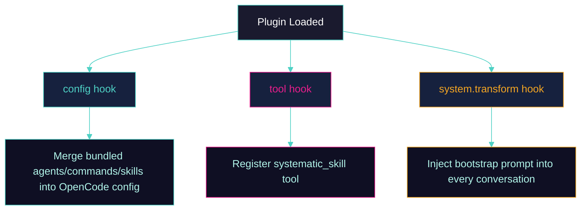

<div align="center">

<picture>
  <source media="(prefers-color-scheme: dark)" srcset="./assets/banner.svg">
  <source media="(prefers-color-scheme: light)" srcset="./assets/banner.svg">
  
</picture>

<br><br>

[](https://github.com/marcusrbrown/systematic/actions)
[](https://www.npmjs.com/package/@fro.bot/systematic)
[](https://fro.bot/systematic)
[](LICENSE)

<br>

**[Overview](#overview)** · **[Quick Start](#quick-start)** · **[Skills](#skills)** · **[Agents](#agents)** · **[Commands](#commands)** · **[CLI](#cli)** · **[Configuration](#configuration)** · **[Development](#development)**

</div>

---

## Overview

Systematic is an [OpenCode](https://opencode.ai/) plugin that transforms your AI assistant into a **disciplined engineering collaborator**. It provides battle-tested workflows adapted from the [Compound Engineering Plugin (CEP)](https://github.com/EveryInc/compound-engineering-plugin) for Claude Code.

### Why Systematic?

Most AI coding assistants respond to requests without structure or methodology. This leads to inconsistent outputs, missed requirements, and wasted iterations.

**Systematic solves this with structured workflows.** Installation is the first step to equipping your AI with high-leverage engineering habits. Once installed, the plugin injects proven processes directly into the system prompt, enabling it to:

- **Brainstorm systematically** before jumping to implementation
- **Plan with rigor** using multi-phase workflows
- **Review code architecturally** with specialized agents
- **Follow consistent patterns** across your entire team

### Key Features

- **Structured Skills** — Pre-built workflows for brainstorming, planning, and code review
- **Specialized Agents** — Purpose-built subagents for architecture, security, and performance
- **Zero Configuration** — Works immediately after installation via config hooks
- **Extensible** — Add project-specific skills and commands alongside bundled ones
- **Batteries Included** — 11 skills, 24 agents, and 9 commands ship with the npm package
- **CLI Tooling** — Inspect, list, and convert assets from the command line

## Quick Start

### Prerequisites

- [OpenCode](https://opencode.ai/) installed and configured
- Node.js 18+ or Bun runtime

### Installation

Install the plugin by adding it to your OpenCode configuration (`~/.config/opencode/opencode.json`):

```json
{
  "plugins": ["@fro.bot/systematic@latest"]
}
```

Restart OpenCode to activate the plugin. All bundled skills, agents, and commands will be available immediately.

> [!NOTE]
> Systematic uses OpenCode's `config` hook to automatically register all bundled content. No manual file copying required.

### Alternative: Install via OCX

[OCX](https://github.com/kdcokenny/ocx) provides component-level installation:

```bash
# Add the Systematic registry
ocx registry add https://fro.bot/systematic --name systematic

# Install individual components
ocx add systematic/brainstorming
ocx add systematic/agent-architecture-strategist

# Or install bundles
ocx add systematic/skills     # All 11 skills
ocx add systematic/agents     # All 24 agents
ocx add systematic/commands   # All 9 commands

# Or use a profile (requires --global registry)
ocx registry add https://fro.bot/systematic --name systematic --global
ocx profile add sys --from systematic/standalone
```

See the [OCX Registry Guide](https://fro.bot/systematic/guides/ocx-registry/) for details.

### Verify Installation

In any OpenCode conversation, type:

```
/systematic:using-systematic
```

If the skill loads and displays usage instructions, the plugin is working correctly.

#### Next Steps

Once verified, explore these guides to master the Systematic workflow:
- **[Philosophy](https://fro.bot/systematic/guides/philosophy/)** — Understand the Compound Engineering mindset and why it works
- **[Main Loop](https://fro.bot/systematic/guides/main-loop/)** — Learn the Plan → Work → Review → Compound cycle
- **[Agent Install Guide](https://fro.bot/systematic/guides/agent-install/)** — Step-by-step install guide for AI agents

## Skills

Skills are structured workflows that guide the AI through systematic engineering processes. They're loaded via the `systematic_skill` tool.

| Skill | Description |
|-------|-------------|
| `using-systematic` | Bootstrap skill — teaches the AI how to discover and use other skills |
| `brainstorming` | Collaborative design workflow for exploring ideas before planning |
| `agent-browser` | Browser automation using Vercel's agent-browser CLI |
| `agent-native-architecture` | Design systems where AI agents are first-class citizens |
| `compound-docs` | Capture solved problems as categorized documentation |
| `create-agent-skills` | Expert guidance for writing and refining skills |
| `document-review` | Refine brainstorm or plan documents before proceeding to the next workflow step |
| `file-todos` | File-based todo tracking with status and dependency management |
| `frontend-design` | Create distinctive, production-grade frontend interfaces with high design quality |
| `git-worktree` | Manage git worktrees for isolated parallel development |
| `orchestrating-swarms` | Coordinate multi-agent swarms, parallel reviews, and pipeline workflows |

### How Skills Work

Skills are Markdown files with YAML frontmatter. When loaded, their content is injected into the conversation, guiding the AI's behavior:

```markdown
---
name: brainstorming
description: This skill should be used before implementing features...
---

# Brainstorming

This skill provides detailed process knowledge for effective brainstorming...
```

The AI is instructed to invoke skills **before** taking action — even with a 1% chance a skill might apply.

## Agents

Agents are specialized subagents with pre-configured prompts and expertise. They're registered automatically via the config hook.

### Design Agents

| Agent | Purpose |
|-------|---------|
| `design-implementation-reviewer` | Verify UI implementations match Figma design specifications |
| `design-iterator` | Systematic UI/UX refinement through iterative screenshots and improvements |
| `figma-design-sync` | Detect and fix visual differences between web implementation and Figma designs |

### Research Agents

| Agent | Purpose |
|-------|---------|
| `best-practices-researcher` | Research external best practices, documentation, and examples for any technology |
| `framework-docs-researcher` | Gather framework documentation and best practices |
| `git-history-analyzer` | Archaeological analysis of git history to trace code evolution and understand patterns |
| `learnings-researcher` | Search past solutions in docs/solutions/ to surface institutional knowledge |
| `repo-research-analyst` | Research repository structure, documentation, conventions, and implementation patterns |

### Review Agents

| Agent | Purpose |
|-------|---------|
| `agent-native-reviewer` | Ensure agent-native parity — any user action should also be available to agents |
| `architecture-strategist` | Analyze code changes from an architectural perspective |
| `code-simplicity-reviewer` | Final review pass for simplicity and YAGNI principles |
| `data-integrity-guardian` | Review database migrations, data models, and persistent data code for safety |
| `data-migration-expert` | Validate data migrations, backfills, and production data transformations |
| `deployment-verification-agent` | Produce Go/No-Go deployment checklists with verification queries and rollback procedures |
| `dhh-rails-reviewer` | Brutally honest Rails code review from DHH's perspective |
| `kieran-rails-reviewer` | High quality bar Rails code review for conventions, clarity, and maintainability |
| `kieran-typescript-reviewer` | High quality bar TypeScript review for type safety, modern patterns, and maintainability |
| `pattern-recognition-specialist` | Detect design patterns, anti-patterns, and code smells |
| `performance-oracle` | Performance analysis, bottleneck identification, scalability |
| `security-sentinel` | Security audits, vulnerability assessment, OWASP compliance |

### Workflow Agents

| Agent | Purpose |
|-------|---------|
| `bug-reproduction-validator` | Systematically verify and reproduce reported bugs |
| `lint` | Run linting and code quality checks on Ruby and ERB files |
| `pr-comment-resolver` | Address PR review comments by implementing requested changes |
| `spec-flow-analyzer` | Analyze specifications for user flow gaps and missing requirements |

### Using Agents

Agents are invoked via OpenCode's `@mention` syntax or `task`:

```
@architecture-strategist Review the authentication refactoring in this PR
```

Or programmatically in skills/commands:

```
task(subagent_type="architecture-strategist", prompt="Review...")
```

## Commands

Commands are slash-invokable shortcuts that trigger workflows or actions.

### Workflow Commands

| Command | Description |
|---------|-------------|
| `/workflows:brainstorm` | Explore requirements through collaborative dialogue |
| `/workflows:plan` | Create detailed implementation plans |
| `/workflows:review` | Run code review with specialized agents |
| `/workflows:work` | Execute planned work systematically |
| `/workflows:compound` | Document recently solved problems to build team knowledge |

### Utility Commands

| Command | Description |
|---------|-------------|
| `/systematic:lfg` | Full autonomous engineering workflow — plan, then execute |
| `/systematic:create-agent-skill` | Create a new skill with expert guidance |
| `/systematic:deepen-plan` | Enhance a plan with parallel research for each section |
| `/systematic:agent-native-audit` | Audit code for agent-native architecture patterns |

## CLI

Systematic includes a CLI for inspecting and converting assets outside of OpenCode.

```
systematic <command> [options]
```

### Commands

| Command | Description |
|---------|-------------|
| `list [type]` | List available skills, agents, or commands |
| `convert <type> <file>` | Convert a CEP file and output the result to stdout |
| `config show` | Show current configuration and file contents |
| `config path` | Print config file locations |

### Examples

```bash
# List all bundled skills
systematic list skills

# List all bundled agents
systematic list agents

# Convert a Claude Code agent to OpenCode format
systematic convert agent ./agents/my-agent.md

# Convert with a specific agent mode
systematic convert agent ./agents/my-agent.md --mode=primary

# Show configuration
systematic config show
```

## Configuration

Systematic works out of the box, but you can customize it via configuration files.

### Plugin Configuration

Configuration is loaded from multiple locations and merged (later sources override earlier ones):

1. **User config:** `~/.config/opencode/systematic.json`
2. **Project config:** `.opencode/systematic.json`
3. **Custom config:** `$OPENCODE_CONFIG_DIR/systematic.json` (if `OPENCODE_CONFIG_DIR` is set)

```json
{
  "disabled_skills": ["git-worktree"],
  "disabled_agents": [],
  "disabled_commands": [],
  "bootstrap": {
    "enabled": true
  }
}
```

| Option | Type | Default | Description |
|--------|------|---------|-------------|
| `disabled_skills` | `string[]` | `[]` | Skills to exclude from registration |
| `disabled_agents` | `string[]` | `[]` | Agents to exclude from registration |
| `disabled_commands` | `string[]` | `[]` | Commands to exclude from registration |
| `bootstrap.enabled` | `boolean` | `true` | Inject the `using-systematic` guide into system prompts |
| `bootstrap.file` | `string` | — | Custom bootstrap file path (overrides default) |

### Project-Specific Content

Add your own skills, agents, and commands alongside bundled ones:

```
.opencode/
├── skills/
│   └── my-skill/
│       └── SKILL.md
├── agents/
│   └── my-agent.md
└── commands/
    └── my-command.md
```

Project-level content takes precedence over bundled content with the same name.

## Tools

The plugin exposes one tool to OpenCode:

| Tool | Description |
|------|-------------|
| `systematic_skill` | Load Systematic bundled skills by name. Lists available skills in its description and returns formatted skill content when invoked. |

For non-Systematic skills (project or user-level), use OpenCode's native `skill` tool.

## How It Works

Systematic uses three OpenCode plugin hooks:



1. **`config` hook** — Discovers and merges bundled skills, agents, and commands into your OpenCode configuration. Existing config takes precedence over bundled content. Skills are registered as commands with the `systematic:` prefix.
2. **`tool` hook** — Registers the `systematic_skill` tool, which lists available skills in its XML description and loads skill content on demand.
3. **`system.transform` hook** — Injects the "Using Systematic" bootstrap guide into system prompts, teaching the AI how to discover and invoke skills.

This architecture ensures skills, agents, and commands are available immediately without manual setup.

## Development

### Prerequisites

- [Bun](https://bun.sh/) runtime
- Node.js 18+ (for compatibility)

### Setup

```bash
# Clone the repository
git clone https://github.com/marcusrbrown/systematic.git
cd systematic

# Install dependencies
bun install

# Build the plugin
bun run build

# Run type checking
bun run typecheck

# Run linter
bun run lint

# Run unit tests
bun test
```

### Project Structure

```
systematic/
├── src/
│   ├── index.ts              # Plugin entry point (SystematicPlugin)
│   ├── cli.ts                # CLI entry point
│   └── lib/
│       ├── bootstrap.ts      # System prompt injection
│       ├── config.ts         # JSONC config loading + merging
│       ├── config-handler.ts # OpenCode config hook implementation
│       ├── converter.ts      # CEP-to-OpenCode content conversion
│       ├── skill-tool.ts     # systematic_skill tool factory
│       ├── skill-loader.ts   # Skill content loading + formatting
│       ├── skills.ts         # Skill discovery
│       ├── agents.ts         # Agent discovery
│       ├── commands.ts       # Command discovery
│       ├── frontmatter.ts    # YAML frontmatter parsing
│       ├── manifest.ts       # Upstream sync manifest tracking
│       ├── validation.ts     # Agent config validation + type guards
│       └── walk-dir.ts       # Recursive directory walker
├── skills/                   # 11 bundled skills (SKILL.md files)
├── agents/                   # 24 bundled agents (4 categories)
├── commands/                 # 9 bundled commands (with workflows/ subdir)
├── docs/                     # Starlight documentation site
├── tests/
│   ├── unit/                 # Unit tests
│   └── integration/          # Integration tests
└── dist/                     # Build output
```

### Testing

```bash
# Run all unit tests
bun test tests/unit

# Run a specific test file
bun test tests/unit/skills.test.ts

# Run integration tests
bun test tests/integration

# Run all tests
bun test
```

### Contributing

See [`AGENTS.md`](./AGENTS.md) for detailed development guidelines, code style conventions, and architecture overview.

## Converting from Claude Code

Migrating skills, agents, or commands from CEP or other Claude Code-format sources to Systematic? See the [Conversion Guide](https://fro.bot/systematic/guides/conversion-guide/) for field mappings and examples. Also available as [local Markdown](./docs/CONVERSION-GUIDE.md).

## References

- [Systematic Documentation](https://fro.bot/systematic) — Full documentation site
- [Philosophy Guide](https://fro.bot/systematic/guides/philosophy/) — Core engineering principles
- [Main Loop Guide](https://fro.bot/systematic/guides/main-loop/) — The standard development cycle
- [Agent Install Guide](https://fro.bot/systematic/guides/agent-install/) — Advanced subagent configuration
- [OpenCode Documentation](https://opencode.ai/docs/) — Official OpenCode platform docs
- [OpenCode Plugin API](https://opencode.ai/docs/plugins) — Plugin development reference
- [Compound Engineering Plugin](https://github.com/EveryInc/compound-engineering-plugin) — Original Claude Code workflows
- [Source Code](https://github.com/marcusrbrown/systematic) — View the implementation

## License

[MIT](LICENSE) © Marcus R. Brown
