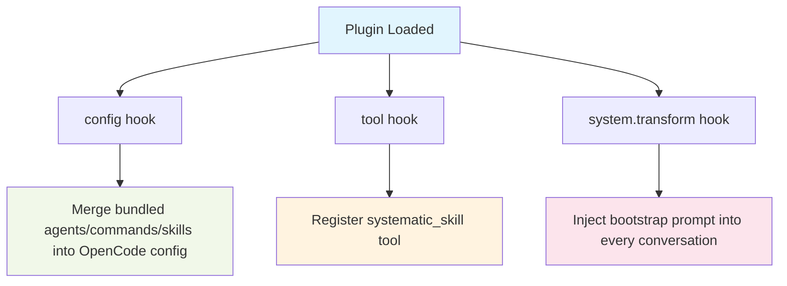

<div align="center">

<picture>
  <source media="(prefers-color-scheme: dark)" srcset="./assets/banner.svg">
  <source media="(prefers-color-scheme: light)" srcset="./assets/banner.svg">
  
</picture>

<br><br>

[](https://github.com/marcusrbrown/systematic/actions)
[](https://www.npmjs.com/package/@fro.bot/systematic)
[](LICENSE)

<br>

**[Overview](#overview)** · **[Quick Start](#quick-start)** · **[Skills](#skills)** · **[Agents](#agents)** · **[Commands](#commands)** · **[Development](#development)**

</div>

---

## Overview

Systematic is an [OpenCode](https://opencode.ai/) plugin that transforms your AI assistant into a **disciplined engineering collaborator**. It provides battle-tested workflows adapted from the [Compound Engineering Plugin (CEP)](https://github.com/EveryInc/compound-engineering-plugin) for Claude Code.

### Why Systematic?

Most AI coding assistants respond to requests without structure or methodology. This leads to inconsistent outputs, missed requirements, and wasted iterations.

**Systematic solves this with structured workflows.** The plugin injects proven engineering processes directly into your AI's system prompt, enabling it to:

- **Brainstorm systematically** before jumping to implementation
- **Plan with rigor** using multi-phase workflows
- **Review code architecturally** with specialized agents
- **Follow consistent patterns** across your entire team

### Key Features

- **🧠 Structured Skills** — Pre-built workflows for brainstorming, planning, and code review
- **🤖 Specialized Agents** — Purpose-built subagents for architecture, security, and performance
- **⚡ Zero Configuration** — Works immediately after installation via config hooks
- **🔧 Extensible** — Add project-specific skills and commands alongside bundled ones
- **📦 Batteries Included** — Skills, agents, and commands ship with the npm package

## Quick Start

### Prerequisites

- [OpenCode](https://opencode.ai/) installed and configured
- Node.js 18+ or Bun runtime

### Installation

Install the plugin via npm:

```bash
npm install @fro.bot/systematic
```

Add it to your OpenCode configuration (`~/.config/opencode/opencode.json`):

```json
{
  "plugins": ["@fro.bot/systematic"]
}
```

That's it. Restart OpenCode and the plugin's skills, agents, and commands are available immediately.

> [!NOTE]
> Systematic uses OpenCode's `config` hook to automatically register all bundled content. No manual file copying required.

### Verify Installation

In any OpenCode conversation, type:

```
/systematic:using-systematic
```

If the skill loads and displays usage instructions, the plugin is working correctly.

## Skills

Skills are structured workflows that guide the AI through systematic engineering processes. They're loaded via the `systematic_skill` tool.

| Skill | Description |
|-------|-------------|
| `using-systematic` | Bootstrap skill — teaches the AI how to discover and use other skills |
| `brainstorming` | Collaborative design workflow for exploring ideas before planning |
| `agent-browser` | Browser automation using Vercel's agent-browser CLI |
| `agent-native-architecture` | Design systems where AI agents are first-class citizens |
| `compound-docs` | Capture solved problems as categorized documentation |
| `create-agent-skills` | Expert guidance for writing and refining skills |
| `file-todos` | File-based todo tracking with status and dependency management |
| `git-worktree` | Manage git worktrees for isolated parallel development |

### How Skills Work

Skills are Markdown files with YAML frontmatter. When loaded, their content is injected into the conversation, guiding the AI's behavior:

```markdown
---
name: brainstorming
description: This skill should be used before implementing features...
---

# Brainstorming

This skill provides detailed process knowledge for effective brainstorming...
```

The AI is instructed to invoke skills **before** taking action — even with a 1% chance a skill might apply.

## Agents

Agents are specialized subagents with pre-configured prompts and expertise. They're registered automatically via the config hook.

### Review Agents

| Agent | Purpose |
|-------|---------|
| `architecture-strategist` | Analyze code changes from an architectural perspective |
| `security-sentinel` | Security audits, vulnerability assessment, OWASP compliance |
| `code-simplicity-reviewer` | Final review pass for simplicity and YAGNI principles |
| `pattern-recognition-specialist` | Detect design patterns, anti-patterns, and code smells |
| `performance-oracle` | Performance analysis, bottleneck identification, scalability |

### Research Agents

| Agent | Purpose |
|-------|---------|
| `framework-docs-researcher` | Gather framework documentation and best practices |

### Using Agents

Agents are invoked via OpenCode's `@mention` syntax or `delegate_task`:

```
@architecture-strategist Review the authentication refactoring in this PR
```

Or programmatically in skills/commands:

```
delegate_task(subagent_type="architecture-strategist", prompt="Review...")
```

## Commands

Commands are slash-invokable shortcuts that trigger workflows or actions.

### Workflow Commands

| Command | Description |
|---------|-------------|
| `/workflows:brainstorm` | Explore requirements through collaborative dialogue |
| `/workflows:plan` | Create detailed implementation plans |
| `/workflows:review` | Run code review with specialized agents |
| `/workflows:work` | Execute planned work systematically |
| `/workflows:compound` | Build compound documentation |

### Utility Commands

| Command | Description |
|---------|-------------|
| `/lfg` | "Let's go" — start working immediately |
| `/create-agent-skill` | Create a new skill with guidance |
| `/deepen-plan` | Add detail to existing plans |
| `/agent-native-audit` | Audit code for agent-native patterns |

## Configuration

Systematic works out of the box, but you can customize it via configuration files.

### Plugin Configuration

Create `~/.config/opencode/systematic.json` or `.opencode/systematic.json` to disable specific bundled content:

```json
{
  "disabled_skills": ["git-worktree"],
  "disabled_agents": [],
  "disabled_commands": []
}
```

### Project-Specific Content

Add your own skills, agents, and commands alongside bundled ones:

```
.opencode/
├── skills/
│   └── my-skill/
│       └── SKILL.md
├── agents/
│   └── my-agent.md
└── commands/
    └── my-command.md
```

Project-level content takes precedence over bundled content with the same name.

## Tools

The plugin exposes one tool to OpenCode:

| Tool | Description |
|------|-------------|
| `systematic_skill` | Load Systematic bundled skills by name |

For non-Systematic skills (project or user-level), use OpenCode's native `skill` tool.

## How It Works

Systematic uses three OpenCode plugin hooks:



1. **`config` hook** — Merges bundled assets into your OpenCode configuration
2. **`tool` hook** — Registers the `systematic_skill` tool for loading skills
3. **`system.transform` hook** — Injects the "Using Systematic" guide into system prompts

This architecture ensures skills, agents, and commands are available immediately without manual setup.

## Development

### Prerequisites

- [Bun](https://bun.sh/) runtime
- Node.js 18+ (for compatibility)

### Setup

```bash
# Clone the repository
git clone https://github.com/marcusrbrown/systematic.git
cd systematic

# Install dependencies
bun install

# Build the plugin
bun run build

# Run type checking
bun run typecheck

# Run linter
bun run lint

# Run unit tests
bun test
```

### Project Structure

```
├── src/
│   ├── index.ts              # Plugin entry point
│   ├── cli.ts                # CLI entry point
│   └── lib/
│       ├── bootstrap.ts      # System prompt injection
│       ├── config.ts         # JSONC config loading
│       ├── config-handler.ts # OpenCode config hook
│       ├── skill-tool.ts     # systematic_skill tool
│       ├── skills.ts         # Skill discovery
│       ├── agents.ts         # Agent discovery
│       └── commands.ts       # Command discovery
├── skills/                   # Bundled skills (SKILL.md files)
├── agents/                   # Bundled agents (Markdown)
├── commands/                 # Bundled commands (Markdown)
├── tests/
│   ├── unit/                 # Unit tests
│   └── integration/          # Integration tests
└── dist/                     # Build output
```

### Testing

```bash
# Run all unit tests
bun test tests/unit

# Run a specific test file
bun test tests/unit/skills.test.ts

# Run integration tests
bun test tests/integration
```

### Contributing

See [`AGENTS.md`](./AGENTS.md) for detailed development guidelines, code style conventions, and architecture overview.

## Converting from Claude Code

Migrating skills, agents, or commands from Claude Code (CEP) to Systematic? See the [Conversion Guide](./docs/CONVERSION-GUIDE.md) for field mappings and examples.

## References

- [OpenCode Documentation](https://opencode.ai/docs/) — Official OpenCode platform docs
- [Compound Engineering Plugin](https://github.com/EveryInc/compound-engineering-plugin) — Original Claude Code workflows
- [Plugin Source Code](https://github.com/marcusrbrown/systematic) — View the implementation

## License

[MIT](LICENSE) © Marcus R. Brown
