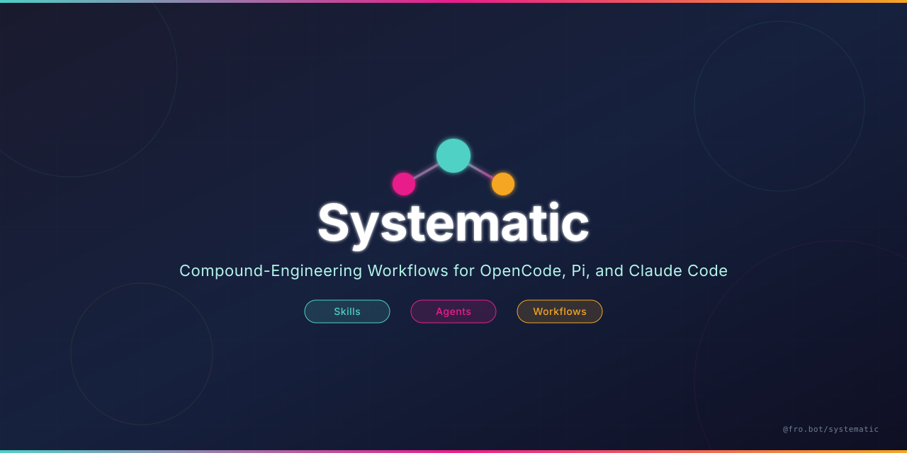
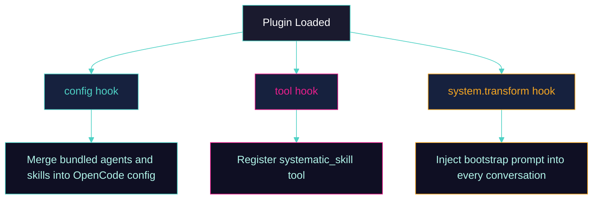

<div align="center">

<picture>
  <source media="(prefers-color-scheme: dark)" srcset="./assets/banner.svg">
  <source media="(prefers-color-scheme: light)" srcset="./assets/banner.svg">
  
</picture>

<br><br>

[](https://github.com/marcusrbrown/systematic/actions)
[](https://www.npmjs.com/package/@fro.bot/systematic)
[](https://fro.bot/systematic)
[](LICENSE)

<br>

**[Overview](#overview)** · **[Quick Start](#quick-start)** · **[Skills](#skills)** · **[Agents](#agents)** · **[CLI](#cli)** · **[Configuration](#configuration)** · **[Development](#development)**

</div>

---

## Overview

Systematic is an [OpenCode](https://opencode.ai/) plugin that transforms your AI assistant into a **disciplined engineering collaborator**. It provides battle-tested workflows adapted from the [Compound Engineering Plugin (CEP)](https://github.com/EveryInc/compound-engineering-plugin) for Claude Code.

### Why Systematic?

Most AI coding assistants respond to requests without structure or methodology. This leads to inconsistent outputs, missed requirements, and wasted iterations.

**Systematic solves this with structured workflows.** Installation is the first step to equipping your AI with high-leverage engineering habits. Once installed, the plugin injects proven processes directly into the system prompt, enabling it to:

- **Brainstorm systematically** before jumping to implementation
- **Plan with rigor** using multi-phase workflows
- **Review code architecturally** with specialized agents
- **Follow consistent patterns** across your entire team

### Key Features

- **Structured Skills** — Pre-built workflows for brainstorming, planning, code review, and more
- **Specialized Agents** — Purpose-built subagents for architecture, security, performance, and research
- **Zero Configuration** — Works immediately after installation via config hooks
- **Extensible** — Add project-specific skills and agents alongside bundled ones
- **Batteries Included** — a curated catalog of skills and agents ships with the npm package
- **CLI Tooling** — Inspect, list, and convert assets from the command line

## Quick Start

### Prerequisites

- [OpenCode](https://opencode.ai/) installed and configured
- Node.js 18+ or Bun runtime

### Installation

Install the plugin by adding it to your OpenCode configuration (`~/.config/opencode/opencode.json`):

```json
{
  "plugins": ["@fro.bot/systematic@latest"]
}
```

Restart OpenCode to activate the plugin. All bundled skills and agents will be available immediately.

> [!NOTE]
> Systematic uses OpenCode's `config` hook to automatically register all bundled content. No manual file copying required.

### Alternative: Install via OCX

[OCX](https://github.com/kdcokenny/ocx) provides component-level installation:

```bash
# Add the Systematic registry
ocx registry add https://fro.bot/systematic --name systematic

# Install individual components
ocx add systematic/using-systematic
ocx add systematic/agent-architecture-strategist

# Or install bundles
ocx add systematic/skills     # All bundled skills
ocx add systematic/agents     # All bundled agents

# Or use a profile (requires --global registry)
ocx registry add https://fro.bot/systematic --name systematic --global
ocx profile add sys --from systematic/standalone
```

See the [OCX Registry Guide](https://fro.bot/systematic/guides/ocx-registry/) for details.

### Verify Installation

In any OpenCode conversation, type:

```
/systematic:using-systematic
```

If the skill loads and displays usage instructions, the plugin is working correctly.

#### Next Steps

Once verified, explore these guides to master the Systematic workflow:
- **[Philosophy](https://fro.bot/systematic/guides/philosophy/)** — Understand the Compound Engineering mindset and why it works
- **[Main Loop](https://fro.bot/systematic/guides/main-loop/)** — Learn the Plan → Work → Review → Compound cycle
- **[Agent Install Guide](https://fro.bot/systematic/guides/agent-install/)** — Step-by-step install guide for AI agents

## Skills

Skills are structured workflows that guide the AI through systematic engineering processes. They're loaded via the `systematic_skill` tool and invocable as slash commands (e.g., `/ce:brainstorm`).

### Core Workflows

The Compound Engineering loop — the heart of Systematic:

| Skill | Description |
|-------|-------------|
| `ce:brainstorm` | Explore requirements through collaborative dialogue before planning |
| `ce:plan` | Transform feature descriptions into structured implementation plans |
| `ce:review` | Perform exhaustive code reviews using multi-agent analysis |
| `ce:work` | Execute work plans efficiently while maintaining quality |
| `ce:compound` | Document recently solved problems to compound team knowledge |
| `ce:ideate` | Generate and critically evaluate grounded improvement ideas |
| `ce:compound-refresh` | Refresh stale learnings and pattern docs against current codebase |

### Development Tools

| Skill | Description |
|-------|-------------|
| `using-systematic` | Bootstrap skill — teaches the AI how to discover and use other skills |
| `agent-browser` | Browser automation using Vercel's agent-browser CLI |
| `agent-native-architecture` | Design systems where AI agents are first-class citizens |
| `compound-docs` | Capture solved problems as categorized documentation |
| `document-review` | Refine requirements or plan documents before proceeding |
| `deepen-plan` | Enhance a plan with parallel research for each section |
| `todo-create` · `todo-resolve` · `todo-triage` | Durable file-based todo tracking, triage, and batch resolution |
| `frontend-design` | Create distinctive, production-grade frontend interfaces |
| `git-worktree` | Manage git worktrees for isolated parallel development |
| `generate_command` | Create a new custom slash command following conventions |
| `orchestrating-swarms` | Coordinate multi-agent swarms and pipeline workflows |
| `lfg` · `slfg` | Full autonomous engineering workflow (single-agent / swarm) |

### Specialized Skills

| Skill | Description |
|-------|-------------|
| `dhh-rails-style` | Write Ruby and Rails code in DHH's distinctive 37signals style |
| `andrew-kane-gem-writer` | Write Ruby gems following Andrew Kane's proven patterns |
| `dspy-ruby` | Build type-safe LLM applications with DSPy.rb |
| `every-style-editor` | Review and edit copy for style guide compliance |
| `gemini-imagegen` | Generate and edit images using the Gemini API |
| `proof` | Create, edit, and share markdown documents via Proof |
| `rclone` | Upload, sync, and manage files across cloud storage providers |

> **[View all skills →](https://fro.bot/systematic/reference/skills/)**

### How Skills Work

Skills are Markdown files with YAML frontmatter. When loaded, their content is injected into the conversation, guiding the AI's behavior:

```markdown
---
name: brainstorming
description: This skill should be used before implementing features...
---

# Brainstorming

This skill provides detailed process knowledge for effective brainstorming...
```

The AI is instructed to invoke skills **before** taking action — even with a 1% chance a skill might apply.

## Agents

Agents are specialized subagents with pre-configured prompts and expertise. They're registered automatically via the config hook.

### Design Agents

| Agent | Purpose |
|-------|---------|
| `design-implementation-reviewer` | Visually compare live UI against Figma designs and report discrepancies |
| `design-iterator` | Iteratively refine UI design through screenshot-analyze-improve cycles |
| `figma-design-sync` | Detect and fix visual differences between web implementation and Figma |

### Docs Agents

| Agent | Purpose |
|-------|---------|
| `ankane-readme-writer` | Create or update README files following Ankane-style template for Ruby gems |

### Research Agents

| Agent | Purpose |
|-------|---------|
| `best-practices-researcher` | Research external best practices, documentation, and examples for any technology |
| `framework-docs-researcher` | Gather framework documentation and best practices |
| `git-history-analyzer` | Archaeological analysis of git history to trace code evolution and patterns |
| `issue-intelligence-analyst` | Analyze GitHub issues to surface recurring themes, pain patterns, and severity trends |
| `learnings-researcher` | Search past solutions in docs/solutions/ to surface institutional knowledge |
| `repo-research-analyst` | Research repository structure, documentation, conventions, and implementation patterns |

### Review Agents

| Agent | Purpose |
|-------|---------|
| `agent-native-reviewer` | Ensure agent-native parity — any user action should also be available to agents |
| `architecture-strategist` | Analyze code changes from an architectural perspective |
| `code-simplicity-reviewer` | Final review pass for simplicity and YAGNI principles |
| `data-integrity-guardian` | Review database migrations, data models, and persistent data code for safety |
| `data-migration-expert` | Validate data migrations, backfills, and production data transformations |
| `deployment-verification-agent` | Produce Go/No-Go deployment checklists with verification queries and rollback procedures |
| `dhh-rails-reviewer` | Brutally honest Rails code review from DHH's perspective |
| `julik-frontend-races-reviewer` | Review JavaScript and Stimulus code for race conditions and timing issues |
| `kieran-python-reviewer` | High quality bar Python review for Pythonic patterns, type safety, and maintainability |
| `kieran-rails-reviewer` | High quality bar Rails review for conventions, clarity, and maintainability |
| `kieran-typescript-reviewer` | High quality bar TypeScript review for type safety, modern patterns, and maintainability |
| `pattern-recognition-specialist` | Detect design patterns, anti-patterns, and code smells |
| `performance-oracle` | Performance analysis, bottleneck identification, scalability |
| `schema-drift-detector` | Detect unrelated schema.rb changes by cross-referencing against included migrations |
| `security-sentinel` | Security audits, vulnerability assessment, OWASP compliance |

### Workflow Agents

| Agent | Purpose |
|-------|---------|
| `bug-reproduction-validator` | Systematically verify and reproduce reported bugs |
| `lint` | Run linting and code quality checks on Ruby and ERB files |
| `pr-comment-resolver` | Address PR review comments by implementing requested changes |
| `spec-flow-analyzer` | Analyze specifications for user flow gaps and missing requirements |

### Using Agents

Agents are invoked via OpenCode's `@mention` syntax or `task`:

```
@architecture-strategist Review the authentication refactoring in this PR
```

Or programmatically in skills:

```
task(subagent_type="architecture-strategist", prompt="Review...")
```

## CLI

Systematic includes a CLI for inspecting and converting assets outside of OpenCode.

```
systematic <command> [options]
```

### Commands

| Command | Description |
|---------|-------------|
| `list [type]` | List available skills, agents, or commands |
| `convert <type> <file>` | Convert a CEP file and output the result to stdout |
| `config show` | Show current configuration and file contents |
| `config path` | Print config file locations |

### Examples

```bash
# List all bundled skills
systematic list skills

# List all bundled agents
systematic list agents

# Convert a Claude Code agent to OpenCode format
systematic convert agent ./agents/my-agent.md

# Convert with a specific agent mode
systematic convert agent ./agents/my-agent.md --mode=primary

# Show configuration
systematic config show
```

## Configuration

Systematic works out of the box, but you can customize it via configuration files.

### Plugin Configuration

Configuration is loaded from multiple locations and merged (later sources override earlier ones):

1. **User config:** `~/.config/opencode/systematic.json`
2. **Project config:** `.opencode/systematic.json`
3. **Custom config:** `$OPENCODE_CONFIG_DIR/systematic.json` (if `OPENCODE_CONFIG_DIR` is set)

```json
{
  "disabled_skills": ["git-worktree"],
  "disabled_agents": [],
  "categories": {
    "review": {
      "temperature": 0.1,
      "steps": 12
    }
  },
  "agents": {
    "security-sentinel": {
      "variant": "thinking"
    },
    "workflow/systematic-implementer": {
      "steps": 20
    }
  },
  "bootstrap": {
    "enabled": true
  }
}
```

| Option | Type | Default | Description |
|--------|------|---------|-------------|
| `disabled_skills` | `string[]` | `[]` | Skills to exclude from registration |
| `disabled_agents` | `string[]` | `[]` | Agents to exclude from registration |
| `categories` | `object` | `{}` | Overlay bundled agents by category (`design`, `docs`, `document-review`, `research`, `review`, `workflow`) |
| `agents` | `object` | `{}` | Overlay exact bundled agents by unique stem or `<category>/<stem>` key |
| `bootstrap.enabled` | `boolean` | `true` | Inject the `using-systematic` guide into system prompts |
| `bootstrap.file` | `string` | — | Custom bootstrap file path (overrides default) |

Agent overlays support `model`, `variant`, `temperature`, `top_p`, `permission`, `mode`, `color`, `steps`, `hidden`, exact-agent-only `disable`, and managed `skills`. `color` accepts `#RGB`, `#RRGGBB`, or OpenCode named color tokens matching `[a-zA-Z][a-zA-Z0-9-]*`; whitespace/freeform numeric strings are rejected. `skills` uses bundled skill frontmatter names like `ce:review`; it is a shortcut that writes OpenCode `permission.skill` rules, not a native OpenCode agent field. Because `model` and `variant` control provider routing/cost/privacy and `permission`/`skills` control tool access, those fields are only accepted from user config or `$OPENCODE_CONFIG_DIR/systematic.json`. Project config may tune non-sensitive presentation and runtime fields such as `temperature`, `top_p`, `mode`, `color`, `steps`, `hidden`, or exact-agent `disable`, but it cannot choose model/provider routing, tune `variant`, or loosen permission/capability policy.

Systematic separates config-source precedence from overlay precedence. Config files merge in this order: user config, project config, then `$OPENCODE_CONFIG_DIR/systematic.json` if set. Higher-priority `agents.<key>` and `categories.<id>` entries replace lower-priority entries wholesale, while unrelated keys survive. Project overlays are the exception for trust-sensitive fields: same-key project overlays preserve user-level `model`, `variant`, `permission`, and `skills` fields instead of erasing them. After the effective config is built, Systematic applies agent overlay precedence for bundled agents:

1. Exact `agents.<key>` overlay (high-trust `model` wins)
2. `categories.<category-id>` overlay (high-trust `model` wins)
3. Source category model default (built-in, code-owned)
4. Bundled markdown/frontmatter defaults
5. OpenCode inherited defaults

Source category model defaults are primary model choices only — they are not fallback chains. Systematic does not support `fallback_models`, inherited retry semantics, runtime fallback behavior, or fallback to the parent model when a source model is unavailable. Explicit and source model IDs are structurally validated and may still fail at OpenCode runtime if the provider or model is unavailable.

Source category model defaults are now ordered preference arrays per category rather than single strings. At plugin load, Systematic reads OpenCode's authentication state from `auth.json` and selects the first array entry whose provider is authenticated. For example, the `review` category defaults to `['anthropic/claude-sonnet-4-6', 'openai/gpt-5.3-codex']` — a user authenticated only to OpenAI receives `openai/gpt-5.5` (first match), while a user authenticated to Anthropic (or both) receives the more preferred `anthropic/claude-sonnet-4-6`. If no array entry's provider is authenticated, the first entry is used as the default. The arrays are an ordered preference list, not a runtime fallback chain — `fallback_models` is still not supported.

If you want to restore OpenCode parent-model inheritance for a bundled agent or category (opting out of the source default), set `"model": null` in high-trust user or `$OPENCODE_CONFIG_DIR/systematic.json` config. Project config cannot use `model: null` — project config cannot set, erase, or shadow `model` at any value.

The source defaults are:

| Category | Default `model` | Rationale |
|----------|-----------------|-----------|
| `design` | `github-copilot/gemini-3.1-pro-preview` | High-judgment UX/product/design work benefits from a strong general reasoning model. |
| `docs` | `github-copilot/gemini-3.1-pro-preview` | Documentation and summarization should start cheaper/faster. |
| `document-review` | `anthropic/claude-opus-4-7` | Requirements and plan critique benefit from strongest nuanced reasoning. |
| `research` | `openai/gpt-5.4-mini` | Tool-heavy synthesis and source evaluation benefit from a strong general reasoning model. |
| `review` | `anthropic/claude-sonnet-4-6` | Code/security/adversarial review benefits from strongest reasoning. |
| `workflow` | `openai/gpt-5.4-mini` | Orchestration and bounded implementation should default cheaper/faster. |

These defaults are owned by Systematic code and emitted for bundled agents in each category when no stronger high-trust exact or category `model` override exists. Uncategorized bundled agents receive no source default and continue inheriting the parent OpenCode model. Native OpenCode agents with the same emitted key are full replacements and receive no Systematic source model default.

Bundled agent markdown still intentionally omits `model` — the field belongs in source code defaults, not portable markdown files. Authors must not add `model:` frontmatter to bundled agent files.

Systematic emits a source model as the default; you can override it per-agent or per-category in user or `$OPENCODE_CONFIG_DIR/systematic.json` config. Project config cannot set, erase, or shadow `model` policy.

> **Migration: Restoring parent-model inheritance.** If you previously relied on bundled agents inheriting the parent OpenCode model (no source defaults), set `"model": null` in your high-trust config to opt out of the source default per agent or per category. For example:
>
> ```jsonc
> // ~/.config/opencode/systematic.json or $OPENCODE_CONFIG_DIR/systematic.json
> {
>   "categories": {
>     "review": { "model": null }     // All review agents inherit parent model
>   },
>   "agents": {
>     "security-sentinel": { "model": null }  // Single agent inherits parent model
>   }
> }
> ```
>
> This only works from high-trust config (user or `$OPENCODE_CONFIG_DIR/systematic.json`). Project `.opencode/systematic.json` cannot set `model: null` or any `model` value.

Native OpenCode agents with the same emitted key are full replacements. An exact Systematic overlay for that key conflicts, while category overlays skip native replacements and continue applying to other bundled agents. Use one canonical agent key form across config sources (`security-sentinel` or `review/security-sentinel`) because alias collisions fail duplicate-target validation.

Category IDs are V1 public API because broad policy overlays are a core use case; future agent reorganizations must preserve aliases or provide migration warnings. Category overlays also apply to future bundled agents added to that category. V1 does not include an MCP allowlist shortcut.

### Project-Specific Content

Add your own skills and agents alongside bundled ones:

```
.opencode/
├── skills/
│   └── my-skill/
│       └── SKILL.md
└── agents/
    └── my-agent.md
```

Project-level content takes precedence over bundled content with the same name.

## Tools

The plugin exposes one tool to OpenCode:

| Tool | Description |
|------|-------------|
| `systematic_skill` | Load Systematic bundled skills by name. Lists available skills in its description and returns formatted skill content when invoked. |

For non-Systematic skills (project or user-level), use OpenCode's native `skill` tool.

## How It Works

Systematic uses three OpenCode plugin hooks:


```mermaid
%%{init: {'theme': 'base', 'themeVariables': { 'primaryColor': '#1a1a2e', 'primaryTextColor': '#fff', 'primaryBorderColor': '#4FD1C5', 'lineColor': '#4FD1C5', 'secondaryColor': '#16213e', 'tertiaryColor': '#0f0f23'}}}%%
flowchart TB
    A[Plugin Loaded] --> B[config hook]
    A --> C[tool hook]
    A --> D[system.transform hook]

    B --> E[Merge bundled agents and skills into OpenCode config]
    C --> F[Register systematic_skill tool]
    D --> G[Inject bootstrap prompt into every conversation]

    style A fill:#1a1a2e,stroke:#4FD1C5,color:#fff
    style B fill:#16213e,stroke:#4FD1C5,color:#4FD1C5
    style C fill:#16213e,stroke:#E91E8C,color:#E91E8C
    style D fill:#16213e,stroke:#F5A623,color:#F5A623
    style E fill:#0f0f23,stroke:#4FD1C5,color:#B2F5EA
    style F fill:#0f0f23,stroke:#E91E8C,color:#B2F5EA
    style G fill:#0f0f23,stroke:#F5A623,color:#B2F5EA
```

1. **`config` hook** — Discovers and merges bundled skills and agents into your OpenCode configuration. Existing config takes precedence over bundled content. Skills are registered as slash commands with the `systematic:` prefix.
2. **`tool` hook** — Registers the `systematic_skill` tool, which lists available skills in its XML description and loads skill content on demand.
3. **`system.transform` hook** — Injects the "Using Systematic" bootstrap guide into system prompts, teaching the AI how to discover and invoke skills.

This architecture ensures skills and agents are available immediately without manual setup.

## Development

### Prerequisites

- [Bun](https://bun.sh/) runtime
- Node.js 18+ (for compatibility)

### Setup

```bash
# Clone the repository
git clone https://github.com/marcusrbrown/systematic.git
cd systematic

# Install dependencies
bun install

# Build the plugin
bun run build

# Run type checking
bun run typecheck

# Run linter
bun run lint

# Run unit tests
bun test
```

### Project Structure

```
systematic/
├── src/
│   ├── index.ts              # Plugin entry point (SystematicPlugin)
│   ├── cli.ts                # CLI entry point
│   └── lib/
│       ├── bootstrap.ts      # System prompt injection
│       ├── config.ts         # JSONC config loading + merging
│       ├── config-handler.ts # OpenCode config hook implementation
│       ├── converter.ts      # CEP-to-OpenCode content conversion
│       ├── skill-tool.ts     # systematic_skill tool factory
│       ├── skill-loader.ts   # Skill content loading + formatting
│       ├── skills.ts         # Skill discovery
│       ├── agents.ts         # Agent discovery
│       ├── commands.ts       # Command discovery (backward compat)
│       ├── frontmatter.ts    # YAML frontmatter parsing
│       ├── validation.ts     # Agent config validation + type guards
│       └── walk-dir.ts       # Recursive directory walker
├── skills/                   # Bundled skills (SKILL.md files)
├── agents/                   # Bundled agents (6 categories)
├── docs/                     # Starlight documentation site
├── registry/                 # OCX registry config + profiles
├── scripts/                  # Build and utility scripts
├── tests/
│   ├── unit/                 # Unit test files
│   └── integration/          # Integration test files
└── dist/                     # Build output
```

### Testing

```bash
# Run all unit tests
bun test tests/unit

# Run a specific test file
bun test tests/unit/skills.test.ts

# Run integration tests
bun test tests/integration

# Run all tests
bun test
```

### Contributing

See [`AGENTS.md`](./AGENTS.md) for detailed development guidelines, code style conventions, and architecture overview.

## Converting from Claude Code

Migrating skills or agents from CEP or other Claude Code-format sources to Systematic? See the [Conversion Guide](https://fro.bot/systematic/guides/conversion-guide/) for field mappings and examples.

## References

- [Systematic Documentation](https://fro.bot/systematic) — Full documentation site
- [Philosophy Guide](https://fro.bot/systematic/guides/philosophy/) — Core engineering principles
- [Main Loop Guide](https://fro.bot/systematic/guides/main-loop/) — The standard development cycle
- [Agent Install Guide](https://fro.bot/systematic/guides/agent-install/) — Advanced subagent configuration
- [OpenCode Documentation](https://opencode.ai/docs/) — Official OpenCode platform docs
- [OpenCode Plugin API](https://opencode.ai/docs/plugins) — Plugin development reference
- [Compound Engineering Plugin](https://github.com/EveryInc/compound-engineering-plugin) — Original Claude Code workflows
- [Source Code](https://github.com/marcusrbrown/systematic) — View the implementation

## License

[MIT](LICENSE) © Marcus R. Brown
