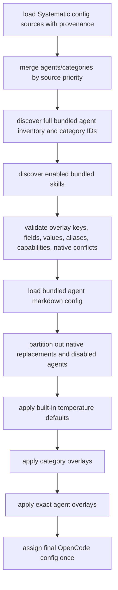

# feat: Add Agent Configuration Overlays

## Overview

Add a Systematic config surface for tuning bundled agents without editing bundled markdown or copying native OpenCode agent definitions. The first version adds top-level Systematic `agents` and `categories` overlays, built-in zero-config temperature defaults, strict field validation, and a permission-backed `skills` allowlist shortcut.

The plan replaces the earlier model-only `agent_models` direction. The config surface is broader agent configuration, but it remains a deterministic config-time overlay layer: no presets, runtime model switching, fallback chains, provider probing, or background retry manager.

## Problem Frame

Systematic emits bundled OpenCode agent definitions from `agents/**/*.md`. Bundled agents intentionally omit `model:` frontmatter, preserving provider portability by inheriting the orchestrating agent model. That portability makes specialized workflow tuning awkward: users must either accept inherited model/capability behavior or replace complete native OpenCode agent config and risk drift from bundled prompt/tool metadata (see origin: `docs/brainstorms/2026-05-09-agent-model-configuration-requirements.md`).

Systematic should provide a smaller, safer customization layer for its own bundled agents: markdown remains the default prompt/tool source, built-in policy defaults supply low-risk runtime tuning, category overlays handle broad policy, exact agent overlays handle exceptions, and native OpenCode same-name agents remain full user-owned replacements. The `skills` shortcut is included because per-agent skill visibility is part of the same customization problem: without it, users still have to copy full native agent definitions just to tune skill access.

## Requirements Trace

- R1. Support top-level Systematic `agents` and `categories` maps for bundled-agent overlays.
- R2. Support both unqualified file-stem agent keys and qualified `<category>/<stem>` keys, with duplicate-target validation. V1 also requires bundled stems to remain globally unique because emitted OpenCode agent keys are stem-only.
- R3. Treat documented category IDs as public V1 config API.
- R4. Apply precedence: exact agent overlay, category overlay, built-in defaults, bundled markdown defaults, inherited OpenCode defaults.
- R5. Across Systematic config sources, higher-priority same-key `agents`/`categories` objects replace lower-priority objects; unrelated keys survive.
- R6. Enforce a strict V1 field allow-list and reject unsupported fields.
- R7. Validate explicit `model` strings structurally as `provider/model`; include `variant` only as a normal OpenCode agent field, not as provider availability proof.
- R8. Define scalar, object, array, and capability allowlist merge semantics.
- R8a. Allow `disable` only for exact agent overlays.
- R8b. Add zero-config runtime tuning defaults outside bundled markdown; temperature defaults are in scope and may change zero-config runtime behavior. Provider-specific model defaults are deferred because safe config-hook availability/fallback support was not proven.
- R9. Include `skills` as a permission-backed shortcut because planning verified inventory and OpenCode `permission.skill` enforcement. Defer `mcps` because V1 should not depend on MCP tool-key naming without a dedicated implementation spike.
- R10. Fail fast before mutating OpenCode config for invalid overlay keys, fields, values, duplicates, and capability names.
- R11. Error messages include source config file path and invalid config key path where possible.
- R12. Exact overlays for known disabled bundled agents are valid no-ops unless a native replacement conflict exists.
- R13. Native OpenCode same-name agents are full replacements. Exact Systematic overlay for the same key conflicts; category overlays skip native replacements.
- R14. Bundled agents continue to omit `model:` frontmatter.
- R15. Overrides apply during OpenCode config generation, not by mutating markdown or generated docs.
- R16. Documentation covers config shape, field allow-list, precedence, conflict behavior, source precedence, and no-`model:` policy.
- R17. Documentation warns that category defaults affect future bundled agents in that category.

## Scope Boundaries

- V1 keeps `systematic.json`; it does not add `systematic.jsonc` discovery.
- V1 does not add named presets, runtime fallback chains, rate-limit failover, retry managers, or model switching.
- V1 does not attempt provider/model availability detection in the config hook. Explicit user `model` values are structurally validated only; well-shaped but nonexistent provider/model IDs pass Systematic validation and are left for OpenCode runtime behavior.
- V1 does not emit provider-specific zero-config model defaults. Default `model` remains omitted so OpenCode inheritance still works.
- V1 does not emit native `agent.skills` or `agent.mcps` fields; OpenCode has no such agent fields.
- V1 does not include a Systematic `mcps` shortcut. MCP allowlists are deferred until a separate plan can specify stable OpenCode MCP tool-key mapping and permission-rule behavior.
- V1 does not expose `prompt`, `description`, `options`, `tools`, display metadata beyond `color`/`hidden`, or arbitrary future OpenCode fields.
- V1 does not cover arbitrary user-defined agents outside Systematic's bundled inventory.
- V1 does not mutate bundled agent markdown or generated reference docs to add runtime tuning metadata.

## Context & Research

### Relevant Code and Patterns

- `src/lib/config.ts` loads `systematic.json` from defaults, user config, project config, and `$OPENCODE_CONFIG_DIR`, with custom config highest priority. Current arrays are union-merged and `bootstrap` is shallow-merged.
- `src/lib/config-handler.ts` discovers bundled agents/skills/commands and mutates OpenCode config in the plugin `config` hook. Current native `config.agent` entries win by object spread.
- `src/lib/agents.ts` discovers bundled agent files and categories, parses OpenCode-like frontmatter, and currently omits `variant` from `AgentInfo` despite OpenCode supporting it.
- `src/lib/skills.ts` discovers bundled skills and already has frontmatter validation patterns useful for skill allowlist inventory.
- `src/lib/validation.ts` contains small type guard helpers; new overlay validation should follow that style but live in a focused module.
- `src/lib/converter.ts` has `inferTemperature()` heuristics seeded from CEP conversion work: low temperature for review/security/lint/oracle-style agents, moderate for planning/research/architecture, medium for docs/writing, higher for brainstorm/design.
- `scripts/content-integrity.ts` already rejects bundled agent `model` frontmatter and discovers top-level bundled categories.
- `tests/unit/config.test.ts`, `tests/unit/config-handler.test.ts`, and `tests/unit/agents.test.ts` provide temp-dir and config-hook testing patterns.
- `docs/src/content/docs/getting-started/configuration.mdx` is the main manual config documentation surface.

### Institutional Learnings

- Bundled agents must omit `model:` entirely; `model: inherit` is invalid historical baggage.
- Systematic config priority is `$OPENCODE_CONFIG_DIR/systematic.json` over project `.opencode/systematic.json` over user `~/.config/opencode/systematic.json` over defaults.
- Content-integrity gates are needed for bundled asset contracts; type/lint checks alone do not catch invalid markdown/frontmatter drift.
- Plugin config-hook changes must preserve the idempotent plugin registration behavior; duplicate plugin factory calls should still return empty hooks after the first registration.
- Batch/generator verification should avoid brittle shell iteration patterns and should use a different verification mechanism than mutation.

### External References

- `anomalyco/opencode` `packages/opencode/src/config/agent.ts`: OpenCode `AgentConfig` supports `model`, `variant`, `temperature`, `top_p`, `prompt`, deprecated `tools`, `disable`, `description`, `mode`, `hidden`, `options`, `color`, `steps`, deprecated `maxSteps`, and `permission`. Unknown fields are moved into `options`, so Systematic must not pass arbitrary overlay fields through.
- `anomalyco/opencode` `packages/opencode/src/agent/agent.ts`: runtime overlays config fields onto agents and merges permissions. `disable: true` removes an agent.
- `anomalyco/opencode` plugin APIs: the plugin `config(cfg)` hook receives only the mutable config object. It does not cleanly expose provider/model availability during config mutation.
- `anomalyco/opencode` skill/MCP sources: skills are global via `skills.paths`/`skills.urls`; per-agent skill visibility is enforced through `permission.skill`. MCP servers are global via `cfg.mcp`; per-agent MCP access is controlled through permission rules on MCP tool keys.
- `oh-my-opencode-slim` demonstrates strict top-level `agents` config, provider-specific defaults, and translation of `skills`/`mcps` allowlists into permissions. It does not safely preflight provider availability during config-hook model selection. Systematic adopts the `skills` permission shortcut pattern but defers MCP shortcut support.
- `@cortexkit/magic-context` demonstrates explicit model/fallback settings for hidden managed agents and model-not-found retry for owned prompts, but that is outside Systematic V1's static bundled-agent overlay scope.

## Key Technical Decisions

- **Config shape:** Add top-level `agents` and `categories` maps to Systematic config. Do not use `agent_models`.
- **Effective source merge:** Merge `agents`/`categories` by key across Systematic config sources. Higher-priority same-key objects replace lower-priority same-key objects wholesale; unrelated keys survive.
- **Agent key model:** Support both unqualified file stems and qualified `<category>/<stem>` IDs as config aliases. V1 keeps emitted OpenCode agent keys as stem-only, so bundled agent stems must remain globally unique. Reject duplicate stems during inventory validation and content integrity. Reject configs that use both key forms for the same target in the effective config.
- **Category API:** Use top-level bundled category directory names as stable V1 category IDs: `design`, `docs`, `document-review`, `research`, `review`, and `workflow`.
- **Overlay field allow-list:** Support `model`, `variant`, `temperature`, `top_p`, `permission`, `mode`, `color`, `steps`, `hidden`, exact-agent-only `disable`, and managed `skills` shortcut fields translated into permissions. Exclude `tools` because OpenCode marks it deprecated; users can express tool policy through `permission`.
- **Built-in policy defaults:** Add zero-config temperature defaults in a default-resolution layer outside bundled markdown. These are intentional policy defaults, not absence-only fillers, and may override bundled markdown temperature values. Do not emit provider-specific default models in V1 because provider/model availability cannot be cleanly verified inside `config(cfg)`. Explicit user `model` config remains supported.
- **Capability semantics:** Implement `skills` as a managed shortcut for `permission.skill`. Omitted means inherit from weaker layers; an explicit empty array means allow none; `null` is invalid. Unknown/disabled skill names fail fast. Defer `mcps` rather than shipping a shortcut with underspecified MCP tool-key semantics.
- **Permission ordering:** Normalize permissions from weakest to strongest layer: bundled markdown, built-in defaults, category overlay, exact overlay. OpenCode evaluates the last matching permission rule, so exact-layer rules must be appended after category/default rules. Within a single overlay object, reject configs that set both managed `skills` and explicit `permission.skill`; this avoids ambiguous same-layer ownership of skill visibility.
- **Permission serialization:** Flatten each layer into ordered permission rules, concatenate weakest-to-strongest, resolve duplicate permission/pattern entries by last match, then rebuild the final permission object in evaluation order. Cross-layer `skills` and explicit `permission.skill` both normalize into the same ordered rule representation; exact-layer rules win because they are appended last.
- **Native replacement behavior:** Native OpenCode `agent.<key>` with the same emitted bundled agent key is a full user-owned replacement. Exact Systematic `agents.<key>` config for that agent conflicts. Category overlays skip native replacements and apply to remaining Systematic-owned bundled agents.
- **Pre-mutation validation:** Validate all overlay config, inventories, native conflicts, and capability names before mutating `config.agent`, `config.command`, `config.skills`, or `config.mcp`.
- **No markdown mutation:** Keep content-integrity enforcement of no bundled `model:` frontmatter; overrides and defaults are config-time only.

## Open Questions

### Resolved During Planning

- **Does OpenCode expose provider/model availability in the config hook?** No cleanly supported path was found in `anomalyco/opencode`; V1 defers provider-specific zero-config model defaults and never rewrites or falls back from explicit user `model` values.
- **Are `skills`/`mcps` native per-agent fields?** No. V1 translates `skills` into `permission.skill` rules and defers `mcps` until MCP permission mapping is specified in a later plan.
- **Should `tools` be part of the overlay allow-list?** No. OpenCode treats `tools` as deprecated and normalizes it into `permission`; Systematic should expose `permission` directly.
- **Can `variant`, `steps`, and `hidden` be exposed?** Yes. They are real OpenCode agent config fields in the actual source.
- **Can `variant` appear without `model`?** Yes. Systematic accepts it as a native OpenCode field, but docs/tests must note it may be ignored by OpenCode when no effective model uses variants.
- **Should native same-name config overlay bundled agents shallowly?** No. The corrected requirements make native same-name agents full replacements; exact Systematic overlay for the same target conflicts.

### Deferred to Implementation

- **Nearest-name suggestions:** Implement deterministic suggestions only if cheap; otherwise list valid categories and agent keys in errors.
- **Exact default temperature table:** Seed from `inferTemperature()` but adjust per-agent mappings during implementation if current bundled categories/roles make a more explicit table clearer.

## High-Level Technical Design

> *This illustrates the intended approach and is directional guidance for review, not implementation specification. The implementing agent should treat it as context, not code to reproduce.*

Precedence for a Systematic-owned bundled agent is:

1. Exact `agents.<key>` overlay
2. `categories.<category-id>` overlay
3. Built-in zero-config defaults
4. Bundled markdown/frontmatter defaults
5. OpenCode inherited defaults

Config-source priority is separate: before applying overlays, Systematic first computes effective `agents` and `categories` maps from defaults, user config, project config, and `$OPENCODE_CONFIG_DIR`, replacing same-key objects wholesale at higher priority.

## Implementation Units

- [ ] **Unit 1: Add source-aware overlay config loading**

**Goal:** Extend Systematic config loading with top-level `agents` and `categories`, preserving source provenance and whole-object same-key replacement semantics.

**Requirements:** R1, R5, R10, R11

**Dependencies:** None

**Files:**
- Modify: `src/lib/config.ts`
- Test: `tests/unit/config.test.ts`

**Approach:**
- Add typed optional `agents` and `categories` maps to `SystematicConfig`.
- Introduce a source-aware config result/helper boundary so the merged `SystematicConfig` can remain simple while overlay validation receives effective overlay entries with their source file path and key path.
- Represent raw overlay objects as `unknown`/records at config load time; detailed field validation belongs in Unit 2 after inventories exist.
- Track source file path and key path for each effective `agents.<key>` and `categories.<id>` entry so later validation errors can name the file that supplied the surviving object. Same-key replacement should replace provenance as well as value.
- Merge config sources in existing priority order. For overlay maps, higher-priority same-key objects replace lower-priority same-key objects wholesale; unrelated keys survive. Alias forms are not canonicalized before source merge; cross-source unqualified/qualified aliases for the same target survive and fail duplicate-target validation, so docs must tell users to use one canonical key form across sources.
- Preserve existing disabled-list union behavior and `bootstrap` shallow merge behavior.
- Keep missing config files ignored. Do not add `systematic.jsonc` discovery.
- Do not change plugin registration/idempotency behavior.

**Patterns to follow:**
- `src/lib/config.ts` default config and source-priority merge structure.
- `tests/unit/config.test.ts` temp-dir isolation.

**Test scenarios:**
- Happy path: user config with `agents.correctness-reviewer.model` loads with source/key provenance.
- Happy path: user category plus project exact agent both survive when keys differ.
- Precedence: project `agents.correctness-reviewer` replaces user `agents.correctness-reviewer` wholesale, without retaining lower-priority fields.
- Precedence: `$OPENCODE_CONFIG_DIR` category object replaces project category object for the same key.
- Edge case: absent `agents`/`categories` and empty maps are valid no-ops.
- Error path: `agents`, `categories`, or a same-key overlay entry set to `null`, arrays, or scalars fails with file path and config key path.
- Error path: higher-priority same-key replacement reports the higher-priority source file in later validation errors, not the lower-priority source.
- Error path: lower-priority unqualified key plus higher-priority qualified key for the same target fails duplicate-target validation rather than silently overriding across aliases.
- Non-error path: missing config files remain ignored.

**Verification:**
- Config tests prove merge priority, same-key replacement, unrelated-key survival, and source provenance.

- [ ] **Unit 2: Add bundled agent overlay inventory and validation**

**Goal:** Validate overlay keys, allowed fields, values, category IDs, alias collisions, and native replacement conflicts against real bundled inventories before config mutation.

**Requirements:** R2, R3, R6, R7, R8a, R10, R11, R12, R13

**Dependencies:** Unit 1

**Files:**
- Create: `src/lib/agent-overlays.ts`
- Modify: `src/lib/agents.ts`
- Test: `tests/unit/agent-overlays.test.ts`

**Approach:**
- Build a public bundled-agent inventory from direct `agents/<category>/<name>.md` files.
- Expose both qualified IDs and unqualified aliases when the stem is unique.
- Reject duplicate bundled stems as an inventory error because V1 emits stem-only OpenCode agent keys.
- Reject effective configs that use both qualified and unqualified keys for the same bundled agent.
- Validate category keys against top-level bundled category IDs, not only enabled agents.
- Validate field allow-list: `model`, `variant`, `temperature`, `top_p`, `permission`, `mode`, `color`, `steps`, `hidden`, exact-agent-only `disable`, and `skills`.
- Reject `tools`, `prompt`, `description`, `options`, unknown display metadata, and arbitrary unknown fields.
- Validate scalar values structurally: non-empty `provider/model` strings for `model`, non-empty string for `variant`, finite numbers for sampling fields, positive integer for `steps`, boolean for `hidden`/`disable`, supported mode literals, and OpenCode-compatible color strings. Do not validate provider/model availability and do not normalize shorthand model names.
- Validate `permission` against OpenCode's current permission shape, including action-or-object rules, rest/custom tool keys, wildcard patterns, and `permission.skill` object form, without interpreting provider/MCP tool-key semantics. Do not reuse `normalizePermission()` if it rejects valid OpenCode permission config.
- Validate category-level `disable` as invalid.
- Detect native same-name replacements from the incoming OpenCode `config.agent` map. Exact overlay targeting a native replacement fails; category overlays should later skip those targets.
- Treat exact overlays for known disabled bundled agents as valid; they become no-ops when application filters disabled agents.

**Patterns to follow:**
- `src/lib/validation.ts` type guards and normalizers.
- `src/lib/agents.ts` and `scripts/content-integrity.ts` category discovery style.
- `tests/unit/agents.test.ts` fixture-based discovery tests.

**Test scenarios:**
- Happy path: unqualified unique key and qualified key each resolve to the same bundled agent when used alone.
- Error path: both key forms for the same target in the effective config fail with a duplicate-target error.
- Error path: duplicate bundled stems fail inventory validation before config application.
- Happy path: known category ID validates.
- Error path: unknown category ID lists valid categories.
- Error path: unknown field, deprecated `tools`, `prompt`, `description`, and `options` are rejected with key path.
- Error path: `mcps` is rejected as unsupported in V1.
- Error path: `disable` under `categories.review` is rejected; `disable` under an exact agent is accepted.
- Error path: malformed `model`, `variant`, `temperature`, `top_p`, `mode`, `steps`, `hidden`, `color`, or `permission` values fail with source path and key path.
- Native conflict: exact overlay for `correctness-reviewer` fails when incoming OpenCode config already defines `agent.correctness-reviewer`.
- Native conflict: exact overlay using qualified key `agents.review/correctness-reviewer` also fails when incoming OpenCode config defines `agent.correctness-reviewer`.
- Native conflict: exact overlay for a disabled bundled agent still fails when the same emitted key is present as a native replacement.
- Permission path: `permission.read`, `permission.grep`, `permission.skill` object form, wildcard rules, and custom tool keys validate without MCP-specific semantics.
- Model path: `model: "gpt-4"` and `model: "inherit"` fail structural validation; `model: "openai/gpt-4"` passes even if OpenCode may not have that model configured.
- Disabled path: exact overlay for a disabled bundled agent validates but records no application target.

**Verification:**
- Validation tests prove every public error class and key-resolution rule before config-handler integration.

- [ ] **Unit 3: Implement defaults, capability permissions, and overlay application**

**Goal:** Apply built-in defaults, category overlays, exact overlays, and managed capability shortcuts to emitted bundled OpenCode agent config.

**Requirements:** R4, R8, R8b, R9, R12, R13, R14, R15

**Dependencies:** Unit 2

**Files:**
- Modify: `src/lib/agent-overlays.ts`
- Modify: `src/lib/config-handler.ts`
- Modify: `src/lib/agents.ts`
- Test: `tests/unit/agent-overlays.test.ts`
- Test: `tests/unit/config-handler.test.ts`

**Approach:**
- Add built-in temperature defaults outside bundled markdown. Prefer an explicit function/table seeded from `inferTemperature()` rather than importing converter-specific behavior directly if that would couple runtime config to conversion internals. Built-in defaults sit above bundled markdown in the precedence stack and override existing markdown temperature values unless a stronger category/exact overlay applies; document this zero-config behavior change and note that OpenCode/runtime providers own unsupported sampling-parameter behavior.
- Do not emit default `model` values. User-configured explicit `model` values apply normally.
- Add `variant` parsing/emission support to bundled agent config where relevant because OpenCode supports it.
- Apply overlays to Systematic-owned bundled agents only: markdown defaults first, built-in policy defaults next, category overlay, then exact overlay.
- Partition disabled agents and native same-name replacements out of the Systematic-owned target set before applying overlays. Exact overlays targeting native replacements fail during validation; category overlays simply never see those native-owned targets.
- Implement `skills` as a managed shortcut that writes `permission.skill` rules. `skills: ["ce:review"]` should deny all skills first and then allow the selected skills, ordered so OpenCode's last-match rule produces the allowlist. `skills: []` should deny all skills. Omitted `skills` inherits weaker-layer skill permissions/defaults.
- Reject any single overlay object that sets both managed `skills` and explicit `permission.skill`; users must choose one authority for skill visibility at that layer.
- Normalize each layer into ordered permission rules and concatenate weakest-to-strongest so exact overlays override category/default rules under OpenCode's last-match behavior. Cross-layer managed `skills` and explicit `permission.skill` use the same normalized rule representation.
- Build all bundled agent configs and validation results locally, then assign `config.agent` and related config surfaces only after validation succeeds. Stage cloned copies of every mutated surface, including `config.skills.paths`, and avoid in-place `push` on caller-owned arrays before validation succeeds.

**Patterns to follow:**
- `src/lib/config-handler.ts` existing bundled agent/skill registration flow.
- `src/lib/agents.ts` frontmatter-to-AgentConfig mapping.
- OpenCode permission shape from `anomalyco/opencode` config sources.

**Test scenarios:**
- Happy path: no user config applies built-in temperature defaults while leaving `model` omitted.
- Precedence path: a bundled markdown temperature is overridden by the built-in temperature default unless a category/exact overlay provides a stronger value.
- Happy path: category `review.temperature` applies to review agents.
- Happy path: exact `agents.correctness-reviewer.temperature` beats `categories.review.temperature`.
- Happy path: exact explicit `model` emits `model`; unrelated agents still omit `model`.
- Happy path: `variant`, `top_p`, `mode`, `color`, `steps`, and `hidden` emit correctly when configured.
- Variant path: `variant` without `model` is accepted and emitted, with docs noting OpenCode may ignore it without an effective variant-capable model.
- Capability path: `skills: ["ce:review"]` emits exact ordered permission rules that deny all skills and then allow `ce:review`.
- Capability path: `skills: []` emits deny-all skill permission; omitted `skills` inherits weaker-layer behavior.
- Capability path: category allows skill A/B and exact allows only A; final permission order allows only A.
- Capability path: category denies skill A and exact allows A; exact wins through last-match rule order.
- Capability path: category `skills` plus exact explicit `permission.skill` follows weakest-to-strongest rule ordering; category explicit `permission.skill` plus exact `skills` does the same.
- Error path: same overlay object with both `skills` and `permission.skill` fails.
- Error path: unknown or disabled skill names fail before config mutation.
- Native path: category overlay skips native replacement and still applies to other bundled agents in the category.
- Disabled path: exact overlay for disabled bundled agent has no emitted config.
- Atomicity path: invalid overlay leaves `config.agent`, `config.command`, `config.skills.paths`, and `config.mcp` unmodified, including preserving existing array contents, nested object state, and caller-owned references.

**Verification:**
- Unit tests prove final emitted OpenCode config shape, permission translations, no default model emission, and pre-mutation atomicity.

- [ ] **Unit 4: Add integrity coverage and documentation**

**Goal:** Document the new config surface and guard the bundled-asset contracts that make it safe.

**Requirements:** R14, R15, R16, R17

**Dependencies:** Units 1-3

**Files:**
- Modify: `README.md`
- Modify: `docs/src/content/docs/getting-started/configuration.mdx`
- Modify: `scripts/content-integrity.ts`
- Test: `tests/unit/content-integrity.test.ts`

**Approach:**
- Document `agents` and `categories` examples using repo-accurate category IDs and agent IDs.
- Explain precedence separately for config-source merging and overlay application.
- Document native OpenCode same-name replacement conflicts and category-skip behavior.
- Document that default `model` is omitted unless the user configures it; provider-specific model defaults are intentionally deferred.
- Document managed `skills` as a permission shortcut, not a native OpenCode agent field. Do not include `mcps` in the V1 config schema or examples; mention it only in an out-of-scope note if needed.
- Document that category IDs are V1 public API because broad policy overlays are a primary use case; future reorganizations must preserve aliases or provide migration warnings.
- Document that users should use one canonical agent key form across config sources because cross-source alias collisions fail duplicate-target validation.
- Add or extend content-integrity checks only where needed: bundled agent `model:` ban stays enforced, and any duplicated bundled agent stems should fail because unqualified config aliases depend on uniqueness.
- Do not edit generated reference docs directly.

**Patterns to follow:**
- Existing config docs in `docs/src/content/docs/getting-started/configuration.mdx`.
- Existing `checkAgentModel()` and explicit-field validation style in `scripts/content-integrity.ts`.

**Test scenarios:**
- Content-integrity: duplicate bundled agent stems across categories fail with both paths.
- Content-integrity: existing no-`model:` bundled agent rule still fails a fixture with `model` frontmatter.
- Docs review expectation: examples use `agents`/`categories`, not `agent_models`, and no generated reference files are hand-edited.

**Verification:**
- Documentation clearly states config shape, precedence, conflicts, defaults, and capability semantics.
- Integrity tests cover duplicate stem and no-model contracts.

- [ ] **Unit 5: Add integration coverage and generated artifacts**

**Goal:** Verify the full plugin config hook behavior and generated-artifact drift status.

**Requirements:** R1-R17

**Dependencies:** Units 1-4

**Files:**
- Modify: `tests/integration/systematic-plugin.test.ts`

**Approach:**
- Add end-to-end plugin config-hook tests that run through `SystematicPlugin()` or the nearest existing integration harness rather than only pure helpers.
- Cover exact/category overlays, no-default-model behavior, native exact conflict, native category skip, and capability permission translation at the integration level.
- No generated artifacts are expected to change from the plan alone. Run docs/registry drift checks; regenerate only if source changes require it.
- Keep OpenCode plugin default export contract unchanged; do not add named exports from `src/index.ts`.

**Patterns to follow:**
- Existing integration tests for skill/tool registration and config hook behavior.
- Existing generated-doc and registry workflows.

**Test scenarios:**
- Integration: plugin config with exact overlay emits tuned bundled agent.
- Integration: plugin config with category overlay tunes category members and skips native replacement.
- Integration: native-replaced category member is partitioned out before overlay application; no intermediate or final Systematic-owned config is produced for that key.
- Integration: exact overlay plus native same-name agent fails before partial mutation.
- Integration: no user model config leaves emitted agents without provider-specific default models.
- Integration: well-shaped but nonexistent explicit `model` passes Systematic validation and is emitted unchanged; OpenCode owns runtime failure behavior.
- Regression: plugin still exports only a default factory function from built `dist/index.js`.

**Verification:**
- Full unit/integration test suite, typecheck, lint, content-integrity, and registry drift pass after implementation.

## System-Wide Impact

- **Interaction graph:** `loadConfig()` feeds `createConfigHandler()`, which discovers bundled agents/skills and mutates OpenCode config. Overlay validation must run before any config mutation to avoid partial registration.
- **Error propagation:** Invalid config should throw with file path and key path. Missing config files remain ignored.
- **State lifecycle risks:** Plugin config hooks mutate a live object; build local results first and assign once to minimize partial-state bugs.
- **API surface parity:** Config docs, README examples, content-integrity, and tests must all agree on `agents`/`categories`, not `agent_models`.
- **Integration coverage:** Pure helper tests are insufficient; at least one integration path should prove final OpenCode config shape.
- **Unchanged invariants:** Bundled markdown still omits `model:`; `src/index.ts` still exports only the default plugin factory; registry source of truth remains `registry/registry.jsonc`.

## Risks & Dependencies

| Risk | Mitigation |
|------|------------|
| Provider-specific defaults break users without that provider | Defer default model emission; inherit unless user explicitly configures `model`. |
| `skills`/`mcps` become inert pass-through fields | Translate `skills` to permissions; defer `mcps` until a separate plan specifies stable MCP permission mapping. |
| Dual agent key forms create ambiguous config | Canonical inventory, duplicate-target validation, duplicate-stem integrity gate. |
| Category defaults surprise users after upgrades | Document category IDs as public API and warn that future agents in a category inherit category defaults. |
| Native OpenCode config and Systematic overlays fight for ownership | Exact overlay conflicts with native same-name replacement; category overlays skip native replacements. |
| Config-hook partial mutation leaves broken OpenCode config | Validate first, build local maps, assign once. |

## Documentation / Operational Notes

- This is a minor feature if the implementation preserves inherited model behavior by default.
- Release notes should say provider-specific zero-config model defaults were researched and deferred because OpenCode does not expose reliable config-hook availability detection.
- Docs should present `skills` as a permission shortcut, not as a native OpenCode agent field.
- Docs and tests must omit `mcps` from the V1 config schema rather than marking it “coming soon.”

## Sources & References

- **Origin document:** [docs/brainstorms/2026-05-09-agent-model-configuration-requirements.md](../brainstorms/2026-05-09-agent-model-configuration-requirements.md)
- `src/lib/config.ts`
- `src/lib/config-handler.ts`
- `src/lib/agents.ts`
- `src/lib/skills.ts`
- `src/lib/validation.ts`
- `src/lib/converter.ts`
- `scripts/content-integrity.ts`
- `docs/src/content/docs/getting-started/configuration.mdx`
- OpenCode source: `https://github.com/anomalyco/opencode/blob/dev/packages/opencode/src/config/agent.ts`
- OpenCode source: `https://github.com/anomalyco/opencode/blob/dev/packages/opencode/src/agent/agent.ts`
- OpenCode source: `https://github.com/anomalyco/opencode/blob/dev/packages/plugin/src/index.ts`
- OpenCode source: `https://github.com/anomalyco/opencode/blob/dev/packages/opencode/src/config/skills.ts`
- OpenCode source: `https://github.com/anomalyco/opencode/blob/dev/packages/opencode/src/config/mcp.ts`
