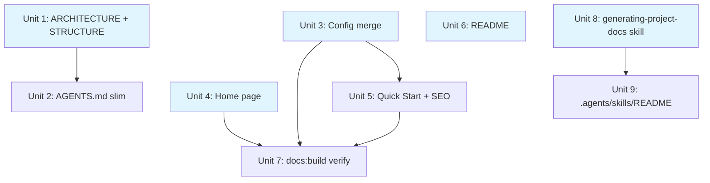

# Launch Surface Cleanup

## Overview

Rewrite the docs site home page, merge configuration pages, add a Quick Start guide, rewrite the README, extract ARCHITECTURE.md and STRUCTURE.md from AGENTS.md, add SEO metadata, and create a project-specific `generating-project-docs` skill. Target: a public-facing funnel that converts AI-assisted developers exploring workflow tools.

## Problem Frame

Systematic is technically credible (47 skills, 51 agents, typed config, content-integrity CI) but publicly under-positioned. The home page is a 36-line thin hero. The README is reference-heavy with full asset tables. Configuration is split across two pages with repeated prose. Architecture and structure docs are buried in AGENTS.md. No Quick Start exists to activate new users after install. (See origin: `docs/brainstorms/2026-05-22-launch-surface-requirements.md`)

## Requirements Trace

**Docs site:**
- R1. Home page — three-flatland product landing page pattern (value prop → proof → CTA → features → quick-start)
- R2. Merge configuration pages — single focused reference, retarget generator, add redirects

**Repo docs:**
- R3. README — problem-first, lean (<150 lines target), link to docs for catalogs
- R4. ARCHITECTURE.md — matklad pattern (bird's eye, codemap, invariants, data flow, cross-cutting)
- R5. STRUCTURE.md — Magic Context pattern (directory layout, purposes, key files, naming, where to add)
- R6. AGENTS.md slimming — keep AI contributor essentials + compact agent index

**Tooling:**
- R7. generating-project-docs skill — replaces `.opencode/commands/generate-readme.md`, supports scoped arguments
- R8. `.agents/skills/README.md` — skills directory purpose and available skills table
- R9. Getting Started flow verification — installation page current, links work after restructure
- R10. Quick Start / First Workflow page (from Oracle assessment — not in original requirements doc)
- R11. SEO metadata — JSON-LD, og:type, og:site_name, twitter:card, canonical URLs (from Oracle assessment)

## Scope Boundaries

- No promotion copy (LinkedIn, Discord, ecosystem PR) — separate effort after docs ship
- No new guide pages beyond Quick Start
- No badge redesign — current badges are fine
- No v3.0.0 excision work
- No docs site theme changes — OKLCH refresh already shipped
- No curated Skills/Agents category landing pages — valuable but separate effort
- No visitor analytics or telemetry

### Deferred to Separate Tasks

- OpenCode ecosystem PR (`anomalyco/opencode` packages/web/src/content/docs/ecosystem.mdx): after launch surfaces ship
- Curated Skills/Agents category overview pages: separate docs enhancement PR
- Star history / npm download metrics automation: separate repo polish PR

## Context & Research

### Relevant Code and Patterns

- `docs/scripts/generate-config-reference.ts` — auto-generates `reference/systematic-config.mdx` from Zod schema. Must be retargeted or removed when merging config pages.
- `docs/scripts/transform-content.ts` — generates skill/agent reference pages from bundled assets
- `docs/astro.config.mjs` — Starlight sidebar config, site metadata, head tags
- `docs/src/content/docs/index.mdx` — current 36-line home page
- `docs/src/content/docs/getting-started/configuration.mdx` — 246-line human-authored config guide
- `docs/src/content/docs/reference/systematic-config.mdx` — auto-generated field reference
- `.opencode/commands/generate-readme.md` — current README generation command (152 lines)
- `AGENTS.md` — AI contributor instructions with embedded architecture/structure content
- `src/lib/AGENTS.md` — sub-module AGENTS.md

### Institutional Learnings

- Generate docs/reference tables from runtime constants, not hand-edited MDX (`docs/solutions/best-practices/provider-availability-source-defaults-2026-05-12.md`)
- Make `docs:build` the idempotence gate for generated docs (`docs/solutions/best-practices/typed-config-validation-build-time-codegen-2026-05-16.md`)
- Docs deployment only fires on `release: published` events or manual `workflow_dispatch` — non-releasing commits do NOT trigger deployment

## Key Technical Decisions

- **Config page merge strategy**: Keep human-authored narrative flow at top (examples, trust boundaries, overlays, schema/autocomplete), retarget `generate-config-reference.ts` to output a generated section at the bottom of the unified page or as an imported component. Don't dump schema inline near the top. (Oracle recommendation)
- **AGENTS.md agent index**: Keep a compact "must-read for agents" index in AGENTS.md with critical paths and triggers. Agents must find the right module from AGENTS.md alone without following links to ARCHITECTURE.md or STRUCTURE.md. Full detail lives in the extracted docs.
- **Page redirects**: Use Astro `redirects` in `docs/astro.config.mjs` (NOT Starlight `slug`, which only changes a page's canonical URL). Static builds produce meta-refresh HTML pages (acceptable for GitHub Pages). Cover both old paths: `/getting-started/configuration/` and `/reference/systematic-config/` → `/reference/configuration/`. Preserve old anchor IDs with explicit heading IDs on the new page.
- **Canonical activation story**: All surfaces (README, home page, Quick Start, installation) use one canonical workflow sequence: install → restart → `/ce:brainstorm` → `/ce:plan` → `/ce:work` → `/ce:review`. Same install snippet, same example task ("add dark mode toggle"). Counts come from live inventory commands, not hardcoded. Any page that abbreviates the workflow must reference the full flow. Source of truth: Quick Start page defines the canonical sequence; other surfaces derive from it.
- **Config generator mechanism**: Use **sentinel injection** (existing pattern). Generator currently uses `SYSTEMATIC:SOURCE-DEFAULTS:START/END` delimiters to inject the source-defaults table — use the same pattern for the field reference: `SYSTEMATIC:FIELD-REFERENCE:START/END` markers in the human-owned `reference/configuration.mdx`. Generator writes content between markers only, no frontmatter, no page-level metadata. The generator's "Do NOT edit" warning scopes to the generated region only. This avoids MDX import complexity and content-collection routing issues. Generator has **two side effects** today (config page write + source-defaults injection) — both must be retargeted to the new unified page.
- **SEO metadata**: Add to `docs/astro.config.mjs` head config — JSON-LD `SoftwareSourceCode` schema, `og:type`, `og:site_name`, `twitter:card`. Canonical URLs use Starlight's built-in canonical support (or per-page frontmatter if needed) — do NOT hardcode a static canonical in global head config since it would be wrong for every page except the home page.
- **Skill location**: Verify `.agents/skills/` discovery in OpenCode before deleting old command. If not discovered, use `.opencode/skills/` instead.

## Open Questions

### Resolved During Planning

- **Where does Quick Start page go?** → `docs/src/content/docs/getting-started/quick-start.mdx` with `sidebar.order: 2` (between Installation and Configuration)
- **What workflow does Quick Start show?** → Install → restart → `/ce:brainstorm` → `/ce:plan` → `/ce:work` → `/ce:review` (Oracle recommendation)
- **Config page final location?** → `docs/src/content/docs/reference/configuration.mdx` — moved from Getting Started to Reference since it's reference material

### Deferred to Implementation

- Exact Starlight redirect mechanism (slug vs Astro config) — depends on Starlight version capabilities
- Whether `generate-config-reference.ts` should output a partial MDX fragment or a full page — depends on import/composition approach

## Implementation Units

### Parallel batch A (no dependencies between these)

- [ ] **Unit 1: ARCHITECTURE.md + STRUCTURE.md**

**Goal:** Create two new root-level docs following matklad and Magic Context patterns respectively. Extract content from AGENTS.md.

**Requirements:** R4, R5

**Dependencies:** None

**Files:**
- Create: `ARCHITECTURE.md`
- Create: `STRUCTURE.md`
- Read (source): `AGENTS.md`, `src/lib/AGENTS.md`

**Approach:**
- ARCHITECTURE.md: bird's eye overview (3-hook plugin model), codemap (coarse module relationships), invariants (entry point exports only default, bundled markdown omits model, trust boundary), data flow (plugin load → config merge → agent emission → bootstrap injection), cross-cutting concerns (content-integrity gate, registry drift)
- STRUCTURE.md: directory layout ASCII tree, per-directory purposes (Purpose/Contains/Key files), key file locations by role, naming conventions, "where to add new code" recipes
- Extract from AGENTS.md: Plugin Architecture, Code Map, Where to Look, Structure tree
- Do NOT extract: Conventions, Anti-Patterns, Commands (those stay in AGENTS.md)
- Target: ARCHITECTURE.md <200 lines, STRUCTURE.md <250 lines

**Patterns to follow:**
- matklad's ARCHITECTURE.md pattern (name symbols, don't link; architecture invariants inline)
- Magic Context's STRUCTURE.md (`STRUCTURE.md` at repo root)

**Test scenarios:**
- Test expectation: none — pure documentation, no behavioral change

**Verification:**
- Both files exist at repo root
- ARCHITECTURE.md covers: overview, codemap, invariants, data flow, cross-cutting
- STRUCTURE.md covers: directory layout, purposes, key files, naming, where-to-add

---

- [ ] **Unit 3: Config page merge + generator retarget**

**Goal:** Merge two config pages into one focused reference page. Retarget or remove the auto-generator.

**Requirements:** R2

**Dependencies:** None

**Files:**
- Create: `docs/src/content/docs/reference/configuration.mdx`
- Delete: `docs/src/content/docs/getting-started/configuration.mdx`
- Delete: `docs/src/content/docs/reference/systematic-config.mdx`
- Modify: `docs/scripts/generate-config-reference.ts` (retarget output path)
- Modify: `docs/astro.config.mjs` (sidebar + redirects)

**Approach:**
- Human-authored content flow: (1) config file locations, (2) common examples, (3) trust boundaries summary, (4) overlays with examples, (5) source defaults table (preserved from current), (6) schema/autocomplete setup, (7) typed validation migration note
- Cut: repeated trust-boundary explanations (currently 3+ times), verbose availability-aware resolution prose, redundant precedence lists
- Generated field reference: change `generate-config-reference.ts` to inject between `{/* SYSTEMATIC:FIELD-REFERENCE:START */}` / `{/* SYSTEMATIC:FIELD-REFERENCE:END */}` sentinel markers in the human-owned page (matching existing source-defaults injection pattern). Generator must also retarget the source-defaults table injection from `getting-started/configuration.mdx` to `reference/configuration.mdx`. Generator must NOT recreate `reference/systematic-config.mdx` or `getting-started/configuration.mdx` after deletion.
- Add Starlight redirect from old paths to new

**Patterns to follow:**
- Source defaults table uses MDX comment delimiters (`{/* SYSTEMATIC:SOURCE-DEFAULTS:START */}`) — preserve this pattern
- Learnings: generate from runtime constants, make `docs:build` the idempotence gate

**Test scenarios:**
- Test expectation: none — docs content restructure
- Verification via `bun run docs:generate && bun run docs:build` producing clean output

**Verification:**
- Single config page at `reference/configuration.mdx`
- Old paths redirect (no 404s)
- `docs:generate` produces no resurrection of deleted files
- `docs:build` clean (110+ pages, zero errors)
- No repeated trust-boundary explanations
- `docs/AGENTS.md` updated to reflect new config reference path and generator contract

**Ownership model:** `reference/configuration.mdx` is a **committed, human-owned file** with generated regions injected between sentinel markers. The generator updates only the marked regions; human prose outside markers is preserved. The old fully-generated `reference/systematic-config.mdx` is deleted and must not be regenerated.

---

- [ ] **Unit 4: Home page rewrite**

**Goal:** Rewrite docs home page as a product landing page that converts AI-assisted developers exploring workflow tools.

**Requirements:** R1

**Dependencies:** None

**Files:**
- Modify: `docs/src/content/docs/index.mdx`

**Approach:**
- Three-flatland pattern sections:
  1. Hero: value prop H1 ("Your AI writes code. Systematic adds engineering discipline."), subtagline, primary CTA (Install) + secondary CTA (GitHub)
  2. What you get: concrete capabilities (not abstract "Structured Skills"), actual skill/agent counts
  3. The workflow: brainstorm → plan → implement → review → compound — show the actual cycle
  4. Quick-start snippet: `opencode.json` config + first command
  5. What it is NOT: not a model wrapper, not another chat UI, not telemetry/SaaS (honesty section per Oracle)
- Concrete content direction:
  1. Hero: "Your AI writes code. Systematic adds engineering discipline." + subtext about workflow-driven collaboration
  2. What It Is: plugin that bundles skills, agents, bootstrap hooks, config hooks, CLI
  3. What You Get: 47 skills, 51 agents, zero manual copying, automatic bootstrap, extensibility, OCX
  4. The Workflow: brainstorm → plan → work → review (the core activation loop). Compound is a follow-up step, not part of the activation sequence.
  5. Quick Start: canonical install snippet + first command
  6. What It Is Not: not a model wrapper, not chat UI, not telemetry/SaaS, not magic autopilot
- Use Starlight components: `Card`, `CardGrid`, `Steps` where appropriate
- Tone: blunt, useful, promise less / explain more. Same voice as philosophy.mdx
- Target: 80-120 lines

**Patterns to follow:**
- Current banner/hero structure (keep `<picture>` with `alt`)
- Starlight splash template conventions

**Test scenarios:**
- Test expectation: none — docs content
- GREEN verification: @designer reviews the deployed page for design-law compliance

**Verification:**
- Home page answers: what is it, why care, what do I get, first command, who is it for, what is it not
- `docs:build` clean

---

- [ ] **Unit 5: Quick Start page + SEO metadata**

**Goal:** Add activation page showing first workflow end-to-end. Add structured SEO metadata to docs site.

**Requirements:** R10, R11

**Dependencies:** Unit 3 (both modify `docs/astro.config.mjs` — serialize to avoid merge conflicts)

**Files:**
- Create: `docs/src/content/docs/getting-started/quick-start.mdx`
- Modify: `docs/astro.config.mjs` (sidebar order, head metadata)
- Modify: `docs/src/content/docs/getting-started/installation.mdx` (add link to Quick Start as next step)

**Approach:**
- Quick Start shows: prerequisite (OpenCode installed), add plugin config, restart, run `/ce:brainstorm "add dark mode toggle"` → observe brainstorm output → run `/ce:plan` → observe plan → run `/ce:work` → observe implementation → run `/ce:review` → observe review. Keep it concrete with a simple example task.
- SEO: add to `docs/astro.config.mjs` head array: `og:type` website, `og:site_name` Systematic, `twitter:card` summary_large_image, canonical URL pattern. Add JSON-LD `SoftwareSourceCode` script tag.
- Better site title: "Systematic — Structured Engineering Workflows for OpenCode"
- Better description: "Install 47 skills and 51 agents for disciplined OpenCode workflows: brainstorm, plan, implement, review, and compound engineering knowledge."

**Patterns to follow:**
- Existing `og:image` meta tags in `docs/astro.config.mjs` (already added in PR #420)
- Starlight `sidebar.order` for page positioning

**Test scenarios:**
- Test expectation: none — docs content + metadata

**Verification:**
- Quick Start page renders with clear step-by-step flow
- View page source shows JSON-LD, og:type, twitter:card metadata
- Installation page links to Quick Start as next step
- `docs:build` clean

---

- [ ] **Unit 6: README rewrite**

**Goal:** Problem-first README under ~150 lines that links to docs for everything detailed.

**Requirements:** R3

**Dependencies:** None

**Files:**
- Modify: `README.md`

**Approach:**
- Structure: (1) header block (preserve `<picture>` banner + badge style), (2) problem statement: "AI coding tools are fast at generating code, but they don't preserve engineering discipline by default. They skip planning, forget standards, miss review steps, and fail to capture what was learned.", (3) "Why Systematic?": "You want AI that follows your process, not just your prompts. You want the system to get better after each task.", (4) what you get (3-5 sentences: 47 skills, 51 agents, zero config, OCX registry — not tables), (5) quick install (canonical `opencode.json` snippet from activation story), (6) first workflow (canonical sequence from Quick Start), (7) first-run checklist (prerequisite, config, verify, first workflow), (8) deep links (docs, skills catalog, agent catalog, config reference, architecture), (9) license
- Remove: full skills table, agent category tables, CLI command table, Mermaid diagram, Development section, converter/CEP migration section
- Preserve: badge style, banner, license
- Target: ~100-150 lines

**Patterns to follow:**
- three-flatland README structure: value prop → install → quick-start → core concepts → deep links
- Current badge style (`flat-square`, `labelColor=1a1a2e`)

**Test scenarios:**
- Test expectation: none — documentation

**Verification:**
- README is under 150 lines
- All links resolve (docs site, npm, GitHub)
- Contains: problem statement, install snippet, first workflow example, deep links
- Does NOT contain: full skill/agent/command tables, Mermaid diagram, CLI reference

---

- [ ] **Unit 8: generating-project-docs skill**

**Goal:** Convert `.opencode/commands/generate-readme.md` into a project-specific skill that generates README, ARCHITECTURE.md, and STRUCTURE.md.

**Requirements:** R7

**Dependencies:** None

**Files:**
- Create: `.agents/skills/generating-project-docs/SKILL.md` (or `.opencode/skills/` if discovery fails)
- Delete: `.opencode/commands/generate-readme.md`

**Approach:**
- Follow `writing-skills` discipline for skill authoring
- Frontmatter: `name: generating-project-docs`, `description: Use when creating, refreshing, or updating project-level documentation...`
- Support scoped arguments: `readme`, `architecture`, `structure`, or section names. Default = all three docs.
- Derive every fact from live repo (inventory commands, git log, filesystem — never hardcoded counts)
- Non-negotiable style rules matching project conventions (badge colors, heading order, voice)
- Preserve evolved document structure — minimal diff, not template regression
- Quality checks: security (no secrets), accuracy (counts match), style (headings, code blocks)
- Before deleting old command: verify OpenCode discovers `.agents/skills/` in this repo

**Execution note:** Follow `writing-skills` RED-GREEN-REFACTOR discipline for skill content verification.

**Patterns to follow:**
- fro-bot/.github's `generating-project-docs/SKILL.md` for structure and tone
- Current `.opencode/commands/generate-readme.md` for inventory commands and phase structure
- agentskills.io specification for `.agents/skills/` layout

**Test scenarios:**
- GREEN: invoke skill from fresh OpenCode session, verify it's discoverable and loadable
- GREEN: invoke with `readme` scope, verify it produces a minimal-diff README update
- GREEN: invoke with no argument, verify it addresses all three docs

**Verification:**
- Skill is discoverable from OpenCode session
- Old command deleted
- Skill passes `writing-skills` verification

### Sequential batch B (depends on batch A)

- [ ] **Unit 2: AGENTS.md slimming**

**Goal:** Slim AGENTS.md to AI contributor essentials with compact agent index.

**Requirements:** R6

**Dependencies:** Unit 1 (ARCHITECTURE.md and STRUCTURE.md must exist first)

**Files:**
- Modify: `AGENTS.md`
- Modify: `src/lib/AGENTS.md` (update cross-references)

**Approach:**
- Keep: Commands reference, Stack summary, Code conventions, Anti-patterns, Notes, Known Issues
- Add: Compact agent index as a non-negotiable inline routing table — common task → exact file(s) → must-read invariant. NOT link-only guidance. Agents must be able to route without following links. Example entries: "Add config field → `src/lib/config-schema.ts` + `src/lib/config.ts`", "Add bundled skill → `skills/<name>/SKILL.md` + run `bun scripts/generate-registry.ts`", "Edit docs generator → `docs/scripts/*.ts`". Include abbreviated top-10 Where to Look entries inline.
- Remove: Full Structure tree (→ STRUCTURE.md), full Where to Look table (→ STRUCTURE.md, abbreviated stays), Code Map table (→ ARCHITECTURE.md), Plugin Architecture section (→ ARCHITECTURE.md)
- Update cross-references: link to ARCHITECTURE.md and STRUCTURE.md where content was extracted

**Patterns to follow:**
- Current AGENTS.md section ordering
- Adversarial reviewer finding: cold agent must find right module from AGENTS.md alone

**Test scenarios:**
- Test expectation: none — documentation restructure
- Integration: content-integrity gate should still pass (AGENTS.md paths referenced in gate must still resolve)

**Verification:**
- AGENTS.md contains: commands, stack, conventions, anti-patterns, compact agent index
- AGENTS.md does NOT contain: full structure tree, full code map, plugin architecture prose
- A cold agent reading only AGENTS.md can identify which file to edit for any common task
- `bun scripts/content-integrity.ts` passes

---

- [ ] **Unit 7: docs:build final verification + Getting Started flow**

**Goal:** Verify entire docs site builds cleanly after all content changes. Verify Getting Started flow works.

**Requirements:** R9

**Dependencies:** Units 3, 4, 5 (all docs content changes)

**Files:**
- Modify: `docs/src/content/docs/getting-started/installation.mdx` (verify links, add Quick Start pointer if not done in U5)
- Modify: `docs/astro.config.mjs` (final sidebar ordering verification)

**Approach:**
- Run `bun run docs:generate && bun run docs:build`
- Verify no deleted-page resurrection
- Verify all internal links resolve
- Verify Getting Started flow: Installation → Quick Start → Configuration (reference)
- Verify sidebar ordering makes sense
- Verify page count is reasonable (expect ~110 pages, ±2 from adds/removes)

**Test scenarios:**
- Test expectation: none — verification pass

**Verification:**
- `docs:build` exits 0 with zero errors
- No 404s from old URLs (redirects work)
- Getting Started sidebar: Installation (1), Quick Start (2), with link to Reference > Configuration

---

- [ ] **Unit 9: .agents/skills/README.md**

**Goal:** Create skills directory README following fro-bot pattern.

**Requirements:** R8

**Dependencies:** Unit 8 (skill must exist to list in table)

**Files:**
- Create: `.agents/skills/README.md`

**Approach:**
- Brief explanation of skills directory purpose
- Reference agentskills.io specification
- Layout diagram showing `SKILL.md` structure
- Available Skills table listing `generating-project-docs`
- "When to add a skill here" guidance (repo-specific techniques, not broad skills)

**Patterns to follow:**
- fro-bot/.github's `.agents/README.md` structure and tone

**Test scenarios:**
- Test expectation: none — documentation

**Verification:**
- File exists with skills table listing at least `generating-project-docs`

## Dependency Graph

Blue = parallel batch A (no dependencies). White = sequential batch B. U5 depends on U3 (shared `astro.config.mjs`).

## System-Wide Impact

- **Content-integrity gate scope:** The gate does NOT scan root `AGENTS.md` or `src/lib/AGENTS.md`. It only scans `skills/**/*.md`, `agents/**/*.md`, `src/**/*.ts`. AGENTS.md slimming will not break the gate directly. Gate risk only appears if the restructure also edits scanned files. Run `bun scripts/content-integrity.ts` as a general regression check, not an AGENTS-specific coupling.
- **Docs generation pipeline order:** `docs:generate` runs: (1) `transform-content.ts` (skill/agent reference pages), (2) `generate-config-schema.ts` (bundled names + JSON Schema), (3) `generate-config-reference.ts` (config page + source-defaults injection). Order matters — schema gen refreshes `bundled-names.ts` before config reference imports it.
- **Config generator dual output:** `generate-config-reference.ts` currently writes TWO things: the config reference page AND the source-defaults table injection into configuration.mdx. Both output paths must be retargeted to the new unified page. Deleting old paths without retargeting breaks `docs:generate`.
- **Generated content routing risk:** If a generated fragment file is placed inside Starlight's `docs/src/content/docs/` tree, it becomes a standalone routed page. Sentinel injection into the human-owned page avoids this entirely.
- **Sidebar ownership split:** Sidebar state is split across: page frontmatter (`sidebar.order`), generated index pages (`reference/skills/index.mdx`, `reference/agents/index.mdx`), and manual entries in `astro.config.mjs`. Unit 3 must retarget the manual `User Configuration` link. Unit 5 must add Quick Start ordering. Unit 7 is the final sidebar reconciliation pass.
- **AGENTS.md as AI instruction file:** Slimming AGENTS.md affects every AI agent working in this repo. Compact agent index must preserve navigability — agents must route to the correct module from AGENTS.md alone without following links.
- **External link breakage:** Moving config pages creates 404 risk for existing external links. Mitigated by Astro `redirects` config (meta-refresh on static builds).

## Risks & Dependencies

| Risk | Mitigation |
|------|------------|
| Config generator resurrects deleted page | Retarget generator output path before deleting old file |
| Old config URLs break for existing users | Add Starlight redirects from both old paths |
| AGENTS.md slimming degrades agent performance | Keep compact agent index with critical paths; verify cold-agent navigability |
| `.agents/skills/` not discovered by OpenCode | Verify discovery before deleting old command; fall back to `.opencode/skills/` |
| SEO metadata breaks docs build | Validate JSON-LD syntax in `docs:build` |

## Validation

Before shipping: dogfood the Quick Start path from a fresh OpenCode install to verify the canonical activation sequence works end-to-end. This is the minimum measurable success criterion — if a new user can't follow Quick Start to a completed first workflow, the launch surface hasn't achieved its goal.

## Documentation / Operational Notes

- This is a `feat:` release — triggers minor version bump
- Docs deploy on release tag — changes go live when the release publishes
- Manual `workflow_dispatch` available if docs need to go live before next release

## Sources & References

- **Origin document:** [docs/brainstorms/2026-05-22-launch-surface-requirements.md](docs/brainstorms/2026-05-22-launch-surface-requirements.md)
- Oracle launch surface assessment (memory #3724, #3725)
- matklad's ARCHITECTURE.md: https://matklad.github.io/2021/02/06/ARCHITECTURE.md.html
- Magic Context STRUCTURE.md: https://github.com/cortexkit/magic-context/blob/master/STRUCTURE.md
- fro-bot generating-project-docs: https://github.com/fro-bot/.github/blob/main/.agents/skills/generating-project-docs/SKILL.md
- fro-bot .agents/README.md: https://github.com/fro-bot/.github/blob/main/.agents/README.md
- thejustinwalsh/three-flatland README (Oracle's reference for landing page pattern)
