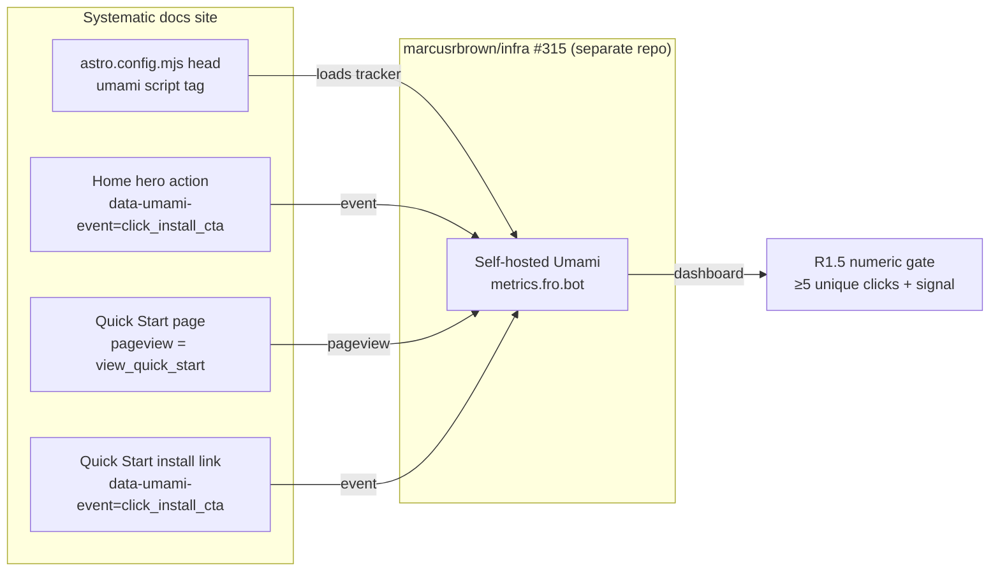
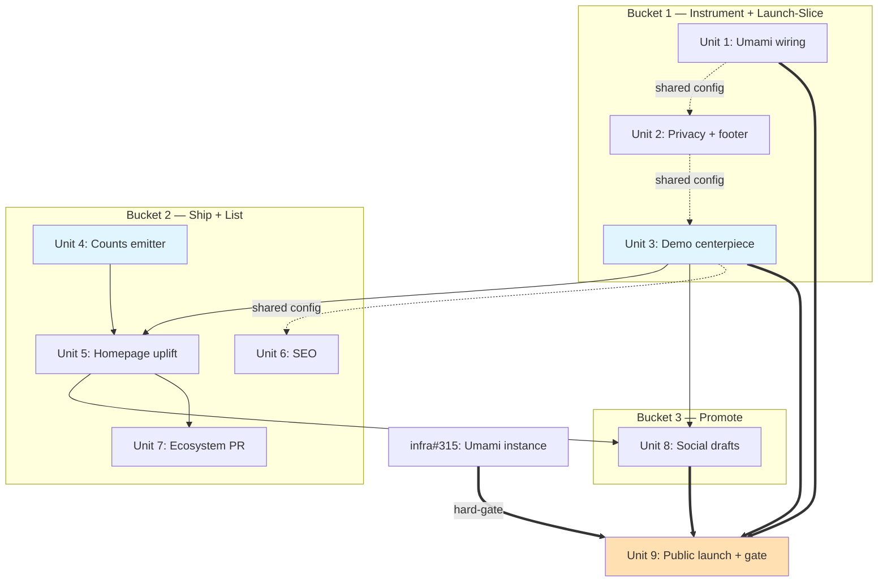

# Promotion and Growth

## Overview

Stand up the public-adoption surface for Systematic across three buckets: (1) instrument the docs site with self-hosted privacy-respecting analytics, ship a Privacy page, and author the canonical "with vs without Systematic" demo that is the actual pitch; (2) uplift the homepage to a product-landing structure (three-flatland layout shape, Systematic theme, no shader), add structured SEO metadata, and list Systematic in the OpenCode ecosystem; (3) draft the social-channel copy (LinkedIn, Bluesky, Discord) for a coordinated launch.

This plan is the deferred sibling of the launch-surface cleanup (PR #428 / v2.21.0), which explicitly scoped OUT promotion copy, SEO beyond og:image, and analytics. All nine product decisions (D0–D8) and both open implementation choices were resolved in the origin brainstorm across three review rounds (Oracle + document-review ×2).

## Problem Frame

Systematic is technically credible (45 skills, 50 agents, typed config, content-integrity CI, automated release-notes narrative) but publicly under-instrumented and under-listed: 22 stars, 1 fork, 0 watchers, not on the OpenCode ecosystem page, no docs analytics, no canonical demo showing the with/without delta that *is* the value proposition. The launch-surface cleanup made the docs presentable; this plan makes them measurable, discoverable, and promotable. (See origin: `docs/brainstorms/2026-05-27-promotion-and-growth-requirements.md`)

## Requirements Trace

**Bucket 1 — Instrument + Launch-Slice (heavy, durable foundation):**
- R1.1. Self-hosted Umami docs analytics live (cookie-free, DNT-respected, no third-party processor) — **provider DECIDED: self-hosted Umami via `marcusrbrown/infra`#315; instance LIVE + verified at https://metrics.fro.bot (2026-05-27)**
- R1.2. Privacy page documenting what is/isn't collected, with a footer link on every docs page
- R1.3. Activation events via Umami declarative `data-umami-event` attributes — `click_install_cta` on install CTAs; `view_quick_start` as a plain Quick Start pageview
- R1.4. Canonical "with vs without Systematic" demo guide page — the centerpiece pitch; complex task class (OAuth login flow OR DB migration with backfill), comparator = OpenCode-without-plugin in a clean isolated workspace
- R1.5. Numeric validation gate met (≥5 unique non-crawler UTM clicks AND (≥1 substantive Discord reply OR ≥1 new star) within 72h of the Discord test post) — **owned by Unit 9; the gate is a directional smoke signal, not proof of product-market fit (see D8 + Unit 9 failure playbook)**

**Bucket 2 — Ship + List:**
- R2.1. Homepage uplift to three-flatland structural pattern (StatsBanner → FeatureCard grid → alternating ValueProp sections), Systematic OKLCH theme, no custom shader, no React
- R2.2. Live StatsBanner counts (skills, agents, OCX components, latest version) derived from runtime sources — never hardcoded
- R2.3. Structured SEO metadata: JSON-LD `SoftwareSourceCode`, `og:type`, `og:site_name`, `twitter:card`, `twitter:image`, improved title/description
- R2.4. Systematic listed in OpenCode ecosystem (`anomalyco/opencode` → `packages/web/src/content/docs/ecosystem.mdx`, Plugins table)

**Bucket 3 — Promote:**
- R3.1. Social-channel drafts committed under `docs/promotion/` (LinkedIn project entry, LinkedIn post, Bluesky post, Discord forum post)
- R3.2. Pre-post inventory-refresh mechanism so count claims in drafts never drift from live numbers

## Scope Boundaries

- No plugin-runtime telemetry — ever. Analytics is docs-site only. The plugin's "nothing phones home" claim stays accurate.
- No custom WebGL/shader hero (three-flatland's HeroShader.tsx is explicitly rejected — structural layout shape only)
- No React component library — Starlight components + small inline-styled `.astro` components only
- No consent banner (self-hosted cookie-free Umami doesn't require one)
- No paid promotion / ads
- No v3.0.0 excision work
- No changes to the plugin's runtime, config schema, or bundled assets

### Deferred to Separate Tasks

- **Umami deployment + CLI + provisioning**: tracked in `marcusrbrown/infra`#315 (separate repo, separate OpenCode session). **Public launch (Unit 9) is HARD-GATED on this instance being live and dashboard-verified — not merely soft-blocked.**
- **Actual posting to LinkedIn/Bluesky/Discord**: drafts are committed here; publishing is a manual human action gated on Unit 9, not a code deliverable.

### Build-vs-Launch Split (resolves reviewer convergence on the infra timing dependency)

The plan separates **building artifacts** (Units 1–8, no infra dependency) from **public launch** (Unit 9, hard-gated on infra#315 + verified analytics). Rationale: four HIGH reviewer findings (adversarial + feasibility) converged that publishing the demo/homepage before analytics can measure them burns the only high-signal launch window AND a placeholder analytics ID on static GitHub Pages risks shipping a broken/blind tracker. So: author and merge all artifacts now; **do not perform public-launch actions (publish demo as centerpiece, Discord test post that starts the gate clock, social posting) until Umami is live and a real pageview+event is verified in the dashboard.** Analytics is HARD-DISABLED (script omitted, not placeholder) until then. This also realizes the brainstorm's own "instrument first" instinct (D-impl), with the infra dependency made explicit instead of hand-waved.

## Context & Research

### Relevant Code and Patterns

- `docs/scripts/transform-content.ts` — walks `skills/` + `agents/`, emits per-item MDX + index pages, logs counts (lines 249–366). Does NOT emit a shared counts artifact today — the StatsBanner emitter (Unit 4) must add one.
- `docs/scripts/generate-config-reference.ts` — sentinel-injection pattern (`injectFieldReference`, lines 399–423; markers 385–386). The model for any generated-into-human-owned-page content.
- `docs/astro.config.mjs` — Starlight `head: [...]` array (lines 38–60); existing `tag: 'meta'` entries with `attrs` (og:image at 39–59). Confirmed: `tag: 'script'` with `content` works for JSON-LD; `attrs` works for meta. **This file is touched by Units 1 (analytics script head entry), 2 (Footer component registration), 3 (sidebar entry for the new guide), and 6 (SEO head) → serialize all four. Unit 5 does NOT touch it.**
- `docs/src/content/docs/index.mdx` — current splash hero (84 lines). Hero `actions` accept `attrs` (verified against opencode's own astro.config.mjs hero usage) → `data-umami-event` attaches via frontmatter.
- `docs/src/styles/custom.css` — OKLCH token system. Available tokens: `--sl-color-accent-low/accent/accent-high`, `--sl-color-gray-1..6`, `--sl-color-white/black`; typography `--sl-font-system/heading/mono`; spacing `--space-1..12`; motion `--ease-out-expo`. New components MUST inherit these, not invent colors.
- `docs/src/` has **zero** `.astro` components today and no `docs/src/components/` dir — new components (`StatsBanner.astro`, `ValueProp.astro`, `CustomFooter.astro`) establish that directory.
- Starlight Footer override: `starlight({ components: { Footer: './src/components/CustomFooter.astro' } })` — the mechanism for R1.2's per-page footer link.
- `.slim/clonedeps/repos/anomalyco__opencode/` — OpenCode clone. Ecosystem file CONFIRMED live at `packages/web/src/content/docs/ecosystem.mdx` (three tables: Plugins / Projects / Agents; Systematic → **Plugins**). Format: `| [name](url) | description |`.

### Institutional Learnings

- **MDX `{#anchor}` syntax crashes the Astro build** (`docs/solutions/build-errors/mdx-heading-anchor-crashes-astro-build-2026-05-22.md`) — let Starlight auto-slug; never hand-write `{#...}`. Applies to all new MDX (privacy page, demo page).
- **Astro `redirects` destinations must include the `/systematic/` base** (`docs/solutions/integration-issues/astro-redirect-destinations-missing-base-prefix-2026-05-22.md`) — if any new redirect is added, prefix it. Applies to Units 2/4 if they move pages.
- **Pre-push live-server screenshot QA catches what `docs:build` misses** (`docs/solutions/best-practices/pre-push-live-server-screenshot-qa-2026-05-22.md`) — homepage uplift (Unit 5) and demo page (Unit 3) require live-server screenshots before PR.
- **Generate docs from runtime constants; `docs:build` is the idempotence gate** (`docs/solutions/best-practices/provider-availability-source-defaults-2026-05-12.md`) — the StatsBanner counts emitter (Unit 4) must derive from source, and re-running `docs:generate` must produce no diff.
- **OKLCH not understood by Mermaid** (`docs/solutions/best-practices/docs-site-oklch-migration-2026-05-21.md`) — irrelevant unless new components render Mermaid; noted for safety.
- **`gh api` PR/issue bodies: use `-F body=@file`, not inline heredocs** (`docs/solutions/developer-experience/gh-api-heredoc-backtick-escape-2026-05-17.md`) — the ecosystem PR (Unit 7) body uses a temp file (also memory #3171).
- **semantic-release ignores commit bodies for release notes** (`docs/solutions/developer-experience/semantic-release-body-ingestion-myth-2026-05-17.md`) — commit-prefix discipline matters; see Operational Notes for per-PR prefixes.

### External References

- three-flatland docs (`thejustinwalsh/three-flatland`, ref `1279239e`): homepage layout reference. Adopt the structural shape (stat banner, feature-card grid with stat badges, alternating-alignment value-prop sections) and SEO additions (JSON-LD SoftwareSourceCode, twitter:card). Reject the WebGL shader + custom React component library.
- OpenCode ecosystem page: `https://opencode.ai/docs/ecosystem/` — Plugins table is the listing target.
- Umami docs: declarative event tracking via `data-umami-event` HTML attributes; cookie-free pageview tracking by default.

## Key Technical Decisions

- **Analytics provider = self-hosted Umami** (D2). Deployed via `marcusrbrown/infra`#315. Self-hosting eliminates the third-party-processor concern entirely → strongest defensible privacy claim, no consent banner. The docs-side wiring lands HARD-DISABLED (script omitted behind a build-time guard, not a placeholder ID — a placeholder on static GitHub Pages risks a broken/blind tracker). Public launch (Unit 9) flips the guard ON only after the instance is live and a real event is verified in the dashboard.
- **Activation events = declarative `data-umami-event` attributes** (D-impl-2). No custom JS, no component wrappers, no Starlight ejection. `click_install_cta` attaches to the hero action via frontmatter `attrs` and to the Quick Start install link. `view_quick_start` is a plain pageview. Plan verifies attribute syntax against the deployed Umami version.
- **Homepage uplift = structural mimicry only** (D-impl-3). Starlight `Card`/`CardGrid`/`Steps` + new small inline-styled `.astro` components (`StatsBanner`, `ValueProp`) inheriting the existing OKLCH tokens. Keep `banner.svg`. No shader, no React.
- **StatsBanner data = build-time generated artifact, contract locked** (R2.2). Emitter `docs/scripts/generate-stats.ts` (sibling to `transform-content.ts`) writes `docs/src/data/stats.json` (JSON, not TS — decided: simplest MDX import, no transpile coupling). Authoritative sources locked: skills = walk `skills/`, agents = walk `agents/`, OCX components = count entries in `registry/registry.jsonc` (the committed source, not `dist/registry/` which is a build artifact), version = `package.json`. Wired into `docs:generate` BEFORE `astro build`. Never hardcoded; deterministic/sorted output; `docs:build` enforces idempotence (round-trip regression test).
- **SEO = global head config + home-page JSON-LD** (R2.3). `og:type`/`og:site_name`/`twitter:card`/`twitter:image` go global in `astro.config.mjs` head. JSON-LD `SoftwareSourceCode` is a `tag: 'script'` entry. Canonical URLs use Starlight's built-in support — do NOT hardcode a static canonical in global head.
- **Demo page = the centerpiece, ships independently** (D3). Complex task class (OAuth login flow OR DB migration with backfill — final choice at implementation, must be hard enough that the without-Systematic flow visibly struggles). Comparator = OpenCode without the plugin, in a clean isolated workspace (fresh config dir, no cached bootstrap, no other plugins) to prevent contamination. Includes a "When NOT to use Systematic" honesty section. NOT gated behind the Discord post.
- **Privacy page footer link = Starlight Footer component override** (R1.2). New `CustomFooter.astro` registered via `components.Footer` in config.
- **`astro.config.mjs` is a shared-file hotspot** — Units 1 (analytics script), 2 (Footer registration), 3 (sidebar entry), 6 (SEO head) all touch it. Serialize these four; do not dispatch in parallel. Unit 5 does NOT modify this file.
- **Promotion drafts location = `docs/promotion/`, committed** (D5). Per-channel markdown files. Public record risk acknowledged (D5 contingency) — drafts are professional, count-accurate, and contain no session internals.

## Open Questions

### Resolved During Planning

- **Analytics provider?** → Self-hosted Umami via infra#315 (decided in brainstorm)
- **Event mechanism?** → `data-umami-event` declarative attributes (decided in brainstorm)
- **Ecosystem file path?** → CONFIRMED live: `packages/web/src/content/docs/ecosystem.mdx`, Plugins table
- **Do hero actions accept HTML attrs for the event hook?** → YES, verified against opencode's own Starlight config (`attrs` on hero actions)
- **Is there a live counts source today?** → NO; Unit 4 builds the emitter
- **Footer link mechanism?** → Starlight `components.Footer` override
- **Baseline page count?** → 110; expect +2 (privacy + demo) → ~112

### Deferred to Implementation

- **Final demo task: OAuth vs DB-migration** — pick whichever produces the starkest, most honest with/without contrast when actually run. Decide during Unit 3 by trial.
- **Counts artifact format: JSON vs generated `.ts` module** — depends on the cleanest MDX import ergonomics under Astro 6; decide during Unit 4.
- **Exact Umami `<script>` src + website-id** — supplied by infra#315 when the instance is live. Unit 1 wires the shape; the ID is the activation fill-in.
- **OCX component count for StatsBanner** — derive from `dist/registry/` or `registry/registry.jsonc` at build time; confirm the authoritative source during Unit 4.

## Output Structure

New files only. Existing files MODIFIED (not shown in tree): `docs/astro.config.mjs` (U1 script, U2 Footer, U3 sidebar, U6 SEO head), `docs/src/content/docs/index.mdx` (U1 attrs, U5 uplift), `docs/src/content/docs/getting-started/quick-start.mdx` (U1 attrs), `docs/package.json`/root `package.json` (U4 script wiring), `docs/src/content/docs/privacy.mdx` (U9 reconcile).

    docs/
      src/
        components/            # NEW — first .astro components in the repo
          StatsBanner.astro    # U5
          ValueProp.astro      # U5 — only if sections are duplicated (inline first)
          CustomFooter.astro   # U2
        data/                  # NEW — generated counts artifact (outside content/docs/)
          stats.json           # U4 — JSON (decided)
        content/docs/
          privacy.mdx          # NEW — U2
          guides/
            with-vs-without.mdx # NEW — U3, the canonical demo (centerpiece)
      scripts/
        generate-stats.ts      # NEW — U4 counts emitter, wired into docs:generate
    docs/promotion/            # NEW — committed social drafts (U8)
      README.md
      linkedin-project.md
      linkedin-post.md
      bluesky-post.md
      discord-forum-post.md
      _ops/
        launch-checklist.md    # NEW — U9 ops (gate test post + runbook), NOT a social draft

## High-Level Technical Design

> *This illustrates the intended approach and is directional guidance for review, not implementation specification. The implementing agent should treat it as context, not code to reproduce.*

Analytics + activation funnel data flow:



StatsBanner generation seam (mirrors existing `docs:generate` pattern):

```
docs:generate  →  transform-content.ts      (skills/agents pages + counts in memory)
              →  generate-stats.ts (NEW)    (emit docs/src/data/stats.json from
                                             skills/ + agents/ + registry source + package version)
              →  generate-config-schema.ts
              →  generate-config-reference.ts
   then        astro build  →  index.mdx imports stats.json  →  StatsBanner renders live counts
```

## Implementation Units

### Bucket 1 — Instrument + Launch-Slice

- [x] **Unit 1: Umami analytics wiring (docs-side, hard-disabled until launch)**

**Goal:** Wire the docs site so Umami CAN load and fire activation events, but ship it HARD-DISABLED (script omitted at build time) until infra#315 is live. Unit 9 flips it on.

**Requirements:** R1.1, R1.3

**Dependencies:** No build dependency (ships hard-disabled). The live endpoint + website-id from `marcusrbrown/infra`#315 are now KNOWN (instance verified live 2026-05-27) and consumed by Unit 9 at activation, not wired live here. Shares `docs/astro.config.mjs` with Units 2, 3, 6 → serialize.

**Files:**
- Modify: `docs/astro.config.mjs` (add the Umami `tag: 'script'` head entry behind a build-time guard — see Approach)
- Modify: `docs/src/content/docs/index.mdx` (hero install action gets `attrs: { 'data-umami-event': 'click_install_cta' }`)
- Modify: `docs/src/content/docs/getting-started/quick-start.mdx` (install link/CTA gets `data-umami-event="click_install_cta"`)

**Approach:**
- **HARD-DISABLE, not placeholder.** Gate the `<script>` head entry behind an explicit env flag (the head array conditionally includes the entry only when `import.meta.env.UMAMI_WEBSITE_ID` is set). With the flag unset, the tag is OMITTED entirely — no broken/blind tracker ships to production on static GitHub Pages. A placeholder ID is explicitly rejected (reviewer finding: placeholder on static hosting silently ships a dead tracker that view-source can't catch). The website-id is public-by-design (ships in client HTML), but env-gating still keeps dev/preview builds out of prod analytics.
- **Exact deployed tag shape (verified live 2026-05-27)** — the conditional head entry emits ALL of: `src="https://metrics.fro.bot/script.js"`, `data-website-id` (from `UMAMI_WEBSITE_ID`, value `7ccd1c7e-e0e5-4b6d-8572-0f1196f5b1ae`), `defer`, `data-do-not-track="true"`, `data-exclude-search="true"`, `data-exclude-hash="true"`. Not just `src` + id.
- The `data-umami-event` attributes on CTAs are inert until the script loads, so they can land now safely.
- `view_quick_start` needs no attribute — it is the Quick Start pageview Umami auto-tracks once live.
- Document the one-line activation (set `UMAMI_WEBSITE_ID` + endpoint in the docs build/deploy env) as Unit 9's job.
- Verify `data-umami-event` attribute syntax against the deployed Umami version's docs during Unit 9 before relying on it.

**Patterns to follow:**
- Existing `tag: 'meta'` head entries in `astro.config.mjs` (og:image block) for head-array shape
- opencode's own hero-action `attrs` usage (confirmed reference)

**Test scenarios:**
- Test expectation: none — config + content wiring. Verify via `docs:build` clean with the flag UNSET (script tag absent from output) AND with the flag set to a test value (script tag present).

**Verification:**
- `docs:build` clean; with flag unset, NO Umami script tag in built HTML (grep the output)
- View-source of home + Quick Start shows the `data-umami-event` attributes (inert but present)
- Activation is documented as a Unit 9 step, not done here

---

- [x] **Unit 2: Privacy page + footer link**

**Goal:** Publish a Privacy page documenting the cookie-free, self-hosted, no-PII analytics posture, linked from every docs page footer.

**Requirements:** R1.2

**Dependencies:** None for authoring. Shares `docs/astro.config.mjs` with Units 1, 3, 6 (Footer registration) → serialize.

**Files:**
- Create: `docs/src/content/docs/privacy.mdx`
- Create: `docs/src/components/CustomFooter.astro`
- Modify: `docs/astro.config.mjs` (register `components.Footer`)

**Approach:**
- Privacy page states: what's collected (aggregate pageviews + 2 named events), what's NOT (no cookies, no PII, no cross-site, no fingerprinting, no third-party processor — self-hosted), DNT respected, retention, and the plugin-runtime "nothing phones home" guarantee restated.
- **DNT is config-confirmed, not aspirational:** the deployed tag carries `data-do-not-track="true"`, so Umami honors the browser Do-Not-Track signal — state this as a verified claim alongside cookie-free + self-hosted. `data-exclude-search="true"` and `data-exclude-hash="true"` also mean query strings and URL fragments are not recorded — note this under "what's NOT collected."
- **Deployment-dependent claims (retention period, IP handling, DNT specifics) MUST be reconciled against the live infra#315 Umami config before the page is finalized in Unit 9.** Until then, author the page with those specific claims marked as pending/TODO so a wrong privacy claim never ships publicly (reviewer finding: privacy page can overclaim before the instance exists). The structural claims (cookie-free, self-hosted, no third-party processor) are config-independent and safe to state now.
- `CustomFooter.astro` composition seam: import and render Starlight's default `Footer` component, then append the Privacy link below it (do NOT reimplement footer markup). If the default Footer is not directly importable in the installed Starlight version, fall back to rendering the documented footer slots + appending the link — confirm the exact import path during implementation.
- No `{#anchor}` syntax (build-crash learning).

**Patterns to follow:**
- Starlight Footer component override docs (render default + augment)
- Existing MDX page frontmatter conventions

**Test scenarios:**
- Test expectation: none — docs content + component. Verify via `docs:build` and live-server check that the footer link appears on multiple page types (splash, guide, reference).

**Verification:**
- Privacy page renders; reachable URL under `/systematic/privacy/`
- Footer Privacy link present on home, a guide page, and a reference page
- Default footer behavior intact (no regression to pagination/edit links)
- `docs:build` clean

---

- [ ] **Unit 3: Canonical "with vs without Systematic" demo guide (centerpiece)**

**Goal:** Author the demo page that *is* the pitch — a real complex task run with and without the plugin, showing the engineering-discipline delta honestly.

**Requirements:** R1.4

**Dependencies:** None for authoring. Shares `docs/astro.config.mjs` with Units 1, 2, 6 (sidebar entry) → serialize. **PUBLIC publication of this page is gated on Unit 9** (the centerpiece must be measured from first public view — reviewer convergence). Authoring/merging the page is fine; making it the publicly-promoted centerpiece waits for analytics.

**Files:**
- Create: `docs/src/content/docs/guides/with-vs-without.mdx`
- Modify: `docs/astro.config.mjs` (sidebar entry for the new guide, if not auto-included)

**Approach:**
- **Pre-register the evaluation rubric BEFORE running any trial** (reviewer finding: post-hoc task selection reads as rigged). Write down — in the unit's working notes — what counts as a publishable delta (e.g. "without-Systematic run skips ≥2 of: planning step, named edge cases, project-standard adherence, review pass") BEFORE running. Pick the task class (OAuth login flow OR DB migration with backfill) and commit to it; do not run both and publish the worse-baseline winner.
- **No-ship condition (reviewer HIGH):** if the pre-registered trial does NOT produce a clear, honest delta, do NOT publish a with/without comparison. Instead convert the page into a "where Systematic helps / where it doesn't" decision guide. An honest "it depends" page beats a staged win. This is an explicit failure branch, not a fallback to fabrication.
- Comparator = OpenCode WITHOUT the Systematic plugin, run in a **clean isolated workspace**. Document the EXACT reset recipe: fresh `OPENCODE_CONFIG_DIR=$(mktemp -d)`, empty plugin list, no cached bootstrap, the exact `opencode` invocation, and the transcript-capture steps — so the comparison is reproducible and uncontaminated.
- Structure: the task → without-Systematic transcript/outcome (what got skipped) → with-Systematic transcript/outcome (brainstorm→plan→work→review) → side-by-side delta → "When NOT to use Systematic" honesty section (trivial tasks, throwaway scripts, when raw prompting is faster).
- Keep counts/version references derived from live numbers or omitted, not hardcoded.

**Execution note:** This is content, but the contrast must be empirically produced — actually run both flows in a clean workspace before writing, don't fabricate the transcripts. Pre-register the rubric first.

**Patterns to follow:**
- Existing guide-page voice (`philosophy.mdx`, `main-loop.mdx`) — blunt, useful, anti-hype
- Pre-push live-server screenshot QA learning

**Test scenarios:**
- Test expectation: none — docs content. Verify the comparison is reproducible (clean-workspace recipe documented) and `docs:build` clean.

**Verification:**
- Evaluation rubric was pre-registered before trials (working-notes evidence)
- Page renders with a clear with/without structure + honesty section, OR was converted to a decision guide per the no-ship condition
- Clean-isolated-workspace reset recipe is documented with exact commands
- Transcripts/outcomes are real (produced by actual runs), not invented
- `docs:build` clean; live-server screenshot captured

---

### Bucket 2 — Ship + List

- [x] **Unit 4: Live-counts emitter (StatsBanner data source)**

**Goal:** Add a build-time generator that emits a counts artifact (skills, agents, OCX components, latest version) for the homepage to consume — never hardcoded.

**Requirements:** R2.2

**Dependencies:** None. Prerequisite for Unit 5's StatsBanner.

**Files:**
- Create: `docs/scripts/generate-stats.ts`
- Create (generated): `docs/src/data/stats.json` (JSON — decided, not TS: simplest MDX import, no transpile coupling)
- Modify: root `package.json` and/or `docs/package.json` (`docs:generate` runs `generate-stats.ts` before `astro build`)
- Test: `docs/scripts/generate-stats.test.ts` (or co-located per docs test convention)

**Approach:**
- **Contract locked (no decide-later):** skills = walk `skills/` (count dirs with `SKILL.md`), agents = walk `agents/` (count `.md` files), OCX components = count entries in `registry/registry.jsonc` (the COMMITTED source — not `dist/registry/`, which is a build artifact and may be stale/absent), version = read `package.json`. Output path = `docs/src/data/stats.json`. Format = JSON object `{ skills, agents, components, version }`.
- `docs/src/data/` is OUTSIDE `docs/src/content/docs/` so the artifact is NOT picked up as a routed page (routing-risk guard).
- Emit deterministic/sorted output so re-running produces no diff (idempotence gate).
- Wire into `docs:generate` ordering: must run before `astro build`; place consistently relative to `transform-content.ts`.

**Patterns to follow:**
- `transform-content.ts` directory-walk + count logic
- `generate-registry.ts` deterministic-output + `--check`-style idempotence (the round-trip regression pattern)
- Generated-from-runtime-constants learning

**Test scenarios:**
- Happy path: emitter run against a fixture skills/agents/registry tree produces the expected counts artifact
- Happy path: latest version is read from `package.json`, not hardcoded
- Edge case: empty/missing `registry/registry.jsonc` → emitter fails loudly (exit non-zero) rather than emitting a silent zero — a zero count on the homepage is worse than a build failure
- Integration/idempotence: running the emitter twice produces byte-identical output (regression test, mirrors `generate-registry` round-trip)

**Verification:**
- `docs:generate` emits the artifact; re-running yields no diff
- Counts match live `skills/` + `agents/` + `registry/registry.jsonc` + `package.json`
- Tests pass

---

- [x] **Unit 5: Homepage layout uplift**

**Goal:** Rewrite the homepage to the three-flatland structural pattern with Systematic theme — StatsBanner, FeatureCard grid, alternating ValueProp sections — no shader, no React.

**Requirements:** R2.1

**Dependencies:** Unit 4 (StatsBanner needs the counts artifact). Does NOT modify `docs/astro.config.mjs` — no serialization constraint with the head-touching units.

**Files:**
- Modify: `docs/src/content/docs/index.mdx`
- Create: `docs/src/components/StatsBanner.astro`
- Create: `docs/src/components/ValueProp.astro` (only if the alternating sections are genuinely duplicated — see Approach: inline first)

**Approach:**
- Section order (per design-lens IA): hero (keep banner.svg + tagline) → StatsBanner (4 live stats from Unit 4) → demo proof CTA pointing at Unit 3's with/without page (proof before install) → FeatureCard grid (concrete capabilities, not abstractions) → alternating ValueProp full-width sections → Quick Start snippet → "What It Is Not" honesty section.
- Components inherit OKLCH tokens from `custom.css` (`--sl-color-accent*`, `--space-*`, `--sl-font-*`) — no new colors.
- StatsBanner imports the Unit 4 artifact; renders 4 stat cards.
- Keep the install hero action's `data-umami-event` from Unit 1 intact.
- **Inline the alternating value-prop sections directly in `index.mdx` first.** Extract `ValueProp.astro` ONLY if the markup is genuinely duplicated (3+ repetitions) or too noisy to keep inline (scope-guardian finding: don't pre-extract a single-use abstraction). StatsBanner earns its own component (live data + reuse); ValueProp may not.
- Tone matches `philosophy.mdx`: blunt, promise-less, explain-more.

**Patterns to follow:**
- three-flatland section structure (shape only)
- Existing Starlight `Card`/`CardGrid`/`Steps` usage in current `index.mdx`
- OKLCH token system in `custom.css`

**Test scenarios:**
- Test expectation: none — docs content + presentational components.
- GREEN verification: @designer reviews the deployed page for design-law compliance + OKLCH adherence; live-server screenshots captured.

**Verification:**
- Home page answers: what is it, why care, what do I get (live counts), proof (demo link), first command, what it is not
- StatsBanner shows live numbers (not hardcoded)
- No invented colors (tokens only)
- `docs:build` clean; @designer review + screenshots done

---

- [x] **Unit 6: SEO metadata**

**Goal:** Add structured SEO metadata across the docs site.

**Requirements:** R2.3

**Dependencies:** Shares `docs/astro.config.mjs` with Units 1, 2, 3 → serialize (this is the LAST of the four head-touching units; do final head reconciliation here).

**Files:**
- Modify: `docs/astro.config.mjs` (head: `og:type`, `og:site_name`, `twitter:card=summary_large_image`, `twitter:image`; JSON-LD `tag: 'script'` SoftwareSourceCode; improved site title + description)

**Approach:**
- Global head: `og:type=website`, `og:site_name=Systematic`, `twitter:card`, `twitter:image` (reuse the existing og:image asset).
- JSON-LD `SoftwareSourceCode` (name, description, codeRepository, license, programmingLanguage, keywords, author) as a `tag: 'script'` entry with `type: 'application/ld+json'` and a JSON string `content`.
- Title: "Systematic — Structured Engineering Workflows for OpenCode". Description leads with the workflow-discipline value prop; counts as proof, derived or omitted (not stale-hardcoded).
- Do NOT hardcode a global canonical (would be wrong for non-home pages) — rely on Starlight's built-in canonical.
- Validate JSON-LD parses (no trailing commas) so `docs:build` stays green.

**Patterns to follow:**
- Existing og:image head entries (shape)
- three-flatland SEO additions (reference)

**Test scenarios:**
- Test expectation: none — metadata. Verify view-source shows JSON-LD + og/twitter tags; validate JSON-LD with a structured-data check.

**Verification:**
- View-source shows JSON-LD `SoftwareSourceCode`, `og:type`, `og:site_name`, `twitter:card`, `twitter:image`
- JSON-LD validates (parses; passes a structured-data validator)
- `docs:build` clean

---

- [ ] **Unit 7: OpenCode ecosystem PR**

**Goal:** List Systematic in the OpenCode ecosystem Plugins table.

**Requirements:** R2.4

**Target repo:** `anomalyco/opencode` (external — fork + PR, not a local commit)

**Dependencies:** Best submitted after Bucket 2 homepage/SEO is live so the ecosystem link lands on the uplifted page. Cheap + durable — does not gate other work.

**Fallback (reviewer finding — external repo, no merge-timing control):** if the PR sits unmerged or is rejected within ~2 weeks, fall back to the upstream's preferred listing path: open an issue-first proposal asking maintainers how they want third-party plugins listed, OR post in the OpenCode community/Discord with the plugin link. Do not let the ecosystem listing be the SOLE discovery channel — the homepage, demo, and social drafts are independent distribution legs.

**Files:**
- Modify (in fork): `packages/web/src/content/docs/ecosystem.mdx` (add one row to the **Plugins** table)

**Approach:**
- Add a single Plugins-table row: `| [systematic](https://github.com/marcusrbrown/systematic) | <concise one-line description> |`. Match the table's existing column alignment and terse description style.
- Description in Marcus's voice, no session internals, no hype — e.g. "Structured engineering workflows: brainstorm, plan, work, review with bundled skills and agents."
- Fork → branch → PR. Use `gh api -F body=@file` (or `--body-file`) for the PR body (heredoc-backtick learning + memory #3171). If GraphQL rate-limits, fall back to REST `gh api -X POST repos/anomalyco/opencode/pulls`.
- Follow the upstream's contribution conventions (check for CONTRIBUTING / PR template before opening).

**Test scenarios:**
- Test expectation: none — single doc-table row in an external repo. Verify the row renders in the upstream's table format and links resolve.

**Verification:**
- PR opened against `anomalyco/opencode` with one Plugins-table row
- Row matches existing format; link resolves
- PR body is clean (Marcus voice, no internals)

---

### Bucket 3 — Promote

- [x] **Unit 8: Social-channel drafts**

**Goal:** Commit per-channel promotion drafts with count-accuracy guarded against drift.

**Requirements:** R3.1, R3.2

**Dependencies:** Drafts reference the demo page (Unit 3) and live homepage (Unit 5); author after those exist so links/claims are real.

**Files:**
- Create: `docs/promotion/README.md` (purpose, voice rules, pre-post inventory-refresh checklist, permanent-record caveat)
- Create: `docs/promotion/linkedin-project.md` (200–2000 char project entry, GitHub URL, skills tags)
- Create: `docs/promotion/linkedin-post.md` (500–1500 char announcement)
- Create: `docs/promotion/bluesky-post.md` (150–250 char + 1–3 hashtags + image note: Bluesky doesn't auto-fetch OG, upload manually)
- Create: `docs/promotion/discord-forum-post.md` (OpenCode Discord forum post; channel TBD on join)

**Approach:**
- Voice: continuation of the homepage voice (D6) — blunt, useful, problem-first, anti-hype. All copy reads as Marcus, no agent/process references, no session internals.
- **Count claims use `{{SKILLS}}` / `{{AGENTS}}` / `{{COMPONENTS}}` / `{{VERSION}}` placeholders, NOT hardcoded numbers** (reviewer finding: a README checklist is advisory and gets skipped under launch pressure). `README.md` documents a one-command fill step that substitutes placeholders from `docs/src/data/stats.json` (the Unit 4 artifact) immediately before posting. Drafts with un-substituted placeholders are obviously-unfinished, so stale numbers can't silently ship.
- **Permanent-record caveat:** drafts are evergreen — no launch dates, no time-bound claims, no positioning that ages badly. `README.md` states that committed drafts are public git history (reviewer finding). Keep them durable and professional; if positioning shifts materially, update or remove rather than leave stale copy.
- The Bucket-1 gate test post (Discord, UTM-tagged) is NOT a social draft — it lives in Unit 9's launch checklist as ops content, not here (scope-guardian finding).

**Patterns to follow:**
- Homepage + philosophy voice
- Memory: public-facing text reads as Marcus, stripped of internal process

**Test scenarios:**
- Test expectation: none — promotional copy. Verify char-count bounds per channel and that placeholders + fill step exist.

**Verification:**
- All five files exist under `docs/promotion/`
- Each draft is within its channel's char bounds
- Count claims are placeholders, not hardcoded numbers; README documents the fill step
- Permanent-record caveat present in README
- No session internals / agent references in any draft
- `content-integrity` gate passes (these are `docs/`, outside the gate's scan scope, but run it as a regression check)

---

### Launch Gate (hard-gated on infra#315 — NOT a code unit)

- [ ] **Unit 9: Public launch + numeric gate**

**Goal:** Activate analytics, verify it measures, then perform the public-launch actions and run the directional smoke-signal gate. This unit is operational, not code — it executes only after `marcusrbrown/infra`#315 is live.

**Requirements:** R1.1 (activation), R1.5 (gate)

**Dependencies:** HARD-GATED on `marcusrbrown/infra`#315 (live Umami instance + website-id). Requires Units 1–8 merged.

**Files:**
- Modify: docs build/deploy env (set `UMAMI_WEBSITE_ID` + endpoint — flips Unit 1's guard ON)
- Modify: `docs/src/content/docs/privacy.mdx` (reconcile pending deployment-dependent claims against the live Umami config)
- Create: `docs/promotion/_ops/launch-checklist.md` (NOT a social draft — the gate test post + UTM links + the launch runbook; underscore-prefixed so it reads as ops, not promo copy)

**Approach:**
1. Activate: set the env flag, redeploy docs, and **verify a real pageview + a real `click_install_cta` event appear in the Umami dashboard** before anything public. View-source is NOT sufficient (reviewer finding) — dashboard verification is the gate to proceed.
2. Reconcile the privacy page's deployment-dependent claims (retention, IP/DNT specifics) against the live config; remove any TODO/pending markers.
3. Publicly promote the demo as the centerpiece (it was merged earlier but not promoted) and post the UTM-tagged Discord test post — this starts the 72h clock.
4. Run the gate: **≥5 unique non-crawler UTM clicks AND (≥1 substantive Discord reply OR ≥1 new star) within 72h.**

**Gate failure playbook (reviewer HIGH — a gate without consequences is theater):** if the gate fails, do NOT silently proceed to broad social posting. Instead: (a) inspect Umami referrers/paths to separate weak-distribution from weak-message; (b) revise the demo framing OR the homepage proof CTA OR the post message; (c) run ONE alternate test (different channel or different framing); (d) if still flat, treat promotion as not-yet-validated and pause broad posting — the analytics/privacy/SEO/demo artifacts remain valuable regardless, but broad promotion waits for a real signal. The gate is a directional smoke signal, not proof of product-market fit (D8) — it cannot distinguish weak positioning from bad timing, so treat a pass as "worth continuing," not "validated."

**Test scenarios:**
- Test expectation: none — operational. Verification is dashboard events + the gate measurement.

**Verification:**
- Real pageview + `click_install_cta` event confirmed in the Umami dashboard before public posting
- Privacy page reconciled against live config (no pending markers)
- Gate measured at 72h; pass → continue, fail → playbook executed (not ignored)

## Dependency Graph



Serialize the four `astro.config.mjs`-touching units (U1 analytics script, U2 Footer registration, U3 sidebar entry, U6 SEO head) — never edit that file in parallel; U6 does the final head reconciliation. U5 does NOT touch the config (no serialize constraint). U4 before U5. U3 is independent and high-value for authoring — can start first — but its PUBLIC promotion is gated on Unit 9. U7 + U8 author last (need live homepage/demo). **Unit 9 is hard-gated on infra#315 and gates all public-launch actions.**

## System-Wide Impact

- **`astro.config.mjs` shared hotspot:** Units 1, 2, 3, 6 all touch it. Serialize. Unit 6 does the final head reconciliation pass. Unit 5 does NOT touch it.
- **`docs:generate` pipeline ordering:** Unit 4 inserts a new generator. It must run before `astro build` and not conflict with `transform-content.ts` / `generate-config-*` ordering. A mis-order breaks the StatsBanner import.
- **Generated artifact routing risk:** `docs/src/data/stats.json` must live OUTSIDE `docs/src/content/docs/` so it isn't picked up as a routed page. Keep it in `docs/src/data/`.
- **Footer override blast radius:** `CustomFooter.astro` renders on EVERY docs page. Must extend (not replace) the default footer or pagination/edit-link/last-updated behavior regresses site-wide.
- **External repo (Unit 7):** PR against `anomalyco/opencode` — follow their conventions; no control over merge timing. Listing is additive and low-risk.
- **Unchanged invariants:** No plugin runtime, config schema, bundled skills/agents, or registry changes. The "nothing phones home" plugin claim is explicitly preserved — analytics is docs-site only. Content-integrity gate scope (`skills/**`, `agents/**`, `src/**`) is untouched by docs-only work.
- **Cross-repo dependency:** Public launch (Unit 9) is hard-gated on `marcusrbrown/infra`#315. All artifacts (Units 1–8) build/merge without it; only the launch actions wait.

## Risks & Dependencies

| Risk | Mitigation |
|------|------------|
| infra#315 not ready when docs wiring lands | Unit 1 ships HARD-DISABLED (script omitted unless `UMAMI_WEBSITE_ID` env is set) so no broken/blind tracker ships; `docs:build` stays green; Unit 9 flips the env flag + verifies dashboard events when the instance is live |
| Public launch happens before analytics can measure it | Unit 9 hard-gates ALL public-launch actions (demo promotion, Discord test post, social posting) on a verified dashboard event; building/merging artifacts is decoupled from launching them |
| Demo produces no honest delta | Unit 3 no-ship condition: convert to a "where it helps / where it doesn't" decision guide rather than publish a staged win |
| Demo reads as cherry-picked | Unit 3 pre-registers the evaluation rubric + task choice before running trials |
| Numeric gate fails | Unit 9 failure playbook: inspect referrers → revise demo/CTA/message → one alternate test → pause broad posting if still flat (artifacts remain valuable) |
| Comparator contaminated by cached bootstrap/other plugins | Unit 3 documents an exact clean-isolated-workspace reset (fresh `OPENCODE_CONFIG_DIR`, no plugins) |
| StatsBanner counts drift or hardcode creep | Generate from runtime sources; `docs:build` idempotence gate; round-trip regression test |
| `astro.config.mjs` merge conflicts across 4 units | Serialize all head/config-touching units |
| MDX `{#anchor}` build crash on new pages | No explicit anchors; auto-slug only (learning) |
| JSON-LD syntax breaks build | Validate JSON parses; `docs:build` gate |
| Ecosystem PR body Markdown mangled | `--body-file` not heredoc (memory #3171); REST fallback on GraphQL rate-limit |
| Count claims in social drafts age/drift | Drafts use `{{SKILLS}}`/`{{AGENTS}}`/etc. placeholders filled from `stats.json` at post time — un-substituted drafts are obviously unfinished |
| infra#315 takes weeks | Build/merge all artifacts now; Unit 9 launch waits. No half-instrumented public launch — hard-disabled until verified |
| Privacy page overclaims before instance exists | Deployment-dependent claims marked pending; Unit 9 reconciles against live config before finalizing |
| Ecosystem PR stalls/rejected | Unit 7 fallback: issue-first proposal or community post; homepage/demo/social are independent distribution legs |
| Committed social drafts become stale public history | Evergreen drafts only (no dates/time-bound claims); permanent-record caveat in README |

## Documentation / Operational Notes

- **Commit prefixes (memory #3128 / #3947):** Docs-site content/components → `feat(docs):` or `fix(docs):` only if a consumer-visible runtime/bundled surface changes — these are docs-only, so most should be `docs(...)`-scoped or `chore`. The counts emitter + components are dev/docs tooling, NOT published-package surface → `chore(docs):` or `docs(...)`, NOT `feat:`. Decide per-PR: does it change anything an npm consumer or bundled-asset sees? If no → `chore:`/`docs:`. This avoids an unintended minor bump for a docs/dev-only change.
- **docs:build is the gate, not proof** — run `docs:verify` (CI-parity) + live-server screenshots for Units 3 and 5 before any PR (pre-push live-server QA learning).
- **Docs deploy on `release: published` or manual `workflow_dispatch`** — docs-only/`chore`-only PRs do NOT auto-deploy; use `workflow_dispatch` if changes must go live before the next release.
- **PR sequencing:** Demo (U3) can be its own early PR. Bucket 2 (U4→U5→U6) is one coherent homepage-uplift PR (serialized head edits). U7 ecosystem PR is external. U8 drafts can ride with U5 or be a small follow-up.
- **Analytics activation is a discrete post-infra step** — flip the website-id, redeploy docs, verify events fire in the Umami dashboard before the Discord test post starts the 72h gate clock.

## Sources & References

- **Origin document:** [docs/brainstorms/2026-05-27-promotion-and-growth-requirements.md](docs/brainstorms/2026-05-27-promotion-and-growth-requirements.md)
- **Cross-repo dependency:** [marcusrbrown/infra#315](https://github.com/marcusrbrown/infra/issues/315) (Umami deployment)
- Launch-surface predecessor: [docs/plans/2026-05-22-001-feat-launch-surface-cleanup-plan.md](docs/plans/2026-05-22-001-feat-launch-surface-cleanup-plan.md) (PR #428, v2.21.0)
- three-flatland homepage reference: `thejustinwalsh/three-flatland` @ `1279239e`
- OpenCode ecosystem: https://opencode.ai/docs/ecosystem/ + `anomalyco/opencode` `packages/web/src/content/docs/ecosystem.mdx`
- Institutional learnings: MDX anchor crash, Astro base-path redirects, pre-push live-server QA, generate-from-constants, gh-api heredoc, semantic-release body-ingestion (all in `docs/solutions/`)
