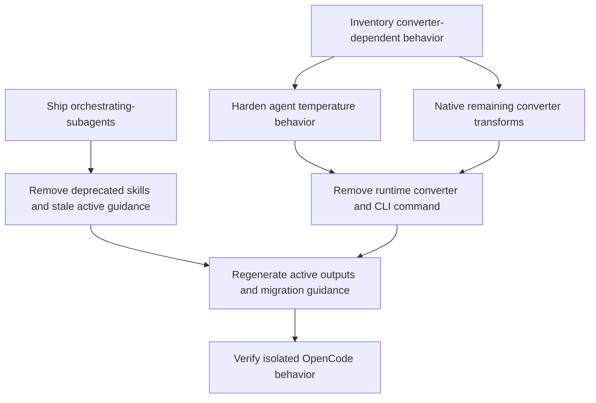

# feat: v3 compatibility cleanup

## Overview

Remove Systematic's remaining CEP-era compatibility surfaces in a controlled v3 sequence. The plan first makes bundled assets explicitly native, then removes runtime converter use, removes the legacy `systematic convert` CLI command, replaces stale orchestration guidance, and deletes deprecated skills with clear migration guidance.

---

## Problem Frame

The converter is no longer just historical migration code. It still shapes bundled asset behavior at load time, especially agent temperatures and legacy frontmatter/body rewrites. Removing it without first making that behavior explicit would make v3 a behavior-change release disguised as cleanup.

Two deprecated skills also remain discoverable. `orchestrating-swarms` points at CEP-era APIs and needs a bundled OpenCode-native replacement before removal. `claude-permissions-optimizer` targets Claude Code permission files and should disappear without replacement because there is no equivalent OpenCode surface. The release should remove these dead surfaces while keeping current guidance, generated outputs, and migration notes coherent.

---

## Requirements Trace

**Behavior-preserving prerequisites**

- R1. Preserve or deliberately document bundled agent temperature behavior before converter removal.
- R2. Audit every remaining converter-injected field named by the origin doc (`description`, `steps`, `tools`, `permission`, `hidden`) plus any converter body rewrite still reachable in bundled content before converter removal.
- R3. Preserve the shipped explicit agent `mode` invariant from v2.27.0.
- R4. Add durable gates or equivalence coverage for any behavior-preserving hardening.

**Converter and CLI removal**

- R5. Remove runtime converter use from bundled agent, skill, and command loading.
- R6. Remove the legacy `systematic convert` command.
- R7. Document the v2 pin path and active references affected by command removal.

**Deprecated skill removal**

- R8. Ship a bundled `orchestrating-subagents` skill before removing `orchestrating-swarms`.
- R9. Remove `claude-permissions-optimizer` without replacement.
- R10. Remove deleted skills from active docs, registry, generated lists, command/help surfaces, and config schema outputs.
- R11. Make `orchestrating-subagents` discoverable through the same surfaces as other bundled skills.
- R12. Document that stale removed-skill config/profile references must be deleted because v3 keeps strict validation.

**Scope hygiene**

- R13. Avoid broad imported-skill rewrites, model-default changes, and general frontmatter redesign.
- R14. Correct current product guidance without scrubbing historical records solely for grep cleanliness.

---

## Scope Boundaries

- Bundled agent `model` defaults remain source-owned; do not add `model` fields to bundled agent markdown.
- Deprecated `tools` cleanup is not part of this plan unless a converter-dependence audit proves it is required for safe removal.
- Historical plan, brainstorm, and solution records remain historical unless linked as active user guidance.
- Multi-harness generation remains deferred.

### Deferred to Separate Tasks

- Broad frontmatter field semantics documentation: separate v2.x or v3 follow-up unless required by the converter-removal path.
- General imported-skill content refresh: separate content-maintenance work.
- Provider/model default changes: separate configuration work.

---

## Context & Research

### Relevant Code and Patterns

- `src/lib/converter.ts` owns converter transforms and cache behavior.
- `src/lib/config-handler.ts` and `src/lib/skill-loader.ts` are the runtime bundled loading surfaces that still use converter logic.
- `src/cli.ts` exposes `systematic convert`.
- `src/lib/agent-overlays.ts` and `src/lib/config-handler.ts` contain source-owned temperature inference that must not silently override explicit frontmatter decisions.
- `scripts/content-integrity.ts` is the pattern for bundle invariants such as omitted `model`, explicit `mode`, color validation, stem uniqueness, and deprecated metadata.
- `tests/unit/converter.test.ts`, `tests/unit/config-handler.test.ts`, `tests/unit/skill-loader.test.ts`, `tests/unit/content-integrity.test.ts`, and `tests/integration/opencode.test.ts` are the likely test anchors.
- `registry/registry.jsonc`, `src/lib/bundled-names.ts`, generated config schemas, and docs reference pages are regenerated surfaces affected by bundled skill additions/removals.
- `tests/manual/smoke-deprecation-warning.ts` may need adjustment when deprecated skills are removed.

### Institutional Learnings

- `docs/solutions/best-practices/destructive-to-nondestructive-converter-Systematic-20260209.md`: converter removal should be excision of dead compatibility behavior, not a new destructive rewrite that drops unknown fields accidentally.
- `docs/solutions/best-practices/content-integrity-mirror-runtime-drop-rules-2026-05-17.md`: runtime survival/drop rules need matching content-integrity gates.
- `docs/solutions/workflow-issues/registry-drift-on-skill-description-change-2026-05-20.md`: skill/agent frontmatter changes must regenerate registry output.
- `docs/solutions/best-practices/typed-config-validation-build-time-codegen-2026-05-16.md`: schema generation must stay aligned with runtime validation.
- `docs/solutions/integration-issues/isolated-opencode-subprocess-fixtures-2026-05-14.md`: OpenCode behavior changes should be verified through isolated subprocess fixtures.
- `docs/solutions/developer-experience/semantic-release-body-ingestion-myth-2026-05-17.md` and `docs/solutions/best-practices/release-notes-narrative-procedure-2026-05-23.md`: migration guidance needs to land in release notes explicitly, not only in commit bodies.

---

## Key Technical Decisions

- **Full native asset path, no compatibility shim:** remaining converter bridges should become explicit bundled content, tested loader behavior, or intentional removals.
- **Strict stale config policy:** v3 keeps strict validation for removed bundled names; migration guidance tells users to delete stale references rather than silently ignoring them.
- **Normal bundled replacement skill:** `orchestrating-subagents` should be user-invocable and discoverable through generated skill catalogs, registry output, and active guidance.
- **Behavior-preserving temperature default:** preserve current inferred agent temperatures unless a later review intentionally changes named agents and documents the behavior change.
- **Hard CLI removal:** remove `systematic convert` rather than keeping a v3 shim; active docs and scripts must stop invoking it.

---

## Open Questions

### Resolved During Planning

- Should stale removed-skill config references hard-fail, warn, or auto-prune? — Hard-fail under existing strict validation, with migration guidance.
- Should `orchestrating-swarms` require a shipped replacement first? — Yes; ship bundled `orchestrating-subagents` before removal.
- Should v3 remove the CLI converter? — Yes; remove `systematic convert` with v2 pin guidance.

### Deferred to Implementation

- Exact explicit temperature values per agent: derive mechanically from current resolved behavior and review any intended deviations.
- Exact remaining converter body rewrites still present in bundled assets: determine through the native-asset inventory before deleting converter code.
- Exact `orchestrating-subagents` prose: author during skill implementation, but keep it OpenCode-native and free of CEP-era concepts.
- Schema versioning for the v3 config contract: resolve whether the public schema path stays version-agnostic despite the current `v2` location or gains a v3-specific public path before generated docs are finalized.

---

## High-Level Technical Design

> *This illustrates the intended approach and is directional guidance for review, not implementation specification. The implementing agent should treat it as context, not code to reproduce.*

This cleanup is a staged removal of CEP-era compatibility behavior, not a broad asset or configuration redesign. The dependency rule is: make bundled content native and gate-enforced before deleting converter-backed runtime paths, then regenerate every active surface that reflects the shipped bundle.

### Surface Sequence

1. Native asset readiness first: inventory and harden behavior currently supplied by converter logic, especially agent `temperature` and any still-reachable frontmatter/body transforms.
2. Replacement before excision: add `orchestrating-subagents` and make it discoverable before deleting `orchestrating-swarms`.
3. Runtime removal after hardening: remove converter reads from bundled loaders only after bundled assets no longer depend on converter output.
4. CLI removal in the same breaking cleanup: remove `systematic convert` with v2 pin guidance in active migration docs.
5. Generated surface convergence: regenerate registry, bundled names, config schema/docs, reference pages, and migration guidance after skill and CLI surfaces change.
6. Runtime confidence last: isolated OpenCode verification proves the shipped plugin loads native bundled assets and reports stale removed-skill config references correctly.

### Boundary Notes

- Do not change the plugin hook architecture or default export contract.
- Do not introduce a v3 compatibility shim for the converter.
- Do not broaden into imported-skill rewrites, model-default changes, or historical-doc cleanup.

---

## Phased Delivery

### Phase 1: v2.x prerequisites

- Inventory converter-dependent asset behavior.
- Harden temperature and only inventory-backed converter transforms that must change before removal.
- Ship `orchestrating-subagents` and make it discoverable.
- Do not remove deprecated skills, delete converter code, rewrite unrelated content, or change public CLI/config surfaces in this phase.

### Phase 2: v3 breaking cleanup

- Remove runtime converter loading and CLI converter command.
- Delete deprecated skills and stale active guidance.
- Regenerate schema, registry, docs, and bundled-name outputs.
- Publish breaking migration guidance.

---

## Implementation Units

- [ ] **Unit 1: Inventory native-asset readiness**

**Goal:** Produce a verified inventory of every bundled asset behavior that still depends on converter output.

**Requirements:** R1, R2, R3, R4

**Dependencies:** None

**Files:**
- Modify: `docs/plans/2026-06-05-001-feat-v3-compatibility-cleanup-plan.md`
- Test: `tests/unit/converter.test.ts`
- Test: `tests/unit/content-integrity.test.ts`

**Approach:**
- Compare raw bundled asset content with converter-resolved output at the behavior level.
- Classify each transform as already native, needs explicit asset rewrite, needs a gate, or is intentionally removed.
- Record the explicit origin-doc fields (`description`, `steps`, `tools`, `permission`, `hidden`) separately from body rewrite checks so traceability stays visible.
- Keep the inventory in this plan or a companion tracked solution/plan artifact so implementation does not rediscover it.

**Execution note:** Start with characterization coverage around converter-resolved behavior before changing assets.

**Patterns to follow:**
- Converter field audit in `docs/plans/2026-06-05-003-feat-agent-mode-explicit-hardening-plan.md`.
- Existing converter equivalence tests in `tests/unit/converter.test.ts`.

**Test scenarios:**
- Characterization: representative bundled agent frontmatter resolves the same before and after native hardening.
- Characterization: representative skill frontmatter/body content identifies any converter-only rewrites.
- Error path: a future bundled asset that reintroduces a forbidden converter dependency fails the appropriate gate once the gate exists.

**Verification:**
- Inventory identifies every remaining converter transform and maps each to preserve, rewrite, gate, or drop.

- [ ] **Unit 2: Harden bundled agent temperature behavior**

**Goal:** Remove hidden temperature inference as a blocker to converter removal.

**Requirements:** R1, R4

**Dependencies:** Unit 1

**Files:**
- Modify: `agents/**/*.md`
- Modify: `scripts/content-integrity.ts`
- Modify: `src/lib/agent-overlays.ts`
- Modify: `src/lib/config-handler.ts`
- Test: `tests/unit/content-integrity.test.ts`
- Test: `tests/unit/config-handler.test.ts`
- Test: `tests/unit/agent-overlays.test.ts`

**Approach:**
- Add explicit temperature values for bundled agents that currently receive inferred values.
- Ensure explicit frontmatter values, not hidden inference, are the durable source for bundled-agent temperature behavior.
- Account for current source-owned inference in `applyAgentOverlays` and `inferBuiltInTemperature` so explicit frontmatter is not overwritten by built-in defaults.
- Audit each bundled agent's temperature source of truth before freezing values: existing explicit frontmatter, converter-inferred baseline, source-owned built-in inference, or intentional behavior change.
- Preserve current behavior unless a named exception is documented.
- Derive baseline values from an isolated fixture that reads bundled asset files without user/project overlays or local OpenCode config.
- Add a content-integrity or equivalence check that prevents future bundled agents from relying on implicit temperature inference.

**Execution note:** Implement test-first with a failing gate/equivalence case before editing bundled agents.

**Patterns to follow:**
- `checkAgentMode` and `checkAgentModel` style gate checks in `scripts/content-integrity.ts`.
- Existing config-handler tests that assert emitted bundled agent config.

**Test scenarios:**
- Happy path: every bundled agent has explicit temperature behavior matching the current resolved value.
- Error path: a bundled agent missing required temperature coverage fails the new gate or equivalence check.
- Regression: derived baseline values are stable in an isolated fixture and do not depend on user/project config.
- Regression: project/user overlays can still intentionally override temperature according to existing overlay precedence.
- Audit: every bundled agent is accounted for in the temperature source-of-truth inventory before values are locked in.

**Verification:**
- Hidden temperature inference is no longer required to preserve bundled agent behavior.
- For each bundled agent, emitted config temperature equals the pre-hardening resolved value unless the plan records a deliberate behavior change.
- Explicit bundled temperature wins over built-in inference; user/project overlays still win over bundled defaults.

- [ ] **Unit 3: Gate inventory-backed converter transforms**

**Goal:** Gate and harden only the converter frontmatter/body dependencies proven reachable by Unit 1.

**Requirements:** R2, R4, R5, R13

**Dependencies:** Unit 1

**Files:**
- Modify: `skills/**/*.md`
- Modify: `agents/**/*.md`
- Modify: `scripts/content-integrity.ts`
- Test: `tests/unit/content-integrity.test.ts`
- Test: `tests/unit/skill-loader.test.ts`
- Test: `tests/unit/config-handler.test.ts`

**Approach:**
- Rewrite only inventory-backed CEP-era tool names, path references, and legacy frontmatter fields that are required to preserve runtime behavior after converter removal.
- Add gates for banned legacy patterns that would otherwise have been rewritten at runtime.
- Preserve a behavior-to-test mapping before deleting converter coverage.
- Stop at the inventory boundary: occurrences not proven converter-reachable stay deferred, even if they look stale.

**Behavior-to-test mapping:**
- Frontmatter fields named in the origin doc map to content-integrity and loader/config tests.
- Loader-visible skill behavior maps to skill-loader tests.
- Loader-visible agent or command behavior maps to config-handler tests.
- Deprecated or banned legacy patterns map to content-integrity tests.

**Execution note:** Use characterization tests before removing converter use from loaders.

**Patterns to follow:**
- Existing content-integrity phantom-reference and frontmatter checks.
- `docs/solutions/best-practices/content-integrity-mirror-runtime-drop-rules-2026-05-17.md`.

**Test scenarios:**
- Happy path: bundled skills and agents load correctly without relying on body rewrite transforms.
- Error path: a legacy tool name or legacy path reference in active bundled content fails content-integrity.
- Regression: allowed OpenCode-native fields such as `subtask` remain accepted.

**Verification:**
- Converter output is no longer needed to make active bundled content OpenCode-native, and every preserved converter behavior has a non-converter test home.

- [ ] **Unit 4: Ship bundled `orchestrating-subagents`**

**Goal:** Provide the replacement skill required before removing `orchestrating-swarms`.

**Requirements:** R8, R11

**Dependencies:** Unit 1 may run in parallel; removal waits for this unit.

**Files:**
- Create: `skills/orchestrating-subagents/SKILL.md`
- Modify: `registry/registry.jsonc`
- Modify: `ATTRIBUTIONS.md` if imported content is used
- Test: `scripts/content-integrity.ts`
- Test: `tests/unit/skills.test.ts`

**OpenCode grounding:**
- `task()` accepts `description`, `prompt`, `subagent_type`, optional `task_id`, optional `command`, and optional experimental `background`.
- Background subagents are gated by `OPENCODE_EXPERIMENTAL_BACKGROUND_SUBAGENTS` or umbrella `OPENCODE_EXPERIMENTAL`.
- `task_status` is only registered when background subagents are enabled.
- Foreground task execution returns a child result immediately; background execution returns a running job stub and later surfaces completion into the parent session.
- The shipped skill must work when background subagents are unavailable.

**Approach:**
- Author OpenCode-native orchestration guidance around `task()` dispatch, serialization boundaries, result synthesis, and failure handling.
- Describe foreground execution as the portable default.
- Describe background execution as optional/experimental: only use `background: true` and `task_status` when the tool surface exposes them; otherwise fall back to foreground dispatch.
- Keep it user-invocable and discoverable through normal bundled skill surfaces.
- Do not migrate CEP swarm prose; write the skill around OpenCode's actual subagent model.

**Execution note:** Use `writing-skills` for the RED/GREEN/REFACTOR pressure-test loop, then use `writing-systematic-skills` for bundled-skill frontmatter, reference-file, and content-integrity constraints. The pressure-test loop is a live authoring exercise — do not encode its transient structural or prose assertions as persistent tests in `tests/unit/skills.test.ts`. Persistent test additions should be limited to durable gates: content-integrity checks, registry drift, and schema drift. Brittle structural or prose assertions belong in the pressure-test session, not in the committed test suite.

**Patterns to follow:**
- `skills/ce-work/SKILL.md` for current `task()`-based dispatch language.
- `skills/writing-systematic-skills/SKILL.md` for bundled skill authoring constraints.
- `skills/writing-skills/SKILL.md` for pressure scenarios, rationalization capture, and skill TDD.
- `.slim/clonedeps/repos/anomalyco__opencode/packages/opencode/src/tool/task.ts` for task tool behavior.
- `.slim/clonedeps/repos/anomalyco__opencode/packages/opencode/src/tool/task_status.ts` and `packages/opencode/src/tool/registry.ts` for background-tool gating.
- `.slim/clonedeps/repos/anomalyco__opencode/packages/opencode/src/effect/runtime-flags.ts` for experimental flag names.

**Test scenarios:**
- Happy path: `orchestrating-subagents` is discovered as a bundled skill and appears in generated skill surfaces.
- Error path: stale `orchestrating-swarms` replacement metadata cannot point to a non-existent skill.
- Content quality: content-integrity accepts the new skill and its references.
- Skill TDD: baseline pressure tests expose CEP/swarm terminology, over-broad parallelism, or background-only assumptions before authoring the skill. Run these during the authoring session; do not commit them as persistent structural/prose assertions.
- Compatibility: final skill guidance works with default foreground-only task surfaces and with experimental background subagents enabled.
- Regression: skill prose does not require `task_status` when the runtime does not expose it.

**Verification:**
- Users can discover the replacement wherever bundled skills are surfaced.
- Final pressure tests pass without relying on experimental background subagent support.

- [ ] **Unit 5: Remove deprecated skills and stale active guidance**

**Goal:** Delete deprecated skill directories and remove their active exposure.

**Requirements:** R8, R9, R10, R11, R12, R14

**Dependencies:** Unit 4

**Files:**
- Delete: `skills/orchestrating-swarms/`
- Delete: `skills/claude-permissions-optimizer/`
- Modify: `registry/registry.jsonc`
- Modify: `src/lib/bundled-names.ts`
- Modify: `scripts/.drift-allowlist.json`
- Modify: `tests/manual/smoke-deprecation-warning.ts`
- Modify: active docs that mention removed skills
- Test: `tests/unit/config-schema.test.ts`
- Test: `tests/unit/skills.test.ts`
- Test: `tests/unit/content-integrity.test.ts`

**Approach:**
- Remove the deprecated skills from bundled content and curated/generated install surfaces.
- Preserve strict validation for stale removed names and document that users must delete references.
- Define the stale-reference validation-message contract before deletion: name the stale key/value, explain that v3 removed the bundled skill, and point to the v3 migration cleanup path.
- Update active user guidance; leave historical docs alone unless they are linked as current guidance.

**Execution note:** Implement with test coverage around removed-name validation and generated-name drift.

**Patterns to follow:**
- Registry and schema generation flow from existing skill additions/removals.
- `docs/solutions/workflow-issues/registry-drift-on-skill-description-change-2026-05-20.md`.

**Test scenarios:**
- Happy path: removed skill names no longer appear in generated bundled-name/schema/registry surfaces.
- Error path: config that references removed skill names fails strict validation with useful guidance.
- Error path: strict validation guidance names the removed skill reference and points users at the v3 migration cleanup path before they need the removed skill catalog.
- Regression: schema/config tests and isolated runtime fixtures assert the same stale-reference guidance contract.
- Regression: historical docs are not modified solely because they mention removed skills.

**Verification:**
- Deleted skills are gone from active product surfaces and strict migration guidance exists.

- [ ] **Unit 6: Remove runtime converter and CLI command**

**Goal:** Delete converter runtime dependency and remove the legacy conversion command.

**Requirements:** R5, R6, R7

**Dependencies:** Units 1, 2, and 3

**Entry criteria:**
- Unit 2 has proven bundled agent temperature comes from explicit native frontmatter or documented source-owned runtime logic, not converter inference.
- Unit 3 has replaced or gated every inventory-confirmed converter body/frontmatter transform.
- Converter characterization tests that still matter have been migrated into loader, config, or content-integrity tests before deleting converter tests.

**Files:**
- Modify: `src/lib/config-handler.ts`
- Modify: `src/lib/skill-loader.ts`
- Modify: `src/cli.ts`
- Delete: `src/lib/converter.ts`
- Delete or rewrite: `tests/unit/converter.test.ts`
- Test: `tests/unit/config-handler.test.ts`
- Test: `tests/unit/skill-loader.test.ts`
- Create: `tests/unit/cli.test.ts` if no existing CLI coverage can be extended

**Approach:**
- Replace runtime converter reads with direct native asset reads after hardening proves those reads are safe.
- Remove CLI command routing, help text, and tests for `systematic convert`.
- Audit the full repo for remaining converter imports/calls before deleting `src/lib/converter.ts`.
- Do not delete converter tests until every behavior still worth preserving has moved into loader, config, or content-integrity coverage.
- Keep the plugin default export contract untouched.

**Execution note:** Remove converter use only after behavior-preserving tests are green against native assets.

**Patterns to follow:**
- Existing direct file-read and frontmatter parsing helpers.
- Default-only export smoke check for `dist/index.js`.

**Test scenarios:**
- Happy path: bundled agents, skills, and commands load from native content without converter code.
- Error path: `systematic convert` is absent from CLI help and is rejected as an unknown command.
- Regression: zero imports or call sites remain for deleted converter exports.
- Regression: plugin build still exports only `default`.

**Verification:**
- No runtime imports of converter code remain and the legacy CLI command is gone.

- [ ] **Unit 7: Regenerate active outputs and migration guidance**

**Goal:** Make active generated outputs, docs, registry, and migration guidance describe the same v3 surface.

**Requirements:** R7, R10, R11, R12, R14

**Dependencies:** Units 4, 5, and 6

**Entry criteria:**
- Schema public-path/versioning decision is resolved and documented.
- Deprecated skill removal and CLI removal have landed in source surfaces.
- Replacement skill discoverability is verified in source-owned discovery surfaces before generated artifacts are refreshed.

**Files:**
- Modify: `docs/src/content/docs/reference/configuration.mdx`
- Modify: `docs/public/schemas/v<resolved-major>/systematic-config.schema.json` or document why the existing schema path remains correct
- Modify: `docs/src/data/stats.json`
- Modify: `src/lib/bundled-names.ts`
- Modify: `docs/src/content/docs/reference/skills/index.mdx`
- Create: `docs/src/content/docs/reference/skills/orchestrating-subagents.md`
- Delete: `docs/src/content/docs/reference/skills/orchestrating-swarms.md`
- Delete: `docs/src/content/docs/reference/skills/claude-permissions-optimizer.md`
- Modify: `dist/registry/` generated outputs if present
- Test: generated output drift checks

**Approach:**
- Regenerate docs, schema, registry, and reference outputs through existing scripts.
- Ensure active documentation and release-prep notes carry migration guidance for removed skills and CLI conversion.
- Assert generated surfaces contain `orchestrating-subagents`, omit removed skills, and omit `systematic convert` from active guidance.
- Lock migration wording into release-facing guidance so semantic-release cannot be the only place users learn the remediation path.

**Execution note:** Treat regeneration as a gate, not a best-effort cleanup step.

**Patterns to follow:**
- `docs/solutions/integration-issues/isolated-opencode-subprocess-fixtures-2026-05-14.md`.
- Existing generated docs and registry drift checks.

**Test scenarios:**
- Happy path: generated skill lists, registry output, and docs expose `orchestrating-subagents`.
- Regression: generated schema/config docs do not list removed skills as valid bundled names.
- Regression: active docs/scripts no longer invoke `systematic convert`.
- Release guidance: migration text names removed skills, stale config cleanup, CLI removal, and the v2 pin path.
- Parity: source skills, bundled names, schema enum values, docs reference pages, registry source, registry output, stats, CLI/help surfaces, and package contents agree on the v3 surface.

**Verification:**
- Generated surfaces and release-facing guidance match the v3 product surface.
- Schema path/versioning is resolved before generation rather than left for artifact authors to infer.

- [ ] **Unit 8: Verify isolated OpenCode behavior**

**Goal:** Prove the v3 cleanup works in an isolated OpenCode runtime, not only through static checks.

**Requirements:** R5, R10, R11, R12

**Dependencies:** Units 5, 6, and 7

**Files:**
- Test: `tests/integration/opencode.test.ts`
- Test: packaged-artifact fixture used by integration coverage

**Approach:**
- Add or update isolated OpenCode subprocess coverage that loads the current checkout without converter runtime behavior.
- Include package/tarball verification so the tested fixture represents what users install, not only source-local TypeScript.
- Verify bundled asset loading, skill catalog surfaces, and strict stale-config failure behavior through fixtures.
- Keep fixtures isolated from installed plugins, real user config, and persistent project sessions.

**Execution note:** Use isolated OpenCode fixtures; do not create persistent real-project sessions.

**Patterns to follow:**
- `docs/solutions/integration-issues/isolated-opencode-subprocess-fixtures-2026-05-14.md`.

**Test scenarios:**
- Integration: isolated OpenCode session loads bundled assets after converter removal.
- Integration: skill catalog surfaces expose `orchestrating-subagents` and not removed skills.
- Error path: stale removed-skill config reference fails with actionable migration guidance.
- Integration: clean isolated config loads the packaged v3 plugin surface, not only source-local TypeScript.
- Integration: fixture isolation proves no installed global Systematic plugin or real project OpenCode state participates.
- Integration: failure diagnostics redact token-like environment values.

**Verification:**
- Runtime fixture behavior matches static/generated v3 surfaces.

---

## System-Wide Impact

- **Interaction graph:** asset discovery, config merging, skill loading, CLI help, schema generation, registry generation, docs generation, and OpenCode launch verification all participate.
- **Error propagation:** stale removed-skill config references continue to fail validation; release guidance must make the fix obvious.
- **State lifecycle risks:** generated outputs can drift if skill deletion/addition is not regenerated in the same branch.
- **API surface parity:** npm package files, OCX registry profiles, generated docs, and CLI help must all describe the same v3 surface.
- **Integration coverage:** unit tests prove transforms and gates; isolated OpenCode subprocess tests prove actual plugin launch/loading behavior.
- **Unchanged invariants:** bundled agent markdown still omits `model`; `src/index.ts` still exports only `default`; telemetry remains absent.

---

## Release / Deployment Invariants

- v3 package contains no runtime converter loading path for bundled agents, skills, or commands.
- `systematic convert` is absent from CLI help and active docs, with v2 pin guidance present in release-facing docs.
- `orchestrating-subagents` appears anywhere bundled skills are discoverable.
- `orchestrating-swarms` and `claude-permissions-optimizer` are absent from active docs, registry output, generated skill lists, config schema outputs, and bundled-name outputs.
- Stale config/profile references to removed skills fail strict validation with an actionable error naming the removed value and cleanup path.
- Generated registry, schema, docs, stats, bundled names, and package registry artifacts describe the same v3 surface.
- Public GitHub release notes include migration guidance for removed skills, stale config cleanup, CLI converter removal, and v2 pinning before external announcement.
- Isolated OpenCode verification proves both clean config startup and stale-config failure without reading user/global OpenCode config.

---

## Risks & Dependencies

| Risk | Mitigation |
|------|------------|
| Temperature hardening changes agent behavior | Mechanically derive explicit values from current resolved behavior and add equivalence coverage. |
| Replacement skill becomes a large content rewrite | Keep it OpenCode-native and focused on orchestration patterns; defer broad skill rewrites. |
| Removed skill config references brick upgrades unexpectedly | Keep strict validation but document cleanup in release notes and active migration guidance. |
| Strict stale-config errors block plugin startup before users see migration guidance | Treat validation message quality as a release gate; errors must name the stale key/value and point to cleanup guidance. |
| Converter removal misses body rewrites | Inventory and gate legacy patterns before deleting converter code. |
| Converter deletion misses an indirect caller | Add a zero-import/call-site audit before deleting the module. |
| Generated artifacts drift | Regenerate schema, docs, registry, and bundled names in the same branch that changes shipped assets. |
| Schema path/versioning ambiguity hides v3 config behavior under stale URLs | Resolve the public schema path/version decision before generated docs are finalized. |
| Release notes lose migration guidance | Keep migration text in active release-facing docs and verify the async release narrative after semantic-release publishes. |
| Source-local tests pass while packaged output differs | Include packaged-artifact verification in isolated OpenCode coverage. |

---

## Documentation / Operational Notes

- v3 release notes must include four user-facing migration sections: removed skills, replacement guidance, stale config/profile cleanup, and CLI converter removal with v2 pinning.
- Migration guidance must exist in committed active docs before release; semantic-release output is not the only source of truth.
- After semantic-release publishes, verify the public GitHub release body still contains the migration narrative before announcement.
- Release notes should avoid internal workflow details, but they must be explicit about user-visible breakage: stale removed-skill config can fail validation, `systematic convert` no longer exists, and Claude Code permission optimization has no OpenCode replacement.
- Generated artifact parity is a release gate across bundled source, bundled-name output, config schema output, generated docs/reference pages, registry source/output, docs stats/reference data, CLI/help surfaces, and package contents.
- Rollback is partial after publication: code can be fixed with a v3 patch, guidance can be patched in release notes/docs, new installs can be steered to the last v2 line, and already-upgraded users still need explicit remediation.

---

## v3 Go / No-Go Checklist

### Pre-release

- [ ] Native-asset inventory is complete and every converter transform is classified as preserve, rewrite, gate, or drop.
- [ ] Removed-skill stale config errors are covered with actionable validation messages.
- [ ] `orchestrating-subagents` is present in generated/discoverable bundled skill surfaces.
- [ ] Removed skills are absent from active docs, registry, schema, bundled names, and generated references.
- [ ] Schema versioning/public path for v3 config behavior is explicitly resolved.
- [ ] Migration guidance is committed in active docs, not only PR body or commit body.
- [ ] Package contents have been checked for stale converter/deprecated-skill surfaces.
- [ ] Isolated OpenCode clean-config and stale-config fixtures pass before publication.

### Release publication

- [ ] v3 package publishes with the intended breaking surface.
- [ ] Public GitHub release notes contain migration guidance for removed skills, stale config cleanup, CLI converter removal, and v2 pinning.
- [ ] If release-note automation fails or produces thin notes, patch the public release body before announcement.

### Post-release verification

- [ ] Published-package OpenCode verification matches the pre-release fixture behavior.
- [ ] Generated docs/registry/schema visible to users match the shipped package.
- [ ] Support/reported issues are monitored for strict-validation failures and missing migration guidance.

### Rollback / containment

- [ ] If package behavior is broken, ship a v3 patch.
- [ ] If migration guidance is missing, patch release notes and active docs immediately.
- [ ] If strict validation causes unexpected broad breakage, decide whether to publish a compatibility patch or steer users to the last v2 line.
- [ ] Do not assume published v3 artifacts can be fully recalled.

---

## Sources & References

- **Origin document:** `docs/brainstorms/2026-05-21-v3-converter-removal-and-excision-requirements.md`
- Related plan: `docs/plans/2026-06-05-003-feat-agent-mode-explicit-hardening-plan.md`
- Related code: `src/lib/converter.ts`, `src/lib/config-handler.ts`, `src/lib/skill-loader.ts`, `src/cli.ts`, `scripts/content-integrity.ts`
- Related generated surfaces: `registry/registry.jsonc`, `src/lib/bundled-names.ts`, `docs/src/content/docs/reference/configuration.mdx`, `docs/public/schemas/v2/systematic-config.schema.json`
- Institutional learnings: `docs/solutions/best-practices/content-integrity-mirror-runtime-drop-rules-2026-05-17.md`, `docs/solutions/integration-issues/isolated-opencode-subprocess-fixtures-2026-05-14.md`, `docs/solutions/workflow-issues/registry-drift-on-skill-description-change-2026-05-20.md`
