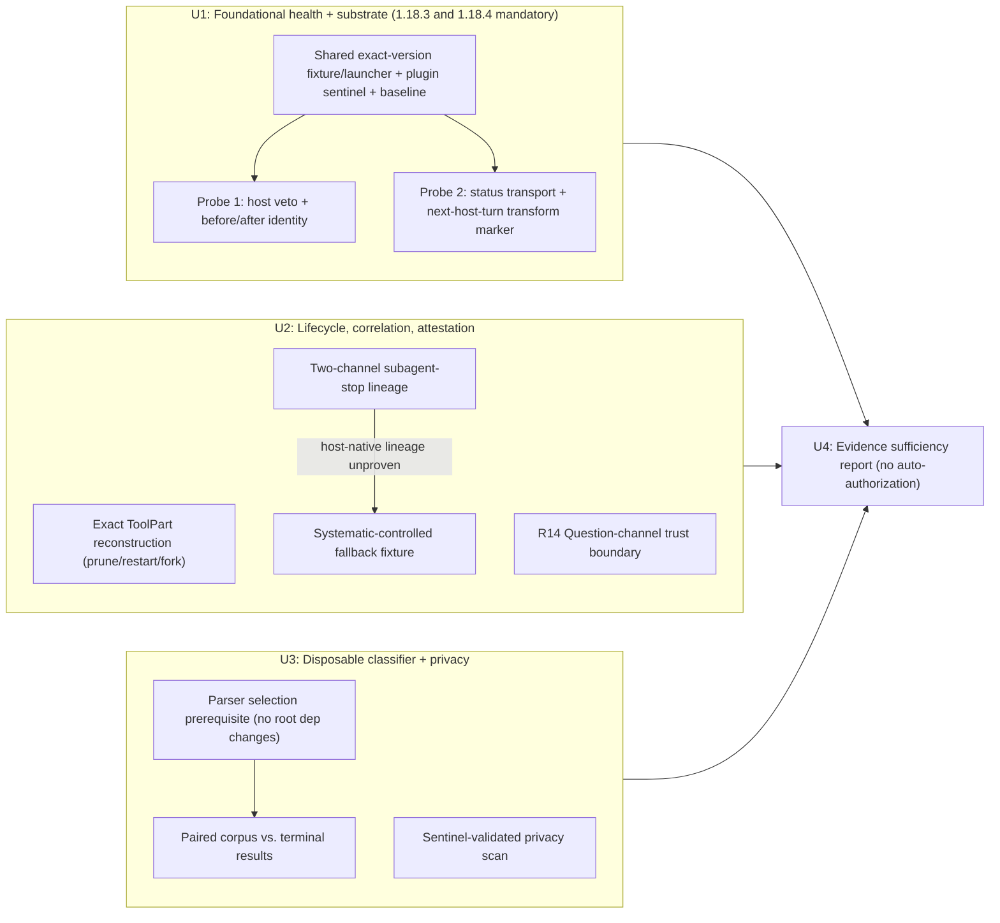

# test: Probe OpenCode receipt-workflow capabilities

## Overview

Before a receipt-backed completion gate for `ce:work` and Systematic git shipping can be planned for implementation, the specific OpenCode runtime behaviors that gate mechanism depends on must be verified empirically against real hosts rather than assumed from source reading. This plan scopes only that verification work: a set of capability probes against real OpenCode sessions on both of Systematic's relevant versions, each producing a classified outcome — never a bare pass/fail — that a later implementation plan can rely on. It does not design or build the receipt ledger, the guard state machine, or any production enforcement code. Its final unit (U4) is an evidence-synthesis step only: it reports whether evidence is sufficient or insufficient per requirement and never itself authorizes, rewrites, narrows, or renegotiates scope. The user decides all next steps from that evidence.

---

## Problem Frame

The origin requirements describe a receipt-backed grounding contract (R1-R22) built on assumptions about OpenCode hook delivery, session/call identity, status visibility, restart/compaction behavior, delegation lineage, and user-message provenance. Three distinct version references are in play and must not be conflated: the incident that motivated the origin document occurred on a real host running OpenCode `1.18.4`; the current repository `package.json`/`bun.lock` resolve `@opencode-ai/sdk@1.18.4`; and the vendored source checked into `.slim/clonedeps/repos/anomalyco__opencode/` for offline reading is `v1.17.6` — older than both. The mandatory exact-host matrix still includes both `1.18.3` and `1.18.4`. Source reading against the `1.17.6` snapshot is a convenience for locating hook shapes, not evidence about `1.18.3` or `1.18.4` runtime behavior.

Several requirements (R4, R9, R13, R16) depend on runtime facts — whether a rejected tool call produces any todo side effect, whether restart/fork reconstructs prior evidence, and whether parent-child lineage is host-provable — that no amount of source reading can settle. R14's product trust boundary is resolved separately: OpenCode Question replies are the trusted user channel, while arbitrary `role:user` chat messages remain non-evidence; no runtime Question probe was run. R3/R22 duplicate-mint semantics instead require deterministic tests against the later plugin-owned ledger and are explicitly not inferred from host retry behavior in this capability plan. A further methodological risk sits underneath the runtime facts themselves: a probe that silently swallows a hook error, fails to invoke the tool under test, or loses its own captured evidence can misreport `unsupported` when the true condition is `blocked/inconclusive` (the probe, not the host, failed), or misreport success when the host actually failed to reject or reconstruct. Planning the production gate on a misclassified probe result repeats the same category of failure the origin incident itself was about — invented state standing in for observed evidence — just one layer down, inside the probe apparatus. This plan's outcome vocabulary and probe-health controls exist specifically to prevent that recursion.

This plan treats capability verification as its own deliverable: a bounded set of empirical, hermetic probes against real OpenCode hosts, each with a classified outcome, culminating in an evidence synthesis for the later implementation plan.

---

## Outcome Vocabulary

Every probe records one of five outcomes per capability, never a bare pass/fail:

- **`primary-supported`** — the capability's primary, host-native mechanism (e.g., host-provable lineage, durable reconstruction) was directly observed working on a real host, under a passing probe-health check, and the observation itself is the origin requirement's behavior — not merely a substrate the later guard would need. For R4, this requires exact durable metadata/output field survival of the same receipt-bearing ToolPart by `callID` in raw `session.messages()` readback for a specific lifecycle transition; nonzero message/part counts never qualify.
- **`substrate-confirmed`** — a real host capability the later guard needs was directly observed working under a passing probe-health check, but neither plugin-owned final state nor the origin requirement's full behavior has been implemented or proven. This is a positive capability-evidence result usable for later planning; it is NEVER a claim that the origin requirement or production behavior is fulfilled. U1's verified positive findings use this outcome only: R1, R2, R11, R12, and R18 can reach only `substrate-confirmed`, never `primary-supported`, because the host-veto canary and identity observations prove hook timing, non-interference, and event-identity behavior only; R15/R16 and R17/R21 likewise remain transport/config substrate evidence. R3 and R22 are not probed here and remain deferred to deterministic ledger tests.
- **`fallback-proven`** — the primary host-native mechanism is unsupported or unavailable, and a disposable, real-host fixture was actually run and did produce the required runtime-controlled, forgery-resistant correlation/evidence that worker text could not supply or replay. A fallback demonstration proves only that an implementation substrate exists, never final production equivalence.
- **`unsupported`** — the host was observed, the probe ran cleanly, and the capability genuinely does not exist or does not meet the requirement's structural need. This also covers a fallback fixture that ran cleanly but could not produce the required forgery-resistant runtime correlation (e.g., no distinguishable user-role channel; fallback ran but its correlation was replayable or unattributable).
- **`blocked/inconclusive`** — the probe itself could not produce a trustworthy result: missing capture, the model/tool under test was never actually invoked, the hook threw for an unrelated reason, host-side infrastructure rejected the fixture, the probe-health baseline failed, or — for a fallback specifically — the fixture could not be established/run at all so the fallback was never exercised. This is an unconditional evidence-insufficient result for the requirement group it covers — never a pass or a fail. If any required probe or version-matrix cell for a requirement group is `blocked/inconclusive`, that requirement group cannot be reported evidence-sufficient in aggregate, regardless of other cells' outcomes.

R1, R2, R11, R12, and R18 in particular must never be marked `primary-supported` (or any variant implying the origin requirement is fulfilled) from a substrate observation alone; the host-veto canary in U1 proves hook timing, native-todo non-interference, identity substrate, and marker transport, not that plugin-owned Systematic state exists — that remains a later, unbuilt architecture decision. Their U1 positive ceiling is `substrate-confirmed`. R3 and R22 are not classified here; deterministic ledger tests in the later implementation plan must establish their dedup semantics. No probe outcome in this plan may be read as proof of final production behavior; U4 produces an evidence-sufficiency report, not an implementation validation, and it does not itself decide whether the later plan proceeds.

---

## Requirements Trace

The origin's R1-R22 remain the authoritative requirement set for the eventual receipt-backed gate. This plan does not implement them; it determines, requirement by requirement, whether the runtime capability each depends on actually exists, using the outcome vocabulary above.

| Requirement group | Capability probe(s) | Planned coverage |
|---|---|---|
| R1, R11, R12, R18 (guarded todo/completion state stays plugin-owned, resists model text, and a text-only completion attempt is marked unverified via a **next-host-turn status marker**: host-owned, delivered outside assistant text, injected on the next host turn, never immediate) | Host-veto canary against upstream `todowrite` (proves hook timing/non-interference only) plus a true text-only-turn scenario producing exactly one next-host-turn status marker | U1 |
| R2 (receipt identity substrate) | Stable session/call identity across `before`/`after` for a normal custom-tool call, mandatory on both version-matrix cells | U1 |
| R3, R22 (receipt-ledger dedup and no-duplicate-mint semantics) | Deferred to deterministic ledger tests in the later implementation plan; U1 does not simulate retries or duplicate delivery and does not classify these requirements | Later implementation plan |
| R4 (restart/compaction/fork reconstruction vs. fail-closed fresh readback) | Same synthetic receipt-bearing ToolPart, verified by `callID` and raw `session.messages()` readback across separate `prune:false`/`prune:true` compaction runs, fresh-host restart, and fork | U2 |
| R5-R10 (operation-specific receipts for implementation, verification, commit, push, PR creation, PR check/review readback; composed-shell attribution; no-op rejection) | Disposable, test-only AST-bounded operation classifier corpus, each case paired with a representative terminal `after` result and expected receipt outcome, covering all seven operation classes independently: implementation, verification, commit, push, PR creation, PR check readback, and PR review readback. The trace is intentionally many-to-one: implementation/verification map to R5/R6, commit to R5/R7, push/PR creation to R5/R8, PR check/review readback to R5/R9, and R10 cross-cuts all classes. Production classifier and any permanent unit-test contract are deferred to the later implementation plan | U3 |
| R13 (parent-child lineage proof for delegated evidence roll-up) | Two-channel correlation probe using `tests/manual/subagent-stop-probe.ts`: parent task `before`/`after` sessionID+callID, task-result metadata child session ID/parent ID, and fresh persisted `parentID` readback via `session.get(child)` or `session.children(parent)`; fallback only if host metadata/parentID is absent | U2 |
| R14 (one-time user attestation through the trusted OpenCode Question channel, bound to one session/resource/guarded transition and consumed once) | Exact-host chat-message evidence establishes only a negative boundary: unauthenticated, Basic-authenticated, and plugin-created `role:user` messages are indistinguishable and cannot mint attestations. OpenCode Question source semantics provide the planning substrate: `ask` creates a pending `requestID` bound to session/questions/tool; `reply` requires the live request, deletes it, publishes the session/request/answers correlation, and completes the deferred request. Production Systematic binding remains unbuilt | U2/product boundary |
| R15, R16 (status transport substrate: custom-tool result/metadata, persisted rejected-tool error/result part, read-only plugin-owned status value, and a next-host-turn status marker never treated as immediate) | Status transport probe with an actual `experimental.chat.system.transform` path; no five-state policy simulation and no `/session/status` classification as Systematic guard status | U1 |
| R17 (static plugin config reaches the plugin, and disabled/unavailable values can be represented without claiming protection) | Status transport probe observes static plugin config delivery and transport representation of disabled/unavailable values; default-on/global-vs-session authorization is later guard testing, and the trusted Question-channel binding remains U2 | U1/U2 |
| R19 (session-local receipt/status state and optional debug export exclude raw arguments/output/env/PR body/user prose and remain user-deletable) | Only the content-exclusion scanner methodology was evidenced on exact `1.18.3`: `6/6` sentinel validation, four healthy risk-selected target shapes, empty Systematic-scope findings, bounded containment/tripwire/cleanup evidence, and descriptive-only host-native persistence observations outside R19 governance. Session-locality and export deletability remain unbuilt | U3 |
| R21 (OpenCode reports `unavailable` when required enforcement capabilities are missing, rather than presenting itself as protected) | Status transport probe's disabled/unavailable representation check (shared fixture with R17) | U1 |

R20 (harness-neutral semantics are documentation, not enforcement, outside OpenCode) is excluded from runtime probing entirely: it is addressed once, here, as later implementation-plan adapter documentation only, and appears nowhere else in this plan as a probe target.

---

## Scope Boundaries

- Included: hermetic, real-host OpenCode probes for hook timing, side effects, before/after identity, status transport (including the standardized next-host-turn status marker), static plugin-config delivery, disabled/unavailable status representation, restart/compaction/fork behavior, delegation correlation (including an exercised Systematic-controlled fallback fixture where host-native lineage is unsupported), the R14 chat-message negative boundary plus Question-channel product/source boundary, a disposable test-only AST-bounded operation-classifier corpus paired with representative terminal results, and a completed privacy scanner methodology run on exact host `1.18.3` using synthetic sentinels plus a structurally representative, risk-selected sample regenerated through the same exported fixture primitives. Host-native persistence observations remain descriptive only and outside R19 governance.
- Execution used one small, shared, test-scoped exact-version fixture/launcher for U1's two substrate-only probes; it was not a generalized framework and followed the complexity of `tests/manual/subagent-stop-sanity.ts` and the isolation patterns in `tests/integration/opencode.test.ts`. The fixture was removed after U4.
- Included: a mandatory two-cell exact-host version matrix (`1.18.3` and `1.18.4`, both acquired as the exact `opencode-ai` version) for every covered capability in U1 and U2; the repository-resolved `@opencode-ai/sdk` is currently `1.18.4` but does not replace either matrix cell.
- Included: an evidence-sufficiency report synthesizing all classified probe outcomes against the origin's requirement groups. This report is not implementation validation, does not declare final production behavior proven, and does not itself authorize, rewrite, narrow, or renegotiate scope — the user decides next steps from it.
- Excluded (deferred to the later implementation plan): the production receipt ledger, deterministic R3/R22 dedup tests, the guard state machine, the completion tool, the five-state status event wiring, the next-host-turn status marker's production implementation, default-on/global-vs-session authorization testing, the production operation classifier and any permanent unit-test contract for it, the kill-switch config schema, the Systematic-controlled delegation fallback's production implementation, and any user-facing behavior change to `ce:work` or git-shipping skills.
- Excluded: portable (non-OpenCode) harness semantics; R20 is addressed once, as documentation in the later plan, not by a runtime probe here. R21's `unavailable`-reporting behavior remains in scope as a U1 probe because it is an OpenCode runtime/config capability, not a portable-semantics documentation concern.
- Excluded: merge, deployment, planning, research, advisory work, and ordinary todos — unchanged, matching the origin's own scope boundary.
- This plan produced no production code paths reachable by `ce:work` or git-shipping skills; probe scaffolding ran under a clearly test-scoped path against disposable temporary projects/worktrees and isolated HOME/XDG/OpenCode roots, and was not wired into `src/index.ts` or any skill.
- Execution used and verified `web-tree-sitter@0.25.10` plus `tree-sitter-bash@0.25.0` as temporary manual/test probe dependencies; their `package.json`/`bun.lock` changes were removed after evidence capture. No production classifier implementation or weaker string/regex fallback was retained.
- U3 produced temporary/manual probe artifacts only. No permanent `tests/unit` artifact or production-shape classifier contract was created; the classifier corpus and its results are disposable evidence, not a shipped test suite.
- Retention/disposition: all U1-U3 manual probes, shared probe-fixture changes, subagent-stop instrumentation, and temporary parser dependencies were execution-only artifacts and were removed after U4 captured the empirical findings. This completed plan is the durable evidence artifact.
- Reproducibility limitation: the plan records exact versions, corpus counts, the U1/U2 host matrix, and outcomes, but rerunning requires reconstructing temporary probes from git/session history or a future implementation plan; the deleted code and dependencies are not directly runnable from the final source tree.

---

## Context & Research

### Relevant Code and Patterns

- `.slim/clonedeps/repos/anomalyco__opencode/packages/plugin/src/index.ts` and `packages/opencode/src/session/tools.ts` describe `tool.execute.before`/`tool.execute.after` receiving `tool`, `sessionID`, `callID`, and a `before` throw occurring ahead of the tool body — at the checked-in `v1.17.6` vendored source. This predates the current repository-resolved `@opencode-ai/sdk@1.18.4` and the mandatory `1.18.3` exact-host cell; every U1/U2 probe runs against both real host versions independently rather than assuming parity with the `1.17.6` reading or with each other.
- `.slim/clonedeps/repos/anomalyco__opencode/packages/opencode/src/session/processor.ts` documents that text completion and event hooks do not veto an OpenCode turn — relevant to the R12/R18 "turn may end without completing workflow state, and text-only completion is marked unverified via a next-host-turn status marker" requirements.
- `.slim/clonedeps/repos/anomalyco__opencode/packages/opencode/src/tool/todo.ts` and `packages/opencode/src/tool/registry.ts` are the guarded-todo interception surface and plugin-defined completion-tool registration path probes target.
- `.context/systematic/todos/` holds durable Systematic todos as skill-driven Markdown with no runtime-authoritative ledger today; intercepting known write paths is confirmed insufficient as a primary security boundary and is not attempted here.
- `tests/manual/subagent-stop-probe.ts` is the named seam for the R13 correlation probe: it already exercises parent `task` hook observation and is extended, not replaced, to capture parent before/after sessionID+callID, task-result child session ID/parent ID, and persisted `parentID` readback for child-session-filtered evidence.
- `tests/manual/subagent-stop-sanity.ts` is the complexity benchmark for the small shared U1 fixture/launcher; U1 must not grow a generalized probe framework.
- Current seams for any future wiring: `src/index.ts`, `src/lib/bootstrap.ts`, `src/lib/config-schema.ts`, `src/lib/config.ts`, `src/lib/skill-tool.ts`, `skills/ce-work/SKILL.md`, `skills/git-commit-push-pr/SKILL.md`. Probes may exercise these paths read-only or via disposable scaffolding but must not alter their production behavior.
- `tests/integration/opencode.test.ts` and `tests/integration/pi.test.ts` are the existing real-host integration precedents this plan's probes should follow in structure and harness setup.
- AFT (pinned reference, `github.com/cortexkit/aft` at `300f47287c867219aa0e84e9b4ac2d376d3fbbf6`) demonstrates session-keyed registries, completion queues, persisted background-task metadata, explicit acknowledgement, and a tree-sitter Bash dependency strategy in a shipped OpenCode plugin. This is precedent that such patterns are achievable, not proof that generic OpenCode itself exposes receipt persistence or cross-session provenance guarantees; each AFT-inspired assumption is re-verified independently by this plan's probes rather than inherited.
- Parser strategy for the AST-bounded operation classifier used the approved temporary pair `web-tree-sitter@0.25.10` plus `tree-sitter-bash@0.25.0`, modeled on AFT's existing approach; compatibility was verified during execution, and the dependencies were removed afterward rather than retained as production classifier code.

### Institutional Learnings

- The origin brainstorm's own genesis was a verified false-completion incident traced to assistant prose substituting for execution evidence with no corresponding tool parts. The methodological lesson directly motivating this plan is: do not let source-code reading, or an unverified probe, substitute for real-host observation when planning enforcement.

---

## Key Technical Decisions

- Treat this plan as evidence-gathering, not authorizing: no later implementation plan for the receipt ledger or guard proceeds until every capability probe in this plan reaches a classified outcome (`primary-supported`, `substrate-confirmed`, `fallback-proven`, `unsupported`, or `blocked/inconclusive` — never left pending or assumed), and even a fully evidence-sufficient result does not itself authorize, rewrite, narrow, or renegotiate the origin scope. The user makes that call from U4's report.
- The repository-resolved `@opencode-ai/sdk@1.18.4` does not replace the mandatory exact-host cells `1.18.3` and `1.18.4` for any covered U1 or U2 capability. U1 uses one small shared exact-version fixture/launcher: it acquires `opencode-ai@<version>` through command plus prefix arguments (with `npx --yes` as the current proven shape), validates `--version`, captures requested version, observed version, and fixture identity, and rejects a mismatch as `blocked/inconclusive`. There is no `PATH` fallback for mandatory cells; an explicit binary override is allowed only after exact-version validation passes. Each cell's fixture manifest also captures active plugin IDs/options. A cell that cannot run is recorded `blocked/inconclusive` and the requirement is not extrapolated from the other cell.
- A fallback (most notably the Systematic-controlled delegation fallback for R13) counts as `fallback-proven` only when a disposable real-host fixture actually exercised it and observed a runtime-controlled correlation result that worker text/summaries/notifications could not have supplied or replayed; it proves only an implementation substrate, never final production equivalence. Merely identifying the fallback in prose is `blocked/inconclusive`, not a pass.
- The user-approved disablement-authority decision remains a future implementation constraint: static operator configuration alone may disable protection globally; only a trusted OpenCode Question reply, via a Systematic-owned one-time binding, may authorize a current-session transition; assistant text, tool arguments, free-form chat claims, and unconfirmed session settings never authorize either scope. U1 does not claim to prove this policy before the guard exists. U1 probes only static plugin-config delivery and whether status transport can represent disabled/unavailable values; the Question-channel binding contract remains unbuilt.
- U1 has exactly one small shared fixture/launcher and two substrate-only probes. The fixture is disposable, hermetic (synthetic data, temporary project/worktree, isolated HOME/XDG/OpenCode roots, unique probe IDs, fresh host process where needed), and test-scoped; it must not become a generalized framework or a stealth implementation of the guard, ledger, fallback, or operation classifier.
- U1 probes R2 identity substrate only. Retry/duplicate-delivery simulation and any conclusion about host duplicate semantics are excluded; R3/R22 dedup and no-duplicate-mint semantics remain deferred to deterministic ledger tests in the later implementation plan.
- Every probe requires a passing plugin-load sentinel and a successful baseline tool invocation before its results are interpreted; a probe-health failure is recorded as `blocked/inconclusive`, distinct from an observed host rejection or genuine unsupported behavior.
- Privacy is preventive by construction in U1/U2: synthetic data only, allowlisted structured evidence fields only, no raw hook payload or message serialization, abort-and-discard on unexpected capture. Isolated probe roots and artifacts are readable only by the executing local user and deleted immediately after result capture; only redacted summaries are retained. U3's completed privacy scanner methodology used exact host `1.18.3`, perfect sentinel validation, and a structurally representative, risk-selected sample regenerated through the same exported fixture primitives; no completed U1/U2 probe file or shared fixture was modified or reopened. OpenCode-native session/log persistence observations are descriptive only and outside R19 governance.
- The AST-bounded operation classifier corpus is evaluated only against fail-closed behavior and paired representative terminal results, using disposable test-only fixtures — the corpus proves what a classifier must accept/reject given real `after` outcomes, not a production classifier implementation or a permanent test contract.

---

## Capability Gate Matrix

| Capability | Origin requirement(s) | Probe unit | Evidence-insufficient consequence |
|---|---|---|---|
| Host-veto canary: `before`-hook rejection of upstream `todowrite` with zero native-todo/after-hook side effects, stable before/after identity, plus text-only-turn next-host-turn status marker | R1, R2, R11, R12, R18 | U1 | Proves only hook timing, native-todo non-interference, identity substrate, and marker delivery — recorded as `substrate-confirmed` at best (never `primary-supported`, since that would claim plugin-owned state exists). If `before` cannot reject cleanly, the complete synthetic-todo hash changes, identity is not stable, or no marker is delivered on either mandatory version cell, this requirement group is evidence-insufficient |
| Receipt-ledger dedup and no-duplicate-mint semantics | R3, R22 | Later implementation plan | Not probed in U1; deterministic ledger tests are required later. No retry/duplicate-delivery simulation or host duplicate-semantics conclusion is recorded here |
| Status transport substrate: custom-tool result/metadata, persisted rejected-tool error/result part, one plugin-owned synthetic status value, and next-host-turn transform marker | R15, R16 | U1 | Recorded as substrate evidence only. The probe does not simulate all five policy states and does not treat `/session/status` as Systematic guard status; failure on either mandatory version cell is evidence-insufficient |
| Static plugin-config delivery and disabled/unavailable representation | R17, R21 | U1 | U1 does not test default-on or global-vs-session authorization and does not claim the future guard policy is proven; failure to reach the plugin or represent these values is evidence-insufficient |
| Hermetic compaction/restart/fork reconstruction with exact durable field survival | R4 | U2 | `primary-supported` is allowed per transition only when the same synthetic receipt-bearing ToolPart and its required metadata/output fields survive raw `session.messages()` readback by `callID`; nonzero message/part counts are health only. Fork must record the same-callID caveat and never treat session-local callID existence alone as execution proof |
| Two-channel correlation via the `subagent-stop-probe.ts` seam, with an exercised Systematic-controlled fallback only when host lineage fields are absent | R13 | U2 | `primary-supported` requires both channels on both version cells: parent task before/after sessionID+callID, task-result child session ID/parent ID, and persisted parentID readback. Fallback setup/SDK friction is `blocked/inconclusive`; a cleanly run but non-correlating fallback is `unsupported` |
| Trusted OpenCode Question-channel boundary and planned one-time attestation binding | R14 | U2/product boundary | Chat-message evidence is negative-only: the three `role:user` origins cannot attest. Source semantics establish one-time request correlation and replay rejection through live `requestID` deletion; Systematic's session/resource/transition binding and receipt minting remain unbuilt |
| Disposable, test-only AST-bounded operation classifier fail-closed corpus, paired with representative terminal results, across implementation/verification/commit/push/PR-creation/check-readback/review-readback | R5-R10 | U3 | `primary-supported` for the disposable paired AST+terminal-result corpus only: `45/45` cases matched expected outcomes across all seven operation classes; no production classifier or permanent receipt adapter is produced here |
| Privacy scanner validated on synthetic leak sentinels (no sentinel content in diagnostics), then run on a structurally representative, risk-selected sample regenerated through the same exported fixture primitives | R19 | U3 | Completed exact `1.18.3` methodology run is `substrate-confirmed`, reason `systematic-state-unbuilt`; host-native session/log persistence is outside R19 governance and descriptive only. Scanner/fixture/methodology malfunction is `blocked/inconclusive`; a future genuine Systematic-owned state finding is judged only after that state exists. |

---

## Open Questions

Each question below is resolved by recorded evidence or an explicit product/source decision, not by an unsupported assumption:

- R3/R22 dedup and no-duplicate-mint semantics are not U1 questions: can deterministic ledger tests in the later implementation plan establish them without relying on host retry/duplicate-delivery behavior? (Later implementation plan)
- R4 lifecycle question — resolved by the exact-host record below: both `1.18.3` and `1.18.4` produced identical compaction, restart, fork, and aggregate classifications for the same planted receipt-bearing ToolPart; compaction is `unsupported` with bounded `operation-unavailable` evidence, while restart and fork are `substrate-confirmed`.
- R13 lineage question — resolved identically on exact hosts `1.18.3` and `1.18.4`: the tested foreground path is `primary-supported` with exact two-channel host correlation; background dispatch was not run, the fallback was not run because primary lineage was proven, and worker summary text was explicitly non-evidence.
- R14 product boundary — resolved by the explicit trust decision and OpenCode Question source semantics, not by a runtime Question probe: Question replies are the trusted user channel with one-time live-`requestID` correlation; arbitrary `role:user` chat messages remain non-evidence based on identical unauthenticated, Basic-authenticated, and plugin-created observations on both exact hosts. Production Systematic binding and receipt minting remain unbuilt.
- R5-R10 classifier question — resolved by the disposable paired AST+terminal-result corpus: all seven operation classes were covered, `45/45` cases matched expected outcomes, and the parser failed closed without command execution; this is not a production classifier or receipt adapter. (U3)
- U3 parser prerequisite — resolved: `web-tree-sitter@0.25.10` plus `tree-sitter-bash@0.25.0`, ABI `15`, minimum compatible ABI `13`; partial-initialization cleanup was fixed and verified. (U3)
- R19 privacy question — resolved as `substrate-confirmed`, reason `systematic-state-unbuilt`: sentinel validation was `6/6` perfect and all four risk-selected target shapes were healthy, but host-native persistence observations are descriptive only and do not prove unbuilt Systematic-owned R19 state. (U3)

If a probe's answer is not yet known, it is listed here as open; it is not assumed favorably for planning purposes anywhere else in this document, and a `blocked/inconclusive` result reopens the question as evidence-insufficient rather than closing it either way.

---

## Capability Gate Diagram

---

## Implementation Units

- [x] **U1. Foundational health, hook-timing/identity, and status-transport probes**

Goal: Establish, against real OpenCode hosts on both mandatory version cells, whether two substrate-only probe surfaces the later guard depends on are available: (1) `before`-hook veto timing, native-todo non-interference, and stable before/after identity; and (2) status transport from custom-tool results/metadata and persisted rejected-tool parts through a read-only plugin-owned status value and an actual next-host-turn `experimental.chat.system.transform` marker. One small shared exact-version fixture/launcher supplies both probes. U1 does not implement or prove plugin-owned guard state, receipt-ledger dedup, five-state policy behavior, or authorization policy.

Requirements R-IDs: R1, R2, R11, R12, R15, R16, R17, R18, R21. R3 and R22 are explicitly deferred to deterministic ledger tests in the later implementation plan and are not classified by U1.

Dependencies: None. This is the foundational probe set; U2 and U3 assume its identity/status findings.

Files:

- Temporary execution artifact (removed after U4): `tests/manual/receipt-workflow-capabilities-fixture.ts` — one small shared exact-version fixture/launcher for both probes
- Temporary execution artifact (removed after U4): `tests/manual/receipt-hook-identity-probe.ts` — substrate-only host-veto and identity probe
- Temporary execution artifact (removed after U4): `tests/manual/receipt-status-transport-probe.ts` — substrate-only status transport and next-turn transform probe
- Historical read-only references: `tests/manual/subagent-stop-sanity.ts` as the complexity benchmark and `tests/integration/opencode.test.ts` for isolation patterns; these are not retained U1 artifacts

Approach:

- Use the shared fixture/launcher for both probes. It accepts only the mandatory cell `1.18.3` or `1.18.4`, acquires exact `opencode-ai@<version>` through command plus prefix arguments; the verified acquisition was exactly `npx --yes opencode-ai@<version>`. It validates the launched CLI with `--version`, captures requested version, observed version, and fixture identity, and rejects any mismatch as `blocked/inconclusive`. There is no `PATH` fallback for mandatory cells. An explicit binary override is allowed only after exact-version validation passes. Capture active plugin IDs/options in the fixture manifest as well.
- Keep the fixture small, test-scoped, disposable, and hermetic: synthetic data, temporary project/worktree, isolated HOME/XDG/OpenCode roots, unique probe IDs, and a fresh host process where needed. Do not turn it into a generalized framework; use `tests/manual/subagent-stop-sanity.ts` as the complexity ceiling.
- Before interpreting either probe: confirm the plugin loaded via a sentinel and that a baseline custom tool completed successfully. A missing sentinel, failed baseline, version mismatch, invalid/missing capture, or unrelated hook/host setup error is `blocked/inconclusive`, not `unsupported`.
- Probe 1 — host veto and identity: register the plugin sentinel and baseline custom tool, record stable `sessionID`/`callID` identity across that tool's `before`/`after` events, then have a `tool.execute.before` hook veto upstream `todowrite`. Hash the complete synthetic todo representation before and after the veto and require the hash to remain unchanged; require no `after` event for the vetoed call. Record only hook timing, non-interference, and identity substrate. Do not simulate retries or duplicate delivery and do not draw any conclusion about host duplicate semantics; R3/R22 remain deferred to deterministic ledger tests.
- Probe 2 — status transport: observe a custom tool's result and metadata, the persisted rejected-tool error/result part, and a read-only custom status tool exposing exactly one plugin-owned synthetic enum value. Exercise an actual `experimental.chat.system.transform` path that emits exactly one next-host-turn status marker while the original assistant text remains unchanged. Also observe whether static plugin config reaches the plugin and whether transport can represent `disabled`/`unavailable` values. Do not simulate all five policy states and do not treat `/session/status` as Systematic guard status.
- Capture only an allowlisted set of structured evidence fields (operation name, synthetic state/value, IDs, timestamps, requested/observed version, fixture identity, and manifest); never serialize raw hook payloads or message content, and abort/discard the run if unexpected capture occurs. Delete isolated probe roots/artifacts immediately after result capture, keeping only redacted summaries readable by the executing local user.

Test scenarios:

- Shared-fixture path: each mandatory cell is acquired through the exact-version command/prefix-args path, `--version` matches the requested cell, requested/observed version and fixture identity are captured, and a mismatch or unavailable cell is classified `blocked/inconclusive`; no `PATH` fallback is attempted.
- Baseline path: plugin-load sentinel fires and the baseline custom tool completes successfully before either substrate result is interpreted.
- Host-veto path: `before` hook vetoes upstream `todowrite`; the complete hash of the synthetic todo representation is unchanged and no `after` event fires for the vetoed call.
- Identity path: the baseline custom tool's `sessionID`/`callID` remain stable across its `before`/`after` events. This is R2 identity substrate only; no retry or duplicate-delivery scenario is run, and no R3/R22 host duplicate-semantics conclusion is recorded.
- Status-transport path: the custom tool result/metadata, persisted rejected-tool error/result part, and one plugin-owned synthetic enum value are observable through their respective substrate paths.
- Next-turn transform path: a real text-only assistant turn reaches `experimental.chat.system.transform`, which emits exactly one next-host-turn status marker outside the original assistant text; the original assistant text remains unchanged and the marker is not treated as immediate.
- Config/status representation path: static plugin config reaches the plugin and the status transport can represent `disabled`/`unavailable` values. This does not test default-on or global-vs-session authorization, which remains later guard testing; typed interactive user-role provenance remains U2.
- Probe-health canary: a deliberately malformed/missing capture is classified `blocked/inconclusive`, not silently dropped or misreported as `unsupported`.
- Version-matrix path: every applicable scenario above is run on both the `1.18.3` cell and the `1.18.4` cell independently, with the exact-version manifest recorded per cell; a cell that cannot run is `blocked/inconclusive`, and the requirement is not extrapolated from the other cell.

Verified matrix and evidence:

| Version | Probe | Exit | Requested == observed | Classification |
|---|---|---:|---|---|
| `1.18.3` | `receipt-hook-identity-probe` | 0 | yes | `substrate-confirmed` |
| `1.18.3` | `receipt-status-transport-probe` | 0 | yes | `substrate-confirmed` |
| `1.18.4` | `receipt-hook-identity-probe` | 0 | yes | `substrate-confirmed` |
| `1.18.4` | `receipt-status-transport-probe` | 0 | yes | `substrate-confirmed` |

Evidence was identical across both versions:

- Hook/identity: plugin sentinel `1`; successful baseline execute/before/after each `1`; the same `sessionID` and `callID` across baseline `before`/`after`; `todowrite` `before` `1`, `after` `0`; attempted synthetic-todo hash matched expected, and synthetic/native todo hashes were unchanged before/after; deterministic local mock used `4` requests with no protocol errors.
- Status transport: plugin sentinel/config reached `1`; custom result `1` with metadata observed; rejected `before` `1`, `after` `0`, with the rejected-tool error persisted in session messages; the read-only status tool returned `unavailable`, while the static plugin option represented `disabled`; original text-only assistant output persisted unchanged; the next host request contained exactly one transform marker in system content outside assistant text, and the plugin recorded one transform marker; deterministic local mock used `8` requests with no protocol errors.
- Exact acquisition used `npx --yes opencode-ai@<version>` with no `PATH` fallback and a credential-free local OpenAI-compatible SSE mock.
- Fixture corrections required for valid evidence: stdout-only version parsing; a missing status-map entry counts as idle, matching the host; generated legacy plugins use default export only; no optional-peer runtime import.

Verification: U1 is complete. All four mandatory matrix cells above exited `0`, had matching requested/observed versions, and classified both probes as `substrate-confirmed`. The positive ceiling remains `substrate-confirmed`, never `primary-supported`; no receipt ledger, five-state guard, dedup semantics, or kill-switch authorization exists yet. R17 evidence is limited to static config/options delivery and disabled representation, not assistant-proof authorization or session disablement. R3/R22 duplicate/retry semantics were explicitly not probed and remain deferred to later ledger/guard tests. The `todowrite` result is labeled as hook-timing/non-interference and identity evidence rather than proof of plugin-owned state.

- [x] **U2. Lifecycle, correlation, and attestation probes**

Goal: Determine, hermetically, whether OpenCode's restart/compaction/fork primitives preserve an exact synthetic receipt-bearing ToolPart; whether the `subagent-stop-probe.ts` correlation seam provides two-channel host-native parent-child lineage or requires an actually-exercised Systematic-controlled fallback; and, for R14, preserve the negative boundary around arbitrary `role:user` chat messages while incorporating the trusted OpenCode Question-channel source semantics and product trust decision. No runtime Question probe was run. This unit does not build the fallback, Question binding, receipt mint, or guard for production use or prove any of them production-ready — any demonstration proves a substrate, not final production equivalence.

Requirements R-IDs: R4, R13, R14.

Dependencies: U1's identity findings (session/call ID stability) and probe-health conventions inform how U2 interprets cross-boundary evidence correlation.

Files:

- Temporary execution artifact (removed after U4): `tests/manual/receipt-lifecycle-probe.ts`
- Temporary execution artifact (removed after U4): `tests/manual/receipt-lineage-probe.ts`
- Temporary execution artifact (removed after U4): `tests/manual/subagent-stop-probe.ts` — temporary capture of parent task `before`/`after` sessionID+callID, task-result child session ID/parent ID, and persisted `parentID` readback as the named R13 correlation-probe seam
- Temporary execution artifact (removed after U4): `tests/manual/receipt-attestation-probe.ts`

Approach:

- Run every fixture inside a disposable temporary project/worktree with isolated HOME/XDG/OpenCode roots and unique probe IDs on both mandatory exact-version cells; a cell that cannot run is `blocked/inconclusive`. Use a truly fresh host PID/client for restart, not an in-process simulation.
- R4 reconstruction evidence must use the same synthetic receipt-bearing ToolPart by `callID`. Read raw `session.messages()` and check the ToolPart's required metadata/output fields directly. Nonzero message/part counts are health checks only and never pass evidence. Run compaction twice independently with `prune:false` and `prune:true`; the credential-free local mock must script the compaction summary. Record metadata survival independently from bulk output survival/redaction, and do not use or filter through model-context `filterCompacted`.
- For restart, have the fresh host PID/client read the same session ID and receipt ToolPart. For fork, select a known cutoff message strictly after the assistant message containing the receipt ToolPart (the source cutoff is exclusive; never pass the receipt message itself), and block with bounded code if no later message exists. Verify a new child session ID, no persisted `parentID` by design, and a copied ToolPart with the new session ID plus the same `callID`, status, metadata, output, and redaction state. Use an expected-session-reassignment comparison mode for fork while restart/compaction still require the same session ID; record `callIDDuplicationCaveat`, and treat source linkage as probe-control knowledge rather than persisted host provenance.
- R13 requires two independent channels: parent task `before`/`after` sessionID+callID, and task-result metadata containing child session ID/parent ID, followed by fresh-host `session.get(child)` or `session.children(parent)` readback proving persisted `parentID`. Never use worker summary text as evidence. Foreground task is primary; background work is out of scope/optional.
- Attempt a disposable Systematic-controlled fallback only if the real host lacks after-hook child metadata or persisted `parentID`. The fallback must produce runtime-controlled correlation that worker text, summaries, or notifications could not supply or replay; SDK/probe friction or inability to establish/run it is `blocked/inconclusive`, not `unsupported`.
- The executed R14 boundary probe used one minimal backward-compatible auth option: an unauthenticated external SDK prompt, a Basic-auth external SDK prompt using `OPENCODE_SERVER_PASSWORD` and an optional username, and an assistant-triggered/plugin-client-created user message. It recorded only `authEnabled:boolean`, never credentials or headers. The three `role:user` origins were indistinguishable, so chat messages remain non-evidence and cannot mint attestations. In v1, `prompt`/`promptAsync` has no top-level `synthetic`; text-part `synthetic` is forgeable/cooperative and cannot establish trust. Basic auth authenticates server access but no principal, username, or client identity reaches `chat.message` or persisted `UserMessage`.
- R14 product boundary: OpenCode Question replies are the trusted user channel across TUI, Desktop, and `serve` web interfaces. Source semantics are one-time: `ask` creates a pending `requestID` bound to session/questions/tool; `reply` requires the live request, deletes the pending entry, publishes sessionID/requestID/answers, and completes the deferred request. A future Systematic-owned question identifies exactly one current session/resource/guarded transition; a successful reply mints one `user-attested` receipt. Unknown, expired, already-consumed, mismatched, replayed, or free-form chat claims do not. This is resolved planning/product-boundary evidence, not a runtime Question-probe result.
- Stop immediately and record `blocked/inconclusive` if any fixture causes unexpected native-todo mutation, hook scope leaking outside the disposable fixture, or any non-disposable persistence outside the isolated roots.
- Capture only allowlisted structured evidence; never serialize raw hook payloads or full message content; abort/discard on unexpected capture. Delete isolated probe roots/artifacts immediately after result capture, retaining only redacted summaries.

Test scenarios:

- Reconstruction path: the same synthetic receipt-bearing ToolPart and required metadata/output fields survive raw `session.messages()` readback by `callID`, recorded independently for compaction `prune:false`, compaction `prune:true`, fresh-host restart, and fork. Message/part counts are health only; metadata survival is separate from bulk output survival/redaction. Fork uses an exclusive cutoff strictly after the receipt-bearing assistant message, requires a new child session ID and absent-by-design `parentID`, requires session reassignment while preserving the other receipt fields, blocks with bounded code when no later cutoff exists, and records the same-callID security caveat without treating source linkage as persisted host provenance.
- Correlation path: `primary-supported` requires both independent channels on both version cells — parent task before/after sessionID+callID, task-result child session ID/parent ID, and persisted `parentID` readback. Foreground task is primary; background is optional/out of scope. A fallback is attempted only when host metadata or persisted parentID is absent; failure to establish/run it, including SDK/probe friction, is `blocked/inconclusive`; a cleanly run but non-correlating fallback is `unsupported`; a cleanly run and correlating fallback is `fallback-proven`.
- Attestation boundary path: the three `role:user` message origins remain indistinguishable and therefore cannot attest. The trusted Question source semantics provide the one-time request lifecycle needed for future replay/reuse/substitution tests; those tests and the Systematic binding are implementation work, not runtime Question-probe evidence.
- Stop-condition path: a fixture is deliberately made to leak scope or mutate native state outside its disposable boundary, and the probe correctly halts and reports `blocked/inconclusive` rather than continuing.

Verification: U2 is complete for R4, R13, and the R14 product boundary on both mandatory exact-host cells. R4 is resolved per the lifecycle record below; `primary-supported` is not claimed because compaction is unavailable, while restart and fork remain substrate evidence only. R13 is `primary-supported` only for the tested foreground path. R14 is `substrate-confirmed`: the exact-host chat-message result is a negative boundary, and Question source semantics plus the explicit product trust decision provide the trusted one-time interaction substrate. No runtime Question probe was run; Systematic binding, receipt minting, and replay/reuse/substitution tests remain unbuilt. U2 completion does not mark the requirements satisfied; R3/R22 remain deferred, U3 is complete, and U4 is complete as an evidence synthesis only. No result claims a production guard, ledger, or invented attestation token.

### U2 R4 exact-host lifecycle verification

Probe: `tests/manual/receipt-lifecycle-probe.ts`. Source context: the vendored OpenCode session source already cited by this plan, including `.slim/clonedeps/repos/anomalyco__opencode/packages/opencode/src/session/session.ts`; source reading is context, not a substitute for the exact-host runtime result.

| Exact host | Compaction `prune:false` | Compaction `prune:true` | Fresh-process restart | Fork | Aggregate R4 lifecycle |
|---|---|---|---|---|---|
| `1.18.3` | `unsupported`, code `operation-unavailable` | `unsupported`, code `operation-unavailable` | `substrate-confirmed` | `substrate-confirmed` | `unsupported` |
| `1.18.4` | `unsupported`, code `operation-unavailable` | `unsupported`, code `operation-unavailable` | `substrate-confirmed` | `substrate-confirmed` | `unsupported` |

- Both exact hosts produced identical evidence. For both compaction cells, the v2 target session read succeeded; a syntactically valid nonexistent negative-control session was rejected with HTTP `404` / `not-found`; compact returned HTTP `503` / `server-error` with sorted signals `compact`, `session`, and `unavailable`; mock request delta was `0`; no summary was observed; and the planted receipt remained exact and preserved across `callID`, status, metadata, output, and redaction state. The `prune=true` threshold-dependent field remains recorded, but the note is irrelevant because the unavailable operation never ran.
- Restart was `substrate-confirmed`: the fresh process changed PID, and the same persisted session retained the exact receipt, including session/call/status/metadata/output/redaction fields.
- Fork was `substrate-confirmed`: the child had a new session ID, no persisted `parentID` by host design, and the copied ToolPart retained `callID`, status, metadata, output, and redaction while reassigning `sessionID`. `callID` alone is not execution proof; source linkage is probe-control knowledge, not persisted host provenance.
- The aggregate R4 result is `unsupported`: compaction is unavailable on both exact hosts even though restart and fork provide substrate-confirmed evidence. There is no version divergence between `1.18.3` and `1.18.4`.

### U2 R13/R14 exact-host verification

Probe sources: `tests/manual/receipt-lineage-probe.ts` and `tests/manual/receipt-attestation-probe.ts`. R13 is exact-host runtime evidence; R14 combines exact-host chat-message boundary evidence with the explicit product trust decision and OpenCode Question source semantics. No runtime Question probe was run, and no raw hashes, JSON, or internal task/session metadata are recorded.

| Exact host | R13 foreground lineage | R14 chat-message boundary |
|---|---|---|
| `1.18.3` | `primary-supported` | `substrate-confirmed` boundary |
| `1.18.4` | `primary-supported` | `substrate-confirmed` boundary |

- R13 evidence was identical on both hosts: plugin loaded; parent task `before`/`after` `sessionID`+`callID` correlated; task output metadata correlated the child; fresh-host `session.children(parent)` plus child `get` correlated persisted lineage; project and directory identities were present and matched; exact two-channel correlation was true. `foregroundOnly:true`; background was not-run; fallback was not-run because primary host lineage was proven; worker summary text was explicitly non-evidence. The run produced `3` mock requests, `1` task call, no protocol errors, child completion, and parent follow-up. This proves the tested foreground path used by the planned Systematic-owned delegation adapter, not untested background dispatch.
- R14 evidence was identical on both hosts for the negative chat-message boundary: unauthenticated external SDK, Basic-authenticated external SDK, and plugin-created sibling-session prompts were all healthy but indistinguishable. Basic auth transport was accepted but did not make chat messages trusted; `authSpecificPrincipalFieldCount:0`; candidate fields `user`, `username`, `principal`, `clientID`/`clientId`, `actor`, `identity`, and `auth` were absent. Part-level `synthetic` was absent and is not identity evidence. The trusted Question-channel source semantics and product decision are planning evidence only; no runtime Question probe was run. Production binding and replay/reuse/substitution tests remain unbuilt. There was no version divergence in the negative chat-message boundary.

- [x] **U3. Disposable operation-classifier corpus and privacy-scanner validation**

Goal: Using disposable, test-only fixtures, confirm an AST-bounded command classifier, paired with representative terminal results, correctly maps all seven operation classes — implementation, verification, commit, push, PR creation, PR check readback, and PR review readback — to expected receipt outcomes and fails closed on ambiguous shapes; and confirm a privacy scanner validated against synthetic leak sentinels plus a structurally representative, risk-selected sample regenerated through the same exported fixture primitives. No production classifier or permanent unit-test contract is produced; that is deferred to the later implementation plan.

Requirements R-IDs: R5, R6, R7, R8, R9, R10, R19.

Dependencies: U1 and U2 complete; this unit regenerates a structurally representative, risk-selected sample through the same exported fixture primitives and does not modify or reopen completed U1/U2 probe files or the shared fixture.

Files:

- Temporary execution artifact (removed after U4): `tests/manual/receipt-operation-classifier-corpus.ts`
- Temporary execution artifact (removed after U4): `tests/manual/receipt-privacy-scanner-sentinels.ts`
- Temporary execution dependency changes (removed after U4): `package.json`, `bun.lock` — exact `web-tree-sitter@0.25.10` and `tree-sitter-bash@0.25.0` pins used for manual/test probes.

The two planned manual files were the only new U3 code artifacts, and `receipt-privacy-scanner-sentinels.ts` composed existing exported fixture primitives without editing or reopening the shared fixture; all U3 code artifacts were removed after U4.

Approach:

- Execution used the exact temporary parser pair `web-tree-sitter@0.25.10` and `tree-sitter-bash@0.25.0`; compatibility was verified for the manual corpus, then the dependencies were removed because no production classifier implementation was retained.
- Build a representative, disposable corpus covering implementation, verification, commit, push, PR-creation, PR-check-readback, and PR-review-readback independently, alongside deliberately ambiguous variants (pipelines, wrapper scripts, command substitution, `||` chains, ambiguous composed shell). Pair every corpus case with a representative terminal `after` result/metadata shape and the receipt outcome a classifier should produce for that pairing.
- Run the AST-bounded parser against the corpus and record, per operation class, which shapes are correctly recognized with their expected receipt outcome, which ambiguous shapes are correctly rejected (fail closed), and any false rejections of legitimate simple operations. Treat this corpus and its results as disposable test-only evidence; do not shape it as, or commit it as, a permanent test contract.
- Build synthetic leak sentinel artifacts for every prohibited category (raw tool arguments, tool output, environment values, PR body text, repository-private content, user prose) and confirm the privacy scanner detects each sentinel without echoing sentinel content into sentinel-validation diagnostics or real-artifact findings. Every finding has only `category`, `relativePath`, `pathKind`, `matchCount`, and `patternId`; matched content, raw messages, hashes, and unrestricted paths are never emitted.
- Regenerate a structurally representative, risk-selected sample through the same exported fixture primitives; do not modify or reopen any completed U1/U2 probe file or shared fixture. The four required target shapes are lineage task dispatch, Basic-auth attestation, lifecycle fork+compact, and U1 status-transport/rejected-result.
- Run the scanner in this order: host-stop, scan only within allowlisted `tempRoot`/isolated roots, then cleanup in `finally`. Inspect SQLite through `bun:sqlite`, including WAL visibility, and inspect other allowlisted files as text. Unexpected external persistence outside the allowlisted roots is `blocked/inconclusive`.
- Run R19 shape scanning on exact host `1.18.3` only. This is explicit U3 scope: the mandatory two-cell matrix applies to U1/U2, and those cells showed no divergence; one exact U3 cell is therefore sufficient for shape scanning, not an inference about unrun U3 outcomes.

Test scenarios:

- Prerequisite path: execution used and verified `web-tree-sitter@0.25.10` and `tree-sitter-bash@0.25.0`, with ABI `15` and minimum compatible ABI `13`; the temporary dependencies were removed, and no production classifier behavior is claimed.
- Recognition path: each of the seven operation classes, paired with its representative terminal result, is correctly classified to its expected receipt outcome.
- Fail-closed path: pipelines, wrappers, substitutions, `||`, and composed-but-unattributable shell are all rejected rather than guessed at.
- Over-rejection check: legitimate simple operations are not incorrectly caught by the fail-closed rules.
- Sentinel-detection path: the exact `1.18.3` run detected all `6/6` synthetic leak sentinels, with no sentinel content in diagnostics or findings; finding shape is limited to `category`, `relativePath`, `pathKind`, `matchCount`, and `patternId`.
- Privacy-scan path: the four risk-selected target shapes were healthy, Systematic-scope `findings` was empty, structural containment recorded `10` root assertions and `8` child-environment assertions, the external tripwire was `top-level-metadata-only`/`loadBearing:false`/`no-change-observed`, and cleanup removed `0` temporary roots. OpenCode-native session/log persistence observations are descriptive only and outside R19 governance.

Verification: U3 is complete. The approved pins were exact: `web-tree-sitter@0.25.10` plus `tree-sitter-bash@0.25.0`; the parser reported ABI `15` with minimum compatible ABI `13`. The disposable AST-bounded corpus covered seven operation classes — implementation, verification, commit, push, PR creation, check readback, and review readback — with `45` cases: `14` accepted, `31` rejected, and `45/45` matching expected outcomes. Parsing failed closed, performed no command execution, and partial-initialization cleanup was fixed and verified. R5-R10 are `primary-supported` for this disposable paired AST+terminal-result corpus only; no production classifier or receipt adapter was built.

R19 is `substrate-confirmed`, reason `systematic-state-unbuilt`, from the exact `1.18.3` privacy run: sentinel validation was `6/6` perfect; all four risk-selected target shapes were healthy; Systematic-scope `findings` was `[]`; structural containment recorded `10` root assertions and `8` child-environment assertions; the external tripwire was `top-level-metadata-only`, `loadBearing:false`, `no-change-observed` (not proof of absence); and cleanup removed `0` temporary roots. Bounded host-native observations were raw-tool-arguments in the OpenCode log and DB, plus tool-output and user-prose in the OpenCode DB; these are normal transcript persistence, outside R19 governance, and descriptive only. The initial planted-origin/host-native `unsupported` interpretation was rejected as a category error before accepting this final evidence. This outcome proves scanner methodology only: Systematic receipt/status/debug-export state remains unbuilt, so R19 behavior is not fulfilled or proven. It is never `primary-supported` or `unsupported` based on host-native findings. A future genuine Systematic-owned state finding can be judged only after that state exists; scanner, fixture, or methodology malfunction is `blocked/inconclusive`. U3 remains evidence-only and does not mark the overall plan complete.

- [x] **U4. Evidence sufficiency report**

Goal: Synthesize U1-U3's classified outcomes into one explicit, requirement-by-requirement evidence-sufficiency report for the later receipt-ledger-and-guard implementation plan, while carrying R3/R22 forward as explicitly deferred to deterministic ledger tests rather than inventing a U1 capability result. This unit reports evidence only — it certifies that enough runtime evidence exists (or does not) to inform later design, and it never itself authorizes, rewrites, narrows, or renegotiates the origin's scope. The user decides all next steps from this report.

Requirements R-IDs: Synthesizes runtime evidence for R1, R2, R4-R19, and R21 as a synthesis step; records R3/R22 as explicitly deferred to deterministic ledger tests in the later implementation plan; introduces no new requirement coverage of its own. R20 is excluded from this runtime synthesis and remains the single documentation-only row/note defined in the Requirements Trace.

Dependencies: Every in-scope U1-U3 probe must have a classified outcome (`primary-supported`, `fallback-proven`, `unsupported`, or `blocked/inconclusive`) — never pending or assumed. R3/R22 are not U1 probes and must remain explicitly deferred, not assigned a fabricated outcome. Any `blocked/inconclusive` result for a required probe or version-matrix cell makes the requirement group it covers evidence-insufficient in aggregate; it is never averaged away by a passing cell or a passing related probe.

Files:

- Modify: this plan document — populate the `## Capability Findings` section below with real classified outcomes and check off completed units/checkboxes only from observed results.

Approach:

- Tabulate every capability probe's classified outcome against the requirement(s) it gates directly in this plan's `## Capability Findings` section, using only outcomes actually recorded in U1-U3, never a projected or assumed result. No separate findings document or new docs namespace is created; a later implementation plan cites this completed plan directly.
- For every origin requirement group whose outcome is `unsupported` or remains `blocked/inconclusive`, state explicitly that the group's evidence is insufficient for the origin document's requirement as specified. Do not propose a reduced version, renegotiated scope, or next step — surface the evidence gap and stop; the user decides how to proceed.
- Report evidence sufficiency per requirement group and in aggregate across the probed runtime groups R1, R2, R4-R19, and R21 (R20 excluded, documentation-only): sufficient-substrate rows are recorded individually, while any `unsupported` element makes the probed aggregate insufficient, with no averaging or majority logic. R19's `substrate-confirmed` result is scanner-methodology evidence with `systematic-state-unbuilt`, not proof of the origin requirement and not a host-native `primary-supported` or `unsupported` result; OpenCode-native persistence is descriptive and outside R19 governance. R3/R22 remain separately deferred and keep full origin coverage incomplete awaiting deterministic ledger tests after the store exists.
- State explicitly, for every reported outcome, that it is an evidence report, not an authorization: it does not declare the final plugin-owned ledger, the delegation fallback's production implementation, or any other production behavior proven or built, and it does not itself green-light, modify, or narrow the later implementation plan's scope.
- Do not fabricate a passing result for any probe that was not actually run, and do not mark a probe outcome as `primary-supported` or `fallback-proven` based on source-code reading alone.
- Negative consequence: R4's compaction primary path is unavailable on both exact hosts; fresh-readback fallback remains the only applicable design path, but that fallback was not itself proven. R14 has no negative caller-provenance consequence: the trusted Question substrate now enables replay, reuse, and substitution policy work, while the Systematic binding remains unbuilt.
- Stop/not-go evidence finding: the evidence does not support treating the original requirement set as ready for implementation as written because R4 remains unsupported and production binding/ledger behavior is unbuilt. This finding does not authorize, narrow, rewrite, or choose next steps.

Test scenarios:

- Completeness check: every probed runtime group in R1, R2, R4-R19, and R21 maps to one classified outcome recorded in `## Capability Findings`; R3/R22 map to an explicit incomplete/deferred row; R20 maps to its single documentation-only row and is excluded from runtime synthesis.
- Honesty check: `## Capability Findings` does not report any outcome the corresponding unit did not actually produce, and no `blocked/inconclusive` result is silently converted to a pass, fail, or averaged-away partial.
- Non-authorization check: the report states, in a single explicit sentence, that it is evidence-only and that the user — not this plan — decides whether and how the later implementation plan proceeds.

Verification: U4 is complete because the synthesis is complete, not because the requirements are satisfied. `## Capability Findings` contains one classified outcome for every probed runtime group, R3/R22 are explicitly deferred/incomplete, and R20 is documentation-only/excluded. The synthesis records sufficient substrate evidence individually, identifies R4 as the only unsupported runtime group, and preserves the no-authorization boundary.

---

## Capability Findings

Populated by U4 from real, classified probe outcomes only. Every probed runtime group has a classified outcome; R3/R22 remain explicitly deferred/incomplete rather than being assigned an outcome, and R20 remains documentation-only. No row is marked `primary-supported` or `fallback-proven` based on source reading alone, and `blocked/inconclusive` remains an unconditional evidence-insufficient state rather than a placeholder for "pass."

| Requirement(s) | Probe unit | Outcome | Notes |
|---|---|---|---|
| R1, R11, R12, R18 | U1 | `substrate-confirmed` | Sufficient substrate on `1.18.3` and `1.18.4`: before-veto/no-side-effect behavior and exactly one next-host-turn marker. No plugin-owned completion state exists, so this is not final requirement completion. |
| R2 | U1 | `substrate-confirmed` | Sufficient substrate on both versions: stable `sessionID`/`callID` across `before`/`after`. Duplicate delivery remains deferred. |
| R3, R22 | Later implementation plan | Deferred/not probed; incomplete | Deterministic ledger tests are required after the store exists; no retry or duplicate-delivery behavior is classified here. |
| R15, R16 | U1 | `substrate-confirmed` | Sufficient substrate on both versions: tool result/metadata, persisted rejected result, status transport, and next-host-turn marker. No five-state or dedup production status behavior is proven. |
| R17, R21 | U1 | `substrate-confirmed` | Sufficient substrate on both versions: static config transport and disabled/unavailable representation. Default-on and authorization semantics remain unproven. |
| R4 | U2 | `unsupported` | Insufficient aggregate: restart and fork are substrate-confirmed, but compaction returned `503`/`operation-unavailable` on both versions. The fresh-readback fallback is the only applicable design path, but it was not itself proven. |
| R5-R10 | U3 | `primary-supported` | Sufficient substrate scoped only to the disposable paired corpus: seven classes, `45/45` expected, `14` accepted/`31` rejected, fail-closed, and no execution. No production classifier or receipt adapter was built. |
| R13 | U2 | `primary-supported` | Sufficient foreground-only substrate on both versions: exact hook and persisted lineage correlation. Background and fallback paths were not run. |
| R14 | U2/product boundary | `substrate-confirmed` | Sufficient substrate: the three exact-host `role:user` origins remain non-evidence because they are indistinguishable, while trusted OpenCode Question source semantics provide one-time live-`requestID` correlation and replay rejection. No runtime Question probe was run; Systematic session/resource/transition binding and receipt minting remain unbuilt. |
| R19 | U3 | `substrate-confirmed` | Sufficient scanner-methodology substrate only, reason `systematic-state-unbuilt`: exact `1.18.3` cell, `6/6` sentinels, four healthy shapes, zero Systematic findings. Host-native transcript persistence is excluded from R19; Systematic state/export remains unbuilt. |
| R20 | — | Documentation-only, not probed | Excluded from runtime probing; deferred to the later implementation plan's adapter-contract documentation. |

**Evidence sufficiency report:** Complete. The probed aggregate across R1, R2, R4-R19, and R21 is insufficient solely because R4 is `unsupported`; no averaging is applied. R14 is `substrate-confirmed` through the trusted Question-channel product/source boundary, while its Systematic binding and receipt minting remain unbuilt. R3/R22 separately keep full origin coverage incomplete because they are deferred/not probed and require deterministic ledger tests after the store exists. R20 is documentation-only and excluded. This report is evidence-only: it does not authorize, narrow, rewrite, or choose next steps, and it does not declare any production behavior fulfilled.

---

## System-Wide Impact

- No production code path in `src/index.ts`, `src/lib/`, or any bundled skill changed as a result of this plan; all units produced hermetic, test-scoped, disposable probe scaffolding (extending `tests/manual/subagent-stop-probe.ts` only for the R13 seam), which was removed after U4, and findings were recorded in this plan's own `## Capability Findings` section.
- Execution used the exact U3 root devDependency pins `web-tree-sitter@0.25.10` and `tree-sitter-bash@0.25.0` in temporary `package.json`/`bun.lock` changes; those changes were removed after evidence capture and did not constitute production classifier implementation.
- The later receipt-ledger implementation plan cannot be authored credibly until this plan's `## Capability Findings` evidence report exists, but that report is evidence only — it is a hard prerequisite input, never an automatic authorization, and the user decides whether and how the later plan proceeds.
- If any gating capability is `unsupported` or remains `blocked/inconclusive`, this plan surfaces that evidence gap without proposing renegotiated scope; the user determines next steps.

---

## Risks & Dependencies

| Risk or dependency | Mitigation / verification |
|---|---|
| Probe scaffolding accidentally becomes a stealth partial implementation of the guard or fallback, or the shared fixture grows into a generalized framework. | U1 used one small shared fixture plus two substrate-only probes under `tests/manual/`, benchmarked against `tests/manual/subagent-stop-sanity.ts`, and kept the work disposable, hermetic, and disconnected from `src/index.ts` and shipped skills; the artifacts were removed after U4. |
| A probe silently misreports `blocked/inconclusive` conditions (missing capture, non-invocation, hook error, host rejection) as a clean `unsupported` or a false pass. | Every U1/U2 probe requires a plugin-load sentinel, a successful baseline invocation, and a deliberate capture/malformed-record canary before its results are trusted; the outcome vocabulary makes `blocked/inconclusive` a distinct, unconditionally evidence-insufficient state. |
| The checked-in `1.17.6` vendored source, repository-resolved `@opencode-ai/sdk@1.18.4`, and mandatory exact-host `1.18.3`/`1.18.4` cells diverge from each other, or a launcher silently runs the wrong binary. | The shared launcher acquires the exact requested `opencode-ai@<version>` through command plus prefix args, validates `--version`, captures requested/observed version and fixture identity, rejects mismatches as `blocked/inconclusive`, and never falls back to `PATH` for mandatory cells; a cell that cannot run is never extrapolated. |
| Stable hook identity is mistaken for host retry/duplicate semantics, or substrate transport is mistaken for the future guard's five-state policy. | U1 records R2 identity only, defers R3/R22 to deterministic ledger tests, observes one synthetic status value plus transport parts/metadata and the next-turn marker only, and explicitly excludes retry/duplicate simulation, five-state policy simulation, and `/session/status` guard-status claims. |
| The temporary parser pair is incompatible with the disposable U3 corpus or is accidentally treated as production classifier code. | Execution verified `web-tree-sitter@0.25.10` plus `tree-sitter-bash@0.25.0`; the temporary dependencies were removed after U4, and no weaker classifier fallback or production classifier was retained. |
| A gating capability is `unsupported`, leaving the later implementation plan without sufficient evidence. | This is a valid and expected outcome, not a defect in this plan; U4 reports it plainly as evidence-insufficient without proposing a workaround, scope cut, or renegotiation on the user's behalf. |
| Probe artifacts or host/session persistence locations leak sensitive data during the investigation itself. | U3's exact `1.18.3` methodology run regenerated a structurally representative, risk-selected sample through the same exported fixture primitives, scanned only allowlisted roots after host-stop and before cleanup in `finally`, and emitted only bounded finding fields. OpenCode-native session/log persistence is outside R19 governance and descriptive only; a future genuine Systematic-owned state finding is judged only after that state exists. U1/U2 also capture only allowlisted structured fields by construction and delete isolated roots/artifacts immediately after result capture, keeping only redacted summaries. |
| The R13 fallback is treated as proven merely because it was named in the decision record, without a fixture ever exercising it. | U2 requires a disposable Systematic-controlled dispatch fixture, correlated through the `subagent-stop-probe.ts` seam, to actually run and produce runtime-controlled correlation before recording `fallback-proven`; a fixture that never runs is `blocked/inconclusive`, and a fixture that runs but fails to produce forgery-resistant correlation is `unsupported` — neither is recorded as proven. |
| Reconstruction behavior differs across compaction, restart, and fork in ways the origin's single R4 requirement does not distinguish. | U2 captures a lifecycle snapshot proving each transition occurred and records each event's outcome separately: restart/compaction require same-session identity, while fork uses an exclusive post-receipt cutoff, new child session, absent-by-design `parentID`, expected session reassignment, and a bounded no-later-cutoff block; fork source linkage remains probe-control knowledge, not persisted host provenance. |
| The R14 Question-channel binding is not implemented or is later treated as equivalent to free-form chat provenance. | Keep arbitrary `role:user` chat messages non-evidence; bind one Systematic-owned Question to exactly one current session/resource/guarded transition, mint one `user-attested` receipt only on a successful live-request reply, and reject unknown, expired, consumed, mismatched, replayed, or free-form claims. Replay/reuse/substitution tests are implementation work enabled by the Question substrate, not evidence already run here. |
| U4's evidence report is read or produced as if it authorizes the later implementation plan. | U4's approach and Documentation notes state explicitly that the report is evidence-only; no wording in `## Capability Findings` uses authorization language, and scope decisions remain with the user. |

---

## Documentation / Operational Notes

- The `## Capability Findings` section this plan completes is the artifact the later implementation plan cites as its evidence base; it is not itself an implementation plan, and it is not an authorization — it reports evidence sufficiency only, and the user decides how to act on it.
- No opt-in debug export, telemetry, or persistent audit mechanism was introduced by this plan; probe artifacts were local, disposable, hermetic, captured as allowlisted structured fields only, readable only by the executing local user, and deleted after result capture — only redacted summaries were retained in the evidence record.
- R19's completed `substrate-confirmed` result, reason `systematic-state-unbuilt`, proves scanner methodology only. OpenCode-native session/log persistence observations are descriptive and outside R19 governance; they are neither `primary-supported` nor `unsupported` findings for Systematic state.
- This plan does not change any user-facing `ce:work` or git-shipping behavior; users observe no difference in current workflows while these probes run.
- U3's exact `web-tree-sitter@0.25.10` and `tree-sitter-bash@0.25.0` pins were temporary manual/test probe dependencies, used and verified during execution, then removed; they did not authorize or implement a production classifier.

---

## Sources & References

- Origin requirements: `docs/brainstorms/2026-07-20-receipt-backed-workflow-grounding-requirements.md`
- OpenCode plugin hooks source (checked-in vendored snapshot, v1.17.6): `.slim/clonedeps/repos/anomalyco__opencode/packages/plugin/src/index.ts`
- OpenCode tool execution source (checked-in vendored snapshot, v1.17.6): `.slim/clonedeps/repos/anomalyco__opencode/packages/opencode/src/session/tools.ts`
- OpenCode session processor source (checked-in vendored snapshot, v1.17.6): `.slim/clonedeps/repos/anomalyco__opencode/packages/opencode/src/session/processor.ts`
- OpenCode todo tool source (checked-in vendored snapshot, v1.17.6): `.slim/clonedeps/repos/anomalyco__opencode/packages/opencode/src/tool/todo.ts`
- OpenCode plugin tool registry source (checked-in vendored snapshot, v1.17.6): `.slim/clonedeps/repos/anomalyco__opencode/packages/opencode/src/tool/registry.ts`
- Version matrix targets: current repository `package.json`/`bun.lock` resolve `@opencode-ai/sdk@1.18.4`; mandatory exact-host cells remain `1.18.3` and `1.18.4`, both acquired as the exact `opencode-ai` version — both distinct from the checked-in `v1.17.6` vendored source above.
- AFT reference implementation (pinned): `github.com/cortexkit/aft` at `300f47287c867219aa0e84e9b4ac2d376d3fbbf6`
- Existing real-host integration precedent: `tests/integration/opencode.test.ts`, `tests/integration/pi.test.ts`
- U1 fixture complexity benchmark: `tests/manual/subagent-stop-sanity.ts`
- R13 correlation-probe seam: `tests/manual/subagent-stop-probe.ts`
- Current Systematic seams referenced for future wiring: `src/index.ts`, `src/lib/bootstrap.ts`, `src/lib/config-schema.ts`, `src/lib/config.ts`, `src/lib/skill-tool.ts`, `skills/ce-work/SKILL.md`, `skills/git-commit-push-pr/SKILL.md`
- Durable todo state precedent: `.context/systematic/todos/`
