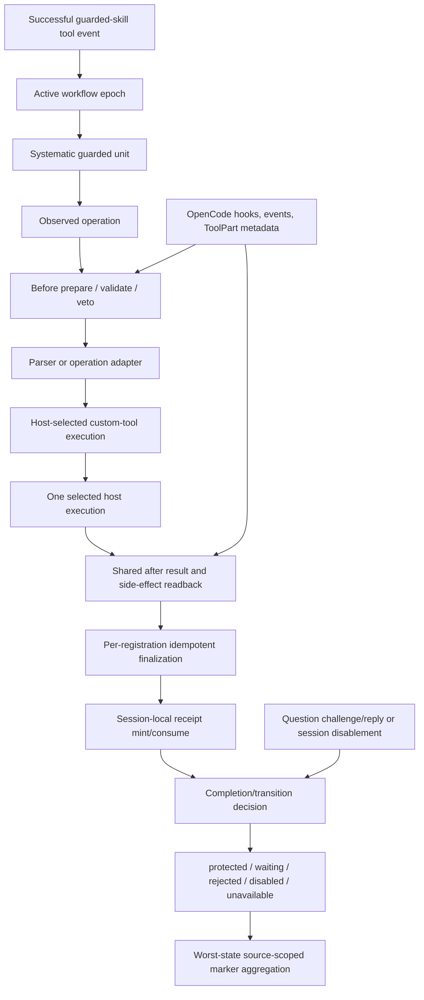
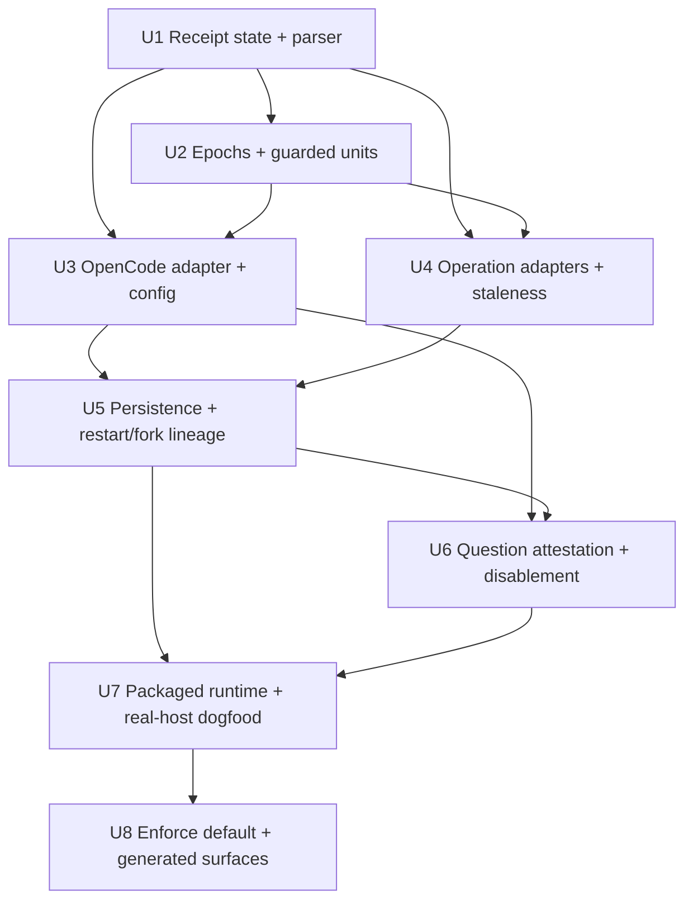

# feat: Add receipt-backed workflow guard

## Overview

Build a Systematic-owned, receipt-backed workflow guard for OpenCode. The guard prevents assistant prose, successful no-ops, stale evidence, unrelated tool calls, and replayed events from advancing guarded `ce:work` or git-shipping state. It records only bounded, privacy-safe session-local evidence, exposes state through custom tool metadata and a next-host-turn marker, and treats unsupported host capabilities as `unavailable` rather than protected.

V1 is OpenCode-only. The workflow semantics remain harness-neutral so Pi and Claude Code can report `unavailable` without receiving speculative adapters. The final shipped default becomes protected/enforced only in U8, after observe-mode real-host and packaged-runtime verification has zero unexplained false rejections.

---

## Problem Frame

The origin incident allowed assistant text to become the premise for later workflow decisions even though no corresponding test, git, GitHub, or shell receipts existed. The failure boundary is workflow state, not prose rendering: text can describe an action, but only a Systematic-owned receipt can prove that a recognized operation happened with the required result.

The capability plan confirms that OpenCode supplies useful substrate for hooks, status transport, restart/fork readback, foreground lineage, and Question-channel trust semantics. It also confirms that compaction is unavailable and must remain a capability-unavailable path. The implementation therefore needs fresh operation-specific readback whenever durable evidence is missing, rather than reconstructing state from summaries or pretending unsupported compaction exists.

The guard must preserve OpenCode's per-source plugin registration model. Each registration owns its own closure-scoped state and observes the same host event stream. Before hooks only prepare, validate, or veto; they never consume receipts or advance units/epochs. After every before hook allows, one host custom-tool execution produces one host-visible result, and the shared after event finalizes idempotently inside each registration. A later rejection, disagreement, or partial finalization failure prevents or invalidates completion rather than relying on a magical consensus layer or a process-wide singleton.

---

## Requirements Trace

The origin requirements remain authoritative. Each row names the implementation unit that owns the behavior and the verification boundary that proves it.

- R1. Only Systematic runtime code mints receipts; model prose, skill arguments, and tool arguments cannot write ledger state. **Units:** U1, U2.
- R2. Receipts contain normalized operation, state, epoch, unit, bounded host identity, timestamp, repository/worktree digests, and integrity data without raw input/output persistence. **Units:** U1, U5.
- R3. Each registration's session-local receipt state permits at most one receipt per host call per registration and consumes it once; before entries reconcile `prepared -> finalized | abandoned`; parent/child correlation requires host-observed provenance and rejects transplanted or replayed receipts. **Units:** U1, U5.
- R4. Restart/fork readback reconstructs only from durable host ToolPart metadata when it is present and valid; missing or unsupported history requires fresh operation-specific readback. Compaction remains unavailable. **Units:** U5.
- R5. V1 guards `ce:work` completion and commit, push, pull-request creation, and pull-request check/review readback; merge, deployment, planning, research, advisory work, and ordinary todos remain outside the gate. **Units:** U2, U4, U7.
- R6. Guarded completion requires a successful implementation receipt and every verification minimum declared by the active unit or workflow. **Units:** U2, U4.
- R7. Commit requires a successful, active-epoch commit receipt. **Units:** U2, U4.
- R8. Push and pull-request creation each require their own successful operation receipt. **Units:** U2, U4.
- R9. Pull-request check/review state is runtime-verified only after successful readback for the active pull request. **Units:** U2, U4.
- R10. Failed, cancelled, running, stale, unrelated, replayed, unattributable, and no-op receipts cannot satisfy transitions. **Units:** U1, U2, U4.
- R11. Only Systematic-created guarded units/todos are held incomplete; native OpenCode todos remain display-only and ordinary user todos retain current behavior. **Units:** U2, U3.
- R12. A turn may end without completion; text-only idle or rejected completion leaves the workflow active and produces one bounded next-host-turn marker. **Units:** U2, U3.
- R13. Parent workflows consume child receipts only with exact host-observed lineage, matching workspace identity, and once-only child consumption; worker summaries are never evidence. V1 supports foreground-completed children only. **Units:** U5, U7.
- R14. OpenCode Question replies are the trusted user channel. A successful reply can mint one `user-attested` receipt bound to one session/resource/guarded transition; unknown, expired, consumed, mismatched, replayed, and free-form chat claims cannot. **Units:** U6, U7.
- R15. OpenCode exposes `protected`, `waiting`, `rejected`, `disabled`, or `unavailable` as a read-time projection through custom-tool metadata and source-scoped host-owned markers outside assistant text; worst-state aggregation cannot be erased by later local output. **Units:** U2, U3.
- R16. Waiting/rejected status identifies bounded missing, running, failed, or stale evidence and remains deduplicated until evidence changes, retry succeeds, or the user explicitly disables protection. **Units:** U2, U3, U6.
- R17. Protected mode is the final shipped default; observe and disabled modes are explicit, and global/session disablement is user/operator-controlled rather than assistant-controlled. **Units:** U3, U6, U8.
- R18. Assistant text remains unchanged; free-text claim scanning is audit-only; text-only or rejected completion causes a next-host-turn unverified marker. **Units:** U3, U7.
- R19. Receipt/status state is session-local and privacy-safe, using bounded compatibility envelopes and domain-separated session-salted correlation digests. No durable audit store or raw command, argument, output, environment, repository content, path, PR body, or user prose is persisted; host-owned ToolPart metadata/events are the V1 trust boundary, not authenticity proofs. **Units:** U1, U5, U7.
- R20. Semantics are harness-neutral, but V1 enforcement exists only in OpenCode; Pi and Claude Code report `unavailable`. **Units:** U3, U7.
- R21. Missing enforcement capabilities or unsupported host versions report `unavailable` and never present the workflow as protected. **Units:** U3, U7.
- R22. Duplicate plugin loads, duplicate hooks, retries, and replayed events permit at most one receipt per host call per registration and at most one selected host-visible transition; duplicate same-ID tool selection is not a public contract and unsafe/unprovable behavior is `unavailable`. **Units:** U1, U3, U5, U7.

---

## Scope Boundaries

- In scope: Systematic-owned receipt state, workflow epochs and units, operation classification, OpenCode tools/hooks/status integration, Question-backed attestation, session disablement, persistence/readback, foreground lineage, trust-sensitive configuration, packaging, exact-version host integration, and the observe-to-enforce rollout gate.
- In scope: only a successful host-observed `systematic_skill` tool call or native OpenCode `skill` tool call for `ce:work`, `git-commit`, or `git-commit-push-pr` activates or reuses the current guarded workflow epoch. A slash/command shim counts only when it produces one of those successful tool events; a path that merely injects or inlines prose cannot activate the guard. Nested shipping loads attach to that epoch; failed or unrelated loads do nothing; a new epoch begins only after completion or in a new session.
- In scope: the four guarded custom-tool roles are start/register unit, read-only status, completion/transition, and control for Question attestation or session disablement. Exact public names remain an implementation detail, but the surface stays small and discriminated.
- In scope: the pinned tree-sitter Bash parser candidate pair `web-tree-sitter@0.25.10` and `tree-sitter-bash@0.25.1`, subject to Marcus's explicit approval before production dependency changes.
- Out of scope: semantic scanning of every assistant sentence, regex or secondary-model gating, native OpenCode todo authority, a durable Systematic audit database, raw debug persistence, merge/deployment guards, speculative background lineage fallback, and non-OpenCode adapters.
- Out of scope: changing provider selection, reasoning effort, skill prose as an enforcement boundary, or the meaning of ordinary user todos.
- Out of scope: fake compaction recovery. If compaction or durable history is unavailable, the guard requires fresh operation-specific readback.

### Deferred to Separate Tasks

- Pi and Claude Code adapters: retain the portable contract and report `unavailable` until their host capabilities are separately researched and planned.
- Durable audit/export storage: a separate privacy and retention decision is required if session-local receipts prove insufficient.
- Background-child fallback: do not implement until host-observed background lineage is independently proven.
- Merge and deployment operation adapters: later requirements may extend the operation allowlist after the V1 guard is stable.

---

## Context & Research

### Relevant Code and Patterns

- `src/index.ts` is the plugin entry point and must keep its single default export. Its `initializePlugin()` path is invoked once per plugin source and owns closure-scoped initialization state.
- `src/lib/bootstrap.ts` provides marker-based strip-and-replace behavior for system prompt content. The guard should use the same sentinel/idempotency discipline for its bounded next-host-turn marker without modifying assistant text.
- `src/lib/skill-tool.ts` is an existing bundled-skill surface referenced for compatibility; activation should observe the general before/after host adapter for successful Systematic and native OpenCode skill tool calls, not modify this file merely to signal activation or infer activation from prompt prose.
- `src/lib/config-schema.ts` and `src/lib/config.ts` already implement typed config, source precedence, and `SECURITY_OVERLAY_FIELDS`. The workflow-guard block must follow those trust boundaries.
- `tests/integration/opencode.test.ts` provides isolated OpenCode process, temporary-root, version, environment, and package-runtime patterns. New real-host tests must preserve its repository immutability and credential-redaction posture.
- `tests/integration/fixtures/receipt-workflow-host.ts` is the planned shared home for extracted exact-version/mock-model/disposable-root/host-readback primitives from existing integration seams. New guard tests consume this helper; no removed manual probe is treated as a source or consumer.
- `tests/unit/config-schema.test.ts`, `tests/unit/config.test.ts`, `tests/unit/package-exports.test.ts`, and `tests/integration/opencode.test.ts` are the closest existing behavior-only test seams.
- `skills/ce-work/SKILL.md`, `skills/git-commit/SKILL.md`, and `skills/git-commit-push-pr/SKILL.md` are activation names and workflow context, not enforcement code. The runtime detects successful tool calls from both host skill surfaces; it does not trust the skill body or prose injection as evidence.
- `skills/using-systematic/references/opencode-profile.md`, `skills/using-systematic/references/pi-profile.md`, and `skills/using-systematic/references/claude-code-profile.md` are the shipped capability-profile surfaces that U8 must keep aligned with `HARNESSES.md`.

### Institutional Learnings

- `docs/solutions/integration-issues/opencode-plugin-factory-duplicate-registration-2026-05-04.md` establishes the non-negotiable multi-source rule: preserve per-load registration, keep state closure-scoped, and solve prompt duplication with marker replacement rather than a factory singleton.
- The capability plan proves the positive substrate and its limits: restart/fork readback and foreground lineage are usable; compaction is `unsupported` with `operation-unavailable`; Question replies provide the trusted one-time interaction substrate; R3/R22 ledger behavior remains implementation work.
- The capability corpus validated fail-closed parser behavior across seven operation classes, but it was disposable evidence rather than a production classifier or receipt adapter. The implementation must preserve that narrowness and add no regex fallback.

### External References

- The origin requirements and capability plan are the authoritative product and runtime evidence documents.
- OpenCode's current plugin/session source and SDK types are execution-time compatibility references; the vendored source is context, not proof of current host behavior.
- Issue #678 is the tracking reference for the receipt-backed workflow guard.

---

## Key Technical Decisions

- KTD-1 — Per-source registration: every `initializePlugin()` invocation owns its own session/call map and guard closure. No `globalThis`, `Symbol.for`, module singleton, client-keyed registry, or global registration/protocol registry is allowed. Rationale: source-specific registrations must remain visible and independently correct.
- KTD-2 — Selected-tool host boundary: duplicate same-ID custom tool resolution is not a public OpenCode contract. On currently observed hosts, a model-requested guard tool call causes one selected tool execution while every loaded registration's before/after hooks may observe that call. U3 characterizes duplicate tool catalog/selection behavior before finalizing the public surface; U7 proves it on exact hosts and dual-source loads. If duplicate-name behavior, transform ordering, or hook delivery is not safe, the guard is `unavailable` and U8 cannot flip the default. V1 does not invent source-scoped public IDs or a process-global active-source registry.
- KTD-3 — Before/after transition protocol: each registration prepares and validates the same call independently. No before hook consumes a receipt or advances state. If any registration vetoes, the selected custom transition tool does not execute and no registration consumes state. After all before hooks allow, one selected host execution/result occurs; the shared after event finalizes and consumes idempotently inside each registration. Divergent or partial finalization becomes `unavailable`/`rejected`, never false completion. Exact resolution mechanics remain an integration-test obligation, not a last-registered-wins assumption.
- KTD-4 — Three state layers: externally projected guard state, workflow epoch/unit progression, and internal receipt mint/consume state remain separate. OpenCode native session status is never used as Systematic guard status. The five guard states are read-time projections, not persisted authority.
- KTD-5 — Minimums are runtime-owned: start-unit arguments declare expectations but cannot reduce mandatory implementation and verification minima. Guard custom tools are excluded from activation and cannot satisfy implementation, verification, or shipping receipts; they only perform their bounded start/status/control/transition roles. Native todos display progress only.
- KTD-6 — Side effect before receipt: a successful write/edit/patch return is insufficient. Implementation and commit evidence require a real before/after workspace or repository revision digest change; no-ops mint nothing.
- KTD-7 — Narrow parser, fail closed: shell-backed verification and shipping use the approved tree-sitter Bash parser and a tested grammar. Parse failures, dynamic/unattributable forms, and unsupported shell constructs are rejected without a string/regex fallback.
- KTD-8 — Question flow is non-blocking and one-time: Systematic creates a pending request and returns `waiting`; the runtime generates a one-time challenge and canonical resource/transition summary; OpenCode asks the user; host hooks validate exact options, challenge, request/call/session binding, and lifecycle; only a matching affirmative reply mints/consumes `user-attested` evidence.
- KTD-9 — Fresh compare-and-consume: immediately before transition finalization, bounded workspace/repository/resource readback must exactly match the digest/revision bound to the receipts. Any interleaving change makes the transition waiting/rejected and leaves receipts unconsumed/stale.
- KTD-10 — Tool metadata is canonical for user-visible output: custom-tool result metadata projects the current read-time guard state. The five states are not persisted authority; workflow progression and receipt mint/consume state remain separate. Toasts and logs are bounded, deduplicated, best-effort presentation only.
- KTD-11 — Privacy by minimization and bounded compatibility: receipts persist only a schema/protocol envelope, session-scoped registration/source digest, capability flags, canonical receipt fields, and bounded digests. Repository/worktree/resource identifiers use domain-separated session-scoped randomized salts; opt-in debug uses an export-local salt or omits stable identities. Host-owned ToolPart metadata and the host event stream are authoritative against the assistant; local DB/host compromise is outside V1. Unkeyed/salted hashes are correlation identifiers, not authenticity proofs; do not add a keyed MAC or durable secret.
- KTD-12 — Observe before enforce: U3 introduces/configures observe as the default, U7 verifies observe and explicit protected-mode behavior on disposable workflows, and only U8 flips the final shipped default to protected/enforced. Protected coverage must exercise veto/repair, TOCTOU, Question replay/substitution, dual-source disagreement, internal after failure, and ordinary-tool non-interference.

---

## Resolved / Deferred Open Questions

### Resolved During Planning

- What user channel is trusted for external attestation? OpenCode Question replies across TUI, Desktop, and `serve` are trusted; arbitrary `role:user` chat is non-evidence.
- What does a valid attestation prove? Only one named resource and guarded transition in one current session, labeled `user-attested`, consumed once.
- What happens when compaction is unavailable? The guard reports capability unavailability and requires fresh operation-specific readback; it does not reconstruct from summaries or build a fake compaction path.
- How should multiple plugin sources behave? Preserve independent registration; every before hook must allow before the selected host execution, and every after hook must finalize consistently. Never collapse them with a singleton or assume public selection/order semantics.
- What does duplicate same-ID custom-tool selection guarantee? Nothing public. U3/U7 must characterize selected execution, hook delivery, transform ordering, and catalog behavior on exact hosts; unsafe or unprovable behavior keeps the guard `unavailable` and blocks U8.
- What happens to a before entry when a later veto prevents execution? It follows `prepared -> abandoned` at a host-observed lifecycle/readback boundary when no matching after event exists. Abandoned entries are garbage-collected, never evidence, never indefinitely waiting, and do not poison call replay/dedup.
- What is the persistence compatibility boundary? Operation ToolParts carry immutable receipt-mint metadata; later completion/control ToolParts carry consumption/progression markers. The envelope includes schema/protocol version, registration/source digest, capability flags, and canonical fields. Unknown, incompatible, or cross-registration-disputed envelopes require unavailable/fresh readback.
- Which non-OpenCode harnesses ship enforcement in V1? None. Pi and Claude Code report `unavailable`.
- Which parser candidates are validated? `web-tree-sitter@0.25.10` and `tree-sitter-bash@0.25.1`; adding them to production dependencies still requires explicit approval during implementation.

### Deferred to Implementation

- Exact public custom-tool names and discriminated argument/result field names: choose the smallest stable surface while preserving the directional roles in this plan.
- Exact OpenCode Question event payload fields and ordering: resolve against current SDK types and real-host integration tests without assuming vendored-source parity.
- Exact digest normalization and bounded workspace snapshot policy: choose a deterministic, reviewable representation that is cheap enough for completion readback and does not persist paths/content.
- Exact parser asset loading and package bundling shape: resolve while adding the approved dependency, preserving npm-packed runtime behavior and no optional-peer runtime import.
- Exact config key names inside the workflow-guard block: keep trust metadata explicit and align generated schema/reference output with existing config conventions.
- Exact operation allowlist expansion: only add a command or result shape after a behavior test proves positive attribution and no-op rejection.
- Exact host ordering/short-circuit, after-throw propagation, duplicate-name selection, and multi-plugin system-transform composition: implementation-time exact-host gates, not stable public guarantees. Question request/reply correlation and rejected lifecycle are the stronger public/SDK boundary; vendored OpenCode `1.17.6` remains context only.

---

## High-Level Technical Design

> This illustrates the intended approach and is directional guidance for review, not implementation specification. The implementing agent should treat it as context, not code to reproduce.

The guard has three layers. The projected layer exposes the five external states at read time; it is not persisted authority. The workflow layer tracks an epoch, guarded unit declarations, required minima, and transition progression. The ledger layer records, consumes, and deduplicates operation receipts per registration. Before-call entries have the lifecycle `prepared -> finalized | abandoned`; prepared entries contain only non-authoritative pending intent/baselines. If any registration rejects, the selected custom transition tool does not execute and no registration consumes state. A missing matching after event reconciles prepared entries as abandoned at a host-observed lifecycle/readback boundary. Abandoned entries are garbage-collected, never evidence, never indefinitely waiting, and cannot poison call replay/dedup. After all before hooks allow, one selected host execution/result occurs; the shared after event finalizes inside each registration. A transition can advance only when every registration finalizes consistently and the workflow layer receives receipts satisfying current epoch, unit, workspace revision, operation, result, and provenance constraints.

Receipt records are metadata-only and carry a bounded compatibility envelope: schema/protocol version, session-scoped registration/source digest, capability flags, and canonical receipt fields. They may include normalized operation/state, epoch and unit identifiers, bounded host session/call identity, timestamps, domain-separated session-salted repository/worktree/resource digests, workspace revision digest, result/resource digests, source classification (`runtime-verified` or `user-attested`), and consumption state. Unknown or incompatible envelopes, or cross-registration disagreement, become `unavailable`/fresh-readback requirements; missing fields are never inferred from prose/output. They never include raw commands, args, output, environment, repository contents, paths, PR bodies, or user prose. Salts remain only in trusted host-owned epoch metadata as needed for restart correlation; opt-in debug omits stable identities or uses an export-local salt with documented linkability.

The operation path is intentionally two-phase. Before hooks record transient intent and a baseline, but never consume a receipt or advance a unit/epoch. After all before hooks allow, one host execution/result occurs. The shared after event finalizes idempotently inside each registration and mints/consumes a receipt only when the operation is recognized, successful, and has the required side effect or result. Failed, cancelled, running, stale, unrelated, and no-effect observations can update read-time state but cannot satisfy a transition. Divergent or partial finalization becomes `unavailable`/`rejected`, never falsely complete.

The Question path is also two-phase but non-blocking. A control tool creates a bounded pending request with a runtime-generated one-time challenge and canonical resource/transition summary, then returns `waiting`; the model invokes native Question; hooks bind the live request to the initiating call and session; only a reply with the exact canonical question/options/challenge/request/call/session binding can mint one `user-attested` receipt. Altered options, free-form assistant-authored wording, missing/reused challenges, resource/transition substitution, stale request IDs, cross-session replies, unknown, expired, consumed, replayed, or rejected claims are rejected. Persist only challenge/resource digests and bounded classifications; user-visible summary is transient. Systematic never invokes Question and never holds a plugin tool awaiting a reply.

Host-owned ToolPart metadata and the host event stream are the trust boundary against assistant claims. The plan does not treat local host/DB compromise as a V1 threat to solve, and unkeyed or salted hashes are correlation/privacy identifiers rather than authenticity proofs. No keyed MAC, durable secret, or durable Systematic event database is introduced.

### Dependency Graph

---

## Acceptance Examples

- A successful `systematic_skill` or native OpenCode `skill` tool call for `ce:work` activates an epoch. A repeated successful call reuses it, a nested shipping skill attaches to it, an unrelated or failed call does nothing, and prose-only command injection cannot activate it.
- A successful write return with an unchanged workspace digest produces no implementation receipt. A recognized write with a changed digest can produce one receipt after required verification.
- A successful `echo` or other no-op command cannot satisfy verification, commit, push, PR creation, or check/review readback.
- A text-only completion leaves the unit active and produces one bounded unverified marker on the next host turn without modifying assistant text.
- A commit receipt does not satisfy push or PR creation. A stale verification receipt is rejected after a later workspace change.
- A missing or malformed persisted ToolPart causes fresh operation-specific readback; it never causes summary/prose reconstruction.
- A foreground child with exact host lineage and matching workspace digest can satisfy a parent unit once. Worker summary text alone cannot.
- A matching affirmative Question reply mints one `user-attested` receipt. A second reply, a mismatched resource, an expired request, or a free-form user-role message cannot.
- A missing hook capability reports `unavailable` and refuses guarded completion while unrelated tools continue normally.
- Dual-source plugin loads keep independent state. Each before hook only prepares/validates/vetoes; an early allow followed by a later reject prevents the custom transition tool from executing and consuming state. After all allow, one host-visible transition occurs and each registration finalizes idempotently; duplicate after delivery or partial finalization never creates a second transition or false completion.

---

## Implementation Units

- [x] **U1. Receipt state, privacy-safe identities, parser prerequisite, and classifier core**

**Goal:** Establish the session-local receipt model, bounded identities and digests, once-only mint/consume semantics, and the narrow tree-sitter Bash classification core without wiring production enforcement.

**Requirements:** R1, R2, R3, R5, R7-R10, R19, R22.

**Dependencies:** None. Production dependency edits require Marcus's explicit approval; candidate pins are `web-tree-sitter@0.25.10` and `tree-sitter-bash@0.25.1`.

**Files:**
- Create: `src/lib/receipt-ledger.ts`
- Create: `src/lib/receipt-classifier.ts`
- Modify, approval-gated: `package.json`
- Modify, approval-gated: `bun.lock`
- Test: `tests/unit/receipt-ledger.test.ts`
- Test: `tests/unit/receipt-classifier.test.ts`

**Approach:**
- Keep all mutable state in an explicitly created session-scoped ledger instance. The ledger accepts only runtime-owned observation records and refuses model-provided receipt fields.
- Normalize repository/worktree identity and workspace revision into bounded digests. Keep digest inputs transient and discard them after calculation.
- Generate domain-separated, session-scoped randomized salts for repository/worktree/resource identifiers so identical private inputs do not form stable cross-session fingerprints. Persist only the trusted host-owned epoch salt metadata needed for restart correlation; opt-in debug omits stable identities or uses an export-local salt.
- Define the bounded receipt compatibility envelope: schema/protocol version, registration/source digest, capability flags, canonical fields, and explicit compatibility outcome. Unknown, incompatible, incomplete, or cross-registration-disputed envelopes require unavailable/fresh readback rather than inferred upgrades.
- Give pending before-call entries the explicit `prepared -> finalized | abandoned` lifecycle. Prepared entries contain non-authoritative intent/baselines only; abandoned entries are garbage-collected and never count as evidence or replay/dedup state.
- Deduplicate by host-issued call identity plus operation context within each registration, consume receipts once per registration, and reject epoch/unit/workspace mismatches. The ledger API must not permit a before hook to consume or advance state.
- Use tree-sitter Bash for a deliberately narrow grammar: simple attributable commands, environment/cwd prefixes, and ordered `&&` chains whose final result proves each stage. Reject parser failure, `||`, pipelines, `;`, substitutions, subshells, eval/wrappers, redirects, dynamic executables, and unresolved attribution.
- Keep classifier output structural and bounded: operation category, attribution, result classification, side-effect requirement, and a safe reason code. Never return raw command text or output.

**Execution note:** Implement behavior test-first. Start with failing ledger/classifier behavior tests and keep parser integration separate from ledger semantics.

**Patterns to follow:** `src/lib/config.ts` for explicit local state and type guards; `tests/unit/config.test.ts` for temporary filesystem isolation; the capability plan's seven-class fail-closed corpus; AFT's session-scoped state discipline without copying its architecture wholesale.

**Test scenarios:**
- Happy path — runtime-owned implementation observation with changed workspace digest mints one receipt containing only bounded metadata.
- Happy path — accepted simple command and ordered `&&` chain classify to the expected operation/result shape without exposing source text.
- Edge case — repeated observation for the same host call yields at most one receipt per registration; a second consume attempt in that registration is rejected.
- Edge case — unchanged before/after workspace digest, empty result, and successful no-op all produce no success receipt.
- Edge case — duplicate operation names in separate epochs remain independent and cannot consume one another's receipts.
- Error path — model-supplied receipt fields, foreign epoch/unit, stale workspace revision, and already-consumed receipt are rejected.
- Error path — missing/unknown envelope fields, cross-registration source disagreement, invalid salt scope, prepared entry without matching after event, and abandoned-entry replay are rejected or require fresh readback.
- Error path — parser failure, pipeline, `||`, substitution, redirect, wrapper, dynamic executable, and ambiguous shell attribution fail closed without regex fallback.
- Error path — missing parser asset or incompatible grammar reports a bounded unavailable/error result rather than accepting text heuristics.
- Integration — classifier output can be inserted into independent registration ledgers without shared state or raw command/argument/output content; a finalization failure leaves the transition unavailable/rejected rather than falsely complete.

**Verification:** The ledger has no process-global state, all accepted records are privacy-safe and once-only within each registration, no-op implementation evidence is rejected, and the seven operation classes have explicit positive and negative classifier coverage. Parser dependency edits remain blocked until approval.

- [ ] **U2. Workflow epochs, guarded units, status, completion, and receipt consumption**

**Goal:** Build the portable workflow state machine that activates/reuses epochs, declares guarded units with mandatory minima, exposes status, and accepts completion only from current valid receipts.

**Requirements:** R5, R6-R12, R15, R16, R22.

**Dependencies:** U1.

**Files:**
- Create: `src/lib/workflow-guard.ts`
- Test: `tests/unit/workflow-guard.test.ts`

**Approach:**
- Model an epoch as a session-local progression boundary with a stable identifier and explicit active/completed state. Successful guarded skill tool events activate or reuse it; prose-only or failed loads do not. A new session or completed epoch starts fresh. Before hooks may validate intent against the epoch but cannot advance it.
- Represent guarded units as immutable declarations with stable unit IDs, mandatory implementation and verification minima, expected operation/resource scope, and current transition state. Model arguments can add expectations but cannot lower minima.
- Treat start/status/control/transition custom tools as guard control surfaces only: their calls cannot activate the epoch and cannot satisfy implementation, verification, or shipping minima.
- Keep the five-state projection separate from internal ledger state. The projection is computed at read time from workflow and receipt state, not persisted as authority. Completion performs fresh bounded evidence checks, consumes qualifying receipts once per registration only after the shared after event, and returns canonical metadata describing accepted/missing evidence plus one bounded repair path when available: fresh operation-specific readback, rerun of the exact operation, or eligible Question attestation. If no supported repair exists, the projection is `unavailable` with a bounded reason.
- Model the host transition boundary explicitly: all registration before hooks prepare/validate/veto; an early allow does not execute or consume; any later veto prevents the custom transition tool from executing; after all allow, one host execution/result occurs and each registration finalizes idempotently. Divergent finalization leaves the read-time projection `unavailable`/`rejected`.
- Implement `protected`, `waiting`, `rejected`, `disabled`, and `unavailable` as a closed read-time state set. The projected state is deduplicated and changes only when evidence or control state changes; workflow progression and receipt mint/consume state remain separate.
- Keep native OpenCode todos outside authority. If a host todo is observed, it is display/context information only.

**Execution note:** Implement test-first around state transitions and once-only consumption; do not begin with the OpenCode adapter.

**Patterns to follow:** `src/lib/receipt-ledger.ts` from U1; discriminated unions and early-return guards used throughout `src/lib/`; the origin acceptance examples for incomplete, waiting, rejected, disabled, and unavailable states.

**Test scenarios:**
- Happy path — the first successful guarded skill tool event activates an epoch; repeated successful events reuse it; nested shipping events attach; unrelated, failed, or prose-only loads do nothing.
- Happy path — a start-unit declaration records mandatory implementation and verification minima, and matching fresh receipts allow completion once.
- Happy path — a completed epoch cannot accept another completion; a new session can activate a new epoch.
- Edge case — a unit with no declared optional expectations still retains mandatory minima; model arguments cannot remove them.
- Edge case — status remains deduplicated across repeated missing-evidence observations and changes when evidence changes.
- Error path — completion with missing, stale, unrelated, failed, cancelled, running, consumed, or foreign receipts remains active or rejected with bounded reasons.
- Error path — successful no-op or unattributable shell result cannot complete implementation or shipping.
- Error path — missing evidence exposes one supported repair path or a bounded no-repair `unavailable` result; it never remains indefinitely `waiting` without action.
- Error path — start/status/control/transition tool results cannot self-activate the guard or mint implementation, verification, commit, push, PR, or check/review receipts.
- Error path — disabled and unavailable control states refuse guarded completion without changing ordinary-tool behavior.
- Integration — accepted after-hook finalization updates each registration's unit/epoch state consistently and yields one host-visible transition; rejected completion leaves the epoch active, and partial finalization yields `unavailable`/`rejected`.

**Verification:** The portable guard can advance only through current, operation-specific receipts after the host transition boundary; all incomplete and failure states remain visible; repeated calls are idempotent per registration with one host-visible transition; and ordinary todos/unguarded work do not enter the guarded state machine.

- [x] **U3. Trust-sensitive config, per-registration OpenCode adapter, activation, markers, and capability errors**

**Goal:** Compose the portable guard into the OpenCode plugin without violating per-source registration, add observe/disabled/protected configuration with trust boundaries, activate epochs only from successful guarded skill tool events, and expose bounded status outside assistant text. U3's shipped default is observe; protected mode is selectable for tests but is not the final default until U8.

**Requirements:** R1, R5, R11, R12, R15-R18, R20, R21, R22.

**Dependencies:** U1, U2.

**Files:**
- Create: `src/lib/opencode-workflow-guard.ts`
- Modify: `src/index.ts`
- Modify: `src/lib/config-schema.ts`
- Modify: `src/lib/config.ts`
- Test: `tests/unit/opencode-workflow-guard.test.ts`
- Test: `tests/unit/config-schema.test.ts`
- Test: `tests/unit/config.test.ts`

**Approach:**
- Have each `initializePlugin()` create one adapter closure with its own guard instance and event maps. Do not cache adapters by client, directory, module, or process.
- Observe successful tool calls from both Systematic's `systematic_skill` tool and OpenCode's native `skill` tool through the general before/after adapter. Only calls for `ce:work`, `git-commit`, and `git-commit-push-pr` activate/reuse an epoch; a slash/command shim counts only when it produces one of those successful events, prose-only injection/inlining does nothing, failed/unrelated calls do nothing, and `src/lib/skill-tool.ts` is not modified merely to signal activation.
- Keep `src/lib/opencode-workflow-guard.ts` as a thin adapter shell: hook/tool registration, host event normalization, and delegation only. State, classification, readback, attestation, and compatibility logic remain in dedicated modules.
- Register the smallest custom-tool surface: unit start/register, read-only status, completion/transition, and a discriminated control tool for attestation/session disablement. Duplicate same-ID resolution is not assumed unique or last-wins; U3 characterizes catalog/selection behavior before finalizing names. Guard tool calls cannot activate or satisfy operation minima.
- Use the existing system-transform seam with source-scoped markers containing bounded protocol/state metadata. Aggregate registration markers with worst-state precedence; an `unavailable`, `rejected`, or `waiting` registration cannot be erased by a later protected/local-disabled marker. Exact transform ordering/composition is a U3/U7 host gate; if safe aggregation cannot be proven, report unavailable and block U8.
- Add a workflow-guard config block with observe as the U3/U7 default, explicit protected and disabled modes, opt-in bounded metadata-only debug output, and protected project overlay fields registered through `SECURITY_OVERLAY_FIELDS`. Static user/config-dir disablement is authoritative; per-session disablement is Question-gated. U8 alone flips the shipped default to protected/enforced.
- Surface hook/SDK capability failures as `unavailable` with bounded diagnostics. Do not break unrelated tools when classification or guard setup fails.
- Define the before/after safety protocol explicitly: every registration's before hook only prepares, validates, or vetoes; an early allow does not consume or advance. Any later veto prevents the selected custom transition tool from executing. After all before hooks allow, one selected host execution/result occurs, and the shared after event finalizes idempotently inside each registration. Catch bounded internal finalization failures in after hooks, mark that registration unhealthy/`unavailable`, preserve the selected host result/ToolPart when the host permits, and let later status/completion fail closed; after hooks do not throw. Partial or divergent finalization becomes `unavailable`/`rejected`; do not assume last-registered-wins or magical consensus.

**Execution note:** Add characterization tests around current per-source `initializePlugin()` and marker behavior before wiring new hooks; then extend them test-first.

**Patterns to follow:** `src/index.ts` per-load `initializePlugin()` composition; `src/lib/bootstrap.ts` marker-based replacement; `src/lib/config-schema.ts` trust metadata; `src/lib/config.ts` source precedence; `docs/solutions/integration-issues/opencode-plugin-factory-duplicate-registration-2026-05-04.md`.

**Test scenarios:**
- Happy path — one registration activates a guarded epoch after a successful `systematic_skill` tool call and another successful native `skill` tool call, while failed/unrelated calls and prose-only command shims do nothing.
- Happy path — two independent registrations prepare the same transition, all before hooks allow, one host execution/result occurs, and each after hook finalizes idempotently to one host-visible transition.
- Edge case — an early registration allows but a later registration rejects; the custom transition tool does not execute and no registration consumes or advances state.
- Edge case — a prepared before entry with no matching after event becomes abandoned at readback, is garbage-collected, never waits indefinitely, and cannot satisfy evidence or poison replay/dedup.
- Edge case — duplicate after delivery finalizes at most once per registration and does not create another host-visible transition.
- Error path — partial finalization failure in one registration produces `unavailable`/`rejected` in the aggregate and never reports completion.
- Error path — a host that propagates a thrown-after failure is characterized, while the adapter's own after hook catches internal finalization failures and does not throw.
- Error path — duplicate same-ID tool catalog/selection, transform-order, or hook-delivery ambiguity reports `unavailable` rather than inventing a source-scoped tool ID or active-source registry.
- Edge case — repeated transform hooks replace one prior marker, preserve assistant text, and emit no duplicate marker; title/internal-agent transforms remain unaffected.
- Edge case — source-scoped markers aggregate with worst-state precedence; later protected or local-disabled output cannot erase another registration's `waiting`, `rejected`, or `unavailable` state.
- Edge case — observe mode is the configured default and records/reports without vetoing; disabled mode remains visibly disabled; protected mode is explicitly selectable for tests but is not the shipped default before U8.
- Error path — failed Systematic/native skill tool call, unrelated tool call, prose-only command shim, and malformed host result do not activate an epoch.
- Error path — missing hook capability, malformed host result, or registration disagreement reports `unavailable` and refuses guarded completion.
- Error path — assistant text, native todo mutation, or tool arguments cannot activate, disable, or complete the guard.
- Integration — config loaded from user/project/custom sources applies trust-sensitive workflow-guard fields with protected overlay restrictions and observe as the default until U8.
- Integration — unguarded ordinary tool execution remains available when the classifier or guard reports an unrelated capability failure.

**Verification:** Per-source registrations remain independent and idempotent, both skill-load surfaces are observed through the general adapter, selected-tool catalog/selection behavior and hook delivery are characterized, before hooks cannot consume or advance state, one selected host execution/result follows all allows, after finalization is idempotent per registration and non-throwing, marker aggregation uses worst-state precedence, partial finalization is unavailable/rejected, config trust rules are enforced, observe is the default until U8, all five states are projected at read time, and capability failure is explicit rather than a false protected state.

- [x] **U4. No-op-safe write, Bash, git, and GitHub operation adapters with workspace staleness**

**Goal:** Turn observed writes, verification, commit, push, pull-request creation, and check/review readback into operation-specific receipts only when attribution, result, and side effect/resource change are proven.

**Requirements:** R2, R5-R10, R16, R19, R22.

**Dependencies:** U1, U2. U3 consumes these operation interfaces after they are stable; U3 and U4 proceed in parallel after U1/U2.

**Files:**
- Modify: `src/lib/receipt-classifier.ts`
- Modify: `src/lib/workflow-guard.ts`
- Test: `tests/unit/receipt-operations.test.ts`
- Test: `tests/unit/workflow-guard.test.ts`

**Approach:**
- Define operation-specific adapters for actual file mutation, verification, commit, push, pull-request creation, and pull-request check/review readback. Each adapter has a narrow recognized shape and a bounded result projection.
- For implementation and commit, require a before/after workspace or repository revision digest change. A successful tool return with no change is a no-op and mints nothing.
- For verification, require an allowlisted recognizable command/result and successful exit/result state. `echo`, unrelated commands, and ambiguous composed shells do not satisfy a declared verification.
- For commit, push, and pull request operations, compare bounded before/after repository or remote-resource identities so existing state/no-op commands cannot masquerade as successful transitions.
- For checks/review readback, require the expected active PR resource and recognized state, not a generic successful request.
- Mark prior verification/commit receipts stale after any later observed or unobserved workspace revision change discovered by fresh bounded readback. Use digest changes, not timeouts.
- Immediately before transition finalization, perform bounded fresh workspace/repository/resource readback and compare it exactly with the digest/revision bound to the candidate receipts. Any interleaving edit, HEAD/upstream change, or PR-state change makes the transition waiting/rejected and leaves receipts unconsumed/stale.
- Keep the allowlist expandable only through behavior tests that prove both positive attribution and negative no-op handling.

**Execution note:** Use test-first operation matrices, with explicit no-op and ambiguous-shell cases before adding positive adapters.

**Patterns to follow:** U1 classifier/ledger boundaries; existing isolated filesystem tests; existing integration repository immutability checks; origin acceptance examples AE2, AE3, AE5, and AE8.

**Test scenarios:**
- Happy path — file mutation changes the workspace digest and produces one implementation receipt; required verification afterward can satisfy a unit.
- Happy path — recognized verification, commit, push, PR creation, and PR check/review readback each produce only their own operation receipt.
- Edge case — a repeated commit/push/PR command against already-current state produces no receipt; a changed remote resource produces one.
- Edge case — a workspace change after verification stales the verification/commit evidence before completion.
- Edge case — an interleaving workspace edit, HEAD/upstream change, or PR-state change between evidence collection and finalization fails the compare-and-consume check without consuming receipts.
- Error path — failed, cancelled, running, malformed, unrelated, or dynamic command results never satisfy a transition.
- Error path — pipelines, `||`, semicolon chains, substitutions, subshells, redirects, wrappers, and unresolved executable attribution are rejected.
- Error path — a valid tool return with unchanged workspace/repository/remote digest is classified as no-op, not success.
- Integration — operation receipts flow through the U2 completion gate and are rejected when epoch, unit, resource, or workspace revision no longer matches.

**Verification:** Every guarded operation has a positive and negative adapter path, no-op-safe write/commit/push/PR handling, digest-based staleness, a final compare-and-consume readback that rejects TOCTOU changes without consuming receipts, and no raw command/result persistence.

- [x] **U4.5. OpenCode production operation observation adapter** — shipped: local ops `4748030`, remote ops `722bdaf`

**Goal:** Feed real OpenCode write/edit/apply-patch/Bash results into U4's host-neutral operation APIs so production receipts are actually minted before U5 persists or recovers them.

**Requirements:** R2, R5-R10, R16, R19, R22.

**Dependencies:** U3 and U4. U5's end-to-end persistence/recovery and U7/U8 enforcement gates depend on this unit.

**Files:**
- Create: `src/lib/opencode-operation-observer.ts`
- Modify: `src/lib/opencode-workflow-guard.ts`
- Modify: `src/index.ts`
- Test: `tests/unit/opencode-operation-observer.test.ts`
- Test: `tests/unit/opencode-workflow-guard.test.ts`
- Test: `tests/integration/receipt-workflow-recovery.test.ts`

**Approach:**
- Keep `opencode-workflow-guard.ts` thin. Put bounded local Git/workspace/resource observation and host-result normalization in `opencode-operation-observer.ts`; keep classification and state decisions in the existing classifier and guard modules.
- Use one honest identity model: `workspaceIdentity` is a stable target/provenance digest derived from the active project/worktree identity and does not change on ordinary edits or HEAD movement. `repositoryIdentity`, `worktreeIdentity`, and operation-specific resource revision identities are mutable revision digests. Stable-target mismatch is cross-workspace replay; mutable revision mismatch is stale evidence requiring fresh readback.
- In `tool.execute.before`, recognize only `write`, `edit`, `apply_patch`, and `bash`; bind one pending baseline to session/call/tool/intent and capture only bounded target plus operation-relevant revision digests. Never mint, consume, or advance in before.
- In `tool.execute.after`, require the matching intent fingerprint and a successful host result. Route write/edit/apply-patch to implementation observation; route Bash through the tree-sitter classifier for verification, commit, push, PR creation, check readback, and review readback. `gh` has no separate host tool and is observed only through Bash. Failed, cancelled, running, malformed, no-op, unrelated, or ambiguous calls mint nothing.
- Require actual before/after revision change for implementation, commit, push, and PR creation; require recognized successful result plus exact current revision/resource state for verification/check/review readbacks. Obtain remote/PR/check/review state only through narrow structured local `git`/`gh` readbacks; generic successful output is not evidence.
- After a receipt is minted, merge one nested immutable mint marker into the existing tool-result metadata without replacing host metadata. Raw commands, args, outputs, paths, diffs, environment values, branch names, PR bodies, and user prose never enter retained receipt/status metadata.
- Abandon unmatched pending baselines at the next readback/turn boundary. Capability or observation failure marks only the affected registration unavailable and does not break unrelated unguarded tools in observe mode.

**Test scenarios:**
- Happy path — changed write/edit/apply-patch operations mint one implementation receipt; unchanged/no-op results mint none.
- Happy path — accepted Bash verification and changed commit/push/PR operations mint only their classified receipt; exact check/review readbacks mint only their own operation.
- Edge case — intent mutation, duplicate after delivery, missing after, and failed observation are idempotent/fail-closed per registration.
- Edge case — normal workspace/HEAD drift stales mutable evidence and offers fresh readback; a different stable target digest rejects as foreign workspace.
- Error path — echo, pipelines, dynamic shell, wrapper commands, failed exits, generic `gh` success, missing resource revisions, and no-op git/PR operations mint nothing.
- Integration — real host ToolPart metadata contains the nested mint marker while preserving built-in metadata, and restart readback sees the same marker.

**Verification:** Production OpenCode calls reach U4's operation classifier/guard exactly once per registration after successful host execution; stable target and mutable revision semantics are distinct; every operation class has positive/no-op/failure coverage; persisted metadata is bounded; and U5 has real receipts to recover.

- [ ] **U5. ToolPart persistence/readback, restart/fork recovery, and foreground child rollup**

**Goal:** Persist privacy-safe receipt-mint metadata in host-owned ToolParts, recover exact receipts after restart/fork when durable evidence is valid, fold later consumption/progression markers without mutating history, require fresh readback when evidence is not valid, and roll up foreground child receipts only with exact host lineage and matching workspace identity.

**Requirements:** R2-R4, R13, R19, R22.

**Dependencies:** U3, U4, U4.5. U3 supplies the thin host adapter seam; U4 supplies operation/readback contracts; U4.5 supplies production receipt minting.

**Files:**
- Modify: `src/lib/receipt-ledger.ts`
- Create: `src/lib/receipt-readback.ts`
- Modify: `src/lib/workflow-guard.ts`
- Modify: `src/lib/opencode-workflow-guard.ts`
- Test: `tests/unit/receipt-ledger-persistence.test.ts`
- Create: `tests/integration/fixtures/receipt-workflow-host.ts`
- Modify: `tests/integration/opencode.test.ts`
- Test: `tests/integration/receipt-workflow-recovery.test.ts`

**Approach:**
- Project immutable receipt-mint metadata through tool-result metadata, which the host persists as operation ToolPart metadata. Progression markers also carry the original random internal epoch/unit IDs, epoch family, unit policy, opaque resource scopes, and session salt required to restore exact active state; their salted digests remain verification fields. Later completion/control tool-result metadata carries consumption/progression markers; neither kind is edited after persistence.
- On restart, use the v2 `session.messages` surface to read message-plus-part arrays. Preflight the immutable markers to recover one agreeing session salt, create the ledger with a deterministic source-scoped registration identity, then fold operation and control metadata in order. Validate the compatibility envelope, integrity, exact opaque epoch/unit IDs against their salted digests, epoch family, unit policy, operation, stable target digest, and per-registration consumption state. A stable-target mismatch is cross-workspace replay; repository/worktree/resource revision drift makes evidence stale and requires fresh readback rather than rejecting the session as foreign. Never mutate historical ToolParts, recover from summaries/notifications/prose, or claim a durable Systematic event database.
- Keep readback/reconstruction in `receipt-readback.ts`; keep `opencode-workflow-guard.ts` limited to bounded adapter composition. Unknown/incompatible schema, source digest disagreement, missing capability flags, or missing markers require `unavailable`/fresh operation-specific readback.
- Immediately before consuming receipts for a transition recovered from host metadata, repeat the bounded compare-and-consume workspace/repository/resource readback. Interleaving changes leave receipts unconsumed/stale.
- Preserve the capability boundary: compaction is unavailable; if compaction removes or obscures receipt evidence, status becomes `unavailable`/`waiting` and the operation requires fresh readback.
- Classify missing, pruned, malformed, or unrecoverable evidence with one bounded repair path in canonical status metadata: fresh operation-specific readback, rerun of the exact operation, or Question attestation only when the transition already satisfies the existing attestation eligibility boundary. If none is supported, report `unavailable` with a bounded no-repair reason; never leave a unit waiting indefinitely.
- For fork, copied ToolPart metadata is non-authoritative history unless the host exposes durable source linkage. OpenCode 1.18.5 preserves call ID/tool/status/metadata while reassigning message/part IDs, but exposes no fork `parentID` and omits forks from `session.children`; therefore copied fork receipts cannot satisfy completion in V1 and require fresh child readback/execution. Never infer execution from duplicated metadata or call identity alone.
- For child rollup, require the characterized foreground lineage (`output.metadata.sessionId`, parent/child call binding, `session.children`, child `parentID`, and completion ordering), matching stable target digest, compatible current revisions, and once-only rollup. Child receipts are never inserted directly into the parent ledger: the parent mints a new parent-scoped receipt from verified child metadata. V1 rollup supports implementation, verification, and commit only when exact current revision mapping is proven; push/PR/check/review remain missing evidence unless exact parent resource mapping is available. Ignore worker summaries and synthetic notifications.
- Keep recovery and rollup local to each registration. Before hooks never consume recovered receipts; after finalization folds consumption idempotently per registration, and any divergence becomes `unavailable`/`rejected` rather than false completion.

**Execution note:** Host characterization on OpenCode 1.18.5 proved that successful built-in-tool `tool.execute.after` metadata persists through restart; forked parts preserve call ID but have no durable parent linkage; and foreground `task` lineage is proven by `output.metadata.sessionId`, `session.children`, child `parentID`, and child completion before parent after-hook. Revalidate these contracts on the exact supported-host matrix in U7.

**Patterns to follow:** capability-plan restart/fork evidence; `tests/integration/opencode.test.ts` isolated host roots and repository immutability; U1 once-only ledger semantics; per-source registration guidance in the integration learning.

**Test scenarios:**
- Happy path — valid persisted receipt metadata reconstructs the same operation and allows one matching completion after restart readback.
- Happy path — foreground child implementation/verification/commit receipt with exact host lineage and matching target/current revision rolls up once as a new parent-scoped receipt.
- Edge case — forked child reassignment preserves operation/status/metadata/result digests as non-authoritative copied history while refusing completion without durable source linkage and fresh child evidence.
- Edge case — duplicate child delivery, repeated readback, and already-consumed child receipt do not advance a parent twice within a registration or create a second host-visible transition.
- Edge case — restart folds an immutable operation ToolPart followed by completion/control markers in order without mutating historical parts or creating a durable Systematic event record.
- Error path — missing, malformed, pruned, compacted, or tampered ToolPart metadata requires fresh operation-specific readback and cannot satisfy completion.
- Error path — unknown/incompatible compatibility envelope, cross-registration metadata disagreement, missing progression marker, or compare-and-consume mismatch requires fresh readback and cannot satisfy completion.
- Error path — missing/pruned/malformed/unrecoverable evidence classifies as fresh-readback, exact-operation-rerun, eligible-Question-attestation, or no-repair `unavailable`; summaries/prose never provide a repair path.
- Error path — a no-repair classification does not remain `waiting`, and no Question path is offered when the transition is outside the existing attestation eligibility boundary.
- Error path — worker summary text, notification text, mismatched stable target, mismatched parent, background-only lineage, foreign registration, or unsupported child resource operation is rejected.
- Integration — restart/fork readback, ordered ToolPart marker folding, per-registration ledger consumption, operation staleness, and U3 read-time projection agree on the same final state.

**Verification:** Exact receipts survive supported restart/fork readback without raw data; immutable mint metadata and later progression markers fold in order; compatibility/salt boundaries fail closed; missing/pruned/malformed/unrecoverable evidence exposes exactly one bounded repair path or no-repair `unavailable`; final compare-and-consume readback rejects interleaving changes without consuming; unsupported history fails closed; foreground child rollup is host-proven and once-only within each registration with one host-visible transition; and compaction never receives a fabricated recovery path.

- [ ] **U6. Question-backed attestation and per-session disablement**

**Goal:** Implement the non-blocking trusted-user flow for one-time attestation and per-session disablement without treating arbitrary chat messages or assistant attribution as evidence.

**Requirements:** R14, R16, R17, R19, R22.

**Dependencies:** U2, U3, U5.

**Files:**
- Create: `src/lib/question-attestation.ts`
- Modify: `src/lib/workflow-guard.ts`
- Modify: `src/lib/opencode-workflow-guard.ts`
- Test: `tests/unit/question-attestation.test.ts`
- Test: `tests/integration/question-attestation-opencode.test.ts`

**Approach:**
- A guard control tool creates a bounded pending request for exactly one current session/resource/guarded transition and returns `waiting`. Systematic never invokes native Question and never suspends its own tool execution.
- The runtime generates a one-time challenge and canonical resource/transition summary. The model invokes native Question. `tool.execute.before` validates canonical control arguments and binds the initiating call/session; `question.asked` cross-checks the live request identifier, exact canonical question/options, challenge, and initiating call; `question.replied` validates the matching affirmative answer and session/resource/transition binding.
- On a valid affirmative reply, consume the pending request and mint exactly one `user-attested` receipt. Reply, rejection, timeout/expiry, unknown request, already-consumed request, mismatched session/resource/transition, and replay all clear or reject the pending state.
- A per-session disablement follows the same Question flow and records visible `disabled` state. Static user/config-dir disablement remains authoritative; assistant text and tool args cannot disable protection.
- Keep attestation metadata minimal: request/transition correlation, challenge/resource digests, bounded session/source identity, answer classification, timestamp, and consumption state. Do not persist question text, canonical summary, answers, headers, or user prose.

**Execution note:** Implement the pending-request lifecycle test-first, then prove event-ordering and replay behavior with an OpenCode integration seam.

**Patterns to follow:** OpenCode Question source semantics captured in the capability plan; U1 once-only consumption; U3 config/control projection; bounded metadata patterns in existing plugin tools.

**Test scenarios:**
- Happy path — a live matching affirmative Question reply mints one `user-attested` receipt for the requested resource and transition.
- Happy path — a valid disablement reply changes the current session to visible `disabled` without affecting unrelated sessions.
- Edge case — two pending requests for different resources remain independent; one reply cannot satisfy the other.
- Edge case — a reply after consumption, expiry, rejection, or session completion is ignored/rejected and cannot mint again.
- Error path — unknown request, mismatched resource/transition, non-affirmative answer, replayed reply, missing call binding, or malformed Question event remains `waiting`/`rejected` with bounded metadata.
- Error path — altered options, free-form assistant-authored wording, missing/reused challenge, resource/transition substitution, stale request ID, cross-session reply, or mismatched call/session binding remains `waiting`/`rejected` and cannot mint.
- Error path — arbitrary `role:user` chat message, assistant attribution, model argument, or stale persisted answer cannot mint attestation or disablement.
- Integration — tool-before, Question-asked, Question-replied, ledger consumption, read-time projection, and next-host-turn marker agree across the common OpenCode Question API/event path. This proves the shared host channel, not three separate UI renderers; the product trust decision applies that channel across TUI, Desktop, and `serve`.

**Verification:** Attestation and disablement are one-time, challenge- and resource-bound, session-local, visibly projected, and impossible to mint from free-form chat or assistant claims. The common Question API/event path proves request/reply/rejection behavior, not individual UI renderers. No plugin tool blocks awaiting Question.

- [ ] **U7. Packaged runtime, exact-version host integration, duplicate-source safety, privacy controls, and observe-mode dogfood**

**Goal:** Prove the assembled guard in the npm-packed runtime and on exact OpenCode `1.18.3`, `1.18.4`, and currently characterized `1.18.5` hosts, including dual-source registration, privacy controls, and an adapted 40-run dogfood corpus while the final default remains observe.

**Requirements:** R1-R22, with R3/R22 deterministic ledger coverage and R20/R21 compatibility behavior explicitly included.

**Dependencies:** U4.5, U5, U6; approved parser dependency and package asset strategy; current OpenCode SDK types; exact-version acquisition capable of detecting unsupported capabilities without a permanent version allowlist. U1-U4.5 interfaces arrive transitively through U5/U6.

**Files:**
- Create: `tests/integration/receipt-workflow-guard-real-host.test.ts`
- Create: `tests/integration/fixtures/receipt-workflow-host.ts`
- Modify: `tests/integration/opencode.test.ts`
- Modify: `tests/unit/package-exports.test.ts`
- Modify: `tests/unit/plugin.test.ts`
- Test: `tests/unit/receipt-privacy.test.ts`
- Verify: `package.json`
- Verify: `scripts/generate-config-schema.ts`
- Verify: `docs/scripts/generate-config-reference.ts`
- Verify: `scripts/build-registry.ts`
- Verify: `scripts/generate-registry.ts`
- Verify: `scripts/build-claude-code-plugin.ts`
- Verify: `skills/using-systematic/references/opencode-profile.md`
- Verify: `skills/using-systematic/references/pi-profile.md`
- Verify: `skills/using-systematic/references/claude-code-profile.md`
- Verify: `HARNESSES.md`
- Verify: `tests/unit/content-integrity.test.ts`

**Approach:**
- Exercise the npm-packed install, not only source imports. Verify parser assets resolve from the packed package using `package.json`, `tests/unit/package-exports.test.ts`, and `tests/integration/opencode.test.ts`; preserve exactly one default plugin export and no optional-peer runtime import.
- Acquire and validate exact OpenCode `1.18.3`, `1.18.4`, and `1.18.5` cells. Detect capabilities from the host at runtime; do not encode a permanent version allowlist or extrapolate one cell's unsupported result to another.
- Treat any change to Systematic's OpenCode compatibility floor or current supported/tested OpenCode version as a revalidation trigger: rerun the exact-host selected-tool, hook-delivery, transform-composition, and Question matrix plus the explicit protected-mode corpus before claiming the changed host supported. A new or unproven host behavior remains `unavailable`.
- Extract bounded exact-version, mock-model, disposable-root, and host-readback primitives from the real seams in `tests/integration/opencode.test.ts` into `tests/integration/fixtures/receipt-workflow-host.ts`. Consume that helper from existing integration coverage and the new guard tests; do not recreate removed manual probes, invent manual consumers, or copy-paste a second large harness.
- Exercise single-source and dual-source plugin loading. Characterize duplicate tool catalog/selection, transform ordering, and hook delivery; assert independent closures, all before hooks prepare/allow before one selected host execution, one host-visible transition, at most one receipt per host call per registration, worst-state marker aggregation, non-throwing after finalization, no singleton/registry behavior, and no unrelated tool breakage.
- Adapt the existing 40-run clean tool-use corpus into behavior-only guarded workflow scenarios in disposable integration workflows spanning activation, implementation, verification, commit, push, PR creation, PR check/review, no-op rejection, waiting/rejected/unavailable states, foreground child rollup, and Question attestation. Run it in both observe mode and explicit protected mode; protected coverage must exercise actual veto/repair, early-allow/later-veto, internal after-finalization failure, stale/readback TOCTOU, Question replay/substitution, dual-source disagreement, and ordinary-tool non-interference. Keep the shipped default observe until there are zero unexplained false rejections.
- Scan only bounded receipt/status metadata and disposable artifacts for raw input/output/env/repository/user content. Treat any unexpected persistence or diagnostic leakage as a failure, not a test fixture convenience.
- Include the R3/R22 ledger duplicate/replay matrix in local and packed integration coverage; do not infer it from host retry behavior.
- Treat any unprovable duplicate-name behavior, transform composition, hook delivery, compatibility-envelope disagreement, or host-owned metadata failure as `unavailable`; U8 cannot flip the default.
- Verify registry/profile/harness/bundle surfaces remain drift-free before U8; U7 does not claim the final protected default.

**Execution note:** Run observe-mode characterization before enforcing any veto. Use the canonical browser/host testing discipline where applicable, but keep this unit's tests behavior-only and avoid snapshots of instructions or file content.

**Patterns to follow:** `tests/integration/opencode.test.ts` exact-version and isolated-root setup; `tests/integration/fixtures/receipt-workflow-host.ts` shared disposable-root/mock-model/host-readback primitives; `tests/unit/package-exports.test.ts` packed artifact invariants; `tests/unit/content-integrity.test.ts` shipped-surface integrity; multi-source integration learning; existing test redaction and repository immutability helpers.

**Test scenarios:**
- Happy path — packed plugin loads under both exact host cells, parser asset resolution succeeds, single default export is preserved, and optional peers are not imported at runtime.
- Happy path — guarded implementation through final check/review readback completes in observe mode with all required receipts and no false rejection.
- Edge case — dual-source loads keep separate state; an early allow followed by a later reject prevents host execution, while all allows produce one host-visible transition and at most one receipt per host call per registration; nested shipping loads do not reset the epoch.
- Edge case — duplicate after delivery is idempotent per registration; a partial finalization failure produces `unavailable`/`rejected` rather than completion.
- Edge case — restart folds immutable mint ToolParts with later progression markers in order without mutating historical parts or creating a durable Systematic event database.
- Edge case — final compare-and-consume readback rejects an interleaving edit/HEAD/upstream/PR-state change and leaves receipts unconsumed/stale.
- Edge case — custom guard tools cannot activate the guard or satisfy implementation/verification/shipping receipts.
- Edge case — missing, pruned, malformed, and unrecoverable evidence each expose exactly one bounded repair path; a transition outside Question eligibility reports no-repair `unavailable` rather than indefinite `waiting`.
- Edge case — host capability differences produce `unavailable` with bounded diagnostics while unsupported non-OpenCode harness surfaces remain documentation-only.
- Error path — privacy scan finds no raw receipt/status leakage; any unexpected external persistence, parser asset failure, or duplicate-source disagreement fails the gate.
- Error path — no-op, stale, replayed, failed, and unattributable operations remain rejected/waiting in the packed runtime.
- Error path — protected-mode Question challenge replay/substitution, duplicate-source disagreement, marker worst-state loss, selected-tool ambiguity, after-finalization failure, or ordinary-tool interference fails the gate.
- Integration — packed exact-host cases cover fresh operation-specific readback, exact-operation rerun, eligible Question attestation, and no-repair `unavailable` as distinct bounded repair classifications.
- Integration — all adapted 40-run dogfood cases complete with zero unexplained false rejections before enforcement is eligible.
- Integration — exact `1.18.3`, `1.18.4`, and `1.18.5` results are reported independently; no permanent version allowlist or unsupported-host claim is synthesized.

**Verification:** The packed artifact behaves like the source runtime, both exact hosts are classified independently, the extracted shared fixture is consumed by integration coverage without manual consumers or copy-paste harnesses, selected-tool catalog/selection and hook delivery are safe, dual-source before/after and worst-state marker aggregation are proven, each registration permits at most one receipt per host call and one host-visible transition occurs, after finalization does not throw, missing-evidence repair classifications and no-repair `unavailable` are behavior-tested, observe and explicit protected corpus runs have zero unexplained false rejections, privacy controls hold, and the shipped default remains observe until U8. Any later compatibility-floor or supported-version change reruns the full exact-host matrix and protected corpus before support is claimed.

- [ ] **U8. Flip the final default to enforce and refresh generated surfaces**

**Goal:** After U7 is clean, make protected/enforced the shipped default, update generated config/docs/profile/harness evidence, and perform final regression verification without changing the portable semantics or claiming unsupported adapters are protected.

**Requirements:** R5-R6, R11-R12, R15-R21, plus the rollout and documentation portions of R1-R4 and R22.

**Dependencies:** U7's packed-runtime and exact-host gate has zero unexplained false rejections in both observe and explicit protected mode; Marcus approves final enforcement rollout; generated assets are regenerated from source rather than hand-edited. Any changed compatibility floor or supported/tested OpenCode version requires U7's selected-tool/hook/transform/Question matrix and protected corpus to pass again before the host is claimed supported.

**Files:**
- Modify: `src/lib/config-schema.ts`
- Modify: `src/lib/config.ts`
- Modify: `tests/unit/config-schema.test.ts`
- Modify: `tests/unit/config.test.ts`
- Modify: `docs/src/content/docs/reference/configuration.mdx`
- Modify: `docs/public/schemas/v3/systematic-config.schema.json` (generated)
- Modify: `skills/using-systematic/references/opencode-profile.md`
- Modify: `skills/using-systematic/references/pi-profile.md`
- Modify: `skills/using-systematic/references/claude-code-profile.md`
- Modify: `HARNESSES.md`
- Test: `tests/unit/package-exports.test.ts`
- Test: `tests/integration/receipt-workflow-guard-real-host.test.ts`
- Verify: `scripts/generate-config-schema.ts`
- Verify: `docs/scripts/generate-config-reference.ts`
- Verify: `scripts/build-registry.ts`
- Verify: `scripts/generate-registry.ts`
- Verify: `scripts/build-claude-code-plugin.ts`
- Verify: `tests/unit/content-integrity.test.ts`

**Approach:**
- Change only the final default from observe to protected/enforced after the U7 evidence gate. Preserve explicit observe and disabled modes and their visible status.
- Regenerate config schema/reference output from the authoritative schema source. Update all three capability profiles and `HARNESSES.md` to describe actual OpenCode enforcement, unavailable behavior, Question trust, session-local privacy, and harness-neutral semantics. Pi and Claude Code report `unavailable`; no adapter is added.
- Verify `scripts/generate-config-schema.ts`, `docs/scripts/generate-config-reference.ts`, `scripts/build-registry.ts`, `scripts/generate-registry.ts`, `scripts/build-claude-code-plugin.ts`, and `tests/unit/content-integrity.test.ts` against the changed source/profile surfaces; do not hand-edit generated output to bypass registry drift, bundle, or integrity checks.
- Re-run regression coverage for config trust, single default export, packed runtime, exact host cells, duplicate-source registration, no-op rejection, marker idempotency, receipt persistence, Question replay, and ordinary-tool non-interference.
- Keep R3/R22 ledger semantics and R20 documentation boundaries visible; do not claim a durable audit store, non-OpenCode enforcement, or production behavior beyond the tested adapters.

**Execution note:** This is the only unit allowed to flip the shipped default. Treat any unexplained false rejection, privacy leak, duplicate-source disagreement, or packed-runtime divergence as a stop condition rather than relaxing the gate.

**Patterns to follow:** Existing schema/reference generation workflow; `HARNESSES.md` compatibility evidence conventions; profile-specific capability reporting; package export invariants.

**Test scenarios:**
- Happy path — default config produces protected/enforced mode, while explicit observe and disabled modes remain distinct and visible.
- Happy path — generated schema/reference/profile/harness descriptions agree with the shipped config and runtime behavior.
- Happy path — OpenCode, Pi, and Claude Code profile outputs agree with the harness capability contract; OpenCode is enforceable, Pi/Claude Code report `unavailable`, registry drift is clean, and any affected Claude Code bundle is regenerated and verified.
- Edge case — static disablement, Question-gated session disablement, and unsupported host capability produce distinct bounded states.
- Edge case — packed runtime and dual-source registration preserve all U7 receipt, marker, and privacy guarantees after the default flip.
- Edge case — a newly supported or compatibility-floor host cannot pass U8 from capability detection alone; without the rerun matrix and protected corpus it remains `unavailable` and the default stays observe.
- Error path — any failed regression gate leaves the default in observe and reports the specific evidence gap without advertising protection.
- Error path — any unresolved selected-tool ambiguity, unsafe transform composition, hook-delivery divergence, non-throwing-after failure, stale/readback TOCTOU, or protected-mode false rejection leaves the default in observe.
- Integration — final exact-host matrix and adapted dogfood corpus remain clean after generated surfaces and final default change.

**Verification:** Protected/enforced is the final shipped default only after U7 observe and explicit protected-mode gates are clean; selected-tool and transform behavior is proven on exact hosts; generated config/docs/registry/profile/bundle surfaces are synchronized through their existing scripts and integrity checks; regressions preserve privacy, no-op safety, per-source registration, Question replay rejection, bounded missing-evidence repair, unavailable reporting, and ordinary-tool behavior. Any later compatibility-floor or supported/tested-version change reopens the exact-host matrix and protected corpus gate.

---

## System-Wide Impact

- **Interaction graph:** `src/index.ts` composes a per-source OpenCode adapter. The adapter observes successful Systematic and native skill tool calls, tool-before/tool-after, Question events, session/history events, and system transforms; it delegates state decisions to `workflow-guard.ts`, ledger decisions to `receipt-ledger.ts`, and parsing/operation attribution to `receipt-classifier.ts`.
- **Error propagation:** Parser, host-hook, Question, persistence, and capability failures become bounded `waiting`, `rejected`, or `unavailable` status. They must not be swallowed into a successful receipt. Unrelated tools remain callable when the guard cannot classify a guarded operation.
- **State lifecycle risks:** Epoch activation, unit declaration, receipt minting, `prepared -> finalized | abandoned` before-call state, once-only per-registration consumption, workspace staleness, restart/fork recovery, and per-session disablement all have independent state boundaries. Before hooks cannot advance state; after finalization must converge across registrations and must not throw. Partial state is safer as missing evidence than as inferred success.
- **Host contract boundary:** Same-ID custom-tool selection, before short-circuit/order, after-throw propagation, and multi-plugin transform composition are host-observed compatibility gates, not public guarantees. A selected tool execution may be observed by every registration; unsafe or unprovable behavior reports `unavailable`.
- **Marker aggregation:** Each registration owns a source-scoped bounded marker. Read-time aggregation uses worst-state precedence so `unavailable`, `rejected`, or `waiting` cannot be erased by protected/local-disabled output; marker composition is not last-wins content.
- **Trust and privacy boundary:** Host-owned ToolPart metadata and events are authoritative against assistant claims. Session-salted digests provide correlation/privacy only; local host/DB compromise, authenticity, keyed secrets, and durable audit storage are outside V1.
- **API surface parity:** OpenCode receives enforcement tools and hooks. Pi and Claude Code retain portable documentation semantics and report `unavailable`; no adapter is planned in V1.
- **Integration coverage:** Unit tests cover pure state/classification; integration tests cover OpenCode event ordering, packed runtime, dual-source registration, ToolPart persistence, Question lifecycle, exact-version hosts, and dogfood behavior.
- **Unchanged invariants:** `src/index.ts` keeps a single default export; plugin sources initialize independently; native OpenCode todos remain display-only; assistant text remains unchanged; existing ordinary tools and skill-tool execution remain usable outside guarded workflows.

---

## Risks & Dependencies

| Risk | Mitigation |
|---|---|
| A factory singleton collapses dual-source behavior or hides one registration's verdict. | Keep all mutable state closure-scoped per `initializePlugin()`, test single and dual sources, require every before hook to prepare/validate/veto, and require idempotent per-registration after finalization. |
| Duplicate same-ID tool selection or catalog behavior is mistaken for a public contract. | Characterize selected execution, catalog entries, hook delivery, and transform order in U3/U7; if unsafe or unprovable, report `unavailable` and block U8 without inventing source-scoped IDs or a global registry. |
| An early before-hook allow is mistaken for execution or a later registration's veto arrives too late. | Keep before hooks side-effect-free with respect to receipt consumption and progression; prove early-allow/later-reject behavior and rely on the host's single custom execution/result path, with exact resolution mechanics verified in integration tests. |
| One registration finalizes while another fails or diverges. | Project `unavailable`/`rejected` and refuse completion; never report a successful aggregate from partial finalization. |
| Prepared before-call state waits forever or poisons replay/dedup after a veto. | Reconcile unmatched prepared entries as abandoned at an observed lifecycle/readback boundary; garbage-collect them and exclude them from evidence, waiting, and dedup. |
| An after hook throws during internal finalization. | Catch bounded internal errors, mark that registration unhealthy/`unavailable`, preserve host result/ToolPart when possible, and let later status/completion fail closed; only deliberate protected-mode veto occurs in before. |
| A successful tool return is mistaken for implementation evidence. | Require before/after workspace revision digest change and operation-specific readback; no-op and unattributable results mint nothing. |
| A TOCTOU change occurs after receipts are observed. | Perform final bounded workspace/repository/resource compare-and-consume immediately before transition finalization; leave receipts stale/unconsumed on any mismatch. |
| Shell parsing accepts an unsafe or ambiguous command. | Use the pinned tree-sitter parser with a narrow grammar, reject unsupported forms, and maintain positive/negative behavior matrices without regex fallback. |
| Receipt metadata leaks sensitive content or creates cross-session fingerprints. | Store only bounded metadata and domain-separated session-salted digests, deny raw inputs/outputs/env/content, use export-local salts or omit stable identities in debug output, scan packed and real-host behavior, and make debug output opt-in. |
| Host persistence is missing, malformed, compacted, or pruned. | Treat history as unavailable and require fresh operation-specific readback; never reconstruct from prose or summaries. |
| Compaction is mistaken for durable receipt reconstruction. | Preserve the capability-unavailable result and do not build a fake compaction path. |
| Question events arrive out of order, are altered, or are replayed. | Bind runtime-generated challenge, canonical options/resource/transition, initiating call/session, and live request identifier; consume exactly once and reject all mismatches without persisting user-visible wording. |
| Child summaries or duplicated call identities bypass lineage. | Require exact host-observed foreground lineage, workspace matching, and once-only child consumption; ignore summary text and do not implement background fallback. |
| Config overlay lets assistant or project content disable protection. | Mark workflow-guard fields through `SECURITY_OVERLAY_FIELDS`; static disablement is user/config-dir controlled and session disablement is Question-gated. |
| Observe-mode corpus passes but enforce mode breaks ordinary workflows. | U3 introduces observe as the default, U7 verifies observe and explicit protected mode without changing the shipped default, and U8 alone flips enforcement after zero unexplained false rejections. |
| OpenCode version drift invalidates assumptions. | Acquire exact `1.18.3`, `1.18.4`, and `1.18.5` cells, detect capabilities at runtime, and report `unavailable` rather than maintaining a permanent version allowlist. |
| Parser dependency approval or packed asset resolution is incomplete. | Keep the dependency change approval-gated, test npm-packed asset resolution, and leave enforcement observe-only until the prerequisite is verified. |
| Unkeyed hashes are mistaken for authenticity or a keyed secret is added as security theater. | Treat hashes as correlation/privacy identifiers only; trust host-owned metadata/events against the assistant and keep local host/DB compromise, keyed MACs, durable secrets, and durable Systematic stores outside V1. |

---

## Documentation / Operational Notes

- Document the five read-time guard projections and their repair meaning through generated configuration reference and all three capability profiles. `unavailable` must be visibly different from `disabled` and `rejected`.
- Describe Question replies as the trusted user channel and arbitrary chat as non-evidence. Document one-time binding, replay rejection, and the distinction between `user-attested` and `runtime-verified` receipts.
- Document session-local retention, metadata-only compatibility envelopes, domain-separated session-salted digest identities, opt-in debug linkability scope, the host-owned metadata/event trust boundary, and the absence of a durable audit store or authenticity key.
- Keep `HARNESSES.md` and the OpenCode, Pi, and Claude Code profiles honest about V1 OpenCode enforcement, Pi/Claude Code unavailable behavior, exact-host compatibility evidence, and the fact that source/vendor reading is not runtime proof.
- Keep generated config schema/reference synchronized with the source schema. Do not hand-edit generated outputs as a substitute for source changes.
- Roll out in observe mode first. U3 and U7 do not change the shipped default; U7 must also run the guarded corpus in explicit protected mode with veto/repair, TOCTOU, Question replay/substitution, duplicate-source disagreement, internal after failure, and ordinary-tool checks. U8 may change the default only after both modes, packed runtime, exact-version cells, privacy tests, and regression checks are clean.
- Treat any change to the compatibility floor or current supported/tested OpenCode version as a revalidation trigger. Runtime capability detection remains required, but a new or unproven host remains `unavailable` until the exact-host selected-tool/hook/transform/Question matrix and explicit protected-mode corpus pass again.
- When evidence is missing, pruned, malformed, or unrecoverable, canonical status names one bounded repair path — fresh operation-specific readback, exact-operation rerun, or eligible Question attestation — or reports bounded no-repair `unavailable`. It never waits indefinitely, reconstructs from summaries/prose, invents a durable store, or broadens Question eligibility.
- Do not release a state that advertises protected enforcement while a required capability is unavailable or a required verification gate is unexplained.

---

## Alternative Approaches Considered

- **Process-global or factory-singleton ledger:** Rejected because it violates per-source registration and can silently shadow local or user configuration.
- **Native OpenCode todo interception as authority:** Rejected because native todos are display state and do not provide the Systematic-owned receipt/transition contract.
- **Free-text claim scanning or secondary-model judgment:** Rejected because natural-language attribution is not a forgery-resistant execution boundary.
- **Durable Systematic audit database:** Deferred because V1 requires minimal session-local state, user deletion, and no new retention surface.
- **Summary/prose-based restart or fork recovery:** Rejected because summaries are not operation receipts and can be replayed or fabricated.
- **Fake compaction reconstruction:** Rejected because exact-host evidence says compaction is unavailable; fresh readback is the fail-closed path.
- **Regex shell classification:** Rejected because ambiguous syntax and wrappers cannot be safely attributed by string patterns.
- **Implementing non-OpenCode adapters now:** Rejected because capability evidence is limited to OpenCode and V1 must report unavailable elsewhere.

---

## Success Metrics

- The verified false-completion scenario cannot advance a guarded epoch or unit without accepted receipts.
- Each guarded implementation requires a real workspace digest change plus declared verification minima; successful no-ops never satisfy the gate.
- Commit, push, PR creation, and check/review readback remain operation-specific and cannot substitute for one another.
- Duplicate delivery, duplicate source loads, retries, and replayed Question events produce at most one receipt per host call per registration and at most one host-visible transition.
- Prepared entries reconcile to finalized or abandoned; abandoned entries never count as evidence, wait indefinitely, or poison replay/dedup.
- Tool catalogs/selection, hook delivery, transform order, marker worst-state aggregation, and non-throwing after finalization are proven on both exact hosts or the capability remains unavailable.
- Final compare-and-consume readback rejects interleaving workspace/repository/resource changes without consuming receipts.
- Restart/fork recovery either validates exact persisted metadata or requires fresh readback; no summary/prose recovery occurs.
- The adapted 40-run dogfood corpus has zero unexplained false rejections in both observe and explicit protected mode before the default flips to enforce.
- Packed runtime and both exact host cells classify independently; unsupported capabilities report unavailable rather than protected.
- A compatibility-floor or supported/tested-version change triggers a fresh exact-host selected-tool/hook/transform/Question matrix and explicit protected-mode corpus before support is claimed.
- Missing/pruned/malformed/unrecoverable evidence names one bounded repair path or no-repair `unavailable`; no guarded unit remains indefinitely `waiting` without action.
- Privacy tests find no raw command, argument, output, environment, repository content, path, PR body, or user prose in retained receipt/status state or opt-in debug output.
- Existing ordinary tools, unguarded skills, native todo display, single default export, and optional-peer runtime boundaries remain intact.

---

## Dependencies / Prerequisites

- Marcus explicitly approves adding the parser pair to root production dependencies. Candidate pins are `web-tree-sitter@0.25.10` and `tree-sitter-bash@0.25.1`; approval is a prerequisite, not assumed authorization.
- The implementation uses current OpenCode SDK/plugin types while validating runtime behavior against exact `1.18.3`, `1.18.4`, and `1.18.5` hosts. Capability detection, not a permanent version allowlist, determines enforcement availability.
- The packaged runtime must include parser assets and resolve them without importing optional peers. The npm-packed install is a release gate, not an optional smoke test.
- The existing config schema/source-precedence and `SECURITY_OVERLAY_FIELDS` mechanisms remain the trust boundary for workflow-guard configuration.
- The existing `ce:work`, `git-commit`, and `git-commit-push-pr` skills remain the activation names. Their prose is context, never receipt evidence.
- The existing integration harness provides isolated project roots, credential redaction, version validation, and repository immutability checks that new real-host tests must reuse.
- The adapted 40-run dogfood corpus and exact-host matrix are prerequisites for flipping the final default.
- U3/U7 exact-host gates must characterize selected custom-tool execution, duplicate catalog behavior, hook delivery/order, and transform composition; no public guarantee is inferred from vendored OpenCode `1.17.6` source.

---

## Phased Delivery

### Phase 1 — Portable evidence core

- Complete U1 receipt state, parser prerequisite, classifier core, and U2 epochs/units/status/completion.
- Keep all behavior local and testable without OpenCode event wiring.

### Phase 2 — OpenCode enforcement seams

- Complete U3 per-source adapter/config/activation/markers and U4 host-neutral operation/staleness semantics, then U4.5 production OpenCode operation observation. Only after real receipts are minted should U5 persistence/recovery/foreground lineage and U6 Question attestation/disablement proceed to their exact-host composition gates.
- Keep the shipped default observe, prove before/after duplicate-registration safety, and surface unavailable capability states. Protected mode is selectable only as an explicit test configuration.

### Phase 3 — Evidence gate

- Complete U7 shared-fixture promotion, packed-runtime, exact-host selected-tool/hook/transform gates, dual-source before/after, privacy, ledger replay, and adapted dogfood verification in observe and explicit protected modes.
- Do not flip enforcement while any unexplained false rejection or privacy/persistence failure remains.

### Phase 4 — Shipped default

- Complete U8 only after the evidence gate is clean. Flip the final default to protected/enforced, regenerate config/docs and all three capability-profile/harness surfaces, run registry drift and affected generated-bundle verification, and preserve all unsupported-harness boundaries.

---

## Sources & References

- Origin requirements: `docs/brainstorms/2026-07-20-receipt-backed-workflow-grounding-requirements.md`
- Capability evidence: `docs/plans/2026-07-21-002-test-receipt-workflow-capabilities-plan.md`
- Multi-source registration learning: `docs/solutions/integration-issues/opencode-plugin-factory-duplicate-registration-2026-05-04.md`
- Plugin entry and per-source initialization: `src/index.ts`
- Bootstrap marker pattern: `src/lib/bootstrap.ts`
- Trust-sensitive configuration: `src/lib/config-schema.ts`, `src/lib/config.ts`
- Existing skill load compatibility surface: `src/lib/skill-tool.ts` (context only; activation uses the general host adapter)
- Planned receipt readback boundary: `src/lib/receipt-readback.ts`
- Existing OpenCode integration patterns: `tests/integration/opencode.test.ts`
- Planned shared integration fixture: `tests/integration/fixtures/receipt-workflow-host.ts`
- Existing package export invariants: `tests/unit/package-exports.test.ts`
- Content-integrity verification: `tests/unit/content-integrity.test.ts`
- OpenCode profile: `skills/using-systematic/references/opencode-profile.md`
- Pi capability profile: `skills/using-systematic/references/pi-profile.md`
- Claude Code capability profile: `skills/using-systematic/references/claude-code-profile.md`
- Harness compatibility record: `HARNESSES.md`
- Registry generation/drift surfaces: `scripts/generate-registry.ts`, `scripts/build-registry.ts`
- Config generation surfaces: `scripts/generate-config-schema.ts`, `docs/scripts/generate-config-reference.ts`
- Claude Code bundle surface: `scripts/build-claude-code-plugin.ts`
- Tracking issue: #678
