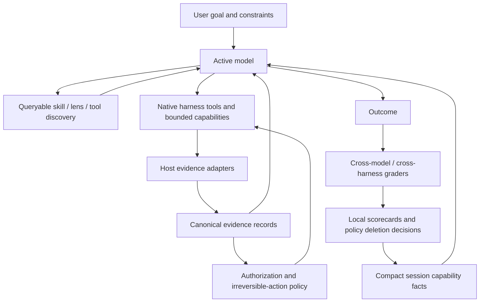

# refactor: Bitter Lesson Engineering Program for Systematic

## Overview

Run a dependency-ordered simplification program that measures where Systematic's opinionated compound-engineering guidance helps, selectively removes policy that obstructs improving models, and preserves the product's useful identity and non-negotiable trust boundaries. Each architecture area receives its own focused child plan before implementation; this document owns the program thesis, audit, sequencing, promotion gates, and deletion criteria.

---

## Problem Frame

Richard Sutton's *The Bitter Lesson* argues that methods built around general search and learning ultimately outperform systems that encode increasingly detailed human knowledge. Human-authored structure often helps immediately, but it tends to plateau, accumulate exceptions, and obstruct methods that can exploit improving computation. The engineering translation for an AI coding harness is not “remove all deterministic code.” It is: keep deterministic mechanisms where the external world requires exactness, and stop encoding our current beliefs about how capable models must think, route, delegate, review, and sequence work.

Systematic currently has strong foundations: runtime skill discovery, shared repository state, generated harness adapters, typed configuration, observable host integration, and evidence-backed operation readback. The audit nevertheless found that these primitives are surrounded by a much larger policy layer:

- mandatory skill invocation based on a one-percent applicability rule;
- fixed brainstorm → plan → work → review choreography;
- dozens of specialized reviewer and workflow personas selected through handcrafted thresholds;
- provider- and model-specific category defaults tied to the current model market;
- large bootstrap catalogs and repeated procedural instructions injected before the model knows whether they matter;
- harness adapters that translate fixed names, fields, and tool mappings rather than publishing structured capability facts;
- a workflow guard whose receipt, parser, attestation, readback, and state machinery proves a fixed workflow protocol rather than offering smaller generic evidence and authorization primitives.

The sharpest symptom is structural. The OpenCode workflow-guard adapter is over 4,000 lines, its core session runtime is roughly 2,400 lines, and the surrounding receipt/readback/classifier stack contains thousands more. Historical fixes around worktree targeting, duplicate registrations, path canonicalization, marker versions, hook mutation, recovery, and readback show that each new handcrafted distinction expands the compatibility surface. The same pattern appears at a smaller scale in prompt workflows, persona catalogs, model defaults, and cross-harness translation.

This program treats every deterministic rule as challengeable, not presumptively wrong. Systematic's opinionated compound-engineering loops are part of its product identity and remain when evidence shows they improve task success, review quality, safety, or operator confidence. A rule is removed only when rule-specific counterexample and ablation evals show that its benefit can be preserved by a simpler mechanism across the supported model and harness cohorts. Authorization, secret isolation, atomic writes, provenance, compatibility, and irreversible side-effect boundaries form the initial minimum safety kernel; a focused child plan may narrow one only after a threat model and adversarial suite prove the replacement.

---

## Bitter Lesson Engineering Rubric

Every retained or introduced mechanism must pass these tests:

1. **Capability, not preference:** does it enable an outcome the model otherwise cannot perform, or merely prescribe how a human expects the model to work?
2. **Outcome, not choreography:** is success judged from observable state rather than a required internal sequence?
3. **Open solution space:** can materially different valid approaches pass?
4. **Scales with models and compute:** does a stronger model gain freedom and performance, or remain trapped behind assumptions made for weaker models?
5. **Search and feedback:** can the model inspect alternatives, act, observe results, and revise?
6. **Measured heuristic:** if a heuristic remains, is its benefit demonstrated by evals and is its cost visible?
7. **Progressive disclosure:** is context loaded when useful rather than injected globally?
8. **Structured evidence:** are capabilities, state, freshness, trust, and failures machine-readable rather than blended into prose?
9. **Narrow safeguard:** does deterministic enforcement correspond to a concrete threat or irreversible action?
10. **Deletability:** can the rule, persona, adapter, or compatibility shim be removed without redesigning the whole system?

Disposition vocabulary used throughout the migration:

- **Keep:** an external contract or trust boundary that remains deterministic.
- **Narrow:** a justified mechanism whose current scope is broader than the risk it controls.
- **Replace:** a handcrafted decision system that should become a capability, eval, search, or feedback loop.
- **Delete:** duplicated, obsolete, or preference-only machinery with no demonstrated outcome benefit.

---

## Current-State Audit

### Scorecard

| Dimension | Audit result | Interpretation |
|---|---:|---|
| Capability discovery | 8/10 | Strong runtime discovery, weakened by static documentation and no unified live diagnostic surface. |
| Context injection | 8/8 categories present | Complete but over-injected; inventory and policy compete with task context. |
| Host/UI visibility | 7/8 action classes | Strong OpenCode/Pi feedback; Claude Code remains more build-time and indirect. |
| Shared authoritative workspace | 4/5 | Source ownership is sound; generated projections create deliberate drift and sync debt. |
| Cross-harness action parity | 8/12 outcomes | Honest gaps exist, but Systematic-specific abstractions encourage lowest-common-denominator ceremony. |
| Primitive-to-policy ratio | 4/13 primitive | Small capability surface surrounded by a substantially larger policy surface. |
| Prompt-native behavior | 6/18 | Most consequential behavior is fixed by code or rigid prompt workflows. |
| Lifecycle completeness | 2/7 entity classes | Discovery is strong; composition and mutation remain packaging- or filesystem-bound. |

### Keep / Narrow / Replace / Delete Inventory

| Area | Current examples | Disposition | Target direction |
|---|---|---|---|
| Authorization and trust | `SECURITY_OVERLAY_FIELDS`, project/user trust precedence, child-session tool isolation | Keep | Schema-owned, explicit trust metadata with the smallest protected field set. |
| Atomic/idempotent writes | harness setup, Pi exports, generated bundles | Keep | Shared generated-projection contract with ownership and drift metadata. |
| Evidence and provenance | repository/worktree snapshots, remote PR/check readback, privacy-safe receipt integrity | Narrow | Generic evidence records independent of a prescribed workflow lifecycle. |
| Workflow guard | epochs, units, required operations, operation parsers, question attestation, progression markers | Replace substantially | Capability/evidence/authorization kernel; model owns workflow selection and sequencing. |
| Shell command classification | command grammar, operation allowlists, command-shape inference | Replace | Observe effects through typed host tools and state snapshots; use a minimal shell-risk boundary only where unavoidable. |
| Bootstrap | full `using-systematic` body, profiles, verbose catalog, usage rules | Replace | Small structured session facts plus queryable discovery handles. |
| Skill invocation policy | mandatory one-percent rule and skill-first routing | Delete | Model may discover and load skills when useful; eval outcomes determine whether guidance helps. |
| Workflow skills | rigid brainstorm/plan/work/review ladders and stopping points | Narrow/replace | Outcome contracts, optional strategy references, and adaptive execution. |
| Persona catalog | fixed reviewer taxonomy and conditional dispatch thresholds | Replace | Fewer generalists plus composable capability/lens descriptors selected dynamically. |
| Model defaults | provider-specific category chains and static rationale | Replace | Inherit-first routing with capability constraints and eval-informed local preferences. |
| Tool translation | fixed OpenCode-to-Pi mappings and namespace translation | Narrow/replace | Runtime capability descriptors and schema-driven projections; fail closed only at execution edges. |
| Ownership detection | description regexes, path-prefix ownership, internal-agent signature strings | Delete/replace | Explicit source IDs, ownership metadata, and host flags. |
| Compatibility shims | marker versions, removed-name lists, legacy read paths | Delete by policy | Time-bounded compatibility with usage evidence and scheduled removal. |
| Content integrity | source-shape bans and duplicated prose rules | Narrow | Validate externally meaningful contracts and generated/runtime parity, not preferred wording. |
| Tests | extensive unit/contract coverage, sparse model-behavior evals | Expand | Outcome eval corpus spanning models, harnesses, cost, latency, safety, and alternative valid strategies. |

---

## Requirements Trace

### Evaluation and adaptability

- R1. Establish a versioned, reproducible eval corpus before simplifying production behavior. It must measure task success, safety, intervention rate, cost, latency, and robustness without requiring one prescribed reasoning trace.
- R2. Run representative evals across multiple model capability tiers and all three supported harnesses; distinguish model failures, harness failures, and adapter failures.
- R3. Record raw task inputs, structured tool events, terminal outcomes, grader evidence, and bounded metadata while excluding secrets and unnecessary user-authored content.
- R4. Every policy removal or routing change must state its baseline, expected gain, regression budget, and rollback condition.
- R33. Every rule proposed for removal must have a rule-specific ablation and counterexample suite that tests both visible task outcome and hidden safety/provenance degradation.
- R25. Every eval run must execute inside a deterministic isolation boundary with a disposable workspace, bounded filesystem scope, explicit environment and network policy, no ambient credentials by default, per-run artifacts, and cleanup/readback evidence.
- R26. Eval and shadow artifacts must follow a defined data-classification, redaction, retention, and sharing policy; redaction failure fails closed before persistence.

### Thin capability kernel

- R5. Publish one structured, source-tagged capability snapshot covering tools, skills, agents/lenses, model availability, workflow protection, config sources, trust level, and freshness.
- R6. Replace global catalog and procedural bootstrap text with progressive discovery; initial context must contain only stable facts needed for the current session.
- R7. Keep deterministic code limited to capability execution, authorization, evidence collection, atomic projection, compatibility, and externally enforced invariants.
- R8. Unsupported capabilities must be explicit and queryable, with native-harness fallbacks preferred over Systematic emulation.
- R34. OpenCode, Pi, and Claude Code must preserve one minimum user-visible contract for core workflows: the same intended outcome, approval boundary, evidence meaning, unsupported-state semantics, and failure visibility, even when native mechanisms differ.

### Model-owned workflow

- R9. Replace mandatory skill invocation and fixed workflow phases with outcome-oriented task contracts. The model may choose direct action, skills, delegation, search, and review according to task evidence.
- R10. Preserve user approval for irreversible public, destructive, security-sensitive, or cost-bearing actions without requiring a specific internal planning ceremony.
- R11. Skills must become optional strategy modules whose value can be independently evaluated and whose full instructions load only on demand.
- R35. Systematic retains opinionated compound-engineering guidance wherever cohort evals show it improves user outcomes; “thin” and “generic” are not independent product goals.
- R12. Persona selection must move from fixed names and thresholds toward composable capabilities/lenses with a small compatibility layer for existing public agent names.

### Model and harness evolution

- R13. Default model behavior must inherit the user's active model unless an explicit user policy or eval-backed capability requirement justifies an override.
- R14. No production source list may assume a closed provider or model catalog. Availability and capability facts must come from the host or user configuration.
- R15. Harness adapters must project one canonical capability/evidence schema and preserve native strengths instead of enforcing artificial parity.
- R16. Generated Pi and Claude Code artifacts must expose source identity, generation version, freshness, and ownership so drift is observable and repairable.

### Evidence and enforcement

- R17. Replace workflow-specific receipt progression with generic evidence assertions: what changed, which host observed it, what authorization applied, and how fresh the observation is.
- R18. Models and prompts cannot mint trusted evidence or expand authorization. Deterministic host adapters remain the authority for side effects and user approvals.
- R19. Evidence checks must validate outcomes rather than command spelling wherever the host can observe the resulting state.
- R20. Workflow protection must degrade by capability: unavailable evidence blocks only the protected transition that needs it, not unrelated work or the whole session.
- R27. Trusted evidence must be issued by deterministic host adapters and structurally bound to its issuer, host/adapter identity, subject, observation method, source snapshot, session/run, freshness, and verification result. Model prose may reference evidence but cannot create it.
- R28. Approval for a protected action must bind to the exact action, resource, repository/workspace/commit snapshot, actor/session, host channel, expiry, and single-use consumption; execution revalidates the binding against current state.
- R29. Every evidence predicate must declare its invalidation inputs and freshness rule. Mutable-state transitions perform final readback or exact subject comparison immediately before execution.
- R30. Each harness must publish a deterministic degradation matrix mapping unavailable observation/approval capabilities to allowed work, blocked predicates, and recovery paths.

### Deletion and operational discipline

- R21. Compatibility code must have an owner, usage signal, removal version/date, and test proving the legacy path; unmeasured indefinite shims are prohibited.
- R22. Documentation, registry profiles, bootstrap text, and generated bundles must derive counts and capability claims from one authoritative source.
- R23. The migration must preserve clean rollback points and allow old and new behavior to run in shadow or comparison mode before deletion.
- R24. The final architecture must materially reduce prompt tokens, fixed persona count, policy-bearing code, workflow-guard complexity, and model/provider literals while meeting the eval regression budget.
- R31. Every migration phase must define versioned state, old/new authority, clean-install and upgrade behavior, rollback behavior, generated-artifact ownership, and mixed-version rejection rules.
- R32. Every behavior-changing subsystem must run behind a documented shadow/opt-in/default-on gate lifecycle; shadow output remains local and non-authoritative until explicit promotion evidence exists.
- R36. No more than two behavior-changing migration surfaces may be active simultaneously. Each child plan must close or freeze its compatibility obligations before the program opens another surface beyond that cap.

---

## Scope Boundaries

- This program audits the entire Systematic product: OpenCode runtime, Pi extension/export, Claude Code bundle, CLI, configuration, skills, agents, registry profiles, tests/evals, CI/build scripts, documentation, and the workflow guard.
- This artifact is not directly implementable and does not authorize a repository-wide rewrite. Each initiative below requires a focused child plan grounded against then-current code, exact interfaces, threat boundaries, migration mechanics, tests, and release scope.
- At most two behavior-changing initiatives may be active concurrently. Measurement and read-only diagnostics do not count toward the cap; shadow implementations do.
- Existing public skill and agent names may remain as temporary aliases, but they cannot dictate the target architecture.
- Security boundaries are not automatically preserved in their current form. They are re-derived from threats and external invariants, then reduced to the smallest mechanism that enforces them.
- Model prompts are not trusted as enforcement. Better models receive broader decision freedom only inside deterministic authorization and evidence boundaries.
- Config authority remains explicit: user/custom security policy overrides project policy; project config cannot set or widen `model`, `variant`, `skills`, or `permission`; generated projections cannot become a higher-trust config source.
- The eval system must remain local/self-hostable by default. Versioned local eval fixtures and redacted run artifacts are not product telemetry; no automatic external transmission or collection is introduced.
- Adding production dependencies, changing release/CI workflows, or changing the default protection mode remains separately approval-gated during implementation.

### Deferred to Separate Tasks

- Training or fine-tuning a routing model: defer until the local eval corpus proves that a learned router would outperform direct model choice or simple capability constraints.
- Automatic model escalation from eval scorecards: defer until inherit-first routing and capability incompatibility detection are proven. Any future escalation requires separate approval, explicit user opt-in, freshness, cost/latency limits, and a visible reason.
- Organization-wide shared eval infrastructure: defer until the repository-local runner and schema stabilize.
- Support for additional harnesses: defer until the canonical capability schema and adapter conformance suite are proven on OpenCode, Pi, and Claude Code.
- Durable cloud audit storage: defer; the default remains local, bounded, and privacy-minimized.

---

## Context & Research

### Relevant Code and Patterns

- `src/index.ts` and `src/pi.ts` are the runtime composition roots. They should become thin adapters over canonical capabilities rather than policy aggregators.
- `src/lib/bootstrap.ts` mixes marker management, full workflow policy, profiles, and catalogs. Its marker/idempotency behavior is useful; its payload should shrink radically.
- `src/lib/skill-catalog.ts`, `src/lib/discovered-skills.ts`, `src/lib/agents.ts`, and `src/lib/agent-resolver.ts` already provide the discovery substrate needed for progressive disclosure.
- `src/lib/source-model-defaults.ts` and `src/lib/model-availability.ts` demonstrate the current split between adaptive availability discovery and static human-authored routing.
- `src/lib/config.ts`, `src/lib/config-schema.ts`, and `src/lib/config-handler.ts` contain both justified trust boundaries and heuristic ownership/projection policy.
- `src/lib/workflow-guard.ts`, `src/lib/opencode-workflow-guard.ts`, `src/lib/receipt-ledger.ts`, `src/lib/receipt-readback.ts`, `src/lib/receipt-classifier.ts`, `src/lib/opencode-operation-observer.ts`, and `src/lib/question-attestation.ts` form the current evidence and enforcement control plane.
- `scripts/build-claude-code-plugin.ts`, `src/lib/pi-subagents-export.ts`, and `registry/` are generated-projection precedents; their source-owned output and drift checks should generalize into one projection contract.
- `tests/integration/opencode.test.ts`, `tests/integration/pi.test.ts`, and `tests/integration/claude-code.test.ts` provide real or packaged harness seams but do not yet form a cross-model outcome eval platform.

### Institutional Learnings

- `docs/solutions/best-practices/content-integrity-mirror-runtime-drop-rules-2026-05-17.md` establishes that validation must mirror runtime semantics rather than check an idealized source shape.
- `docs/solutions/best-practices/cross-harness-adapter-parity-contract-tests-2026-07-14.md` establishes that shared-core tests do not prove adapter parity.
- `docs/solutions/workflow-issues/verify-installed-artifacts-not-just-build-gates-2026-07-18.md` establishes that source correctness does not prove installed runtime correctness.
- `docs/solutions/logic-errors/pi-chained-bootstrap-composition-2026-07-14.md` demonstrates the fragility of prompt composition and the need to preserve foreign host context.
- `docs/solutions/integration-issues/opencode-plugin-hook-silent-defect-swallow-2026-05-19.md` shows why host-hook observability must be explicit.
- `docs/plans/2026-07-21-002-test-receipt-workflow-capabilities-plan.md` and the receipt integration tests establish the correct anti-vibes posture: real-host observations, bounded evidence, and explicit unsupported states.
- The #743/#746 incident chain demonstrates the cost of reasoning over transformed command text across plugin boundaries. Path normalization, hook argument mutation, duplicate registrations, cached plugin versions, and worktree registration all became independent confounders around one operation fingerprint.

### External References

- Richard Sutton, [The Bitter Lesson](http://www.incompleteideas.net/IncIdeas/BitterLesson.html), 2019 — general methods that scale through search and learning outperform accumulated human domain encoding.
- Anthropic, [Demystifying evals for AI agents](https://www.anthropic.com/engineering/demystifying-evals-for-ai-agents) — outcome-oriented agent evals, multiple graders, transcript inspection, and eval maintenance.
- OpenAI, [Evals](https://github.com/openai/evals) and [evaluation guidance](https://developers.openai.com/api/docs/guides/evals) — structured regression, model comparison, and continuous evaluation.
- Google Research, [Towards a science of scaling agent systems](https://research.google/blog/towards-a-science-of-scaling-agent-systems-when-and-why-agent-systems-work/) — orchestration benefit depends on task decomposability, tool density, and coordination cost rather than a universal multi-agent advantage.

---

## Key Technical Decisions

- KTD-1 — **Evals precede simplification.** Existing rules are not retained because they feel safe, and they are not deleted because they feel overengineered. Shadow comparisons establish whether each rule improves outcomes, reduces risk, or merely constrains solution space.
- KTD-1a — **Ablate rules, not just systems.** A candidate architecture cannot earn deletion through aggregate green scores alone. Every removed rule needs counterexamples that detect equal visible output with weaker provenance, authorization, recovery, or safety margin.
- KTD-2 — **One canonical capability schema.** Runtime facts, not prose conventions, describe available tools, skills, lenses, models, guard capabilities, config sources, trust, ownership, and freshness. Harness-specific adapters project this schema into native mechanisms.
- KTD-2a — **The capability schema is descriptive, not prescriptive.** It may expose host affordances, invocation handles, availability, provenance, trust, freshness, and limits. It cannot encode routing thresholds, required workflow sequences, preferred skill order, persona-selection policy, or provider/model preference. Avoid one recursive “everything manifest”; every field must name its consumer and failure consequence.
- KTD-3 — **The model owns reversible workflow decisions.** Search order, skill use, delegation, planning depth, reviewer selection, and iteration strategy are model choices. Deterministic code owns only authorization, evidence, compatibility, and irreversible side-effect boundaries.
- KTD-4 — **Outcome contracts replace phase scripts.** Core workflows state goals, required evidence, user gates, and terminal conditions. Strategy references may suggest tactics but cannot require one trace unless the trace itself is externally required.
- KTD-5 — **Progressive disclosure replaces bootstrap completeness.** Session start carries a compact capability summary and discovery handles. Full catalogs, skills, profiles, and historical guidance load only when requested or task-relevant.
- KTD-6 — **Generalists plus lenses replace persona proliferation.** Lenses are small review perspectives or constraints, not autonomous personas or runtime routing rules by default. A small set of execution/research/review capabilities may compose security, correctness, product, performance, design, and other lenses. Dispatch remains a model decision unless permissions, isolation, or concurrency change the execution boundary. Compatibility aliases map old persona names during migration.
- KTD-7 — **Model inheritance is the default and only baseline router.** Static provider/model chains are deleted. Explicit user policy wins; otherwise the active model handles the task. Eval scorecards may inform local diagnostics or opt-in recommendations but cannot silently override the invoking model.
- KTD-8 — **Evidence and authorization are separate.** Evidence records describe host-observed facts such as workspace deltas, passing checks, commits, pushes, and PR state. Authorization records describe user/host permission for an exact risky action and snapshot. A policy check may require both, but neither subsystem owns workflow phases or the other's lifecycle.
- KTD-9 — **Effects beat command parsing.** Typed tools and post-action state observations are preferred. Shell parsing remains only as a narrow risk classifier where the host provides no safer execution boundary; it is not the primary source of operation truth.
- KTD-10 — **Native harness strengths remain native.** Systematic does not emulate background tasks, blocking questions, task lists, or workflow controls solely to make all harnesses look alike. The canonical schema reports capabilities and honest fallbacks.
- KTD-10a — **One minimum user contract remains portable.** Core workflows keep equivalent outcomes, approval semantics, evidence meaning, unsupported-state behavior, and visible failure across OpenCode, Pi, and Claude Code. Native mechanisms may differ; trust meaning may not silently drift.
- KTD-11 — **Generated projections carry provenance.** Every generated profile, persona export, or plugin bundle declares its source identity, generation version, ownership, and freshness. User-owned content remains separate.
- KTD-11a — **Generated output is never source authority.** Projection manifests bind source identity, generator identity/version, content digest, ownership, and freshness. Installers and rollback paths verify those bindings and reject stale, tampered, or ambiguous mixed-version output.
- KTD-12 — **Compatibility expires.** Aliases, marker readers, namespace translations, and legacy config paths require measured use and an explicit removal release. Absence of evidence is not a reason to keep them forever.
- KTD-13 — **Replacement and deletion travel together.** Each behavior-changing initiative names the legacy surface it narrows or removes, its comparison window, promotion gate, and rollback. I8 completes compatibility cleanup; it is not the first deletion phase.
- KTD-14 — **This is a program, not a mega-implementation.** The initiatives below define dependencies and child-plan acceptance. No initiative starts implementation from this document alone, and no more than two behavior-changing surfaces run concurrently.

---

## High-Level Technical Design

> This illustrates the intended approach and is directional guidance for review, not implementation specification.

The target has four layers:

1. **Capability layer:** discovers and executes native tools, skills, lenses, config, and generated projections.
2. **Evidence layer:** observes side effects and external state without assuming a Systematic workflow.
3. **Authorization layer:** enforces user, repository, and host trust boundaries for risky transitions.
4. **Evaluation layer:** compares outcomes across models, harnesses, strategies, and policy variants.

Prompt workflows become optional policy packages above these layers, not the control plane beneath them.

---

## Acceptance Examples

- A strong model receives a coding task, inspects capabilities, chooses a direct execution path without loading `ce:work`, passes the same behavior and safety evals, and is not penalized for skipping the historical phase sequence.
- A weaker model chooses a planning or TDD strategy skill, uses more steps, and succeeds against the same outcome graders. Both traces are valid.
- A user upgrades or changes providers. Systematic inherits the active model without requiring a source release that edits provider literals.
- A security-sensitive change triggers an authorization requirement because of the affected action/resource, not because a named workflow happened to be active.
- A write performed through a typed edit tool produces workspace-delta evidence. An equivalent safe write through another host-native tool can produce the same evidence without adding another command-shape allowlist entry.
- A shell command succeeds but causes no relevant state change. It cannot satisfy an outcome requiring a changed workspace, commit, push, or PR.
- OpenCode supports rich background delegation while Pi supports only sequential delegation. Each model sees the native capability truth and can still satisfy the same task-level eval.
- Claude Code loads a generated plugin whose provenance and source version are queryable; drift from the source bundle fails conformance even if the build itself succeeds.
- A removed reviewer persona name resolves through a compatibility alias during the migration, emits a deprecation signal, and maps to a general reviewer plus the equivalent lens.
- A legacy receipt marker is observed after its supported window. The system reports the required upgrade/readback path rather than carrying another indefinite parser branch.
- A bootstrap without a full skill catalog remains sufficient because the model can query discovery. Measured task success stays within the regression budget while prompt tokens materially decrease.
- A new model materially outperforms the current preferred workflow using an unexpected strategy. The eval accepts the outcome and provides evidence to delete or narrow the obsolete policy.

---

## Phased Delivery

### Phase 1 — Measure and expose

Create focused child plans for the eval foundation and read-only capability diagnostic. Ship only measurement and introspection in this phase; default runtime behavior remains unchanged.

### Phase 2 — Selectively simplify product policy

Use evidence from Phase 1 to choose narrow wedges in bootstrap, workflow guidance, personas, and model inheritance. Preserve opinionated guidance where it improves user outcomes. No more than two behavior-changing wedges run concurrently.

### Phase 3 — Revisit adapters and trust machinery

Create separate child plans for generated adapters and for evidence/authorization only if earlier measurements show those migrations are warranted. OpenCode remains the first comparison host; Pi and Claude Code follow only after the minimum cross-harness user contract is proven.

### Phase 4 — Complete proven deletions

Complete compatibility removals already started by earlier initiatives. Phase 4 is not the first deletion point and does not reopen unresolved migrations.

### Shadow / comparison mode contract

- Legacy behavior remains authoritative until the candidate subsystem passes its promotion gate.
- Each comparison record is local and versioned and identifies the subsystem, harness, install mode, source/package identity, old result, candidate result, equivalence classification, redacted evidence pointer, and timestamp.
- Allowed classifications are equivalent, safer, less safe, intentional behavior change, unsupported, and error. Unclassified drift is a release blocker.
- Shadow execution cannot mint authoritative evidence, consume approvals, mutate generated ownership state, or affect the user-visible outcome.
- Every subsystem gate declares owner, supported harnesses, current default, evidence location, promotion criteria, rollback action, and removal release/date.

### Install, release, and rollback contract

Every migration release verifies source checkout, packed and installed npm artifacts, generated Pi exports, generated Claude Code bundles, and registry outputs across clean install, upgrade from latest stable, upgrade from the previous migration release, and rollback to latest stable where the surface applies.

The release evidence packet includes source/package identity, gate defaults, compatibility-ledger changes, eval comparison, safety results, clean/upgrade/rollback results, generated provenance, unsupported capabilities, privacy confirmation, and deletion candidates. New local state is versioned; old runtimes ignore or explicitly reject unknown evidence rather than misinterpreting it. Rollback never requires deleting or overwriting user-owned files.

### Compatibility deletion entry criteria

A compatibility path may be deleted only after its replacement and deprecation have shipped in stable releases; clean installs no longer depend on it; supported upgrades migrate or fail clearly; generated artifacts and docs no longer emit it; rollback remains documented; and local/operator evidence supports deletion. Unknown usage requires either more evidence or an explicit major-release breaking decision—it is not silently treated as zero.

---

## Program Initiative Contract

The sections below are architecture initiatives, not implementation-ready units. Before implementation, each initiative must produce and pass review on a focused child plan that defines:

- the verified user or operator pain and the do-nothing baseline;
- the exact current interfaces, call sites, generated surfaces, and trust boundaries involved;
- a narrow first wedge, paired deletion or narrowing slice, and explicit non-goals;
- baseline and candidate eval cases, including rule-specific ablations and counterexamples;
- the authoritative old/new behavior, gate lifecycle, compatibility window, and rollback mechanics;
- clean-install, upgrade, installed-artifact, and harness-specific verification where applicable;
- privacy classification, evidence provenance, and degraded-capability behavior when trust data is involved;
- a release evidence packet and stop condition.

An initiative cannot enter implementation while two other behavior-changing surfaces are active. If a compatibility obligation misses its removal deadline, the program either makes an explicit major-version breaking decision or freezes it as supported debt; it does not extend an indefinite proof loop.

---

## Program Initiatives

### I1. Establish the outcome-evaluation foundation

- [ ] **Goal:** Create the measurement system that decides which current rules help and which obstruct model improvement.
- **Requirements:** R1-R4, R23-R26, R33, R36.
- **Dependencies:** None.
- **Files:**
  - Create: `evals/` with versioned task cases, fixtures, graders, model/harness matrices, and result schemas.
  - Create: `scripts/run-evals.ts` and focused eval support modules under `scripts/lib/` or `src/lib/` according to runtime ownership.
  - Modify: `package.json` scripts only after approval if new named commands are needed.
  - Extend: `tests/integration/` harness fixtures for deterministic replay and installed-artifact execution.
  - Create: `docs/src/content/docs/guides/evaluations.mdx`.
  - Modify: `HARNESSES.md` evidence expectations.
- **Approach:**
  - Run each case in a fresh disposable worktree or temporary repository with bounded filesystem scope, an explicit environment allowlist, controlled network access, no ambient credentials by default, separate artifacts, and mandatory cleanup/readback. Cases needing credentials receive explicit scoped fixtures.
  - Define outcome cases spanning atomic edits, ambiguous bugs, broad refactors, research, planning, review, worktrees, delegation, recovery, public-action approval, and adversarial prompt content.
  - Separate deterministic graders (tests, diffs, file state, git/GitHub state, policy violations) from rubric graders (quality, maintainability, plan usefulness). Use multiple graders where subjective assessment is unavoidable.
  - Record strategy-neutral transcripts and tool events so alternative successful traces remain valid.
  - Add A/B variants for current policy, thinner policy, and no-policy baselines. Report confidence intervals or repeated-run variance rather than treating one run as truth.
  - Define prohibited, fixture-only, derived-only, and allowed-by-default artifact fields. Apply deterministic redaction before persistence, document retention, and fail closed if redaction cannot complete. Raw output, absolute paths, repository content, and user prose are not persisted unless the versioned case explicitly owns them.
  - Establish regression budgets per task class instead of one global score; safety-critical cases remain zero-tolerance.
- **Patterns to follow:** existing isolated OpenCode/Pi/Claude fixtures, receipt real-host tests, installed-artifact verification learning.
- **Test scenarios:**
  - Happy path: the same case runs against at least two models and two harnesses and produces comparable structured results.
  - Alternative strategy: two different valid traces receive equivalent success credit.
  - Grader disagreement: deterministic and rubric graders disagree without silently collapsing to pass/fail.
  - Privacy: injected secrets and user-authored prose do not appear in persisted eval artifacts beyond approved fixtures.
  - Reproducibility: pinned case/version/model configuration can be rerun and compared.
  - Isolation: an attempted out-of-workspace write or undeclared credential access fails the case and leaves the primary checkout unchanged.
  - Crash cleanup: an interrupted case records cleanup status and cannot contaminate the next run.
- **Child-plan entry gate:** specify the repository entrypoint, runner ownership, installed-artifact selection, harness setup/teardown, artifact schema, access/retention rules, and cost envelope before implementation.
- **Verification:** current Systematic behavior has a local baseline; policy changes cannot proceed without a linked eval delta. This initiative is its own implementation program and may ship incrementally rather than blocking harmless read-only diagnostics.

### I2. Introduce a read-only capability snapshot, then test progressive discovery

- [ ] **Goal:** Give models concise, structured, current facts and move large catalogs/policies out of global context.
- **Requirements:** R5-R8, R15, R22-R24, R31-R32, R34, R36.
- **Dependencies:** A minimal I1 harness establishes token/discovery baselines. The read-only diagnostic may ship before the full corpus; behavior-changing progressive disclosure waits for representative eval evidence.
- **Files:**
  - Create: `src/lib/capability-schema.ts` and `src/lib/capability-snapshot.ts`.
  - Modify: `src/lib/bootstrap.ts`, `src/lib/skill-catalog.ts`, `src/lib/discovered-skills.ts`, `src/lib/agent-resolver.ts`, `src/index.ts`, `src/pi.ts`.
  - Modify: `scripts/build-claude-code-plugin.ts` to emit the same fact model through native Claude Code surfaces.
  - Modify: `src/cli.ts` with a live capability/diagnostic view and “why unavailable” explanations.
  - Test: new capability schema/snapshot tests plus all harness integration suites.
- **Approach:**
  - First ship a read-only snapshot and CLI diagnostic with no routing or bootstrap behavior change. Then gate progressive disclosure separately.
  - Keep the schema small and descriptive. Separate capability, source, availability, trust boundary, and projection facts rather than creating a recursive universal manifest. Every field names its runtime consumer and consequence if stale or wrong.
  - Represent each capability with stable ID, kind, source, native binding, trust level, freshness, availability, limitations, and discovery handle; do not include activation thresholds, preferred order, model/provider recommendations, or workflow sequences.
  - Keep session-start content declarative and small. Include only harness identity, high-level capability classes, safety/approval boundaries, and how to query details.
  - Remove verbose skill/agent catalogs from bootstrap once evals prove query-based discovery works.
  - Generate documentation counts and profile inventories from the same schema.
  - Replace internal-agent prompt signatures, description-based ownership, and path-prefix ownership heuristics with explicit host/source metadata where available; report unsupported host metadata honestly.
  - Keep the current bootstrap authoritative while the read-only snapshot ships. A focused child plan must name the first OpenCode/Pi consumer, marker coexistence behavior, Claude Code projection path, and the exact payload section removed at promotion.
- **Test scenarios:**
  - Freshness: model/provider/tool changes update the snapshot without a source edit.
  - Discovery: disabled, missing, invalid, unsupported, and available entries are distinguishable.
  - Token budget: bootstrap size falls materially while outcome scores stay within budget.
  - Duplicate registration: multiple sources retain explicit identities without prompt sniffing.
  - Cross-harness: the same canonical fact has a native projection or explicit unsupported result in each harness.
  - Paired deletion: after query-based discovery passes its gate, remove at least one verbose bootstrap catalog section rather than maintaining a full duplicate path.
- **Child-plan entry gate:** define the minimal schema fields and their consumers, bootstrap coexistence sequence, cross-harness minimum contract, generated-projection versioning, and first paired deletion.
- **Verification:** one diagnostic surface explains the active harness, config sources, discovered assets, available models, protection capabilities, and projection freshness; the first promoted discovery slice deletes its superseded bootstrap payload.

### I3. Test outcome contracts on one workflow family

- [ ] **Goal:** Let models choose how much process they need while preserving user constraints, evidence requirements, and irreversible-action gates.
- **Requirements:** R9-R11, R24, R33, R35-R36.
- **Dependencies:** I1 baselines and I2 progressive discovery.
- **Files:**
  - Candidate scope only: choose one workflow family from `skills/ce-work/SKILL.md`, `skills/ce-plan/SKILL.md`, `skills/ce-review/SKILL.md`, or `skills/test-driven-development/SKILL.md` in the child plan. Do not rewrite all core skills in one release.
  - Treat `skills/using-systematic/SKILL.md` and `skills/orchestrating-subagents/SKILL.md` as separate follow-on surfaces unless the selected wedge requires a narrowly scoped compatibility edit.
  - Review and rationalize: remaining skill definitions under `skills/` and their references.
  - Modify: `scripts/content-integrity.ts` to enforce outcome/safety metadata and source references rather than wording bans.
  - Update: generated docs and registry artifacts.
  - Test: skill loading, content integrity, harness payload, and eval comparisons.
- **Approach:**
  - Define a compact contract for each skill: intended outcomes, entry signals, required evidence, user gates, failure/stop conditions, and optional strategy references.
  - Delete mandatory skill invocation, one-percent applicability, unconditional planning/review/TDD, fixed stopping-point choreography, and harness-specific syntax from global instructions.
  - Keep strict requirements only where skipping them creates an externally demonstrated risk. Encode those requirements in deterministic checks when possible.
  - Move detailed tactics into short references the model can load selectively.
  - Compare current and compact variants across weak and strong models; preserve guidance that measurably helps weaker models without constraining stronger ones by making it optional or capability-tiered.
  - Pair the first promoted contract with deletion of the mandatory one-percent skill-invocation rule; do not retain it as a hidden compatibility default.
- **Test scenarios:**
  - Direct path: an atomic change completes safely without loading a workflow skill.
  - Assisted path: a complex change loads planning/TDD/review guidance and benefits measurably.
  - Strong-model path: a valid unanticipated workflow passes all outcome graders.
  - User-gate path: public/destructive action still pauses for explicit approval independent of workflow choice.
  - Portability: no skill assumes an unavailable harness mechanism.
- **Child-plan entry gate:** identify the first workflow family, measured user pain, weak/strong-model cohorts, fallback guidance for high-risk tasks, and the exact rule removed or narrowed.
- **Verification:** the selected workflow's token footprint and mandatory procedural rules decrease materially with no safety regression and an improved or neutral task-success frontier. Broader skill migration requires another reviewed child plan.

### I4. Collapse one redundant persona cluster before considering lenses

- [ ] **Goal:** Preserve specialized scrutiny without hardcoding dozens of permanent agent identities and dispatch thresholds.
- **Requirements:** R5, R9, R12, R15, R24, R33, R35-R36.
- **Dependencies:** I1 evals and I2 capability schema.
- **Files:**
  - Create: canonical lens/capability metadata under `agents/` or a generated manifest owned by source content.
  - Modify: `src/lib/agents.ts`, `src/lib/agent-resolver.ts`, `src/lib/agent-overlays.ts`, `src/lib/config-handler.ts`, `src/lib/pi-delegate-tool.ts`.
  - Rationalize: `agents/review/`, `agents/document-review/`, `agents/workflow/`, `agents/research/`, and `agents/design/`.
  - Modify: registry generation, Pi export, and Claude Code flattening.
  - Test: compatibility aliases, lens composition, dynamic selection, and review eval coverage.
- **Approach:**
  - Start by identifying and collapsing one cluster whose members differ only by prose framing. Do not introduce a general lens runtime merely to rename today's persona router.
  - Only if the cluster eval demonstrates a real need, define a small set of execution modes such as explore, implement, research, review, and design, then test compact review perspectives such as correctness or security.
  - Store lenses as small prompt fragments and descriptive metadata: stable ID, purpose, required permissions, incompatibilities, and evidence expectations. Production metadata contains no default activation thresholds.
  - Let the active model discover and select lenses from task evidence. Threshold and router experiments live only in eval configuration unless a later plan proves a narrow optional hint.
  - Keep old public names as generated aliases for one major-version window; measure use and publish mappings.
  - Collapse personas whose only distinction is prose framing and retain separate agents only where tool permissions or execution environments genuinely differ.
  - Allow a single capable model to apply multiple lenses serially when multi-agent coordination does not improve eval outcomes.
- **Test scenarios:**
  - Review recall: composed lenses find the same or more seeded defects than the current persona swarm with acceptable false positives.
  - Coordination cost: simple diffs avoid unnecessary multi-agent dispatch.
  - Compatibility: old names resolve to equivalent capabilities during the migration window.
  - Permission boundary: design/write-capable and read-only review capabilities remain distinct where needed.
  - Unknown lens: fail with a discoverable explanation, not a fixed translation-table crash.
  - No-router regression: strong-model cohorts remain within review budget when all automatic lens routing is disabled.
  - Paired deletion: collapse at least one redundant persona cluster into temporary aliases during this unit.
- **Child-plan entry gate:** name the exact cluster, compatibility aliases, seeded defects, permission distinctions, coordination baseline, and proof that a new lens abstraction pays rent.
- **Verification:** fewer canonical personas, no loss of review coverage, and lower median coordination cost on evals. A general lens system is optional follow-on work, not the default result.

### I5. Remove one static model-routing assumption at a time

- [ ] **Goal:** Make Systematic improve automatically as users adopt better models instead of pinning tasks to the model market of August 2026.
- **Requirements:** R2, R4, R13-R14, R24, R31-R33, R36.
- **Dependencies:** I1 eval scorecards and I2 capability snapshot.
- **Files:**
  - Retire or radically narrow: `src/lib/source-model-defaults.ts`.
  - Modify: `src/lib/model-availability.ts`, `src/lib/config-handler.ts`, `src/lib/agent-overlays.ts`, `src/lib/config-schema.ts`.
  - Modify: generated configuration docs and OMO/standalone registry profiles.
  - Modify: bundled skill dispatch references (`skills/*/SKILL.md`, persona catalogs) so every named agent resolves to a registered dispatch key.
  - Test: model inheritance, explicit user overrides, unavailable capability handling, eval-backed optional escalation, and workflow dispatch resolution.
- **Approach:**
  - Default every bundled agent/capability to the invoking model.
  - Preserve explicit user configuration as the only unconditional model override.
  - Describe task needs as capabilities or constraints such as context size, tool use, vision, cost ceiling, latency preference, and reasoning strength, without naming a provider in the canonical policy.
  - Do not implement automatic escalation in this migration. Capability incompatibility may explain why the active model cannot perform a task, but changing models remains explicit user policy.
  - Remove provider frequency lore and hardcoded provider unions from runtime policy; validate identifiers structurally rather than against a closed commercial catalog.
  - Remove fallback-to-first-provider behavior as the first deletion slice; unknown availability inherits rather than guesses.
  - Bind every workflow-dispatched agent to a resolvable dispatch key. Config-owned model policy only takes effect if the identifier a skill names is the identifier the harness can dispatch, and today it usually is not. Three failure modes, all silent: 99 references across bundled skills use the qualified `systematic:<category>:<name>` form while the OpenCode config hook registers bare names (`src/lib/config-handler.ts:217`); `ce:compound` Phase 1 names roles in prose ("Context Analyzer", "Solution Extractor", "Related Docs Finder") with no agent binding at all; and `ce:review`/`ce:ideate` instruct a `model:` parameter that OpenCode's `task` tool does not accept. Each one ends the same way — the orchestrator substitutes or falls back, the substitute runs the session default, and per-agent and per-category assignments in `systematic.jsonc` never apply. Exactly one skill dispatches correctly today (`skills/ce-work/SKILL.md:148`). See issue #784, which covers the qualified-name and `model:`-parameter modes; the unbound-prose mode is newly identified. The identity mechanism is I6's `stable IDs and reversible aliases` work — this wedge only requires that named agents resolve, not that the namespace be unified.
- **Test scenarios:**
  - New provider/model: becomes usable without a Systematic release.
  - Active-model improvement: stronger invoking model receives full workflow freedom rather than being downgraded by category defaults.
  - User override: remains authoritative and trust-protected.
  - Unknown availability: inherits safely instead of guessing a model.
  - Scorecard drift: stale eval data is visible and cannot silently route.
  - Workflow dispatch: every agent a bundled skill names resolves to a registered dispatch key, and the model that runs is the one the user's config assigns to that agent — not the session default reached by substitution or fallback.
- **Child-plan entry gate:** inventory each current default's consumer and fallback behavior, select one deletion wedge, and define config precedence and rollback without introducing scorecard-driven routing. For the dispatch-binding wedge, additionally inventory every dispatch reference in bundled skills and classify each as resolvable, qualified-unresolvable, or unbound prose.
- **Verification:** each promoted wedge removes a source-owned market assumption without reducing task success or overriding explicit user policy. Final zero-literal cleanup is a later deletion decision.

### I6. Unify generated projection facts without flattening native behavior

- [ ] **Goal:** Reduce translation policy and generated drift while preserving each host's native capabilities.
- **Requirements:** R5-R8, R14-R16, R22-R24, R31-R32, R34, R36.
- **Dependencies:** I2 canonical schema; promoted slices from I3/I4/I5 only where they change projected content.
- **Files:**
  - Modify: `src/index.ts`, `src/pi.ts`, `src/lib/config-handler.ts`, `src/lib/agent-resolver.ts`, `src/lib/pi-subagents-export.ts`, `scripts/build-claude-code-plugin.ts`.
  - Consolidate: harness profile and registry generation inputs.
  - Modify: `HARNESSES.md`, installation/configuration guides, registry docs.
  - Test: direct adapter conformance comparisons and installed-artifact scenarios.
- **Approach:**
  - Define an adapter contract that accepts canonical capabilities/content and returns native bindings, unsupported facts, provenance, and drift state.
  - Discover host tools and supported fields at runtime or build time where authoritative schemas exist; keep narrow fail-closed fallbacks for unknown execution capabilities.
  - Stop flattening identity unless a host requires it. When flattening is required, generate stable IDs and reversible aliases rather than relying on filename stems or namespace string surgery.
  - Unify generated-artifact ownership semantics across Pi exports, Claude Code bundles, and registry profiles.
  - Generated artifacts are non-authoritative projections. Their manifests bind source identity, generator version, content digest, ownership, and freshness; installs reject ambiguous mixed versions rather than inferring precedence.
  - Preserve direct boundary tests for each adapter; do not infer parity from shared-core tests.
- **Test scenarios:**
  - Host adds a tool or field: discovery exposes it without a hardcoded translation-table edit where the host schema permits.
  - Host removes or changes a field: adapter reports incompatibility with source/freshness context.
  - Generated artifact drift: detected before publication and explainable to operators.
  - User-owned output: never overwritten by projection refresh.
  - Mixed installation sources: ownership and precedence remain explicit.
- **Child-plan entry gate:** specify per-artifact versioning, source/generated authority, tamper/staleness validation, clean/upgrade/rollback installation paths, and mixed-install rejection behavior.
- **Verification:** adapters contain binding code rather than workflow policy; every capability has conformance evidence or an explicit unsupported status.

### I7. Threat-model and narrow workflow protection before any replacement

- [ ] **Goal:** Preserve trustworthy operation evidence while deleting the assumption that Systematic must prescribe and attest one development workflow.
- **Requirements:** R7, R10, R17-R20, R23-R24, R27-R32, R33-R34, R36.
- **Dependencies:** I1 evidence evals, I2 capability schema, and I6 adapter contract.
- **Files:**
  - Candidate only after child-plan approval: separate evidence-record, authorization-boundary, and thin host-adapter modules under `src/lib/`.
  - Refactor or retire: `src/lib/workflow-guard.ts`, `src/lib/opencode-workflow-guard.ts`, `src/lib/receipt-ledger.ts`, `src/lib/receipt-readback.ts`, `src/lib/receipt-classifier.ts`, `src/lib/question-attestation.ts`.
  - Reuse narrowly: `src/lib/opencode-operation-observer.ts` state observation and remote readback primitives.
  - Modify: `src/index.ts`, config schema/loading, capability snapshot, and workflow tools.
  - Replace/extend: receipt unit/integration tests with generic evidence, authorization, replay, privacy, and real-host cases.
- **Approach:**
  - Define evidence as adapter-issued host observations with type, issuer, host/adapter identity and version, subject/resource, observation method, source snapshot, before/after identities, result, run/session, freshness, verification status, and privacy-bounded integrity. Models may reference evidence IDs but cannot create records.
  - Define an issuer trust policy mapping each adapter identity/version to the evidence classes it may issue. Compromised, unknown, downgraded, or stale issuers cannot satisfy protected predicates.
  - Define authorization separately as a single-use, expiring grant bound to action, resource, actor/session, host channel, and exact workspace/commit snapshot. Revalidate immediately before execution.
  - Remove epochs, units, skill-activation detection, fixed required-operation sequences, and completion attestation from the trusted core.
  - Let workflows or models request evidence predicates such as “workspace changed,” “verification passed after the latest change,” “commit contains current workspace,” “remote branch contains commit,” “PR checks are green,” or “user approved this publication.”
  - Prefer typed tool events and direct state comparisons. Replace shell command grammar as the primary classifier; retain only a small execution-risk parser if needed to decide whether a raw shell action itself requires authorization.
  - Evaluate predicates as pure functions over evidence records and authorization grants. Do not create a generic workflow state machine, pending predicate lifecycle, or monolithic module owning collection, authorization, readback, projection, and progression.
  - Use native host authorization/question channels directly when possible. Preserve one-time binding and replay protection only for approvals that cross a real trust boundary.
  - Require each predicate to declare invalidation inputs and freshness. Perform final readback or exact subject comparison immediately before a protected transition.
  - Run the new kernel in shadow mode beside receipt progression. Compare false accept, false reject, unavailability, latency, and recovery behavior before enforcement changes.
  - Publish a capability-to-predicate degradation matrix. Missing GitHub readback must not disable local editing; missing worktree identity must not fabricate local evidence; unavailable approval channels block only the risky action requiring consent.
  - Preserve the minimum safety kernel until rule-specific threat models and adversarial counterexamples justify narrowing: project-config privilege boundaries, approval binding/replay resistance, operation provenance, current-state freshness, worktree/repository identity, atomic writes, and user-owned-file protection.
  - Pair promotion with retirement of at least one workflow-specific receipt/progression requirement proven equivalent by shadow evidence.
- **Test scenarios:**
  - Equivalent effects: multiple tool paths produce the same valid workspace-delta evidence.
  - No-op/false claim: successful text or tool return without observed effect produces no effect evidence.
  - Freshness: verification before a later change cannot satisfy a current-state predicate.
  - Replay/cross-session: evidence and approvals cannot be transplanted or consumed twice.
  - Authorization binding: approval for one branch/resource/snapshot cannot authorize another or survive a relevant state change.
  - Forgery: model-authored or hand-edited evidence fails provenance validation.
  - Partial capability: unsupported remote readback blocks only remote-state assertions.
  - Duplicate registrations: source identities coexist without selecting ownership through marker-seed heuristics.
  - Recovery: installed runtime reconstructs only from host-owned evidence or performs fresh readback.
  - Privacy: raw commands, outputs, paths, repository contents, and user prose are not persisted unless a specific local eval fixture requires them.
- **Child-plan entry gate:** map every public `WorkflowGuard` call site, define the minimum safety kernel, exact candidate API, shadow-authority boundary, issuer trust policy, config precedence, degradation matrix, mixed-version state behavior, and first workflow-specific rule eligible for ablation.
- **Verification:** outcome and security evals meet the regression budget; the selected workflow-specific rule is narrowed or deleted without weakening provenance or authorization; no replacement module combines evidence, authorization, readback, projection, and workflow lifecycle. A universal evidence platform is explicitly out of scope.

### I8. Complete compatibility expiry for already-proven migrations

- [ ] **Goal:** Complete the architecture change by removing shadowed policy, aliases, and generated duplication once evidence supports deletion.
- **Requirements:** R21-R24, R31-R33, R36.
- **Dependencies:** relevant I1-I7 child plans have shipped stable replacements, deprecations, and comparison evidence.
- **Files:**
  - Delete or simplify superseded workflow-guard, model-default, routing, persona, bootstrap, translation, removed-name, and legacy marker code.
  - Modify: configuration schema and migrations, package exports, docs, registry profiles, content-integrity rules, and release notes.
  - Update: `ARCHITECTURE.md`, `STRUCTURE.md`, `AGENTS.md`, `HARNESSES.md`, onboarding, and generated references.
  - Test: package/runtime compatibility, migration warnings, clean-install behavior, and absence of deleted names/paths.
- **Approach:**
  - Maintain a compatibility ledger with feature, owner, measured use, introduced release, removal release/date, and replacement.
  - Delete code at the scheduled boundary rather than converting deprecation warnings into permanent infrastructure.
  - Use a major release for removals that affect public names, config, or workflow-control tools.
  - Keep migration documentation concise and outcome-oriented; do not expose internal agent/process taxonomy in public artifacts.
  - Re-run the complete eval matrix on clean installs and upgraded installs across all three harnesses.
  - Require the release evidence packet and compatibility deletion entry criteria defined above; I8 completes only aliases/shims that earlier initiatives have already narrowed.
- **Test scenarios:**
  - Clean install: contains only the target architecture and no dormant compatibility branches.
  - Upgrade: supported old config/names produce a clear bounded migration path before removal; after removal they fail explicitly.
  - Installed artifacts: npm, Pi, Claude Code, and registry outputs reflect the same source version and capability claims.
  - Deletion proof: removed provider literals, persona files, workflow markers, and bootstrap rules are absent from source and generated outputs.
  - Rollback: previous stable major version remains installable without shared-state corruption.
- **Child-plan entry gate:** list only deletion candidates that already satisfy stable replacement, deprecation, usage, clean-install, upgrade, generated-artifact, and rollback evidence. This initiative cannot invent replacements.
- **Verification:** the ledger is empty only for the completed migration scope, and cross-harness evals pass on published artifacts. Unproven shims are frozen as explicit supported debt or removed through a declared major-version decision.

---

## System-Wide Impact

- **Interaction graph:** `src/index.ts` and `src/pi.ts` become adapter composition roots over capability, evidence, and authorization services. Skills and agents stop activating trusted workflow state. Generated bundles consume the same canonical manifests.
- **Error propagation:** capability and evidence failures become typed, scoped, source-tagged results. Host-hook exceptions must produce an observable degraded capability instead of disappearing behind best-effort catches.
- **State lifecycle risks:** shadow mode temporarily duplicates observations; comparison state must remain bounded, local, and clearly non-authoritative. Compatibility aliases and legacy readers require expiry from the start.
- **API surface parity:** OpenCode, Pi, Claude Code, CLI, registry profiles, docs, and generated artifacts all consume the canonical capability schema but retain native differences.
- **Integration coverage:** source tests are insufficient. Each phase requires installed-artifact and real-host evidence plus cross-model evals.
- **Unchanged invariants:** `src/index.ts` keeps a single default export; project config cannot escalate sensitive capabilities; generated writes remain atomic/idempotent; user-owned files are not overwritten; secrets and user data are minimized; public/destructive actions still require explicit authorization.

---

## Success Metrics

Baseline exact values are captured in I1. User outcomes are promotion gates; structural reductions are secondary evidence that the architecture actually simplified rather than merely moved complexity.

- Task success is non-inferior overall and improves on at least one strong-model cohort without reducing weak-model safety.
- Median time-to-completion, user intervention rate, and regression/rework rate are non-inferior by task cohort.
- Review and plan usefulness remain non-inferior under rubric and deterministic graders, with no loss of operator-visible evidence or failure clarity.
- Systematic's opinionated guidance is retained wherever its ablation worsens task success, safety, review quality, or operator confidence.
- Safety-critical eval cases retain zero unauthorized destructive/public/security-sensitive transitions.
- The minimum cross-harness user contract passes on OpenCode, Pi, and Claude Code for representative core workflows.
- Every deleted rule passes its own counterexample and ablation gate; aggregate suite scores cannot mask a safety/provenance regression.
- Structural targets below cannot promote a change whose user-outcome gate fails.
- Median bootstrap tokens fall by at least 70%, with full catalogs absent from initial context.
- Mandatory procedural instruction count falls by at least 80% in the core workflow skills.
- Canonical bundled persona count falls by at least 60% while seeded-defect review recall remains non-inferior.
- Production provider/model preference literals fall to zero outside tests, examples, and explicit user configuration.
- Workflow/evidence policy-bearing source lines fall by at least 50%; further reduction is preferred if security evals permit it.
- New host capabilities can appear in the capability snapshot without a Systematic release when the host exposes an authoritative schema.
- Every retained heuristic has a linked eval and every compatibility shim has an expiry.
- Installed npm, Pi, Claude Code, and registry artifacts pass the same capability/evidence conformance suite.

---

## Risks & Dependencies

| Risk | Likelihood | Impact | Mitigation |
|---|---|---|---|
| Evals overfit current tasks or models | High | High | Version broad task families, preserve hidden/held-out cases, compare multiple models, inspect transcripts, and rotate seeded failures. |
| Eval execution mutates real workspaces or leaks credentials | Medium | Critical | Disposable isolated workspaces, bounded environment/network policy, no ambient secrets, cleanup/readback evidence, and isolation adversarial cases. |
| Simplification removes guidance that weaker models need | High | Medium | Keep guidance optional and progressively disclosed; compare by model tier before deleting it. |
| “Model freedom” weakens authorization | Medium | Critical | Separate reversible workflow freedom from deterministic side-effect authorization; zero-tolerance safety evals. |
| New evidence kernel recreates the old guard under new names | Medium | High | Prohibit workflow-phase concepts in the trusted core; review every field against an external evidence or authorization need. |
| Cross-harness schema becomes a lowest-common denominator | Medium | High | Represent native extensions and explicit unsupported facts; do not emulate parity by default. |
| Model routing evals become stale | High | Medium | Inherit by default, attach freshness to scorecards, and require opt-in for automatic escalation. |
| Compatibility migration never ends | High | High | Removal release/date required when each shim is added; CI reports expired entries. |
| Eval cost becomes operationally excessive | Medium | Medium | Tier suites into fast deterministic gates, scheduled model matrices, and pre-release full runs; measure value per case. |
| Generated artifacts diverge during staged rollout | Medium | High | Canonical provenance/freshness metadata and direct installed-artifact conformance tests. |
| Host APIs lack structured identity/capability metadata | High | Medium | Use explicit `unsupported` and narrow local fallbacks; upstream missing primitives rather than expanding prompt sniffing. |
| Shadow mode becomes a permanent dual stack | High | High | Old/new authority contract, named gates, local comparison records, paired deletion slices, promotion criteria, and expiry in every behavior-changing initiative. |
| Program becomes an endless architecture initiative | High | High | Two-surface concurrency cap, focused child plans, narrow first wedges, explicit stop conditions, and freeze-as-supported-debt decisions when deletion proof misses its deadline. |
| Simplification erases Systematic's useful product identity | Medium | High | Treat opinionated guidance as an ablatable product feature, not presumed debt; promote only when user-outcome cohorts stay non-inferior. |

---

## Alternative Approaches Considered

- **Delete the workflow guard immediately:** rejected. It would confuse justified evidence boundaries with unnecessary workflow policy and discard hard-won security behavior without a comparative replacement.
- **Keep the architecture and merely shorten prompts:** rejected. Prompt bloat is a symptom; static routing, persona taxonomy, model defaults, adapter mappings, and workflow progression would remain.
- **Replace deterministic checks with an LLM judge:** rejected for authorization, provenance, and objective side effects. Model graders complement but do not replace verifiable state.
- **Build a learned router first:** rejected. Without a task corpus and stable capability schema, it would learn current taxonomy and encode the same assumptions less transparently.
- **Standardize all harnesses behind Systematic abstractions:** rejected. This suppresses native host progress and increases adapter burden. The target standardizes facts and evidence, not UI/tool mechanics.
- **Preserve every public persona indefinitely:** rejected. Compatibility aliases are temporary; permanent persona accumulation is the exact control-plane growth this plan addresses.

---

## Documentation / Operational Notes

- Publish the Bitter Lesson Engineering rubric as an architectural decision guide after the first phase validates its terminology.
- Add a generated capability reference and remove hand-maintained catalog counts from public documentation.
- Document eval scope, privacy, local storage, model/harness versions, and known blind spots with every published comparison.
- Report model-specific findings as dated evidence, not permanent claims about providers.
- Maintain a public compatibility ledger during the migration and remove it when the target major version no longer carries shims.
- Each child plan should ship independently with before/after eval evidence and exact installed-artifact verification where its surface applies.

---

## Sources & References

- Richard Sutton, [The Bitter Lesson](http://www.incompleteideas.net/IncIdeas/BitterLesson.html)
- Anthropic, [Demystifying evals for AI agents](https://www.anthropic.com/engineering/demystifying-evals-for-ai-agents)
- OpenAI, [Evals](https://github.com/openai/evals)
- Google Research, [Towards a science of scaling agent systems](https://research.google/blog/towards-a-science-of-scaling-agent-systems-when-and-why-agent-systems-work/)
- `ARCHITECTURE.md`
- `STRUCTURE.md`
- `HARNESSES.md`
- `docs/plans/2026-07-21-002-test-receipt-workflow-capabilities-plan.md`
- `docs/plans/2026-07-25-001-feat-receipt-backed-workflow-guard-plan.md`
- `docs/plans/2026-07-16-001-feat-harness-portable-skills-plan.md`
- `docs/solutions/best-practices/content-integrity-mirror-runtime-drop-rules-2026-05-17.md`
- `docs/solutions/best-practices/cross-harness-adapter-parity-contract-tests-2026-07-14.md`
- `docs/solutions/workflow-issues/verify-installed-artifacts-not-just-build-gates-2026-07-18.md`
- `docs/solutions/logic-errors/pi-chained-bootstrap-composition-2026-07-14.md`
- `docs/solutions/integration-issues/opencode-plugin-hook-silent-defect-swallow-2026-05-19.md`
