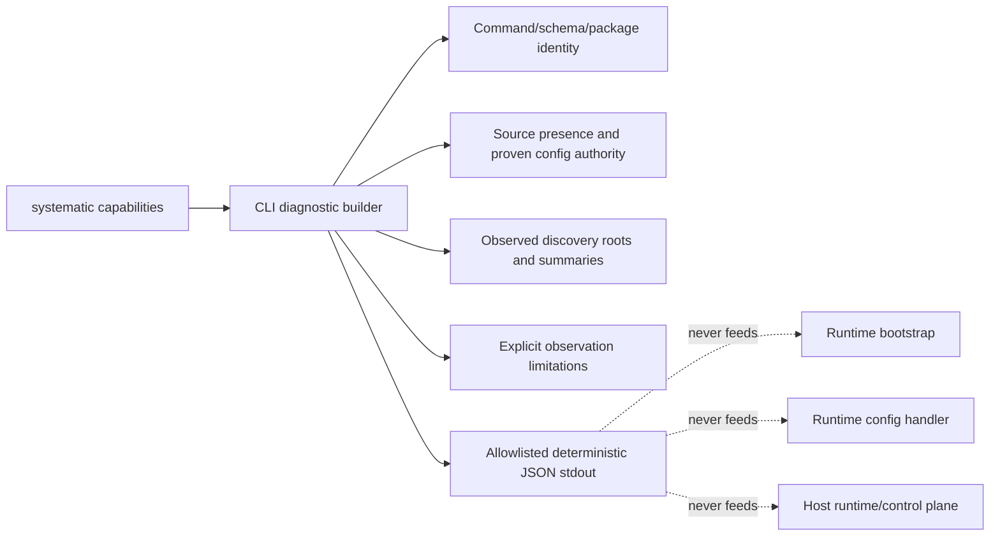

# feat: Add a Read-Only Capability Diagnostic

## Overview

Add the first I2a slice from the Bitter Lesson Engineering program: a CLI-specific,
versioned, machine-readable `systematic capabilities` diagnostic. It reports only
what the standalone CLI can directly observe about the package, configuration
sources, and discovered skills and agents.

This output is not the canonical registry or control plane for capability truth.
Existing bootstrap and config-handler behavior remains authoritative, and the
diagnostic is never consumed by runtime composition, routing, setup, or workflow
protection. Schema generalization waits until a second consumer demonstrates reuse.

## Problem Frame

Operators need a read-only answer to named standalone-CLI questions: which command
and package ran, which configuration sources are present, which source currently
wins for a provable field or path, what discovery roots and winning summaries were
observed, and what the CLI cannot observe. The facts are currently spread across
CLI, config, and discovery code.

The standalone CLI has no authoritative loaded OpenCode, Pi, or Claude Code runtime.
It must not infer host identity, live model availability, setup state, or capability
truth from filenames, generated artifacts, or cached values.

## Requirements Trace

- R1. Emit one CLI-specific, versioned JSON diagnostic for `systematic capabilities`;
  it is not a canonical capability registry or runtime control plane.
- R2. Limit v1 facts to command/schema identity, package/version, configuration
  source presence, effective per-field/path authority only where current merge code
  can prove it, observed discovery roots and winning skill/agent summaries/counts,
  and explicit limitations.
- R3. Report source presence separately from effective authority. Do not invent a
  universal user/project/custom precedence ladder or infer authority from filenames.
- R4. Define `unknown`, `unavailable`, and explicit `absent` semantics; do not use
  either status for an absent source or for an intentionally unobservable host fact.
- R5. Preserve current config merge and protected project-field semantics. A small
  read-only config metadata API may expose source kind, proven precedence, and
  loaded/absent/invalid state; otherwise the CLI reports only facts already proven.
- R6. Preserve current discovery semantics. Skills report only winners returned by
  `discoverSkills()`; duplicate losers are not rediscovered or exposed.
- R7. Treat duplicate-agent catalog collisions as a hard agent-section failure:
  suppress the agent summary and emit one structural-invalid fact.
- R8. Emit an allowlisted, privacy-safe JSON object with redacted/relative source
  IDs, bounded enums/counts, sanitized error codes, and no arbitrary values.
- R9. Sort every emitted collection and key deterministically. The output builder
  accepts an injected clock and output sink for tests and a testable CLI entrypoint.
- R10. Keep the command read-only: no persistence, config mutation, setup/export
  call, provider API call, generated-artifact access, or runtime consumer.
- R11. Prove non-interference: existing bootstrap/config-handler output remains
  unchanged for frozen inputs, and existing runtime code remains authoritative.

## Anti-Goals and Scope Boundaries

- This is not a canonical registry, policy engine, control plane, or broad capability
  ontology. Generalization is deferred until a second consumer proves reuse.
- No setup/projection inventory, host identity, live model availability, model cache
  interpretation, generated-artifact facts, registry facts, or docs/reference page.
- No per-item duplicate-skill visibility, second discovery pass, or alternate
  discovery/control path.
- No prompt/body content, config values, arbitrary overlay values, absolute local
  paths, stacks, raw parser errors, nested unknown keys, cache, telemetry, or file
  output.
- No runtime plugin hook, Pi extension, Claude Code session, bootstrap, routing,
  model-selection, workflow-guard, setup, export, or provider integration.

### Deferred to Separate Tasks

- A second consumer may justify a generalized schema or shared fact model.
- Host-native observations may be added only by a consumer that can directly observe
  the relevant runtime.
- Generated-artifact provenance and drift belong to a separate child plan.
- Snapshot persistence, comparison history, human rendering, and docs-site work wait
  for a concrete operator workflow.

## Context and Research

### Relevant Code and Patterns

- `src/cli.ts` is the narrow first consumer and already has read-only commands.
- `src/lib/config.ts` and `loadConfigWithSources` are the current config authority.
- `src/lib/discovered-skills.ts` defines observed skill winners and root order.
- `src/lib/agent-resolver.ts` builds the flattened catalog and rejects duplicate names.
- `src/lib/bootstrap.ts` and the config handler remain runtime authorities and are not
  consumers of this diagnostic.
- Existing CLI, config, discovery, bootstrap, and config-handler tests provide real
  temporary-directory and non-interference fixtures.

### Institutional Learnings

- `docs/plans/2026-07-21-002-test-receipt-workflow-capabilities-plan.md` separates
  classified observation from runtime behavior.
- `docs/solutions/workflow-issues/verify-installed-artifacts-not-just-build-gates-2026-07-18.md`
  requires observed state rather than build inference.
- `docs/solutions/best-practices/cross-harness-adapter-parity-contract-tests-2026-07-14.md`
  favors boundary-level observable contracts.
- `docs/solutions/integration-issues/opencode-plugin-hook-silent-defect-swallow-2026-05-19.md`
  requires visible typed collector failures.

## Key Technical Decisions

- **CLI-specific contract:** The schema answers named `systematic capabilities`
  operator questions. It is not a registry and has no control-plane authority.
- **Source facts before authority facts:** Emit source presence independently. Emit
  an effective winner for a field/path only when the current merge implementation or
  a narrow metadata API proves it.
- **No filename trust:** The CLI never infers precedence or trust from source names,
  paths, or the existence of generated files.
- **Display versus canonical paths:** Canonicalized/real paths are used internally
  for comparison and deduplication only. Default output uses bounded relative source
  IDs; canonical paths never appear in default JSON.
- **Closed privacy allowlist:** Config facts are limited to source IDs, presence,
  bounded source kinds, proven effective source IDs, and protected-field outcomes.
  No config values or nested arbitrary overlays are serialized.
- **Existing discovery only:** Skills use the winners already returned by
  `discoverSkills()`. Agents use the existing catalog; a duplicate collision yields
  one invalid fact and no valid-looking agent count or summary.
- **Deterministic test seam:** The builder receives clock, filesystem roots, argv, and
  an output sink. The CLI entrypoint is callable in tests without process globals.
- **Runtime separation:** Existing bootstrap and config-handler functions remain
  authoritative and never import or consume the diagnostic.

## Observation Semantics

Every fact answers one named standalone-CLI question. The status vocabulary is:

| Condition | Representation |
|---|---|
| A source is not present | `presence: absent`; not `unknown` or `unavailable` |
| The CLI intentionally cannot observe the fact | `status: unknown` plus a bounded limitation code |
| An intended collector/source exists but failed or is malformed | `status: unavailable` plus source ID and sanitized error code |
| The fact was directly observed successfully | `status: available` |

`unavailable` is forbidden for host-runtime facts that the standalone CLI cannot
observe by design. Those facts remain an explicit `unknown` limitation, not a failed
collector.

## High-Level Technical Design

> This illustrates the intended approach and is directional guidance for review, not
> an implementation specification.

The output has four bounded areas:

1. **Identity:** command identity, diagnostic schema version, package name/version,
   and injected observation time.
2. **Sources:** redacted source IDs, source kind only when provable, and explicit
   `present`/`absent`/`invalid` presence state.
3. **Effective facts:** allowlisted field/path winners only when current merge
   semantics prove them; discovery roots and winning skill/agent counts/summaries.
4. **Limitations/errors:** bounded `unknown` limitations or `unavailable` errors with
   code, source ID, and a short sanitized reason.

## Implementation Units

- [x] **Unit 1: Define the CLI diagnostic contract and deterministic builder**

  **Goal:** Define the smallest versioned JSON object for named standalone-CLI
  observations, with injectable clock, roots, argv, and output sink.

  **Files:**
  - Create: `src/lib/capability-snapshot.ts`
  - Create: `tests/unit/capability-snapshot.test.ts`

  **Approach:**
  - Use closed enums and allowlists for fact kinds, source IDs, presence, status,
    limitation codes, and sanitized error codes.
  - Reject unknown output keys and arbitrary nested values.
  - Lexically normalize injected roots before comparison; the standalone CLI resolves
    filesystem identity before injection. Derive only relative display IDs.
  - Sort every object key and collection before serialization.

  **Tests:** Pure contract/parsing tests, JSON round-trip tests, privacy allowlist
  tests, injected-clock determinism tests, and absence-versus-unknown semantics.

  **Verification:** The builder has no writes or runtime imports from bootstrap or
  config handling and produces deterministic output for identical injected inputs.

- [x] **Unit 2: Collect only proven config facts**

  **Goal:** Report source presence and effective per-field/path authority without
  reimplementing config merge semantics.

  **Requirements:** R3, R5, R8, R10.

  **Files:**
  - Create: `src/lib/capability-snapshot.ts`
  - Modify only if required: `src/lib/config.ts` for a narrow read-only config
    metadata return exposing source kind, proven precedence, and loaded/absent/invalid
    state
  - Create: `tests/unit/capability-snapshot.test.ts`
  - Reference: `src/lib/config-schema.ts`

  **Approach:**
  - First use the metadata already exposed by current loading code. If it cannot
    prove a requested field/path, narrow the diagnostic rather than infer from
    filenames. Add no generalized trust classes.
  - Keep source presence separate from effective winners. Never emit config values,
    prompt bodies, arbitrary overlays, stacks, or canonical paths.
  - Preserve project config protected-field blocking exactly as current semantics.
  - Use a closed allowlist of emitted config facts. Include a nested secret/overlay
    fixture to prove no leakage.

  **Tests:** Present, absent, malformed, and protected-field fixtures; proven winner
  per field/path; unprovable authority omitted with a limitation; canonical-path
  dedupe with relative display IDs; secret/nested-overlay non-leakage.

- [x] **Unit 3: Summarize existing discovery and add the CLI surface**

  **Goal:** Add `systematic capabilities` without a second discovery pass or runtime
  consumer.

  **Requirements:** R1, R2, R4, R6-R9.

  **Files:**
  - Create: `src/lib/capability-snapshot.ts`
  - Modify: `src/cli.ts`
  - Create: `tests/unit/capability-snapshot.test.ts`
  - Test: `tests/unit/cli.test.ts`
  - Reference: `src/lib/discovered-skills.ts`, `src/lib/agent-resolver.ts`

  **Approach:**
  - Report only winning skill roots and bounded skill counts returned by
    `discoverSkills()`; do not expose discarded duplicate skills.
  - Use the existing agent catalog. On duplicate-name collision, suppress its
    summary/count and emit exactly one structural-invalid fact for that section.
  - Keep JSON output deterministic, read-only, and on stdout; invocation errors go to
    stderr. The testable entrypoint accepts the injected clock and output sink.

  **Tests:** CLI JSON contract, help text, invalid invocation, stable sorting, real
  temp-directory no-write behavior, duplicate-agent hard section failure, and frozen
  argv/env/temp-root determinism.

- [x] **Unit 4: Prove non-interference and keep documentation minimal**

  **Goal:** Show that the diagnostic is observation-only and does not alter existing
  runtime behavior.

  **Requirements:** R7, R9-R11.

  **Files:**
  - Modify: `tests/unit/bootstrap.test.ts`
  - Modify: `tests/unit/config-handler.test.ts`
  - Modify: `tests/unit/cli.test.ts`

  **Approach:**
  - Add targeted regression coverage with frozen inputs proving existing bootstrap
    and config-handler output is unchanged.
  - Prove no persistence, config mutation, setup/export call, provider call, or
    generated-artifact read/write.
  - Keep user-facing documentation to CLI help and plan acceptance; do not add a
    docs/reference page or broad parity campaign in v1.

  **Verification:** Existing runtime tests remain authoritative; snapshot disagreement
  never changes runtime behavior.

## System-Wide Impact

- **Interaction graph:** The standalone CLI calls one diagnostic builder. Bootstrap,
  config handling, setup, export, provider access, and workflow protection do not
  consume it.
- **Error propagation:** A malformed intended source is an `unavailable` fact; an
  intentionally unobservable fact is `unknown`; an absent source is explicitly absent.
  Duplicate-agent catalog invalidity fails only that section and suppresses its
  summary.
- **State lifecycle:** No files, config, caches, generated artifacts, or telemetry
  are written.
- **Authority:** Existing config merge, protected fields, discovery winners,
  bootstrap, and config-handler behavior remain authoritative.
- **Determinism:** Identical injected inputs and observed discovery sets produce
  deterministically ordered output.

## Risks and Dependencies

| Risk | Mitigation |
|---|---|
| The diagnostic becomes a second policy engine | CLI-specific named facts, closed allowlists, no runtime consumer, and a second-consumer gate for generalization. |
| Authority is inferred from filenames | Use current merge metadata or omit the effective fact; never infer from paths. |
| Config values or paths leak | Allowlisted fields, relative source IDs, internal-only canonical paths, and secret/overlay fixtures. |
| A duplicate agent catalog looks valid | Hard section failure, one structural-invalid fact, and no summary/count. |
| `unknown` and `unavailable` are conflated | Explicit truth table and separate absence representation. |
| Output becomes nondeterministic | Canonical realpath comparison, sorted keys/collections, injected clock, and frozen-input tests. |
| Snapshot disagreement changes runtime behavior | Bootstrap and config handler remain authorities and receive no snapshot input. |

## Success Metrics

- `systematic capabilities` answers only the named v1 operator questions with a
  versioned, parseable, deterministic JSON object.
- Source presence and proven effective authority are separate and privacy-safe.
- Discovery summaries match existing winner semantics; duplicate-agent collisions do
  not produce a valid-looking summary.
- Default output contains no absolute local paths, config values, prompt/body text,
  arbitrary overlay values, stacks, raw parser errors, or nested unknown keys.
- The command performs no persistence or mutation, and frozen-input bootstrap and
  config-handler output remains unchanged.

## Documentation and Operational Notes

- CLI help is the only planned user-facing note in v1: invocation, read-only scope,
  and the fact that this is not a host-runtime or canonical-registry view.
- Keep examples fixture-based and privacy-safe.
- Defer docs/reference pages, generated artifacts, persistence, and schema reuse until
  a second consumer establishes a real contract need.

## Sources and References

- **Origin program:** `docs/plans/2026-08-13-001-refactor-bitter-lesson-harness-plan.md`
- `src/cli.ts`
- `src/lib/config.ts`
- `src/lib/config-schema.ts`
- `src/lib/discovered-skills.ts`
- `src/lib/agent-resolver.ts`
- `src/lib/bootstrap.ts`
- `tests/unit/cli.test.ts`
- `tests/unit/discovered-skills.test.ts`
- `tests/unit/agent-resolver.test.ts`
- `tests/unit/config.test.ts`
- `docs/plans/2026-07-21-002-test-receipt-workflow-capabilities-plan.md`
- `docs/solutions/workflow-issues/verify-installed-artifacts-not-just-build-gates-2026-07-18.md`
- `docs/solutions/best-practices/cross-harness-adapter-parity-contract-tests-2026-07-14.md`
- `docs/solutions/integration-issues/opencode-plugin-hook-silent-defect-swallow-2026-05-19.md`

The `origin:` field points directly to the parent plan above; no `.origin.md`
companion is expected or created.
