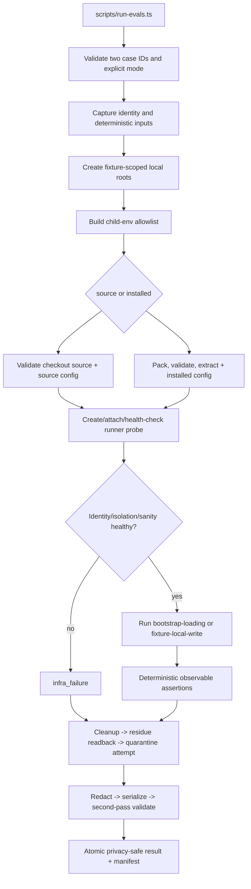

# feat: Establish a Local OpenCode Eval Foundation

## Overview

Implement the first I1 child plan from the Bitter Lesson Engineering program: a
local, deterministic runner for exactly two OpenCode cases. Each selected case can
run against the Systematic source checkout or a packed installed package and emits a
privacy-minimized result bundle.

This is a narrow measurement seam, not a reusable evaluation platform or a model
benchmark. Privacy, cleanup, provenance, sanity, and reproducibility are assertions
around the two cases, not additional corpus cases. Cross-model comparisons,
subjective grading, other harnesses, CI integration, and routing decisions remain
separate work.

## Problem Frame

Existing probes demonstrate useful OpenCode behavior but do not share one small
contract for artifact provenance, fixture-scoped local isolation, deterministic
grading, privacy-safe persistence, and cleanup. The first runner must answer one
question reliably: given a selected case, mode, fixture seed, and injected clock,
did the expected observable state occur?

The runner uses child-process environment allowlisting, canonical-path checks, and
primary-checkout readback. It provides no OS-level sandbox or containment and does
not make arbitrary untrusted model code safe.

## Requirements Trace

- R1. Provide the future direct local entrypoint `scripts/run-evals.ts`; no package or CI
  command is added in v1.
- R2. Run exactly two corpus cases: `bootstrap-loading` and `fixture-local-write`.
  Sanity, privacy, cleanup, provenance, and reproducibility are assertions around
  those cases, never separate cases.
- R3. Support explicit `source` and `installed` modes with no fallback or blending.
- R4. Create unique fixture-scoped local roots for project, home, OpenCode config,
  XDG state, probe, and mode-specific package/provenance paths.
- R5. Build child environments from a concrete deny-by-default policy. Representative
  fake credential/auth values are seeded in tests and proven absent from children.
- R6. Pin runtime identity and run the sanity gate before task grading. Identity drift,
  artifact mismatch, isolation escape, or unhealthy probe is `infra_failure`.
- R7. Use exactly four primary outcomes: `success`, `infra_failure`, `task_failure`,
  and `privacy_cleanup_failure`. Lower-level causes are bounded subcodes.
- R8. Define shared result fields plus mode-specific provenance fields, including
  OpenCode/probe/fixture/case/result/artifact identity, seed, and normalized clock.
- R9. Harden packed mode against unsafe archive entries, links, and module resolution;
  installed execution must not resolve through checkout or workspace-hoisted paths.
- R10. Persist an allowlisted result only after full serialized-output validation.
  Raw stdout/stderr, transcripts, environment, repository content, and user prose are
  banned by default.
- R11. Always attempt cleanup for started cases. Residue or quarantine is non-successful
  and nonzero, and quarantine failures remain `privacy_cleanup_failure`.
- R12. Accumulate independent case/mode results when safe, aborting later work only
  after a runner-wide identity/isolation failure invalidates it. Exit zero only when
  every selected case/mode is `success`; the manifest records partial completion.
- R13. Keep pure parsing/redaction tests in unit tests and fixture, environment,
  artifact, and runner behavior in integration tests. Add no manual tests.
- R14. Preserve the source-vs-packed-installed boundary without generalized dependency
  or provenance infrastructure.

## Scope Boundaries

- OpenCode only; no Pi or Claude Code runner.
- Exactly two deterministic cases:
  - `bootstrap-loading`: plugin/bootstrap loading is observable through the probe.
  - `fixture-local-write`: a controlled write lands under the fixture project with
    the expected bounded content/state.
- No third sanity/privacy/cleanup/provenance case. Those are assertions around both
  cases.
- No full reusable platform is created. The future directory `scripts/lib/evals/` is
  explicitly rejected/deferred. Keep implementation in the future entrypoint
  `scripts/run-evals.ts`, with at most a few case-local helpers if readability or a
  genuinely separate case boundary requires them. Generalization waits for a second
  harness or a demonstrated third use.
- No cross-model matrix, ranking, subjective LLM grader, transcript-quality judge,
  browser UI, hosted service, database, remote upload, CI gate, or policy deletion.
- No credentialed or network-enabled task. Tests use synthetic values only; no real
  credentials are included.
- No direct `dist/` mode. Installed mode must exercise the packed package boundary.
- No production dependency, lockfile, package-script, release-workflow, or origin
  program-plan change.

### Deferred to Separate Tasks

- A second harness or a demonstrated third case may justify shared runner helpers.
- Multi-model cohorts and repeated-run variance require a later measurement plan.
- Credentialed/network-enabled tasks require a separate security review.
- CI scheduling, published comparisons, human reports, and migration of existing
  manual probes wait for evidence that this narrow runner is useful.

## Context and Research

### Relevant Code and Patterns

- `tests/integration/fixtures/receipt-workflow-host.ts` provides tested disposable
  roots, child environment handling, probe capture, cleanup, redaction, and package
  extraction patterns.
- `tests/integration/opencode.test.ts` checks source/installed configuration and
  parent npm configuration non-interference.
- `tests/unit/package-exports.test.ts` verifies tarball contents and installed runtime
  behavior rather than trusting build output.
- `tests/manual/subagent-stop-sanity.ts` provides a sanity-gate precedent; it is not
  migrated or used as a new manual test.

### Institutional Learnings

- `docs/solutions/integration-issues/isolated-opencode-subprocess-fixtures-2026-05-14.md`
  establishes isolated subprocess roots and environment hygiene.
- `docs/solutions/workflow-issues/verify-installed-artifacts-not-just-build-gates-2026-07-18.md`
  requires exercising the packed artifact in situ.
- `docs/solutions/best-practices/cross-harness-adapter-parity-contract-tests-2026-07-14.md`
  favors boundary-first observable contracts.
- `docs/solutions/integration-issues/opencode-plugin-hook-silent-defect-swallow-2026-05-19.md`
  requires probe-health checks before interpreting missing host evidence.

## Key Technical Decisions

- **Narrow implementation surface:** Start with the future entrypoint
  `scripts/run-evals.ts`. A helper may be added only when the two cases genuinely need
  separation; the future directory `scripts/lib/evals/` is explicitly
  rejected/deferred, and no generalized dependency/provenance layer is created.
- **Exactly two cases:** Case IDs are `bootstrap-loading` and `fixture-local-write`.
  All trust assertions execute around each selected case/mode.
- **Four primary outcomes:** Only the table below supplies public top-level outcomes;
  subcodes are bounded implementation causes.
- **Fixture-scoped local isolation:** Trust comes from a child-env allowlist,
  canonical-path validation of every runner-controlled path, pre/post primary-checkout
  status/readback, and failure on detected escape. There is no OS-level sandbox or
  containment, and arbitrary untrusted model code remains out of scope.
- **Explicit modes:** `source` points at the checkout source entry. `installed` packs,
  validates, extracts, and executes the package from its fixture-local package root.
  Neither mode falls back to the other.
- **Deterministic grading:** Grade only probe events, process outcome, and exact
  fixture filesystem state. Do not grade model reasoning or prose.
- **Local evidence only:** Persist an allowlisted run manifest and bounded results in
  the future gitignored run-output directory `evals/runs/`; no telemetry, remote
  upload, or raw transcript collection.

## Primary Outcomes and Subcodes

| Primary outcome | Meaning | Example bounded subcodes |
|---|---|---|
| `success` | Identity, sanity, isolation, case assertions, cleanup/residue checks, and privacy-safe write all pass. | `none` |
| `infra_failure` | Runner, identity, artifact, probe, fixture, OpenCode invocation, or isolation state is not trustworthy for task grading. | `identity_drift`, `probe_unhealthy`, `artifact_resolution`, `opencode_unavailable`, `path_escape`, `primary_checkout_delta`, `case_setup` |
| `task_failure` | The runner is healthy, but the selected deterministic case does not produce the expected observable result. | `bootstrap_not_observed`, `write_missing`, `write_mismatch`, `unexpected_exit` |
| `privacy_cleanup_failure` | Redaction/serialized-output validation, cleanup, residue handling, quarantine, retention, or atomic result write fails. | `redaction_failed`, `residue_detected`, `quarantine_failed`, `atomic_write_failed` |

Lower-level causes never become additional public outcome classes. Identity or
isolation failure is classified as `infra_failure` before task grading; residue or
quarantine is never `success` and always causes a nonzero run exit.

## Result Contract

Every per-case/mode result shares these fields:

- `resultSchemaVersion`, `caseSchemaVersion`, `caseId`, `harness: opencode`, `mode`,
  `outcome`, and optional bounded `subcode`.
- Opaque `runId`, `fixtureSeed`, normalized/injected clock, and selected assertion
  IDs; physical absolute paths are not persisted.
- Runtime identity captured before classification: OpenCode version/build identity,
  probe-plugin identity/hash, fixture contract version/hash, case/result schema
  versions, and artifact identity.
- Bounded sanity/assertion evidence, cleanup/residue state, privacy-validation state,
  and safe artifact references.

Mode-specific provenance is explicit:

- **Source:** checkout-relative source identity, commit/worktree readback identity,
  canonical source entry validation, and the source OpenCode config entry ID.
- **Installed:** package name/version, packed tarball digest, extracted package-root
  identity, canonical resolved module entry ID, and the installed OpenCode config
  entry ID.

Identity drift, an unhealthy probe, or a mismatch between recorded and resolved
  artifact identity is a hard `infra_failure` before any task verdict.

## Child Environment Policy

The child environment is an explicit allowlist, not a filtered copy of the parent.
The runner supplies only fixed execution values such as its controlled `PATH`, locale,
timezone, `TERM`/`NO_COLOR` where needed, fixture-scoped `HOME`, and fixture-scoped
XDG/npm/OpenCode paths. Parent values are not forwarded for:

- GitHub/GH tokens and configuration (`GITHUB_*`, `GH_*`, and token-bearing config).
- npm auth/config/cache/prefix (`NPM_*`, `npm_config_*`, `.npmrc`, and parent cache).
- OpenAI/provider and cloud credentials (`OPENAI_*`, provider token variables,
  `AWS_*`, `AZURE_*`, `GOOGLE_*`, `CLOUDSDK_*`, and equivalent auth files).
- CI credentials and service tokens.
- SSH agent/socket and Git auth/config helpers (`SSH_AUTH_SOCK`, `GIT_ASKPASS`,
  `GIT_SSH_COMMAND`, credential helpers, inherited Git config, and credential files).
- OpenCode auth/cache state and inherited `HOME`, XDG, or npm configuration.

Tests seed representative fake values in each category, including fake files and
socket paths, then prove that children cannot observe them. Synthetic denial markers
are runner-owned, case-specific, and never persisted. No real credential is placed in
the fixture or test environment.

## Artifact and Config Boundaries

The runner creates and owns these mode-specific config entries for every case:

- Source mode: `<fixtureRoot>/opencode/source/opencode.json`, whose plugin entry
  resolves to the validated checkout source entry.
- Installed mode: `<fixtureRoot>/opencode/installed/opencode.json`, whose plugin
  entry resolves only inside `<fixtureRoot>/package-root/`.

For both modes the runner creates a probe plugin at
`<fixtureRoot>/probe/<mode>/probe-plugin.ts`, records its identity/hash, attaches it
to the mode-specific config, verifies probe health, and tears it down during cleanup.
Probe creation, attachment, and teardown are runner-owned operations, not corpus
cases.

Installed mode must:

- Reject archive entries that are absolute or contain `..` traversal components.
- Reject hardlinks and symlinks whose targets are unsafe; any permitted symlink must
  resolve canonically inside the extracted package root, with no escaping link chain.
- Reject every extracted or resolved module path whose canonical path is outside the
  package root.
- Refuse resolution through the primary checkout, workspace-hoisted modules, or any
  other path outside the extracted package root. Missing package content is a hard
  `infra_failure`; source mode is never used as fallback.

Source and installed paths are canonicalized before use. Persisted provenance contains
only bounded relative/package IDs, never sensitive absolute paths.

## Isolation and Out-of-Root Detection

For each case/mode, assert canonical containment for every runner-controlled path:
run root, case root, fixture root, project, home/XDG roots, config entries, probe,
package extraction, resolved module entry, temporary result files, quarantine root,
and retention target.

Before and after each started case, capture primary-checkout repository status and
read back the runner-selected checkout inputs. A detected primary-checkout delta or a
canonical path escape is `infra_failure`. This detector is intentionally limited: it
does not claim general filesystem escape detection or make arbitrary child code safe.

## Identity and Determinism Budget

Identity is captured and validated before classification. The expected OpenCode
version/build, probe-plugin hash, fixture contract version/hash, case/result schema
versions, artifact identity, fixture seed, and injected/normalized clock must remain
stable for the result. Drift or unhealthy probe state aborts task grading as
`infra_failure`.

The determinism budget is deliberately small:

- Freeze argv, allowlisted environment, fixture seed, package/checkout identity,
  observed discovery set, temp-root layout, and injected clock for comparisons.
- Allow only opaque run IDs, physical temp-root names, and non-persisted process
  duration to vary. Normalize those fields out of comparison.
- Sort all persisted keys, collections, assertion IDs, subcodes, and provenance
  identifiers. Any other difference is a failed reproducibility assertion around the
  selected case, not a new outcome class.

## Cleanup, Quarantine, and Privacy

The exact lifecycle is:

1. Execute the selected case.
2. Attempt cleanup, including probe teardown.
3. Read back for residue.
4. Attempt quarantine/retention if residue remains.
5. Build, validate, and atomically write the privacy-safe result/manifest.

Every started case reaches cleanup even after child failure or interruption. Any
residue or quarantine is non-successful and nonzero. Quarantine roots use unique,
run-owned names, are never reused, and are rejected by later runs if discovered.
If quarantine fails, the result remains `privacy_cleanup_failure`; persisted output
contains no absolute sensitive path, only a bounded status/code.

Persistence is allowlist-only. Raw stdout, stderr, transcripts, environment values,
repository content, user-authored prose, arbitrary paths, and secrets are banned by
default. The runner redacts the candidate object, serializes it fully, then runs a
second-pass validator over the complete serialized bytes before the atomic rename.
Redaction or validation failure writes no unsafe artifact and returns
`privacy_cleanup_failure` nonzero; only a separately validated minimal safe status
may be retained.

## High-Level Technical Design

> This illustrates the intended approach and is directional guidance for review, not
> an implementation specification.

## Implementation Units

- [x] **Unit 1: Define the narrow case and result contracts**

  **Goal:** Define the two case manifests and the shared result contract without
  creating a reusable eval platform.

  **Files:**
  - Create: `scripts/run-evals.ts`
  - Create: `evals/cases/opencode/bootstrap-loading.json`
  - Create: `evals/cases/opencode/fixture-local-write.json`
  - Create: `tests/unit/eval-contract.test.ts`
  - Create: `tests/unit/eval-redaction.test.ts`

  **Approach:**
  - Reject unknown case fields and permit only the two stable case IDs.
  - Define the four primary outcomes and one bounded subcode table.
  - Define shared fields and source/installed provenance fields listed above.
  - Keep pure parsing, normalization, allowlist, and redaction helpers unit-testable;
    do not add a generic schema or platform directory.

  **Tests:** Pure parsing and redaction tests cover unknown fields, outcome mapping,
  full serialized-output validation, seeded fake secrets, path minimization, and
  deterministic sorting.

- [x] **Unit 2: Implement fixture-scoped execution and environment policy**

  **Goal:** Run either case in unique local roots with explicit child-env denial and
  honest out-of-root detection.

  **Requirements:** R2, R4-R8, R11-R12.

  **Files:**
  - Create: `scripts/run-evals.ts`
  - Create only if genuinely needed: `scripts/eval-cases/opencode.ts` for case-local
    OpenCode probe/setup logic; it is not a reusable runner API
  - Create: `tests/integration/eval-fixture.test.ts`
  - Create: `tests/integration/eval-runner.test.ts`

  **Approach:**
  - Create unique project/home/XDG/config/probe roots for every case/mode.
  - Apply the concrete child environment policy and synthetic denial fixtures.
  - Create, attach, health-check, and later tear down the probe for both modes.
  - Assert canonical containment of runner-controlled paths and compare pre/post
    primary-checkout status/readback. Do not claim general filesystem monitoring.
  - Run `bootstrap-loading` and `fixture-local-write` only; their privacy, cleanup,
    provenance, sanity, and reproducibility checks remain assertions around them.

  **Tests:** Integration fixtures prove fake credential absence, unique roots,
  no-write behavior outside allowed run artifacts, primary-checkout preservation,
  probe health, child interruption cleanup, and both deterministic case outcomes.

- [x] **Unit 3: Harden source and packed-installed modes**

  **Goal:** Prove distinct source and installed execution boundaries with mode-specific
  config entries and provenance, without generalized dependency infrastructure.

  **Requirements:** R3, R6, R8-R9, R14.

  **Files:**
  - Create: `scripts/run-evals.ts`
  - Test: `tests/integration/eval-artifact.test.ts`

  **Approach:**
  - Source mode validates the checkout source entry and records bounded checkout
    identity plus pre/post readback.
  - Installed mode packs once per run, records package/version/tarball digest, rejects
    unsafe archive entries and links, extracts under the fixture package root, and
    verifies every canonical module resolution stays inside that root.
  - Refuse checkout or workspace-hoisted resolution in installed mode. Never fall
    back between modes.
  - Verify the exact source and installed OpenCode config entry paths and probe
    attachment for both modes.

  **Tests:** A checkout-only sentinel is unavailable in installed mode; source and
  installed results have distinct provenance; malformed archives, unsafe links,
  outside-root module resolution, and missing package content yield `infra_failure`.

- [x] **Unit 4: Implement cleanup, privacy-safe persistence, and exit semantics**

  **Goal:** Produce bounded local evidence and correct run-level behavior for partial,
  failed, and successful selections.

  **Requirements:** R1, R7, R10-R13.

  **Files:**
  - Create: `scripts/run-evals.ts`
  - Modify: `.gitignore`
  - Create: `evals/README.md`
  - Test: `tests/integration/eval-runner.test.ts`
  - Test: `tests/unit/eval-redaction.test.ts`

  **Approach:**
  - Persist one allowlisted manifest and bounded per-case/mode results under the
    future run-output directory `evals/runs/` using temporary file plus atomic rename.
  - Apply the exact cleanup/residue/quarantine/privacy ordering above.
  - Accumulate independent results when safe. If a runner-wide identity/isolation
    failure invalidates later work, abort remaining selections, clean started cases,
    and mark the manifest partial.
  - Exit zero only when every selected case/mode is `success`; every other primary
    outcome, partial completion, residue, or quarantine is nonzero.

  **Tests:** Seeded-secret scans cover the entire serialized output, unsafe-write
  rejection leaves no unsafe artifact, quarantine names are unique/non-reused,
  cleanup always runs, partial manifests are explicit, and source/installed repeated
  runs preserve normalized result evidence under frozen inputs.

  **Documentation:** The future `evals/README.md` stays minimal: invocation, result location,
  the four outcomes, privacy boundary, and unsupported scope. It does not describe an
  operator policy or a reusable platform.

## System-Wide Impact

- **Interaction graph:** The future entrypoint `scripts/run-evals.ts` invokes OpenCode through existing
  subprocess/probe boundaries. Production plugin, CLI, Pi, Claude, config, bootstrap,
  generated assets, package exports, CI, and release workflows do not consume it.
- **Outcome propagation:** Every result uses exactly one of the four primary outcomes;
  bounded subcodes explain lower-level causes.
- **Lifecycle:** Fixtures and probes are run-owned and disposable. Cleanup is always
  attempted; residue/quarantine is visible, non-successful, and nonzero.
- **Provenance:** Source and installed modes have distinct, validated identities and
  config entries. Installed mode cannot resolve through checkout/workspace paths.
- **Boundary honesty:** Canonical path checks and primary-checkout readback detect the
  specified runner-controlled escapes only; no general filesystem containment claim.

## Risks and Dependencies

| Risk | Mitigation |
|---|---|
| The runner becomes a reusable platform too early | One entrypoint, exactly two cases, optional case-local helper only when needed, and a second-harness/third-use gate. |
| Isolation is overstated | Use “fixture-scoped local isolation,” explicit no-OS-containment language, canonical checks, and primary-checkout readback. |
| Ambient auth or config leaks | Deny-by-default child environment, fixture-scoped HOME/XDG/npm/OpenCode paths, and seeded fake-value integration tests. |
| Identity drift hides an invalid result | Capture and validate all required identities before task grading; classify drift as `infra_failure`. |
| Installed mode exercises source or hoisted modules | Harden archive entries/links, canonical package-root resolution, mode-specific config, and no fallback. |
| Artifacts leak private data | Closed persistence allowlist, full serialized second-pass validation, atomic write, and fail-closed privacy outcome. |
| Cleanup contaminates later runs | Unique roots, ordered residue readback/quarantine, never-reused quarantine names, and nonzero failure semantics. |
| Partial results are misread as a complete suite | Manifest records selected, completed, aborted, and per-case/mode outcomes. |

## Success Metrics

- One direct entrypoint runs exactly the two deterministic cases in explicit source or
  packed-installed mode.
- Every selected case/mode has identity, sanity, assertion, provenance, privacy, and
  cleanup evidence under the shared result contract.
- All public outcomes use exactly `success`, `infra_failure`, `task_failure`, or
  `privacy_cleanup_failure`; lower-level causes are bounded subcodes.
- Fake credential/auth values do not reach children or persisted artifacts.
- The primary checkout remains unchanged according to the specified pre/post status
  and readback checks.
- Installed results prove execution from the extracted package root and never from
  checkout/workspace-hoisted paths.
- No production code path, package script, CI workflow, dependency, or origin plan is
  changed.

## Documentation and Operational Notes

- Future documentation path: `evals/README.md` documents only invocation, result location, the four outcomes,
  privacy boundary, and unsupported scope.
- Do not publish result bundles or paste raw artifacts into issues or PRs without a
  separate privacy review.
- Result manifests record OpenCode, probe, fixture, case/result schema, artifact,
  fixture-seed, and normalized-clock identities in bounded form.
- The `origin:` field points directly to the parent plan above; no `.origin.md`
  companion is expected or created.

## Sources and References

- **Origin program:** `docs/plans/2026-08-13-001-refactor-bitter-lesson-harness-plan.md`
- `package.json`
- `.gitignore`
- `tests/integration/fixtures/receipt-workflow-host.ts`
- `tests/integration/opencode.test.ts`
- `tests/unit/package-exports.test.ts`
- `tests/manual/subagent-stop-sanity.ts`
- `docs/plans/2026-07-21-002-test-receipt-workflow-capabilities-plan.md`
- `docs/solutions/integration-issues/isolated-opencode-subprocess-fixtures-2026-05-14.md`
- `docs/solutions/workflow-issues/verify-installed-artifacts-not-just-build-gates-2026-07-18.md`
- `docs/solutions/integration-issues/opencode-plugin-hook-silent-defect-swallow-2026-05-19.md`
- `docs/solutions/best-practices/cross-harness-adapter-parity-contract-tests-2026-07-14.md`
