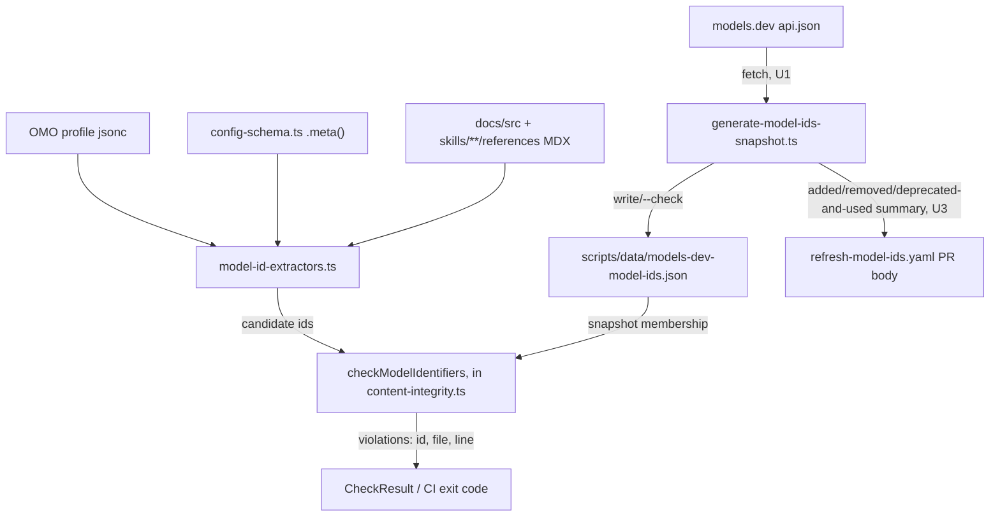

# feat: Validate shipped model ids against a models.dev snapshot

## Overview

Add a hard-fail content-integrity check that resolves every shipped model identifier against a committed snapshot of the models.dev registry, a `generate-*`-family script that regenerates that snapshot, and a scheduled workflow that opens a PR when the registry changes. A retired identifier fails by name; a human picks the replacement.

## Problem Frame

Systematic ships model identifiers in three surfaces — the OMO registry profile (`registry/files/profiles/omo/oh-my-opencode.jsonc`, live category routing), the Zod `.meta()` examples in `src/lib/config-schema.ts` (flows into the published JSON Schema and config reference), and hand-written examples in guides, the reference page, and skill references. `modelSchema` (`src/lib/config-schema.ts:57-66`) only checks the `provider/model` shape, never whether the id is real. A stale id in the OMO profile fails at request time for every OMO user at once, with a provider error naming nothing in this repository; a stale id in an example teaches users to write config that fails the same way. (See origin: docs/brainstorms/2026-09-05-model-id-validation-gate-requirements.md.)

## Requirements Trace

**Snapshot**
- R1. Repository commits a `provider/model`-string snapshot derived from models.dev — U1
- R2. A script regenerates the snapshot and supports `--check` matching the existing drift-gate convention — U1

**Gate**
- R3. A CI gate resolves every model id in the gated surfaces against the snapshot, failing with id/file/line on any miss — U2
- R4. Gated surfaces: OMO registry profile, `.meta()` examples/descriptions in `src/lib/config-schema.ts`, hand-written examples in `docs/src/content/docs/` and `skills/**/references/` — U2
- R5. Exclusion list in one declared location; the gate fails if an excluded path no longer exists — U2
- R6. Exact id match only — no replacement suggestions or family heuristics — U2

**Scheduled refresh**
- R7. A scheduled workflow re-fetches, regenerates, and opens a PR only on a changed snapshot; never pushes to `main` — U3
- R8. When a refresh retires an id a gated surface still uses, the gate fails on that PR naming the stale id/file — U2 (gate) + U3 (workflow triggers it; no new behavior beyond U2's gate running in existing CI)
- R9. The refresh PR is attributable: stable branch name, prose title, body listing added/removed ids — U3
- R10. Read-only workflow permissions; App-token PR creation; no PAT, no automerge — U3
- R11. Snapshot is data-only — a string list the gate only string-matches against — U1 (shape decision, enforced by U2's read-only consumption)

**Failure modes**
- R12. Registry unreachable during refresh: workflow fails visibly, opens no PR, committed snapshot stays authoritative — U1 (script-level fetch/shape failure) + U3 (workflow surfaces the failing exit code)
- R13. The gate itself never performs network access — U2

## Scope Boundaries

- Validating user config at load time against a runtime-fetched or cached snapshot.
- Validating `variant` or `thinking` values (models.dev publishes no variant vocabulary).
- Auto-rewriting retired ids to suggested replacements.
- Rewriting historical records or test-corpus fixtures to current ids.
- Validating provider names against any list beyond what the snapshot implies.
- A new `main.yaml` CI step: content-integrity already runs on every PR, so the new check needs no separate gate wiring (see Key Technical Decisions).

## Context & Research

### Relevant Code and Patterns

- `scripts/content-integrity.ts` — the check-function framework this gate extends: each check is a pure function returning a typed violation array, aggregated into `CheckResult` (`scripts/content-integrity.ts:330-360`), consumed by `checkContentIntegrity` (`scripts/content-integrity.ts:2261-2361`), rendered by a matching `print*Violations` function, and folded into `totalViolations()` for the exit code in `main()` (`scripts/content-integrity.ts:2685-2704`).
- `scripts/generate-registry.ts` — the `--check` drift-gate shape this plan's refresh script mirrors: `parseArgs` reads `--check` (`scripts/generate-registry.ts:337-340`), `checkRegistry` regenerates in memory and byte-compares against the committed file via `normalizeForCompare` (`scripts/generate-registry.ts:342-376`), and `main` dispatches between check and write modes with a shared `generateRegistryContent` producer path (`scripts/generate-registry.ts:378-402`).
- `scripts/generate-config-schema.ts` — a second instance of the same one-producer-path convention (`--version` override, `checkSchemaFiles`, `import.meta.main` guard), confirming the pattern is the house style, not one script's idiosyncrasy.
- `scripts/generate-config-schema.ts:361-414` (`generateSchemaContentFromSchema`) — the exact JSON Schema production path the model-id gate's TS-surface extractor reuses in memory (see Unit 2), instead of parsing `config-schema.ts` as source text.
- `scripts/.drift-allowlist.json` — precedent for a committed, gate-read JSON data file living directly under `scripts/`, informing the snapshot's location.
- `.github/workflows/main.yaml:83-99` — the existing gate lineup (`Content integrity gate`, `Registry drift check`, `Schema drift check`, `Review artifact schema drift check`) this plan's gate joins with zero new steps.
- `.github/workflows/main.yaml:228-251` — the App-token mint + git-identity pattern (`actions/create-github-app-token@bcd2ba49218906704ab6c1aa796996da409d3eb1 # v3.2.0` with `secrets.APPLICATION_ID`/`APPLICATION_PRIVATE_KEY`, then a `gh api` call to derive the bot's user id/email) this plan's scheduled workflow reuses verbatim for its own PR-opening step.
- `.github/workflows/fro-bot.yaml` — the reference shape for a scheduled workflow: `schedule:` cron trigger, `permissions: contents: read`, `persist-credentials: false` on checkout, and third-party actions pinned to full SHA with a version comment.
- `tests/unit/fro-bot-workflow.test.ts` — the workflow-shape test precedent: parse the YAML with `js-yaml`'s `JSON_SCHEMA`, assert `permissions`/`schedule`/checkout options as data, and regex-assert the SHA-pinning convention across every `uses:` line.
- `tests/unit/generate-registry.test.ts` and `tests/unit/content-integrity.test.ts` — unit-test conventions: real temp directories (`fs.mkdtempSync`) for filesystem isolation, fixture builders (`writeFile`/`writeSkill`), no mocking libraries.
- `src/lib/config-schema.ts:57-66` — `modelSchema`, the only existing (shape-only) check this gate supplements without replacing.
- `docs/scripts/generate-config-reference.ts:566-567` — the `SYSTEMATIC:FIELD-REFERENCE:START`/`END` sentinel markers delimiting the generated schema-reference region in `configuration.mdx`, which the Markdown extractor must strip before scanning (it is a generated copy of `config-schema.ts`'s own `.meta()` source, already covered by scanning that source file directly).
- `docs/src/content/docs/guides/pi-subagents.mdx:86-101,121` — a single page carrying both a structural fenced JSONC `"model"` value (the canonical example) and an inline `` `model: provider/model` `` prose mention, grounding the structural/inline extraction split used throughout Unit 2.
- `.slim/clonedeps/repos/anomalyco__opencode/packages/core/src/models-dev.ts:142-158` — OpenCode fetches `https://models.dev/api.json` (override: `OPENCODE_MODELS_URL`); `packages/opencode/src/provider/provider.ts:1293-1301` builds its provider catalog from it. This plan's refresh script targets the same URL but does not honor the override env var — it is an independent, repository-local snapshot, not OpenCode's runtime catalog.

### Institutional Learnings

- `docs/solutions/best-practices/content-integrity-has-no-warning-channel-2026-06-06.md` — content-integrity has no warning channel; the new check is a hard pass/fail like every other check in the file.
- `docs/solutions/best-practices/typed-config-validation-build-time-codegen-2026-05-16.md` — one producer path for generate and `--check` modes; the refresh script follows this directly.
- `docs/solutions/workflow-issues/registry-drift-on-skill-description-change-2026-05-20.md` — prior art for a generated-surface drift gate silently diverging from a local build/test pass; motivates naming the registration obligations (STRUCTURE.md, AGENTS.md) explicitly in-unit rather than leaving them for a failing gate to report.

### External References

- models.dev `api.json`, surveyed directly: a top-level object keyed by provider id; each provider has a `models` map keyed by model id (fields include `id`, `name`, `release_date`, `last_updated`, optional `status`: `deprecated` | `beta`). 213 providers, 7,562 models, 184 deprecated. `github-copilot` (28 models) and `opencode` (102 models) are providers in the registry — no aggregator seed list is needed. Bedrock regional prefixes (`us.`, `eu.`, `global.`) are literal ids in the registry (39 of 123 `amazon-bedrock` ids) — no prefix expansion is needed.

---

## Prior-Art Survey

```json
{
  "schema_version": 2,
  "verdict": "extend",
  "scope": "scripts/, .github/workflows/, src/lib/config-schema.ts, registry/files/profiles/omo/, tests/unit/",
  "freshness": {
    "vcs_reference": "d214d9a"
  },
  "budget": {
    "max_search_passes": 2,
    "max_candidate_inspections": 5,
    "exhausted": false
  },
  "candidates": [
    {
      "path_or_symbol": "scripts/content-integrity.ts",
      "description": "Check-function framework: pure check functions returning typed violation arrays, aggregated in CheckResult, printed by a matching print*Violations function, folded into totalViolations() for the exit code.",
      "disposition": "extend"
    },
    {
      "path_or_symbol": "scripts/generate-registry.ts",
      "description": "Generator script with parseArgs/--check/main shape and a single producer function shared between write and check modes.",
      "disposition": "reuse"
    },
    {
      "path_or_symbol": "scripts/generate-config-schema.ts",
      "description": "Second instance of the same generator shape (parseArgs/--check/main); its generateSchemaContentFromSchema function is also the exact JSON Schema production path the model-id gate's TS-surface extractor reuses in memory, instead of parsing config-schema.ts as source text.",
      "disposition": "reuse"
    },
    {
      "path_or_symbol": ".github/workflows/fro-bot.yaml",
      "description": "Scheduled workflow shape: cron trigger, read-only permissions, persist-credentials:false, SHA-pinned actions.",
      "disposition": "reuse"
    },
    {
      "path_or_symbol": "scripts/.drift-allowlist.json",
      "description": "Precedent for a committed, gate-read JSON data file living directly under scripts/, outside the npm package's shipped files.",
      "disposition": "reuse"
    }
  ]
}
```

## Key Technical Decisions

- **Gate lives inside `scripts/content-integrity.ts`**: one more check function alongside nineteen existing ones, not a new script. The gate is offline and hard-fail like every other check here; a separate script would duplicate the scan-target collection and printing machinery for no benefit.
- **Snapshot location: `scripts/data/models-dev-model-ids.json`**: `package.json`'s `files` array ships only `dist`, `skills`, `agents`, `ATTRIBUTIONS.md`, `HARNESSES.md` — both `scripts/` and `registry/` are already excluded from the npm package, so either would satisfy "must not ship." `scripts/data/` was chosen over `registry/` because the snapshot is gate input data, not an OCX/OMO installation artifact, and sits next to the script that produces and consumes it. `scripts/.drift-allowlist.json` is direct precedent for a committed JSON file at this level.
- **Snapshot shape: flat, lexicographically sorted JSON array of `provider/model` strings, no timestamp or version metadata**: a timestamp would diff on every regeneration even when the id set is unchanged, defeating "no PR when unchanged" (R7). Git history (commit date, blame) is the freshness record instead. Deprecated ids are kept in the snapshot — `status: deprecated` still means the id is real and resolvable; only R6's exact-match rule decides whether a shipped example may use it.
- **Refresh script named `scripts/generate-model-ids-snapshot.ts`**, following the `generate-*` family (`generate-registry.ts`, `generate-config-schema.ts`) rather than `refresh-*`, for naming consistency with sibling generators that share the same `--check` shape.
- **`generate-config-schema.ts` gains an object-returning JSON Schema producer, factored out of `generateSchemaContentFromSchema`**: the TS-surface extractor needs the same `z.toJSONSchema(schema, { target: 'draft-7', reused: 'ref' })` call the full generator already makes, but not its `$id` stamping or its `formatJsonWithBiome` formatting pass. Sharing the object-returning step in memory, rather than re-deriving it, means the gate can never disagree with the published schema about what a `.meta()` call contains, and never needs to spawn Biome or supply a version argument it has no use for.
- **Extraction and gate logic live in `scripts/lib/model-id-extractors.ts`**, not `src/lib/`: `src/lib/` modules require an `ARCHITECTURE.md` codemap entry and a `src/lib/AGENTS.md` module-table row (both gate-enforced). Keeping this logic in `scripts/lib/` (already used by `scripts/eval-cases/opencode.ts` and `scripts/generate-config-schema.ts` for shared helpers) avoids that registration surface entirely, since the module is build/CI-only and never shipped or imported by `src/`.
- **Retirement handling is a failing PR, not an auto-fix**: which replacement model to route to is a decision the maintainer owns; an automated same-family guess would decide it silently and could route users to a still-more-expensive or wrong-capability model.
- **Provider validation is context-dependent, not a blanket filter**: in structural contexts — `.meta()` examples, OMO profile `model` values, and `"model"` values inside fenced JSON/JSONC/YAML blocks — every candidate is validated against the snapshot unconditionally, so a typo'd provider (`anthropc/claude-sonnet-5`) fails as `model-id-unknown-provider`. The known-provider filter applies only to Markdown inline code spans, and only after the `://`/`@`/file-extension deny patterns, because those spans also carry paths and package names — a blanket filter across all contexts would silently mask a real config typo as if it were an unrelated path.
- **Exclusion list is a single declared constant in `content-integrity.ts`**, not inline markers scattered across docs: inline markers are the pattern that rots (unowned, unreviewable in aggregate); a single list is one diff to review and one thing the gate itself can validate for staleness (R5).
- **Refresh runs as its own scheduled workflow** (`.github/workflows/refresh-model-ids.yaml`), not folded into `fro-bot.yaml` or `main.yaml`: it touches CI configuration and opens PRs on its own cadence, which warrants independent review rather than piggybacking on an existing job's trigger surface.
- **GitHub App token over `FRO_BOT_PAT` or `GITHUB_TOKEN`**: the App secrets (`APPLICATION_ID`, `APPLICATION_PRIVATE_KEY`) already exist for the Renovate job in `main.yaml`; an installation token is short-lived and scoped, and — unlike a `GITHUB_TOKEN`-opened PR — it triggers downstream workflow runs, so the refresh PR gets full CI including this plan's own gate (R8, R10).
- **Registry-derived strings never enter shell interpolation**: the refresh workflow writes its added/removed/deprecated-and-used summary to a file and passes it to `gh pr create`/`gh pr edit` only via `--body-file`; no snapshot- or extractor-derived string is interpolated directly into a `run:` command or a `gh` flag value. `chore/refresh-model-ids` is bot-owned and force-pushed every cycle — a human hand-editing a replacement id works on a different branch.
- **`main.yaml` gains no new step**: `content-integrity` already runs on every PR (`main.yaml:83-84`), so the new check rides that existing invocation. A dedicated `models:drift`-in-CI step would additionally require network access on every PR, which R13 explicitly rules out for the gate itself.
- **Sequencing constraint**: the snapshot must be generated and committed in the same unit that turns the gate on, after a local run confirms zero violations on the current tree — otherwise the introducing PR fails its own new check. All ids were refreshed in PR #907, so a clean run is expected; if any gated id turns out missing from the live registry, that is a real finding to fix within the same unit, not a follow-up.

## Open Questions

### Resolved During Planning

- Where the exclusion list lives, and whether the gate fails on a stale entry: a single constant in `content-integrity.ts`; yes, a nonexistent excluded path is itself a violation (R5).
- Snapshot shape: flat sorted array of `provider/model` strings, no timestamp (see Key Technical Decisions).
- Schedule cadence: weekly cron, matching the "months" retirement cadence noted in the origin document — daily would be needless network traffic and PR churn for a registry that changes on the order of months.
- Whether the refresh PR should carry Renovate-style labels/assignment: request review from the repository owner (`gh pr create --reviewer`); no label scheme exists to match since Renovate PRs in this repository are not label-driven either.
- Whether one extractor covers all three surfaces without false positives: no — three surface-specific extractors (TS `.meta()` source scan, JSONC full-tree walk, Markdown/MDX code-span-and-fence scan) sharing one normalization and one provider-membership filter, verified against the repository's actual content (see U2 Approach).

### Deferred to Implementation

- Exact regex/AST boundary for extracting `.meta({ examples, description })` string values from `src/lib/config-schema.ts` — the implementer should run the extractor against the live file and adjust for any construct planning didn't anticipate (e.g., multi-line description strings).
- Final wording of the AGENTS.md contributor note on fixing a failing model-id check (U3) — content depends on the exact error message shape U2 lands.
- Whether the scheduled workflow's PR review request should target a team or the individual repository owner — deferred to implementation since it depends on repository collaborator configuration at merge time, not on anything this plan can resolve.

## High-Level Technical Design

> This illustrates the intended approach and is directional guidance for review, not implementation specification. The implementing agent should treat it as context, not code to reproduce.



## Implementation Units

- [ ] **Unit 1: Snapshot generator**

**Goal:** A `generate-*`-family script fetches, normalizes, and writes the models.dev id snapshot, with a `--check` drift mode; the initial snapshot lands committed in this same unit.

**Requirements:** R1, R2, R11, R12 (script-level failure behavior)

**Dependencies:** None

**Files:**
- Create: `scripts/generate-model-ids-snapshot.ts`
- Create: `scripts/data/models-dev-model-ids.json` (generated by running the script once against the live registry)
- Modify: `package.json` — add `models:refresh` (`bun scripts/generate-model-ids-snapshot.ts`) and `models:drift` (`bun scripts/generate-model-ids-snapshot.ts --check`)
- Modify: `STRUCTURE.md` — add a `scripts/` key-files bullet and a Build/CI Scripts table row
- Modify: `AGENTS.md` — add `models:refresh`/`models:drift` to the Commands block
- Test: `tests/unit/generate-model-ids-snapshot.test.ts`

**Approach:**
- Fetch `https://models.dev/api.json` (no `OPENCODE_MODELS_URL` override — this is an independent snapshot, not OpenCode's runtime catalog).
- Validate shape before normalizing: a top-level object with at least one provider whose value has a `models` object; a non-JSON body or a shape that fails this check exits non-zero and writes nothing (mirrors `GenerationError` handling in `scripts/generate-registry.ts:112-129`).
- Normalize: for each provider, for each model id, emit `${providerId}/${modelId}`; flatten, dedupe, sort lexicographically; serialize with a trailing newline.
- `--check` mode: fetch and normalize, byte-compare (via the same `normalizeForCompare` trailing-whitespace-tolerant pattern as `scripts/generate-registry.ts:332-335`) against the committed file; on match, exit 0 printing an up-to-date message; on drift, print added and removed id sets and exit 1. This unit's `--check` covers R2's drift contract; the fuller added/removed/deprecated-and-used summary object for the scheduled workflow's PR body is added in Unit 3, once the extractors exist.
- Follow the `parseArgs`/dedicated check function/`main`/`import.meta.main` guard shape from `scripts/generate-registry.ts:337-402` exactly.

**Patterns to follow:**
- `scripts/generate-registry.ts` — `parseArgs`, `checkRegistry`, `main`, `normalizeForCompare`, `GenerationError`.
- `scripts/generate-config-schema.ts` — sibling instance of the same shape, for confirming which parts are convention vs. registry-specific.

**Test scenarios:**
- Happy path: a fixture models.dev-shaped payload with two providers and three total models produces a sorted three-entry array with a trailing newline.
- Edge case: a provider with an empty `models` map contributes zero ids without erroring.
- Edge case: out-of-order provider/model keys in the fixture still produce lexicographically sorted output.
- Error path: a non-JSON fetch body causes a non-zero exit and no write to the snapshot path.
- Error path: valid JSON with no provider exposing a `models` map (shape mismatch) causes a non-zero exit and no write.
- Integration: `--check` against a fixture snapshot that differs from a fresh fetch reports the specific added and removed ids and exits 1; against an identical fixture it exits 0.

**Verification:**
- `bun test tests/unit/generate-model-ids-snapshot.test.ts` passes.
- `bun run models:refresh` followed by `bun run models:drift` exits 0 on a clean checkout.
- `STRUCTURE.md` and `AGENTS.md` list the two new scripts.

---

- [ ] **Unit 2: Extraction and gate**

**Goal:** Every model id in the three gated surfaces is resolved against the committed snapshot inside `content-integrity.ts`, with named exclusions and exact-match-only failure.

**Requirements:** R3, R4, R5, R6, R13

**Dependencies:** Unit 1 (the committed snapshot must exist and be current for this unit's own gate to pass on itself)

**Files:**
- Create: `scripts/lib/model-id-extractors.ts`
- Create: `tests/fixtures/model-ids/` — a small fixture tree isolating extractor behavior from the live repository, so an extractor defect and a real stale id are always distinguishable
- Modify: `scripts/content-integrity.ts` — add `ModelIdentifierViolation` interface (carrying a `kind` of `model-id-unknown` | `model-id-unknown-provider` | `model-id-stale-exclusion`), `MODEL_ID_EXCLUDED_PATHS` constant, `checkModelIdentifiers` function, `printModelIdentifierViolations`, wire both into `CheckResult` / `checkContentIntegrity` / `main`'s violation total
- Modify: `scripts/generate-config-schema.ts` — export the object-returning JSON Schema producer (the `z.toJSONSchema(schema, { target: 'draft-7', reused: 'ref' })` call, without the `$id` override or `formatJsonWithBiome` pass) that both `generateSchemaContentFromSchema` and the new TS-surface extractor call
- Test: `tests/unit/model-id-extractors.test.ts`
- Test: `tests/unit/content-integrity.test.ts` (extend with the new check's cases)

**Approach:**
- **Verify against a fixture tree before enabling the check.** Implement the three extractors and `checkModelIdentifiers` against `tests/fixtures/model-ids/` first, proven by unit tests, before touching the live repository. Only after those tests pass, run the check against the real tree with Unit 1's freshly generated snapshot. Any finding at that point is either a real stale id — fixed in this same unit and named in the PR body — or an extractor false positive — fixed in the extractor, never suppressed. Only then wire `checkModelIdentifiers` into `checkContentIntegrity`'s returned `CheckResult` and `main`'s violation total, so the check goes live against a verified-clean baseline.
- **TS surface** (`src/lib/config-schema.ts`): `scripts/lib/model-id-extractors.ts` obtains the JSON Schema object via the object-returning export factored out of `scripts/generate-config-schema.ts`'s `generateSchemaContentFromSchema` — it never parses TypeScript source. It then walks that object recursively: every string value reachable from any `examples` entry, descending into `$defs` (the schema uses `reused: 'ref'`, so a repeated shape like the `agents.<key>` overlay collapses into one `$defs` entry referenced by every property that uses it), skipping non-string entries (`null`, numbers, booleans). Each surviving `examples` entry is a **structural** candidate (12 of the 13 model-id-shaped examples in `config-schema.ts` are nested inside an object rather than a flat array entry, so the walk must be recursive, not one level deep); every backtick-delimited span inside a `description` string is an **inline** candidate (documentation prose, not a config value).
- **JSONC surface** (`registry/files/profiles/omo/oh-my-opencode.jsonc`): parsed with `jsonc-parser` — imported only inside `scripts/lib/model-id-extractors.ts`, never in `content-integrity.ts` — walking the full tree for every `model` key's string value, at any nesting depth. Every value here is a **structural** candidate.
- **Markdown/MDX surface** (`docs/src/content/docs/**`, `skills/**/references/**`): strip the `SYSTEMATIC:FIELD-REFERENCE:START`/`END` region from `configuration.mdx` first (it is a generated copy of the TS surface's own source; scanning it too would double-count). Within a fenced code block, a `model`/`"model"` key's string value in JSON/JSONC/YAML-like content is a **structural** candidate; every other backtick/quoted token matching the id pattern — in a fenced block or an inline code span — is an **inline** candidate. Bare prose outside any span or fence is never scanned.
- **`key: value`-shaped inline spans.** Before matching an inline span against the id pattern, the extractor strips a leading `model:`/`"model":` prefix (optional surrounding quotes and whitespace) — so spans like `` `model: anthropic/claude-haiku-4-5` `` (`writing-skills/references/foundation-conventions.md:21`) and `` `model: github-copilot/gpt-5.6-luna` `` (`docs/src/content/docs/guides/pi-subagents.mdx:121`) are gated as inline candidates rather than skipped as a non-matching shape.
- **Context-dependent resolution, not a blanket filter.** Every structural candidate is validated against the snapshot unconditionally: a provider segment absent from the snapshot's derived provider set fails as `model-id-unknown-provider`; a known provider with no matching model id fails as `model-id-unknown`. Inline candidates are filtered first — discard any token containing `://`, starting with `@`, or ending in a file extension, then discard any whose provider segment is not in the snapshot's provider set (paths, package names, and similarly shaped non-ids) — only a surviving inline candidate is checked, failing as `model-id-unknown` if absent from the snapshot. Two sanctioned schematic placeholders are allowlisted everywhere, structural or inline: the literal string `provider/model`, and any candidate whose model segment ends in `...` (an elision placeholder, e.g., `anthropic/claude-...`); no other placeholder-shaped string is exempt.
- `MODEL_ID_EXCLUDED_PATHS` is a single array constant of exactly two literal repo-relative paths, no globs: `docs/src/content/docs/guides/model-defaults-migration.mdx` and `docs/src/content/docs/guides/with-without-systematic.mdx`. `docs/plans/**`, `docs/solutions/**`, `tests/**`, and `evals/**` need no entry — R4's gated surfaces are only the OMO profile, `config-schema.ts`, `docs/src/content/docs/**`, and `skills/**/references/**`, so those directories sit outside the scan scope by construction rather than needing exclusion from within it. Because every entry is a literal path, staleness is a plain existence check: the check fails (`model-id-stale-exclusion`) if either listed path no longer exists on disk — mirroring `checkCodemapCompleteness`'s `missing-on-disk` violation (`scripts/content-integrity.ts:1678-1687`), which fails the same way when `ARCHITECTURE.md`'s codemap names a module absent from disk.
- The gate reads only the committed snapshot file from disk; it makes no network call (R13).

**Verified, not assumed:** grepping `docs/src/content/docs/` and `skills/` for `provider/model`-shaped text found it mostly in bare prose (`configuration.mdx`'s generated `.meta()` description text, "Model identifier in provider/model format..."), outside any code span or fence and so not a false-positive risk under this unit's extraction rule. `writing-skills/references/foundation-conventions.md:123` does carry inline code spans `anthropic/claude-...` and `openai/gpt-...` — elision placeholders, covered by the elision-placeholder allowlist rule above rather than by extraction exclusion. No other placeholder-shaped id appears in a code span or fence today; both sanctioned forms are allowlisted so future documentation can use either without failing the gate.

**Patterns to follow:**
- `scripts/content-integrity.ts:1543-1594` (`checkHookParity`) and `:1652-1690` (`checkCodemapCompleteness`) — same shape: constant exclusion/exemption set, a check function returning a typed violation array, a matching printer.
- `scripts/content-integrity.ts:1778-1819` (`stripFencedCodeBlocks`, `stripMarkdownNonAssertions`, `blankMarkdownNonAssertions`) — existing helpers for fenced-block and sentinel-region stripping to adapt for the MDX extractor.
- `scripts/content-integrity.ts:1678-1687` (`checkCodemapCompleteness`'s `missing-on-disk` branch) — the precedent for a literal-path exclusion/reference entry that itself becomes a violation once the thing it names no longer exists on disk.
- `scripts/generate-config-schema.ts:361-414` (`generateSchemaContentFromSchema`) and its `z.toJSONSchema(schema, { target: 'draft-7', reused: 'ref' })` call (`:378-385`) — the JSON Schema production path this unit factors into an object-returning export, shared by the full generator and the TS-surface extractor.
- `scripts/build-claude-code-plugin.ts:40` (`import { isExcludedFile } from './generate-registry.js'`) — precedent for a `scripts/` module importing a named export from a sibling script/lib file.

**Test scenarios:**
- Happy path: an OMO profile `model` value present in the snapshot passes; a `config-schema.ts` `.meta()` example present in the snapshot passes; an MDX fenced JSON block's `model` value present in the snapshot passes.
- Happy path: a nested `.meta()` example (e.g., `{ review: { model: 'anthropic/claude-opus-5' } }`) is extracted from arbitrary depth, not just from a flat `examples` array entry.
- Edge case: a non-string `examples` entry (`null`, a number, a boolean) is skipped without erroring.
- Integration: an example nested inside a schema's `$defs` entry (produced by `reused: 'ref'` deduplication) is still reached by the recursive walk.
- Error path: a fenced JSON block's `"model": "anthropc/claude-sonnet-5"` value (typo'd provider, a structural candidate) fails as `model-id-unknown-provider`, naming the id, file, and line.
- Edge case: an inline code span mentioning `agents/review/x.md` (a path, not a model id) is discarded and never flagged, since inline candidates apply the known-provider filter after the deny patterns.
- Edge case: an inline span with a leading `model:` prefix (`` `model: anthropic/claude-haiku-4-5` ``) is gated as an inline candidate after the prefix is stripped.
- Edge case: bare prose containing `provider/model`-shaped text outside any code span or fence (e.g., the `configuration.mdx` description prose) is never extracted, so it cannot fail or pass — it is simply invisible to the gate.
- Edge case: the elision placeholder `anthropic/claude-...` in an inline span (`writing-skills/references/foundation-conventions.md:123`) is allowlisted and never flagged.
- Edge case: the literal placeholder `provider/model`, wherever it appears (structural or inline), is allowlisted and never flagged.
- Edge case: a token containing `://`, starting with `@`, or ending in a file extension is discarded in inline context before the provider filter runs.
- Error path: a structural id (a real `.meta()` example, OMO value, or fenced `model` value) present in a gated surface but absent from the snapshot fails as `model-id-unknown`, naming id, file, and line.
- Error path: an entry in `MODEL_ID_EXCLUDED_PATHS` whose path no longer exists on disk fails as `model-id-stale-exclusion`.
- Integration: running the extractors and check against `tests/fixtures/model-ids/` with a deliberately injected extractor defect (a false-positive candidate) and a deliberately injected real stale id proves the two failure modes are distinguishable before the check ever runs against the live tree.
- Integration: `docs/src/content/docs/guides/model-defaults-migration.mdx`'s deleted-defaults table containing a retired id passes (excluded file), while the same retired id used in a non-excluded surface fails.

**Verification:**
- `bun test tests/unit/model-id-extractors.test.ts` and the extended `tests/unit/content-integrity.test.ts` pass.
- `bun scripts/content-integrity.ts` exits 0 on the current tree once Unit 1's snapshot is committed (per the Key Technical Decisions sequencing constraint) — any miss found here is a real id to fix in this same unit, not a deferred item.
- Renaming a file listed in `MODEL_ID_EXCLUDED_PATHS` without updating the list fails the gate (`model-id-stale-exclusion`) until the list is updated.

---

- [ ] **Unit 3: Scheduled refresh workflow**

**Goal:** A weekly workflow re-fetches the registry, regenerates the snapshot, and opens or updates a single stable-branch PR only when the snapshot changed, using an App-token identity with read-only base permissions.

**Requirements:** R7, R8 (workflow side), R9, R10, R12 (workflow-level failure surfacing)

**Dependencies:** Unit 1 (refresh script), Unit 2 (extractors, for the summary's deprecated-and-used field)

**Files:**
- Create: `.github/workflows/refresh-model-ids.yaml`
- Modify: `scripts/generate-model-ids-snapshot.ts` — extend `--check` to also emit a machine-readable summary (added ids, removed ids, and "deprecated-and-used": snapshot ids with `status: deprecated` that a gated surface currently uses, via `scripts/lib/model-id-extractors.ts`) for the workflow to render into the PR body
- Modify: `AGENTS.md` — short Conventions note on fixing a failing model-id check and refreshing the snapshot
- Test: `tests/unit/refresh-model-ids-workflow.test.ts`

**Approach:**
- Trigger: `schedule:` weekly cron, plus `workflow_dispatch` for the one manual post-merge verification run this plan defers (see Documentation / Operational Notes).
- `permissions: contents: read` at the workflow level, matching `fro-bot.yaml`; elevate only inside the job step that mints the App token, matching `main.yaml:220-251`'s `contents: write` / `pull-requests: write` job-level grant.
- Checkout with `persist-credentials: false` (mirrors both `fro-bot.yaml` and `main.yaml`'s release job).
- Run `bun scripts/generate-model-ids-snapshot.ts` (write mode) after `bun install --frozen-lockfile`; if `git diff --quiet -- scripts/data/models-dev-model-ids.json`, stop with exit 0 and no further steps.
- On a diff: mint the App token (`actions/create-github-app-token@bcd2ba49218906704ab6c1aa796996da409d3eb1 # v3.2.0` with `secrets.APPLICATION_ID`/`secrets.APPLICATION_PRIVATE_KEY`), derive and set the bot git identity exactly as `main.yaml:235-246` does, then commit to a stable branch (`chore/refresh-model-ids`), force-pushing so a re-run updates the same open PR.
- If a closed-but-unmerged PR exists for that branch, delete the remote branch first so the next push opens a fresh PR instead of reopening a stale one.
- `gh pr list --head chore/refresh-model-ids` to decide `gh pr create` vs. `gh pr edit`; PR title `chore(models): refresh the models.dev model id snapshot` (a snapshot refresh alone changes no shipped behavior — a follow-up id-replacement PR, made by a human after reviewing a gate failure, is what carries a `fix`/`feat` release type); body from `--body-file` populated with a fixed template that names the model-id check and its local reproduction command (`bun scripts/content-integrity.ts`), followed by the refresh script's added/removed/deprecated-and-used summary; request review from the repository owner.
- The refresh script also writes its summary to `$GITHUB_STEP_SUMMARY`, so the deprecated-and-used list is visible in the run itself, not only inside the PR body.
- No snapshot- or extractor-derived string (id, file path, provider name) is interpolated directly into a `run:` command or a `gh` flag; every `gh` invocation that carries the summary uses `--body-file`, never inline text.
- All third-party actions SHA-pinned with a version comment; new pins are picked up by Renovate's `github-actions` manager automatically, same as every other workflow in this repository.

**Execution note:** Start with the workflow-shape test (mirroring `tests/unit/fro-bot-workflow.test.ts`'s parse-and-assert-as-data approach) before finalizing the YAML, since the test is the fastest feedback loop for permission/pinning mistakes that are easy to miss reading raw YAML.

**Patterns to follow:**
- `.github/workflows/fro-bot.yaml` — scheduled trigger, `permissions: contents: read`, `persist-credentials: false`, SHA-pinned actions with version comments.
- `.github/workflows/main.yaml:220-251` — App-token mint, `gh api` bot-identity derivation, git identity setup.
- `tests/unit/fro-bot-workflow.test.ts` — `js-yaml` `JSON_SCHEMA` parse, `asRecord`/`asArray`/`asString` helpers, regex assertion for SHA-pinning across every `uses:` line.

**Test scenarios:**
- Happy path: the workflow's `permissions` block is exactly `{ contents: read }` at the top level.
- Happy path: every third-party `uses:` line matches the full-SHA-plus-version-comment pattern (same regex as `tests/unit/fro-bot-workflow.test.ts`'s pinning test).
- Happy path: the checkout step sets `persist-credentials: false`.
- Edge case: a step gating on `git diff --quiet` (or equivalent) exists before any commit/push/PR step, proving the "no PR when unchanged" contract is structural, not just prompted.
- Error path: the PR-creation step's token source is the `create-github-app-token` output, never `secrets.GITHUB_TOKEN` or a bare PAT.
- Integration: the PR-body step sources its content via `--body-file` from a generated file, not an inline string, and that file's template includes the literal reproduction command `bun scripts/content-integrity.ts` alongside the added/removed/deprecated-and-used summary.
- Happy path: a workflow step writes the same summary content to `$GITHUB_STEP_SUMMARY`.
- Integration: no `${{ steps.*.outputs.* }}` expression sourced from the refresh step appears inside any `run:` line except as a file-path argument (e.g., to `--body-file`) — proving registry-derived content never reaches shell interpolation or a bare `gh` flag value.
- Test expectation for the summary emission itself (in `generate-model-ids-snapshot.ts`): given a fixture with one added id, one removed id, and one snapshot id marked `deprecated` that also appears in a fixture-extracted gated surface, `--check`'s summary output lists exactly that one id under "deprecated-and-used".

**Verification:**
- `bun test tests/unit/refresh-model-ids-workflow.test.ts` passes.
- The live idempotent-update and closed-PR-reset behavior is not provable from a workflow-shape test; it is verified once manually via `workflow_dispatch` after merge (see Documentation / Operational Notes).

## System-Wide Impact

- **Interaction graph:** `content-integrity.ts` gains one more check function, one more `CheckResult` field, and one more printer — additive to an already-established fan-out; no existing check's behavior changes.
- **Error propagation:** violations surface through the existing `totalViolations()` / `printResult()` aggregation, so the CI exit-code contract every other check already relies on needs no change. The new violations are distinguished by kind (`model-id-unknown`, `model-id-unknown-provider`, `model-id-stale-exclusion`) so CI output and the refresh PR body can each name the exact failure mode.
- **State lifecycle risks:** the only stateful artifact is the committed snapshot file; it changes only through a reviewed PR merge from the scheduled workflow (or a manual `models:refresh` run), never through the gate itself.
- **API surface parity:** none — per the origin document's Sources, no other interface duplicates model-id validation today; `modelSchema`'s shape check is the only precedent, and it is unchanged.
- **Integration coverage:** the workflow-shape test proves structure (permissions, pinning, token source, gating step) but cannot prove live behavior — the idempotent-PR-update and closed-PR-branch-reset paths need one real `workflow_dispatch` run after merge.
- **Unchanged invariants:** `modelSchema`'s regex shape check (`src/lib/config-schema.ts:55`) is untouched; this gate is a separate, offline, build-time layer on top, not a replacement for runtime shape validation.

## Risks & Dependencies

| Risk | Mitigation |
|------|------------|
| models.dev restructures `api.json`'s shape | The refresh script's shape validation (Unit 1) exits non-zero and writes nothing rather than silently producing a corrupt or empty snapshot. |
| False positives from placeholder ids in code fences | Verified by direct grep of `docs/src/content/docs/` and `skills/`: the only placeholder-shaped ids in a code span today are the elision form (`anthropic/claude-...`, `openai/gpt-...` in `writing-skills/references/foundation-conventions.md:123`). The gate allowlists exactly two sanctioned forms — the literal `provider/model` and any id whose model segment ends in `...` — covering these and future schematic examples; any other placeholder-shaped string must resolve to a real id or be excluded. |
| App-token credentials drift or expire | The workflow reuses the same `APPLICATION_ID`/`APPLICATION_PRIVATE_KEY` secrets the Renovate job already depends on; any expiry is a pre-existing operational concern this plan does not introduce. |
| A refresh PR is left open indefinitely | Force-pushing to one stable branch name keeps a single PR alive across weekly cycles rather than accumulating duplicates; the reviewer owns the merge decision, same as any Renovate PR. |
| Markdown/MDX extraction under- or over-matches in content planning didn't anticipate | The gate is hard-fail (R6, exact match only), so an under-match is a silent gap caught only by review, not by the gate itself; over-matching is bounded by the code-span/fence-only rule plus the context-dependent provider filter (applied only to inline candidates, never to structural values, per Key Technical Decisions). |

## Documentation / Operational Notes

- `AGENTS.md` gains a short Conventions note (Unit 3) explaining how to fix a failing model-id check locally and how to run `bun run models:refresh`.
- Deferred manual verification: after merge, trigger `.github/workflows/refresh-model-ids.yaml` once via `workflow_dispatch` to confirm the idempotent PR-update and closed-PR-branch-reset behavior described in Key Technical Decisions actually holds; if it surfaces a gap, capture it in `docs/solutions/`.

## Sources & References

- **Origin document:** [docs/brainstorms/2026-09-05-model-id-validation-gate-requirements.md](docs/brainstorms/2026-09-05-model-id-validation-gate-requirements.md) — gitignored/untracked in this repository per this repository's convention of treating brainstorm requirements docs as local planning input superseded by the plan; a reader cloning the repo will not find it at this path.
- Related code: `scripts/content-integrity.ts`, `scripts/generate-registry.ts`, `scripts/generate-config-schema.ts`, `src/lib/config-schema.ts:57-66`, `.github/workflows/main.yaml`, `.github/workflows/fro-bot.yaml`, `tests/unit/fro-bot-workflow.test.ts`.
- Related PRs/issues: PR #907 (review observation motivating this work — nothing validates a model id beyond its shape, so an error surfaces per-request at runtime).
- External docs: https://models.dev/api.json
