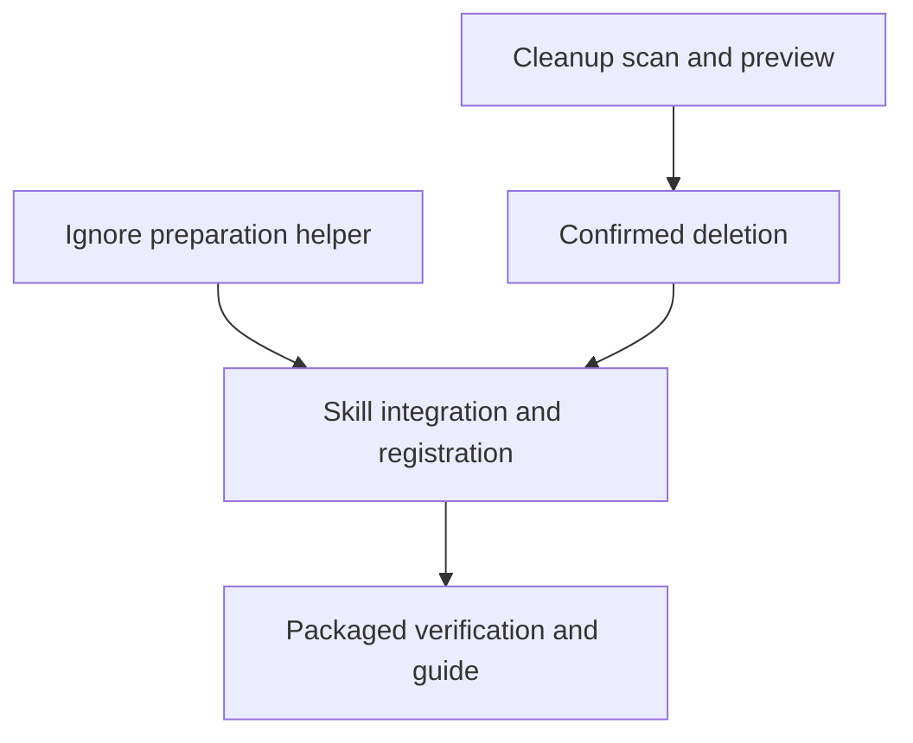

# feat: Add review artifact cleanup

## Overview

Add offline, user-initiated cleanup for old `ce:review` run directories. A dedicated skill previews a fixed selection and requires separate deletion approval. Add targeted ignore-file preparation to the review producer before it creates artifacts.

Age means last filesystem modification, not creation time or inactivity. The operator must stop all review writers using the checkout before preview and keep them stopped through deletion. The helper does not verify that precondition.

## Problem Frame

Issue #796 identifies indefinite retention of local review evidence. Findings can contain source excerpts even when they satisfy schema bounds and the skill's environment-value screening instructions. This repository ignores `.context/`, but that rule is not installed into consumer repositories.

Historical runs have no reliable cross-harness writer identity. An unfinished run can mean either an abandoned review or a paused writer. The approved resolution is offline cleanup, not an age-based claim of inactivity, retrospective locking, or automatic expiry.

Ignore preparation is new behavior. It changes writable review modes by adding a prerequisite before persistence; report-only remains entirely no-write.

## Requirements Trace

The origin is local and gitignored. This table carries its requirements and subsequent approved operating decisions into the distributable plan.

| ID | Requirement | Units |
|---|---|---|
| R1 | Prepare the targeted ignore file before persistence; verify protection in Git. Confirmed non-Git may continue after preparation; missing Git, ambiguous results, or preparation/verification failures block persistence with a diagnostic. | 1, 4, 5 |
| R2 | Preserve existing ignore entries and unrelated context data. | 1, 5 |
| R3 | Protection covers ordinary staging, not force-add, tracked files, or copies elsewhere. | 1, 4, 5 |
| R4 | Cleanup runs only on explicit request, never automatically. | 2, 3, 4 |
| R5 | Require a user-supplied age cutoff; no default TTL. | 2, 4 |
| R6 | Select runs older than the cutoff under the offline precondition; never infer inactivity. | 2, 3, 4 |
| R7 | Include old completed, failed, incomplete, legacy, in-progress, and artifactless runs, with observed labels. | 2, 5 |
| R8 | Require acknowledgment that all writers using the checkout are stopped before preview and remain stopped through deletion; do not claim tool-verified inactivity. | 2, 3, 4 |
| R9 | Skip and report uncertain age; no override. | 2, 3 |
| R10 | Preview candidates before asking for deletion approval. | 2, 4 |
| R11 | Never print source evidence or artifact contents in preview. | 2, 3, 5 |
| R12 | Require separate explicit deletion approval after preview. | 3, 4 |
| R13 | New or changed candidates require a renewed preview before deletion. | 3 |
| R14 | Report deleted, skipped, or failed for each candidate. | 3, 4 |
| R15 | Report partial completion when a confirmed deletion is skipped or fails. | 3 |
| R16 | Preserve report-only's no-write behavior, including no ignore preparation/verification, and existing environment-value screening. | 1, 4, 5 |
| R17 | Disclose that persisted findings may contain source excerpts. | 4, 5 |
| R18 | Disclose indefinite local retention until cleanup. | 4, 5 |
| R19 | Disclose ignore protection's limits. | 4, 5 |
| R20 | Disclose loss of local historical diagnostics after deletion. | 4, 5 |
| R21 | Confine deletion to the canonical review root; reject symlink candidates/traversal, with no outside-root override. | 2, 3 |
| R22 | Recheck each confirmed candidate immediately before deletion and skip drift; do not claim this defeats an uncooperative concurrent writer. | 3 |

## Scope Boundaries

- Only `.context/systematic/ce-review/` run directories are cleanup targets. Never delete that root, `.context/.gitignore`, or other tools' artifacts.
- No automatic expiry, count-based selector, content redaction, remote-copy erasure, Git untracking, or force-delete mode.
- No daemon, lease, heartbeat, historical inactivity detector, or review-artifact schema change.
- No new dependencies, npm CLI command, runtime module, Claude Code executable bundle, or CI workflow changes.
- The threat model is a local checkout operated cooperatively offline. It does not promise safety against concurrent malicious filesystem replacement, uncontrolled remote writers, or forged approval tokens.

## Context & Research

| Existing surface | Relevant behavior and limit |
|---|---|
| `skills/ce-review/SKILL.md`, `references/synthesis-artifact-contract.md` | The parent is instructed to persist artifacts; there is no centralized runtime writer to retrofit with historical liveness checks. |
| `skills/onboarding/scripts/inventory.mjs` | Existing builtin-only Node helper shipped with its skill and invoked through a skill-directory anchor. |
| `src/lib/review-artifact-path.ts` | Lexical containment, symlink rejection, and canonicalization precedent. Its resolver ends with a file check; cleanup requires a directory-shaped implementation, not a direct call. |
| `src/lib/pi-subagents-export.ts` | Ownership and identity rechecks before destructive mutation. Its writers cooperate within one module; its lock is not evidence that review writers have stopped. |
| `src/lib/setup.ts` | Trusted-path checks and controlled file replacement. It does not provide review ignore preparation. |
| `scripts/generate-registry.ts` | `generateSkillComponents` gathers files below each discovered skill. No cross-skill dependency is needed for independent helpers. |
| `scripts/build-claude-code-plugin.ts` | `collectSkillFiles` copies skill files; non-Markdown content passes through translation unchanged. |
| `scripts/generate-config-schema.ts` | Generates `src/lib/bundled-names.ts` and config schemas from discovered skill names. Adding a skill changes these surfaces. |

Institutional guidance:
- `docs/solutions/best-practices/anchor-bundled-script-paths-in-skill-prose-2026-08-24.md`: anchor every helper invocation to the loaded skill directory; terminate the assignment with a semicolon.
- `docs/solutions/integration-issues/pi-subagents-export-config-security-lifecycle-2026-07-30.md`: check ownership and identity at the mutation boundary, not just during selection.
- `docs/solutions/best-practices/unvalidated-artifact-contracts-have-no-conforming-producers-2026-08-23.md`: distinguish an instructed check from enforceable runtime behavior and verify consumer reach.
- `docs/solutions/best-practices/verify-a-no-change-claim-against-the-consumer-2026-09-08.md`: test the consumer-visible contract rather than inferring preservation from a diff.

## Prior-Art Survey

```json
{
  "schema_version": 2,
  "verdict": "extend",
  "scope": "skills/ce-review, skills/onboarding/scripts, src/lib/review-artifact-path.ts, src/lib/pi-subagents-export.ts, src/lib/setup.ts",
  "freshness": {
    "vcs_reference": "6d27120495b10618810bfdcdfc9c5bd20666fe29"
  },
  "budget": {
    "max_search_passes": 5,
    "max_candidate_inspections": 16,
    "exhausted": false
  },
  "candidates": [
    {
      "path_or_symbol": "skills/ce-review/SKILL.md",
      "description": "Owns instructions for parent-side review artifact creation and the report-only exception.",
      "disposition": "extend"
    },
    {
      "path_or_symbol": "skills/onboarding/scripts/inventory.mjs",
      "description": "Demonstrates self-contained Node helper delivery through a skill directory.",
      "disposition": "insufficient",
      "insufficiency_reason": "Owns onboarding inventory, not review ignore preparation or destructive cleanup. Reuse its delivery pattern, not its implementation."
    },
    {
      "path_or_symbol": "src/lib/review-artifact-path.ts",
      "description": "Resolves and validates review artifact file paths.",
      "disposition": "insufficient",
      "insufficiency_reason": "File-shaped validation does not own directory selection, approval, or deletion; cleanup mirrors its containment principles without extending its API."
    },
    {
      "path_or_symbol": "src/lib/pi-subagents-export.ts",
      "description": "Owns persona export manifests, cooperative mutation locks, and cleanup rechecks.",
      "disposition": "insufficient",
      "insufficiency_reason": "Persona ownership and writer cooperation do not apply to historical review directories. Use it as safety precedent without coupling the two lifecycles."
    },
    {
      "path_or_symbol": "src/lib/setup.ts",
      "description": "Owns project-local harness configuration writes and trusted-path checks.",
      "disposition": "insufficient",
      "insufficiency_reason": "It neither prepares the review ignore file nor manages review retention; no reusable ignore-preparation owner was found."
    }
  ]
}
```

## Key Technical Decisions

### Delivery and ownership

Create two independent builtin-only Node helpers. `skills/ce-review/scripts/ensure-ignore.mjs` ships with the producer, including a standalone OCX installation of `ce-review`. `skills/ce-review-cleanup/scripts/cleanup.mjs` ships with the new `ce:review-cleanup` skill. Neither imports the other or runtime TypeScript modules.

The helpers run through `node` and a `SKILL_DIR` anchor in every fenced invocation block, with a trailing semicolon on the assignment. No reliance on an npm `systematic` binary being on PATH. Missing Node or helper execution failure is diagnosed; agents must not substitute unchecked shell deletion. Runtime independence does not remove distribution obligations: registry, bundled-name schemas, and generated docs must remain aligned with the new skill.

Keep cleanup out of `ce:review`'s mode parser. Cleanup must never dispatch a review or create a new review run while asserting that writers are stopped. The Node scripts use noninteractive arguments and JSON output; the skill handles human questions through the host's interaction mechanism.

### Ignore preparation before writes

Writable review modes run the producer-local helper before creating a run directory. Exit 0 requires a valid structured result of `protected` or `not-applicable`; exit 2 denotes blocked preparation. Any other exit, missing output, or malformed result blocks persistence visibly. Report-only does not call it. This is a skill-enforced prerequisite, not a claim that arbitrary agents cannot bypass instructions.

Resolve the supplied project root to its canonical directory first. Below that root, refuse symlink components and a symlink/non-regular `.context/.gitignore`. Preserve existing bytes and mode, adding a line separator if needed and appending `/systematic/ce-review/`. Even when the repository already ignores `.context/`, the explicit nested entry must exist. Effective existing protection plus an existing exact entry is a no-write success.

Limit `.context/.gitignore` to 1 MiB. Check the opened descriptor's size, use bounded reads, and detect size changes or incomplete reads before accepting its bytes. An already-oversized file blocks with `ignore-file-too-large`, even if it already contains the required entry. Refuse an append that would cross the limit without modifying the file; never truncate content to fit. Changes detected during the write recheck remain conflicts.

Use exclusive temporary-file creation, recheck the original file identity/content before replacement, and clean up only the helper's own temporary file on failure. Never overwrite an observed conflicting edit. This is a single-file update, not a merge of concurrent edits or a cross-process transaction. A detected conflict or failed write blocks persistence. If the append succeeds but later Git verification fails, the intended append may remain; report failure without erasing a later editor's changes through rollback.

Invoke Git with argument arrays, a bounded timeout, controlled locale, and repository-redirection environment overrides removed. Do not print raw Git stderr or ignore-file contents. Classify conservatively:

| Git result | Behavior |
|---|---|
| Successful work-tree detection with `true` | Prepare the nested file and verify effective ignore behavior. |
| Git unambiguously reports no repository | Prepare the nested file, report `not-applicable`, and permit persistence. |
| Bare repository or unexpected successful output | Block as unsupported/ambiguous, not as a non-Git directory. |
| Missing Git, timeout, permission/safe-directory error, corrupt metadata, or any other ambiguous failure | Block with a fixed diagnostic category. |

An exit code alone, absence of a local `.git` directory, or `ENOENT` never establishes non-Git status. Test linked worktrees, nested directories, and malformed Git metadata. Non-Git classification must distinguish the controlled-locale no-repository diagnostic from other fatal errors; ambiguity fails closed.

Use `git check-ignore --no-index` to assess pattern behavior independently of tracked status. Check the review directory path itself with directory semantics and a descendant path without creating a canary artifact. A dummy descendant alone is insufficient. If a later same-file negation defeats an earlier exact entry, append the required entry and recheck; preserve the negation rather than deleting it. Once the review directory is excluded, descendant negations cannot re-include its contents. Failed effective verification blocks persistence rather than triggering edits to another ignore file.

The result always discloses that tracked files and force-add are unaffected. No untracking, root-ignore changes, or claim of backup protection.

### Candidate selection and age

Require an explicit offline acknowledgment before any cleanup scan and again on execution. It asserts that the operator has stopped all review writers using this checkout, including other sessions and machines. Do not run concurrent cleanup invocations on the same root; this is an exclusive offline maintenance operation, not a lock-based writer detector.

Candidates are direct, non-administrative child directories enumerated under the captured canonical review-root identity. Root replacement or rebinding invalidates the selection even if its path string is unchanged. Do not require modern timestamp-shaped names: historical layouts remain eligible. Non-directory administrative entries such as `.gitignore` are not candidates. A missing review root is a read-only no-op, not a reason to create it.

Walk each candidate with `lstat`, including its root directory. Reject the whole candidate on any internal or ancestor symlink, special file, unreadable entry, or incomplete traversal. Use a maximum depth of 32 and 10,000 entries per candidate; exceeding a bound skips that candidate with a reason, never partially deletes it. Root enumeration failure aborts the operation.

Age is the maximum finite filesystem modification time in that complete subtree. Accept a positive integer number of days, optionally suffixed with `d` or `w`; reject zero, decimals, negative values, malformed text, and unsafe arithmetic. Eligibility is strictly older than the fixed cutoff. Invalid or future modification times make age uncertain and skip the candidate. Restores and clock changes can affect eligibility in either direction; this is not an original-creation-time guarantee.

Read at most 1 MiB from a regular `review-summary.json` to derive a bounded status label. Recognize current status enums, legacy summaries, absent summaries, and malformed/unknown status separately. Status is never an eligibility gate. Parsing JSON reads artifact bytes into memory; only the projected enum is emitted, never findings, arbitrary status text, or parse-error content. Oversized summaries receive an unknown label rather than unrestricted reads.

Output JSON-escaped run names, last-modified time, observed label, counts, and fixed reason codes. Bound rendered names; derive the display identifier from a SHA-256 digest of the exact root-relative run name, lengthening its displayed prefix if needed to avoid a collision within the preview. That identifier is only a display key; deletion identity binds the exact name, root identity, and full subtree snapshot, including for artifactless runs.

Both helpers use allowlisted result fields and fixed diagnostic categories for every success, skip, and failure path. Never emit raw subprocess stderr, stack traces, nested filenames, artifact contents, absolute root paths, or arbitrary status values. Skill-rendered previews and final reports must preserve escaping of filesystem-derived names rather than inserting raw names into Markdown or terminal text; do not normalize names into a different deletion target. Helper-dispatch failures are summarized with a fixed category instead of repeating raw captured errors.

### Snapshot-bound preview and execution

The helper exposes separate preview and execute operations. Preview requires the age cutoff and offline acknowledgment. Execute requires that acknowledgment and the preview token; supplying a token is not proof of human approval. The skill must ask the user separately after presenting the preview and must never approve its own token.

A versioned, bounded token carries the reference time, normalized age duration, absolute cutoff, and snapshot digest. Those values are recoverable across invocations; a hash alone cannot recover a fixed cutoff. Validate their relationship and reject malformed, future-dated, oversized, or unsafe values. No token or approval manifest is written to disk.

Hash a canonical serialization of the canonical root identity, fixed cutoff inputs, direct-child inventory, and sorted candidate snapshots. Each snapshot includes its root and every descendant's relative path, type, device/inode identity, mode, size, modification time, and change time. Preserve filesystem timestamp precision in serialization. Aggregate max-mtime and file-count alone are insufficient: they miss same-count replacements and changes beneath an unchanged maximum timestamp.

Before any deletion, rescan with the token's fixed time boundary. A changed root, changed membership, changed selected candidate, or inconsistent scan invalidates the whole preview: delete nothing, return `preview-stale`, and require renewed preview and approval. Time passing alone must not expand the approved set.

Immediately before deleting each approved candidate, rescan its entire subtree and recheck root containment/identity. Subsequent drift skips that candidate; failures or skips during execution produce a partial result. Use only the approved direct-child path, never a target path supplied by a token. Refuse the review root itself and symlink traversal at every checked level.

The digest only binds execution to the previewed metadata; it authenticates neither operator consent nor the trustworthiness of the tree. Metadata checks do not guarantee detection of deliberate tampering that preserves metadata. Preview and execution are not atomic; the offline precondition remains necessary between recheck and removal.

| Result | Exit behavior |
|---|---|
| Preview complete, all confirmed deletions complete, or absent-root no-op | Exit 0 with an explicit operation/result field. |
| A confirmed deletion is skipped, fails, or only partly removes a directory | Exit 1; retain per-candidate results and identify partial completion. |
| Invalid arguments, missing acknowledgment, failed root/Git/ignore preparation, or unsafe operation setup | Exit 2; no deletion begins. |
| Preview token no longer matches before deletion starts | Exit 3; zero deletions and renewed preview required. |

Preview and final output both retain separate counts for selected, excluded-recent, skipped-unknown/unsafe, deleted, and failed items, with per-item reasons where applicable. Recent/ineligible items excluded before confirmation are not execution failures. An empty selection reports `nothing-eligible`, not that every historical directory was cleaned; unknown/unsafe exclusions remain visible in that result. Interruptions may leave partially deleted directories; do not promise rollback of deleted evidence.

## Implementation Units



- [x] **Unit 1: Add producer-local ignore preparation**

**Goal:** Implement the new prerequisite without publishing instructions for a missing helper.

**Requirements:** R1-R3, R16. **Acceptance examples:** AE8, AE11. **Dependencies:** None.

**Files:** Create `skills/ce-review/scripts/ensure-ignore.mjs` and `tests/unit/ce-review-ensure-ignore.test.ts`; regenerate `registry/registry.jsonc` to include the helper in the existing producer component.

**Approach:** Implement the canonical-root, preserved-byte update, Git classification, and effective-pattern checks above. Keep the helper independently executable under Node; no cross-skill import or runtime module. Follow `setup.ts`'s trusted-file reasoning and onboarding's helper delivery pattern, without copying their unrelated APIs.

**Execution note:** Implement test-first with real temporary Git/filesystem fixtures. Use controlled executable fixtures for timeout/missing-command diagnostics. Failure-path tests may inject faults through standard Node APIs only inside disposable Node child processes; never mutate builtins in the shared test worker, add production test hooks, or use a mocking library.

**Test scenarios:** Fresh repository and missing `.context`; root already ignores context but nested entry is absent; existing bytes with/without final newline; idempotent second invocation; same-file negation; deeper conflict; tracked-path caveat; linked worktree and nested root; Git-confirmed non-repository; ENOENT/timeout/corrupt metadata/unsafe repository block; symlink ancestors/file; observed file replacement conflict; source/diagnostic canaries never echoed.

**Verification:** Node invocation returns the expected result and exit code; unrelated bytes remain unchanged. Regenerate with `bun scripts/generate-registry.ts` and verify registry drift. No review instructions invoke the helper until Unit 4.

- [x] **Unit 2: Implement read-only cleanup scanning and preview**

**Goal:** Produce useful, bounded previews of historical run directories without mutating them.

**Requirements:** R4-R11, R21. **Acceptance examples:** AE1-AE3, AE6-AE7. **Dependencies:** None; independent of Unit 1.

**Files:** Create `skills/ce-review-cleanup/scripts/cleanup.mjs` and `tests/unit/ce-review-cleanup-preview.test.ts`. Do not add `SKILL.md` until the destructive helper is complete in Unit 3.

**Approach:** Implement acknowledgment/input validation, directory-shaped containment, full metadata walks, status projection, fixed-time selection, and token generation. The helper may expose internal functions for deterministic tests, but does not add an npm API or TypeScript declarations.

**Execution note:** Test-first. Exercise Node subprocesses from Bun tests so `.mjs` behavior is verified without pretending the repository's TypeScript checks cover it.

**Test scenarios:** Missing acknowledgment refuses even preview; missing root creates nothing; positive days/weeks and invalid/overflow input; exact cutoff equality excluded; newer nested entry protects an older directory; invalid/future/unreadable timestamp skips; arbitrary historical names and all status classes; no summary; malformed/oversized summary; control characters, misleading Markdown names, display-prefix collisions, and planted source canaries stay safely rendered or out of output; root/candidate/internal symlinks and special files refused; traversal bounds reported; input trees unchanged after preview.

**Verification:** Preview is read-only and repeatable for the same tree and fixed reference time. Old artifactless and in-progress runs are selectable under the operator precondition, without asserting inactivity.

- [x] **Unit 3: Add snapshot-bound deletion and result reporting**

**Goal:** Delete only the approved, unchanged selection and report actual outcomes.

**Requirements:** R8-R15, R21-R22. **Acceptance examples:** AE4-AE7, AE10. **Dependencies:** Unit 2.

**Files:** Modify `skills/ce-review-cleanup/scripts/cleanup.mjs`; create `tests/unit/ce-review-cleanup-delete.test.ts`.

**Approach:** Implement execute-mode token validation, initial whole-selection comparison, per-candidate full rechecks, directory removal, and structured partial reporting. Use Pi export's mutation-boundary recheck as precedent, not as a shared cleanup owner. Keep candidate deletion separate from scanning so tests can deterministically exercise a changed tree between those operations without sleep-based races.

**Execution note:** Test-first. Internal functions can be exercised by a Node subprocess test harness using Node assertions; do not introduce production test flags, arbitrary delete paths, or global syscall patches.

**Test scenarios:** Missing approval token/acknowledgment and malformed token; wrong root identity; same-count directory replacement; nested modification below unchanged max-mtime; added/removed candidate; fixed cutoff unaffected by elapsed time; initial mismatch deletes nothing; drift after initial comparison skips the affected candidate; per-candidate failure preserves other outcomes; partially removed directory reported failed; direct and nested symlink replacement refused; root and unrelated data remain; interrupted execution does not claim success or leave an approval artifact.

**Verification:** The identity/nested-change regressions fail when snapshot fields or the final recheck are removed. All mutation tests operate only on their own temporary directories, not the developer's review store.

- [x] **Unit 4: Integrate skills and register every generated surface**

**Goal:** Make the completed helpers reachable without breaking producer-only installations.

**Requirements:** R1-R20. **Acceptance examples:** AE7-AE9, AE11. **Dependencies:** Units 1 and 3.

**Files:** Create `skills/ce-review-cleanup/SKILL.md`; modify `skills/ce-review/SKILL.md` and `skills/ce-review/references/synthesis-artifact-contract.md`; create `tests/unit/ce-review-cleanup-contract.test.ts`; extend `tests/unit/skill-script-invocation.test.ts` as needed; regenerate `registry/registry.jsonc`, `src/lib/bundled-names.ts`, and `docs/public/schemas/v3/systematic-config.schema.json`.

**Approach:** Name the new skill `ce:review-cleanup`. It asks for offline acknowledgment, invokes preview, presents exclusions and risks, asks for deletion approval, then invokes execute and reports results. Both skill invocation blocks anchor to their own directory. Review's writing modes invoke the producer-local helper before their first artifact-directory creation; explicit failure is not a silent report-only fallback. Preserve the existing environment-value validation instructions.

**Patterns to follow:** Existing `ce:` naming, `SKILL_DIR` invocation conventions, and filesystem-driven registry/config-schema generation. No edit to `GENERATED_COMPONENT_DEPENDENCIES`: the helpers are self-contained. Do not modify the old review-artifact schema to record cleanup approvals.

**Test scenarios:** Cleanup invocation cannot select a review mode or dispatch personas; offline acknowledgment precedes preview and deletion approval follows it; no automatic approval from a digest; report-only skips ignore work; writing modes execute and inspect the helper result; each fence has its own semicolon-terminated anchor; descriptions and generated skill-name enums resolve; standalone `ce-review` component includes ignore helper without requiring cleanup installation.

**Verification:** Regenerate with `bun scripts/generate-registry.ts` and `bun run schema:generate`; check registry/schema drift and content integrity. The generated `docs/public/schemas/latest/systematic-config.schema.json` and `dist/schemas/systematic-config.schema.json` are verification outputs, not new committed files. Existing generator walks remain unchanged.

- [x] **Unit 5: Verify packaged execution and publish the operator guide**

**Goal:** Prove consumer reach and document the exact safety contract.

**Requirements:** R1-R3, R7-R8, R11-R20. **Acceptance examples:** AE3, AE7-AE9, AE11 at installed boundaries. **Dependencies:** Unit 4.

**Files:** Create `tests/unit/ce-review-cleanup-packaging.test.ts` and `docs/src/content/docs/guides/review-artifact-cleanup.mdx`; update `evals/cases/opencode/host-skill-coverage.json`, `tests/unit/skill-catalog.test.ts`, and `tests/unit/skill-tool.test.ts`.

**Approach:** Run helpers from isolated copies of the actual distributed files under Node, without source-tree imports or `node_modules`. Test producer-only OCX content, npm-packed skill files, and generated Claude Code files. Pi's native skill delivery must resolve the same relative helper path. Do not equate file presence or a successful build with executable reach.

Keep the package-boundary assertions together in the new test file, using the existing registry, Claude Code build, and package-export tests as patterns rather than duplicating their fixtures across files. Add the new skill to the explicit host-coverage manifest. Catalog and tool-description tests compare rendered identities with the catalog API and explicitly include the new skill; do not retain a hardcoded skill count.

**Test scenarios:** Producer-only file selection runs ignore preparation; cleanup-only file selection runs preview; npm and Claude Code packaged helpers run the same synthetic offline cleanup; Claude Code JavaScript bytes are unchanged by namespace translation; missing Node/helper gives an actionable failure rather than unsafe fallback; fixtures isolate HOME/XDG/Git configuration; no evidence canary reaches stdout/stderr.

**Documentation:** Explain explicit retention choice, last-modified cutoff semantics, offline responsibility, separate approval, partial failures, possible source excerpts, screening limits, ordinary-staging-only ignore protection, and loss of local diagnostic history. Document that missing Git blocks writing modes, while Git-confirmed non-Git directories may continue after preparation. Include the existing report-only alternative.

**Verification:** Generate docs with `bun run docs:generate` and build them. Generated references `docs/src/content/docs/reference/skills/ce-review.md`, `ce-review-cleanup.md`, and the skills index remain ignored outputs. No docs generator or CI edit is planned. Run final unit, typecheck, lint, build, content-integrity, schema/registry drift, and packaged-helper checks once after edits settle; repeat only affected checks following later changes. Existing host-contract CI supplies host integration evidence; do not run the expensive local integration suite for these filesystem helpers.

## System-Wide Impact

| Boundary | Change and assurance |
|---|---|
| Review producer to local disk | New ignore-preparation prerequisite in writing modes. Failures are visible; report-only and evidence screening are unchanged. |
| Operator to cleanup helper | Two human decisions; token binds the reviewed state but cannot authenticate consent. |
| Filesystem to deletion | Directory ownership is scoped by the review root, not by schema validity or modern run-name format. Reject unsafe traversal and recheck before mutation. |
| npm, Pi, Claude Code, OCX | Use existing skill asset delivery. Verify invocation from consumer-shaped copies, particularly standalone components. |
| Generated catalogs and docs | New skill changes registry and skill-name schema enums; regenerate those with the skill, not in a later repair. |

## Risks and Deferred Implementation Details

- **Offline precondition violated:** a writer can race deletion after a recheck. Disclose the limit; no liveness claim, advisory heartbeat, or daemon is introduced to hide it.
- **Filesystem metadata limits:** preserved timestamps and deliberate metadata restoration can evade checks. The snapshot detects ordinary drift under the cooperative offline model, not malicious tampering.
- **Ignore-file concurrency:** original-byte/identity rechecks do not make unrelated writers cooperative. Abort observed conflicts; do not claim atomic merging across arbitrary concurrent editors.
- **Partial deletion:** removal is irreversible and can stop mid-directory. Report failure honestly; no rollback or backup copy is created.
- **Runtime availability:** require helper execution on the installed surface. A missing executable blocks the requested operation; bundled prose alone is not reachability evidence.
- **Implementation-time checks:** exact Git diagnostic matching, filesystem precision differences, and deterministic failure fixtures must be verified on supported platforms. If confirmed non-Git cannot be classified unambiguously, fail with a diagnostic rather than broaden the exception.

Helper argument spelling and internal function names may be refined during implementation without changing the fixed-time token, offline acknowledgment, or approval contract. No unresolved product-policy choice is delegated to implementation.

## Sources and References

- **Origin:** `docs/brainstorms/2026-09-08-review-artifact-cleanup-requirements.md` is local-only/gitignored and will not exist in a fresh clone. The requirement table above is authoritative for this plan.
- **Issue #796:** supplied the retention/redaction/disclosure problem. Manual age cutoff, targeted ignore protection, offline operation, and the confirmed non-Git exception were selected during requirements discussion; they are not claims about the original issue's exact wording.
- **Git semantics:** [gitignore](https://git-scm.com/docs/gitignore) and [git-check-ignore](https://git-scm.com/docs/git-check-ignore), including precedence, excluded directories, tracked-file limits, and `--no-index`.
- **Filesystem semantics:** [Node 18 filesystem APIs](https://nodejs.org/docs/latest-v18.x/api/fs.html) and [child-process APIs](https://nodejs.org/docs/latest-v18.x/api/child_process.html), including `lstat`, timestamp metadata, recursive removal, and direct argument execution. Keep the existing Node 18+ runtime floor; normalize environment-key handling on Windows.
- **Prior review contract:** `docs/plans/2026-08-16-002-refactor-review-artifact-contract-plan.md` records the earlier retention deferral; this plan does not modify it.
