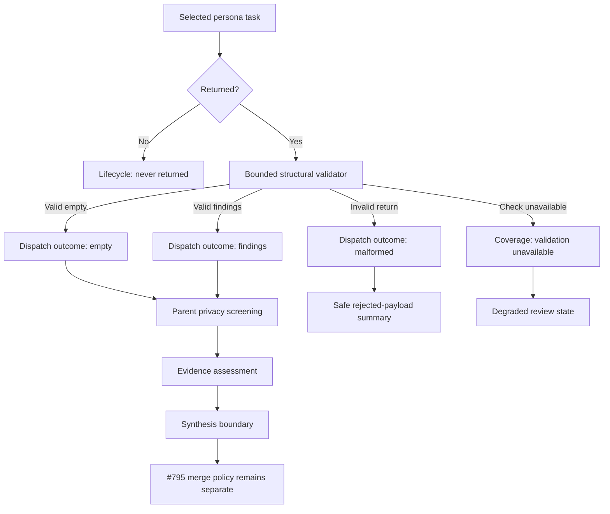
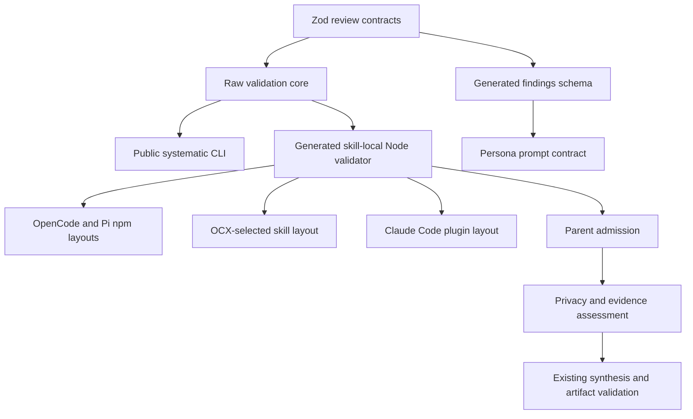

# fix: Validate reviewer returns and select reviewers by risk

## Overview

Make `ce:review` mechanically validate each raw persona return before synthesis,
without treating structural validity as proof that the reviewer's claims are
correct. Replace the fixed six-reviewer minimum with correctness, testing, and
project standards as the always-selected core, then select specialists from the
actual risk surfaces in the change.

The validation contract will be executable from every shipped skill layout
through one generated, skill-local Node script. The public
`systematic validate-review-return` command remains available for direct use and
testing. The aggregate review artifact stays at schema version 1, report-only
remains no-write, and issue #795 retains ownership of deterministic merge and
synthesis extraction.

---

## Problem Frame

`ce:review` currently conflates three independent facts: a selected reviewer
task completed, its returned payload conformed to the raw-return contract, and
its claims were supported by appropriate evidence. The raw-return JSON Schema
exists and is exercised by development-time Ajv tests, but no runtime command or
cross-harness skill path enforces it. A malformed or parent-annotated return can
therefore reach prose-driven reconciliation even though the written contract
says it must be rejected.

Reviewer selection has a separate defect. The skill always selects four review
personas plus two compound-engineering agents, producing a six-reviewer floor
even when only the three core lenses are relevant. Reviewer count has also been
used as a proxy for execution evidence, despite renderer, cache, packaging, and
host-boundary claims requiring targeted probes rather than more static review
lenses.

Issue #964 defines the required behavior and implementation scope. Current-main
inspection confirms both gaps and also confirms that the broader deterministic
merge pipeline remains prose-owned work tracked by issue #795.

---

## Requirements Trace

### Raw-return validation

- R1. Mechanically distinguish a conforming findings return, a conforming empty
  return, a malformed return, a validation check that could not run, and a task
  that never returned.
- R2. Preserve the current raw-return acceptance contract while rejecting
  parent-owned annotations and reporting only safe schema paths and codes.
- R3. Consume exactly one bounded JSON document from stdin, perform no writes or
  network activity, and never echo payload-derived keys or values.
- R4. Keep the raw-return and parent-record JSON Schema definitions generated
  from one executable Zod source without changing their established acceptance
  semantics or prompt-facing descriptions.

### Review acceptance and evidence

- R5. Require structural admission before synthesis in every review mode while
  keeping task lifecycle, structural validity, privacy screening, and evidence
  assessment separate.
- R6. Preserve report-only's no-write behavior, parent-side environment-value
  screening before persistence, and aggregate artifact validation after
  synthesis in writing modes.
- R7. Treat permission events, reviewer prose, stale checkout metadata, missing
  referents, and observed command output according to what they actually prove;
  unavailable evidence remains explicit uncertainty.
- R8. Preserve conservative handling when a selected risk-critical reviewer or
  finding validator fails; all-reviewer failure cannot produce a clean verdict.

### Reviewer selection and delivery

- R9. Always select correctness, testing, and project standards; select every
  other reviewer from an explicit relevant risk surface without an arbitrary
  line-count score.
- R10. Record and render why conditional reviewers were selected, and
  distinguish an intentionally unselected reviewer from one that was selected
  but failed.
- R11. Deliver the same generated validator semantics through npm package,
  OCX-selected skill, Pi extension, and Claude Code plugin layouts without
  relying on a globally linked `systematic` binary.
- R12. Add concrete regressions for malformed returns, safe diagnostics,
  no-write operation, degraded validation availability, evidence qualification,
  and core-plus-risk reviewer selection without adding a generic evidence
  framework or runtime dependency.

---

## Scope Boundaries

- Keep `ReviewArtifactSchema` at schema version 1; do not migrate or repurpose
  aggregate artifact fields.
- Do not change OMO task lifecycle, hosted-agent review submission, model
  routing, reviewer personas, cleanup/retention, locking, or workflow-guard
  version resolution.
- Do not execute commands or URLs cited by reviewers automatically. Reviewer
  evidence remains untrusted input until independently observed.
- Do not turn reviewer selection into a deterministic numeric scoring engine.
- Do not extract confidence filtering, deduplication, agreement boosts,
  provenance merge, ranking, ledger reconciliation, or final synthesis into a
  new module here.
- Do not make the full npm CLI or `dist/` layout a required skill runtime
  dependency.
- Do not modify `skills/document-review/references/findings-schema.json`; it is a
  separate contract with different confidence semantics.

### Deferred to Separate Tasks

- Issue #795 owns executable extraction of the deterministic review merge and
  synthesis pipeline.
- Removal of the existing Claude Code
  `systematic-validate-review-artifact` binary may be considered only after the
  skill-local aggregate validation path has shipped and accumulated evidence.
- The approved KTD8 amendment persists raw-validator unavailability as an
  additive artifact-v1 enum value (`dispatch_outcome: "validation_unavailable"`);
  no aggregate schema-version decision or migration is required. Earlier notes
  that described this as deferred are superseded.

---

## Context & Research

### Relevant Code and Patterns

- `src/lib/review-artifact-schema.ts` is the Zod source for the aggregate
  artifact and already owns compatible bounded reviewer, severity, path, and
  evidence leaf schemas.
- `scripts/generate-review-artifact-schema.ts` demonstrates Zod-to-JSON-Schema
  generation, Biome formatting, committed output, and `--check` drift behavior.
- `skills/ce-review/references/findings-schema.json` contains the current
  `subAgentReturn` and `parentRecord` contracts. It is loaded into reviewer
  prompts, so descriptions are behavior-bearing content rather than cosmetic
  schema metadata.
- `src/cli.ts` and `src/claude-code-validator.ts` establish safe projected Zod
  diagnostics and the existing aggregate-validator exit contract.
- `skills/ce-review/scripts/ensure-ignore.mjs` and
  `skills/ce-review-cleanup/scripts/cleanup.mjs` establish the skill-local Node
  helper pattern. Their packaging tests execute copied helpers from npm, OCX,
  and Claude Code layouts rather than checking file existence only.
- `tests/integration/receipt-workflow-recovery.test.ts` provides the strongest
  real OpenCode scripted-model harness for proving parent orchestration, tool
  calls, malformed returns, and filesystem effects.
- `tests/unit/skill-script-invocation.test.ts` enforces the portable
  model-filled `SKILL_DIR` invocation shape across one-at-a-time fenced blocks.

### Institutional Learnings

- `docs/solutions/best-practices/unvalidated-artifact-contracts-have-no-conforming-producers-2026-08-23.md`
  requires a visible parent-side executable validator; a schema declaration or
  model claim alone is not enforcement.
- `docs/solutions/integration-issues/cross-harness-tools-frontmatter-divergence-2026-08-16.md`
  requires subagents to return data inline while the parent owns validation and
  persistence, because tool restrictions differ across harnesses.
- `docs/solutions/best-practices/cross-harness-adapter-parity-contract-tests-2026-07-14.md`
  requires observable boundary tests for each adapter or package layout rather
  than relying on shared-core unit tests.
- `docs/solutions/best-practices/anchor-bundled-script-paths-in-skill-prose-2026-08-24.md`
  requires a model-filled `SKILL_DIR` assignment in every command block, with a
  terminating semicolon and no harness-specific variable.
- `docs/solutions/workflow-issues/merge-order-dependencies-must-be-structural-2026-08-25.md`
  records a prior executable-mode packaging regression and reinforces testing
  the shipped artifact, not just its source.

### External Research

No external research is required. The change extends established local Zod,
schema-generation, Node helper, packaging, and scripted-host integration
patterns without introducing a new framework or dependency.

---

## Prior-Art Survey

```json
{
  "schema_version": 2,
  "verdict": "extend",
  "scope": "review schemas, validators, ce:review skill assets, packaging, and tests",
  "freshness": {
    "vcs_reference": "65e4374249e5d9eb3d06dc790cbec6ce44ced24e"
  },
  "budget": {
    "max_search_passes": 3,
    "max_candidate_inspections": 10,
    "exhausted": false
  },
  "candidates": [
    {
      "path_or_symbol": "src/lib/review-artifact-schema.ts",
      "description": "Owns executable review schemas and bounded field definitions used by the aggregate artifact contract.",
      "disposition": "extend"
    },
    {
      "path_or_symbol": "scripts/generate-review-artifact-schema.ts",
      "description": "Owns committed review JSON Schema generation, formatting, writing, and drift comparison.",
      "disposition": "extend"
    },
    {
      "path_or_symbol": "skills/ce-review/references/findings-schema.json",
      "description": "Defines the raw persona return and parent-persisted record shapes embedded in reviewer prompts.",
      "disposition": "extend"
    },
    {
      "path_or_symbol": "src/cli.ts::runValidateReviewArtifact",
      "description": "Establishes public validator command dispatch, safe issue projection, and exit-status conventions.",
      "disposition": "extend"
    },
    {
      "path_or_symbol": "src/claude-code-validator.ts::runClaudeCodeValidator",
      "description": "Provides the existing purpose-built aggregate validator fallback for Claude Code packaging.",
      "disposition": "reuse"
    },
    {
      "path_or_symbol": "skills/ce-review/scripts/ensure-ignore.mjs",
      "description": "Establishes a skill-local Node helper invoked through a per-block SKILL_DIR anchor.",
      "disposition": "reuse"
    },
    {
      "path_or_symbol": "tests/unit/ce-review-cleanup-packaging.test.ts",
      "description": "Proves skill helper execution from npm, OCX-selected, and Claude Code bundle layouts under real Node.",
      "disposition": "reuse"
    },
    {
      "path_or_symbol": "tests/integration/receipt-workflow-recovery.test.ts",
      "description": "Provides a real OpenCode scripted-model harness for nested task behavior and filesystem assertions.",
      "disposition": "reuse"
    },
    {
      "path_or_symbol": "skills/ce-review/SKILL.md",
      "description": "Owns reviewer selection, dispatch, admission, evidence assessment, synthesis, and mode behavior.",
      "disposition": "extend"
    },
    {
      "path_or_symbol": "skills/ce-review/references/persona-catalog.md",
      "description": "Owns authoritative reviewer roles, baseline selection, conditional triggers, and risk-critical treatment.",
      "disposition": "extend"
    }
  ]
}
```

---

## Key Technical Decisions

- KTD1. **One Zod source for raw and parent records.** Add the raw-return and
  parent-record schema family to `review-artifact-schema.ts`, reusing leaf
  schemas only when semantics match. Raw findings use P0-P3 severity, while
  residual risks and testing gaps preserve their current looser string bounds.
- KTD2. **Parity precedes replacement.** Before overwriting the hand-maintained
  findings schema, compare old and generated schemas over the existing corpus
  and explicit boundary cases. The change may normalize generator syntax, but
  must preserve accept/reject outcomes, definition names, top-level parent
  reference, strictness, and prompt-facing descriptions. A prompt-consumer test
  assembles the real reviewer prompt from the committed generated schema so the
  integration point cannot silently drift.
- KTD3. **Stdin-only raw validation.** `validate-review-return` accepts one JSON
  document from stdin, has no file arguments or output-format flags, and caps
  input at 1 MiB measured as bytes with an early stop at cap plus one byte.
- KTD4. **Three exit classes.** Exit 0 means structurally valid; exit 1 means the
  returned payload was malformed, empty, oversized, or schema-invalid; exit 2
  means validation did not run because of usage, TTY, missing runtime, or stdin
  read failure. The raw command has no legacy exit status.
- KTD5. **No payload-derived diagnostics.** Emit fixed success text and safe
  JSON paths plus Zod issue codes only. Never emit issue messages, unrecognized
  key names, input values, normalized payloads, or schema fragments.
- KTD6. **Generated skill-local validator is a packaging compatibility shim.**
  A committed, drift-checked Node bundle under the `ce:review` skill exposes
  `return` and `artifact` subcommands because shipped skill layouts cannot all
  rely on the npm CLI or `dist/`. It is not a reusable validator framework or
  extension point. Every harness invokes it through `SKILL_DIR`; the public CLI
  and existing Claude Code artifact binary remain fallback interfaces.
- KTD7. **Structural validation does not become privacy or evidence validation.**
  The raw command performs only bounded parse and schema checks. The parent
  retains environment-value screening before persistence and separately
  assesses checkout identity, cited source, command output, and uncertainty.
- KTD8. **Validator unavailability is not malformed input, and it is persisted
  additively.** The parent never maps exit 2, a missing Node runtime, or a
  missing helper to `malformed` or `never_returned`. A returned-but-unverifiable
  reviewer's preinitialized dispatch entry is updated from `never_returned` to
  `dispatch_outcome: "validation_unavailable"` with `input_finding_count: 0`,
  an optional safe `rejection_reason`, and a `degraded` run status; it is never
  omitted and no rejected-summary ledger row is fabricated. This is an additive
  enum value: `schema_version` stays `1`, existing v1 artifacts remain valid,
  and no field or migration is added. Coverage still reports the exact
  unavailability and what was withheld, and the artifact-level `validation`
  fields are never repurposed.
- KTD9. **Selection stays model-owned but contract-bounded.** The three core
  reviewers always run. Conditional triggers and risk-critical fallback rules
  remain explicit and test-pinned, but no numeric risk score attempts to replace
  parent judgment.
- KTD10. **Admission stops before merge policy.** #964 decides whether a return
  can enter synthesis, what its evidence supports, and how validation coverage
  is surfaced. Any edits to synthesis-facing references are limited to that
  admission and coverage boundary. #795 continues to own filtering,
  deduplication, merge order, ranking, provenance, and reconciliation.

---

## Open Questions

### Resolved During Planning

- **How does validation run when the npm CLI is not on `PATH`?** Use a generated
  skill-local Node script as the primary path in all harnesses.
- **Should Claude Code gain a second dedicated binary?** No. The skill-local
  script already ships through Claude Code and avoids a second harness-specific
  command grammar and duplicate bundled Zod payload.
- **Should invalid parent fields be stripped?** No. Reject the entire raw return
  as malformed so the parent cannot admit attacker-selected annotations.
- **Does structural validation scan environment values?** No. Diagnostics are
  non-echoing, and the existing parent privacy screen remains authoritative
  before any persistence.
- **How is raw-validator unavailability persisted?** As
  `dispatch_outcome: "validation_unavailable"` on the selected persona's
  preinitialized dispatch entry, additively within artifact v1 (no new field, no
  migration, `schema_version` stays `1`). Coverage reports the exact
  unavailability and what was withheld; the artifact-level `validation` fields
  are unchanged and never repurposed.
- **Does risk selection become deterministic code?** No. Tests pin mandatory
  core membership, explicit conditional triggers, selection metadata, and
  conservative failure handling while leaving relevance judgment with the
  parent.

### Deferred to Implementation

- The exact Zod registry and metadata assembly needed to preserve the committed
  Draft-7 definition names and descriptions should be chosen after the parity
  test is red against the first generated candidate.
- The generated Node bundle's exact size and minification settings may be tuned
  after npm, OCX, and Claude package execution tests pass; semantic identity and
  source readability take precedence over byte minimization.
- The scripted OpenCode integration fixture may reuse the receipt-recovery mock
  server directly or extract only its smallest stable helper after the first
  failing behavior test establishes the necessary seam.

---

## High-Level Technical Design

> *This illustrates the intended approach and is directional guidance for
> review, not implementation specification. The implementing agent should treat
> it as context, not code to reproduce.*



| Mode | Raw structural check | Privacy screen | Artifact write | Aggregate validation |
|---|---|---|---|---|
| Interactive | Required | Before persistence | Yes | After synthesis |
| Autofix | Required | Before persistence | Yes | After synthesis and repair |
| Headless | Required | Before persistence | Yes | After synthesis |
| Report-only | Required | In memory | No | Not attempted because no artifact exists |

---

## Implementation Units

### U1. Canonicalize raw-return and parent-record schemas

**Goal:** Make the executable Zod module the source of truth for both the raw
persona return and the parent-persisted record without changing aggregate
artifact version 1.

**Requirements:** R1-R4.

**Dependencies:** None.

**Files:**

- Modify: `src/lib/review-artifact-schema.ts`
- Modify: `src/lib/AGENTS.md`
- Modify: `ARCHITECTURE.md`
- Test: `tests/unit/review-artifact-schema.test.ts`
- Test: `tests/unit/ce-review-findings-schema.test.ts`

**Approach:**

- Add named raw finding, parent finding, subagent return, and parent record Zod
  schemas alongside the aggregate artifact schema.
- Reuse reviewer, repository-relative path, finding severity, and evidence
  definitions where bounds are identical. Add raw-specific risk/gap strings
  where the existing `ReasonSchema` would tighten current behavior.
- Preserve strict object closure so parent-owned `harness`, `dispatch_outcome`,
  `disposition`, and validation annotations cannot appear in raw returns.
- Port every prompt-facing description into schema metadata before generated
  output replaces the committed schema.

**Execution note:** Start with failing parity and boundary tests before exporting
new schemas.

**Patterns to follow:**

- Existing strict Zod objects and bounded field schemas in
  `src/lib/review-artifact-schema.ts`.
- Safe issue projection rules in the aggregate validator tests.

**Test scenarios:**

- Happy path: valid empty and non-empty raw returns parse, including bounded
  overflow evidence.
- Boundary: raw P0-P3 severities pass while `medium` and parent-only `unknown`
  fail.
- Boundary: current residual-risk and testing-gap strings retain their existing
  acceptance semantics rather than inheriting `ReasonSchema` restrictions.
- Error path: parent fields at the root or finding level fail strict validation.
- Error path: absolute Unix, Windows-drive, and UNC file paths fail.
- Compatibility: current valid parent records and aggregate artifacts remain
  accepted without schema-version changes.

**Verification:** Executable schemas distinguish raw and parent ownership, and
the existing aggregate artifact corpus remains unchanged in outcome.

### U2. Generate the prompt schema from Zod with a parity gate

**Goal:** Replace the independently maintained findings schema with generated
output while preserving its behavioral and prompt contract.

**Requirements:** R2-R4, R12.

**Dependencies:** U1.

**Files:**

- Modify: `scripts/generate-review-artifact-schema.ts`
- Modify: `skills/ce-review/references/findings-schema.json`
- Test: `tests/unit/generate-review-artifact-schema.test.ts`
- Test: `tests/unit/ce-review-findings-schema.test.ts`
- Modify: `package.json`

**Approach:**

- Extend the existing generator and drift command to own both committed review
  schemas through path-explicit targets.
- Before replacing `findings-schema.json`, compile the committed and candidate
  schemas with Ajv and compare accept/reject outcomes over the full existing
  corpus plus explicit issue-boundary cases.
- Preserve the top-level reference to `parentRecord`, named `parentRecord` and
  `subAgentReturn` definitions, strict additional-property behavior, and all
  descriptions embedded in persona prompts.
- Permit non-semantic generator normalization such as equivalent union keywords
  only when parity tests and prompt-description coverage stay green.

**Execution note:** Treat the old committed schema as characterization evidence;
do not overwrite it until the generated candidate passes parity.

**Test scenarios:**

- Compatibility: old and generated schemas return identical results for every
  existing raw and parent fixture.
- Error path: explicit malformed cases from #964 fail under both schemas for the
  same contract reason.
- Prompt contract: required definition names, root reference, strictness, and
  description coverage survive generation.
- Prompt consumer: assemble the actual reviewer prompt from the canonical
  template and committed generated schema, then assert the behavior-bearing
  definitions and descriptions are the exact committed payload consumed by the
  reviewer. Do not freeze the old hand-maintained byte layout.
- Drift: changing either Zod contract makes the committed target fail its drift
  check until regenerated.
- Isolation: the document-review findings schema is not read, written, or
  matched by the generator.

**Verification:** One generator reproducibly owns both ce:review schema files,
and the established corpus proves no accidental acceptance change.

### U3. Add bounded raw-return validation and the public CLI command

**Goal:** Provide a runtime-neutral, no-write structural validator and expose it
as `systematic validate-review-return`.

**Requirements:** R1-R3, R11-R12.

**Dependencies:** U2.

**Files:**

- Create: `src/lib/review-return-validator.ts`
- Modify: `src/cli.ts`
- Modify: `src/lib/AGENTS.md`
- Modify: `ARCHITECTURE.md`
- Modify: `STRUCTURE.md`
- Create test: `tests/unit/review-return-validator.test.ts`
- Create test: `tests/unit/validate-review-return.test.ts`

**Approach:**

- Read stdin incrementally with a byte counter and stop at 1 MiB plus one byte;
  do not buffer an oversized payload.
- Reject TTY invocation immediately rather than waiting for interactive input.
- Parse exactly one JSON value and validate it against `SubAgentReturnSchema`.
- Return the three exit classes in KTD4 and fixed, non-echoing diagnostics in
  KTD5.
- Keep the command stdin-only and no-write: no file arguments, temporary files,
  schema-selection flags, output formats, or normalized JSON output.

**Execution note:** Implement the command test-first with real child-process
stdin and filesystem snapshots, not only imported-function tests.

**Test scenarios:**

- Happy path: valid empty and findings returns exit 0 with one fixed success
  line.
- Error path: malformed JSON, empty stdin, over-limit input, and schema-invalid
  input exit 1.
- Operational path: TTY/usage and injected stdin read failure exit 2 without a
  structural verdict.
- Security: secret-shaped strings in unknown keys, values, titles, and evidence
  never appear in stdout or stderr.
- Boundary: a multibyte UTF-8 payload is limited by bytes, not JavaScript string
  length.
- No-write: source and built CLI runs leave a synthetic cwd byte-identical and
  perform no network access.
- Regression: `validate-review-artifact` help, exit codes, and historical valid
  artifacts remain unchanged.

**Verification:** The public command behaves identically under the source and
built CLI entry paths and cannot echo rejected payload content.

### U4. Generate and package the skill-local validator

**Goal:** Make the validator executable from every shipped `ce:review` skill
layout without a globally installed CLI, using a thin packaging compatibility
shim rather than a new validation framework.

**Requirements:** R3-R4, R6, R11-R12.

**Dependencies:** U3.

**Files:**

- Create: `src/ce-review-validator.ts`
- Create: `scripts/generate-ce-review-validator.ts`
- Create generated file: `skills/ce-review/scripts/validate-review.mjs`
- Modify: `package.json`
- Modify: `.github/workflows/main.yaml`
- Modify: `.github/workflows/fro-bot.yaml`
- Modify generated file: `registry/registry.jsonc`
- Modify: `ARCHITECTURE.md`
- Modify: `STRUCTURE.md`
- Create test: `tests/unit/ce-review-validator-packaging.test.ts`
- Test: `tests/unit/build-claude-code-plugin.test.ts`
- Test: `tests/unit/generate-registry.test.ts`
- Test: `tests/unit/skill-script-invocation.test.ts`

**Approach:**

- Build a self-contained Node-target script from shared source and commit it
  under the skill with a deterministic generator and `--check` drift mode.
- Keep the generated entry limited to subcommand dispatch and calls into the
  shared validators; do not expose plugin hooks, user extension points, or a
  general validator registry.
- Expose `return` for bounded stdin validation and `artifact` for the existing
  aggregate file validator. Keep aggregate containment, exit codes, legacy
  detection, and `--allow-outside-artifact-root` behavior unchanged.
- Invoke the script through `node "$SKILL_DIR/scripts/validate-review.mjs"` in
  skill prose; Node absence or script failure is the explicit unavailable path.
- Add the new skill file to generated registry inventory and package it
  byte-identically through npm, OCX, and Claude Code outputs.
- Add the generator drift check to required CI and the repository's generated
  surface refresh workflow.

**Execution note:** Establish a generated-stub RED checkpoint before compiling
the working bundle, then verify with real Node rather than Bun's `process.execPath`.

**Test scenarios:**

- Packaging: from a real npm pack archive, an OCX-selected skill tree, and the
  generated Claude Code plugin, resolve the script through each layout's actual
  `SKILL_DIR` and run both `return` and `artifact` subcommands.
- Routing: assert each packaged layout reaches the intended subcommand and that
  an unknown subcommand cannot fall through to either validator.
- Runtime: assert `typeof Bun === 'undefined'` inside packaged executions.
- Drift: changing shared validator source fails the committed bundle check.
- No-write: both external cwd and synthetic project cwd remain unchanged after
  the `return` subcommand.
- Aggregate compatibility: run `artifact` from the skill directory while cwd is
  a synthetic project and confirm containment remains cwd-anchored.
- Failure: missing Node, a missing or unreadable generated script, or exit 2 is
  surfaced as unavailable rather than malformed in every packaged layout.
- Registry: the `ce-review` component includes the generated script and no
  unrelated component gains it.

**Verification:** The same generated bytes execute under real Node from every
supported package layout, and required drift/registry gates catch omissions.

### U5. Enforce structural admission and evidence limits in `ce:review`

**Goal:** Require the executable validator before a returned payload enters
synthesis while preserving existing privacy, evidence, and mode boundaries.

**Requirements:** R1-R8, R10-R12.

**Dependencies:** U4.

**Files:**

- Modify: `skills/ce-review/SKILL.md`
- Modify: `skills/ce-review/references/subagent-template.md`
- Modify: `skills/ce-review/references/synthesis-artifact-contract.md`
- Modify: `skills/ce-review/references/review-output-template.md`
- Modify: `HARNESSES.md`
- Create test: `tests/unit/ce-review-acceptance-contract.test.ts`
- Create integration test: `tests/integration/ce-review-return-validation.test.ts`

**Approach:**

- Dispatch the exact raw schema and run the generated validator against each
  completed persona return before parsing findings into synthesis.
- Map exit 0 plus empty/non-empty findings to `empty`/`findings`; map exit 1 to
  `malformed`; preserve `never_returned` as a task-lifecycle fact only.
- On exit 2 or unavailable runtime, do not admit the payload and do not call it
  malformed. Update the selected persona's dispatch entry to
  `validation_unavailable` with `input_finding_count: 0` and a `degraded` run
  status, surface degraded coverage and what was withheld, and retain explicit
  uncertainty.
- Keep the existing environment-value detector after structural admission and
  before any persistence. Reject whole malformed payloads with the existing
  non-echoing summary ledger convention.
- Add the skill-local `artifact` subcommand as the first aggregate-validation
  resolution path while retaining the existing bundled binary and npm CLI as
  fallbacks.
- Limit edits to synthesis-facing references and output templates to structural
  admission, validation coverage, and the existing failed-finding retention
  statement. Do not change filtering, deduplication, merge order, ranking,
  provenance, or reconciliation behavior owned by #795.
- Preserve finding validation behavior unchanged: a failed finding validator
  keeps the suspected issue actioned and records the failure.

**Execution note:** Start with a failing real OpenCode scripted-host scenario.
The test process must reap every spawned OpenCode process on success or failure
and must not modify global tool configuration.

**Test scenarios:**

- Lifecycle: a completed task with malformed JSON is `malformed`; a timed-out
  task is `never_returned`; validator unavailability is neither.
- Empty return: a conforming empty response counts as a returned lens but not as
  proof that no risk exists.
- Evidence: a structurally valid wrong-checkout citation remains unverified;
  permission logs and reviewer prose do not become observed command output.
- Uncertainty: a missing referent remains unavailable rather than disproven;
  actual contradictory evidence is recorded separately.
- Report-only: malformed rejection, validation, and evidence qualification run
  in memory with no artifact, directory, or ignore-file write.
- Writing modes: privacy screening occurs before persistence and aggregate
  validation still runs after synthesis.
- Scope boundary: characterization tests prove filtering, deduplication,
  ranking, provenance, and failed-finding retention remain byte- or
  behavior-identical outside the new admission and coverage wording.
- Failure: all selected personas failing cannot produce a clean verdict; a
  selected risk-critical loss remains blocking unless existing qualified
  coverage rules are satisfied.
- Integration: the real OpenCode host observes validator invocation and final
  report behavior for one conforming and one malformed scripted return.

**Verification:** A real host test proves parent behavior rather than only
checking Markdown, while unit contracts pin mode and reporting obligations.

### U6. Replace the six-reviewer floor with core-plus-risk selection

**Goal:** Align every authoritative selection surface around the three core
reviewers and explicit conditional risk lenses.

**Requirements:** R7-R10, R12.

**Dependencies:** U5, because both units edit the authoritative review stages
and must be reconciled serially.

**Files:**

- Modify: `skills/ce-review/SKILL.md`
- Modify: `skills/ce-review/references/persona-catalog.md`
- Modify: `skills/ce-review/references/subagent-template.md`
- Modify: `skills/ce-review/references/review-output-template.md`
- Create test: `tests/unit/ce-review-selection-contract.test.ts`
- Extend test: `tests/unit/ce-review-acceptance-contract.test.ts`

**Approach:**

- Always select correctness, testing, and project standards.
- Move maintainability, agent-native review, and learnings research behind their
  documented structural, agent-facing, and recurring-defect triggers.
- Preserve existing security, migration, API, reliability, performance, CLI,
  TypeScript, prior-comment, and adversarial conditional triggers and their
  risk-critical treatment.
- Record `selection_surface` and `selection_reason` for conditional reviewers.
  Render a concise selected-reviewer rationale in Coverage, including enough
  information to distinguish intentional non-selection from selected-but-failed
  execution. Keep execution probes as a separate parent decision with an
  evidence target and permission boundary.
- Remove every authoritative claim that six reviewers is the minimum without
  turning lower task count into the success metric.

**Execution note:** Characterize current selection text first, then replace it
with scenario contracts and one representative real review per risk class.

**Test scenarios:**

- Core-only: a small prose correction selects exactly the three core lenses and
  does not manufacture unrelated specialists or runtime probes.
- Structural: a refactor selects maintainability; an agent-facing capability
  selects agent-native review; a relevant recurring failure class selects
  learnings research.
- Risk-critical: auth, migration, public API, reliability, and performance
  surfaces retain their corresponding conditional reviewer and conservative
  failure handling.
- Runtime evidence: a small renderer or asset-delivery change may require a
  focused execution probe without restoring the six-reviewer floor.
- Failure: a selected risk-critical reviewer cannot disappear from coverage by
  shrinking the reported team.
- Operator signal: Coverage names the selected specialist set and its risk
  surfaces without dumping internal scoring or implying that unselected lenses
  failed.
- Mode parity: all four modes use the same reviewer-selection policy while
  preserving their mutation and output differences.
- Drift: no stale four-plus-two or six-reviewer-minimum statement remains in an
  authoritative ce:review reference.

**Verification:** Selection contracts, authoritative references, and
representative core-only/risk-critical reviews agree on selected lanes and
required evidence.

---

## System-Wide Impact



- **Interaction graph:** Persona completion feeds the generated structural
  validator before existing privacy screening, evidence assessment, synthesis,
  and aggregate artifact validation.
- **Error propagation:** Payload defects become `malformed`; invocation defects
  become validation-unavailable coverage. Neither is rewritten as task timeout
  or evidence verification.
- **State lifecycle risks:** Report-only remains in memory. Writing modes retain
  the existing single parent-owned artifact write and post-write validation
  contract.
- **API surface parity:** The public npm CLI, skill-local generated script, OCX
  file list, Pi/npm package, and Claude Code bundle must expose identical raw
  schema semantics even though their invocation shells differ.
- **Integration coverage:** Unit tests prove schemas and commands; package tests
  prove shipped bytes; a real OpenCode scripted-host test proves the parent
  invokes validation and respects no-write mode.
- **Unchanged invariants:** Aggregate schema version 1, input finding ledger
  semantics, validator-failure retention, existing reviewer personas, and #795's
  merge responsibility remain unchanged.

---

## Acceptance Examples

- AE1. A reviewer returns a conforming empty payload. Structural validation
  passes, dispatch outcome is `empty`, and the report does not claim that all
  risks were disproven.
- AE2. A reviewer returns malformed JSON containing a secret-shaped string.
  Validation exits 1, the parent records a safe malformed summary, and no output
  or artifact contains the supplied string.
- AE3. Node or the generated helper is unavailable. The parent persists
  `dispatch_outcome: "validation_unavailable"` (zero findings, degraded run
  status) on the selected persona's dispatch entry, reports degraded validation
  coverage and what was withheld, admits no payload, and does not label the
  reviewer malformed or never-returned.
- AE4. A structurally valid finding cites the wrong checkout. The return is
  admitted structurally, but the claim remains unverified until current-target
  evidence resolves the mismatch.
- AE5. Report-only processes conforming and malformed returns and renders the
  result without creating `.context`, an artifact, or an ignore entry.
- AE6. A small documentation correction selects correctness, testing, and
  project standards only, and Coverage explains that no conditional risk
  surface triggered. A small renderer change may add design or reliability
  coverage and a focused runtime probe without selecting six static reviewers.
- AE7. A selected security reviewer never returns and no validated alternative
  covers its risk surface. The run is blocked or degraded according to the
  existing risk-critical contract and cannot be reported clean.
- AE8. The generated validator executes from npm, OCX-selected, and Claude Code
  package layouts under real Node with byte-identical semantics.

---

## Risks & Dependencies

| Risk | Mitigation |
|---|---|
| Generated schema changes acceptance | Characterize old and generated schemas over the full corpus before replacement. |
| Prompt-facing schema drifts despite equivalent validation | Assemble the actual reviewer prompt from the committed generated schema and pin its behavior-bearing definitions and descriptions without freezing the old byte layout. |
| Zod errors echo attacker-controlled key names | Project only paths and issue codes; test secret-shaped keys and values byte-for-byte. |
| Skill helper drifts from source | Commit generated output and require deterministic `--check` verification in CI. |
| Package layouts omit or misroute the generated script | Resolve it through each real layout and execute both subcommands, including unknown-command and missing/unreadable-script failures. |
| Aggregate validator behavior changes while unifying resolution | Reuse the existing runner and pin cwd containment, legacy, flag, and exit semantics. |
| Validator unavailable state is mistaken for malformed input | Keep exit 2 separate and pin parent mapping plus Coverage wording. |
| Selection prose diverges across references | Test the core set, conditional triggers, counts, and stale six-floor phrases together. |
| U5 expands into #795's merge engine | Limit synthesis-facing edits to admission, coverage, and preservation statements; characterize merge behavior as unchanged. |
| Real-host tests leak processes or mask PATH defects | Run one targeted harness path, reap process groups on every exit, and forbid global installs. |

---

## Documentation / Operational Notes

- Update `HARNESSES.md` with the actually tested invocation path for OpenCode,
  Pi/npm, OCX, and Claude Code. Distinguish package execution evidence from a
  true runtime review session where no headless harness exists.
- Update `ARCHITECTURE.md` and `STRUCTURE.md` for the new shared validator module,
  generated skill helper, generator, and public CLI command.
- Keep generated schema and validator refresh commands visible in `package.json`
  and required CI drift gates.
- Preserve the current public aggregate validator documentation and mark the
  skill-local artifact subcommand as a resolution improvement, not a new
  artifact contract.
- No migration or release-time operator action is required.

---

## Sources & References

- Issue: https://github.com/marcusrbrown/systematic/issues/964
- Related issue: https://github.com/marcusrbrown/systematic/issues/795
- `src/lib/review-artifact-schema.ts`
- `src/cli.ts`
- `src/claude-code-validator.ts`
- `scripts/generate-review-artifact-schema.ts`
- `skills/ce-review/SKILL.md`
- `skills/ce-review/references/findings-schema.json`
- `skills/ce-review/references/synthesis-artifact-contract.md`
- `skills/ce-review/references/persona-catalog.md`
- `tests/unit/ce-review-cleanup-packaging.test.ts`
- `tests/integration/receipt-workflow-recovery.test.ts`
- `docs/solutions/best-practices/unvalidated-artifact-contracts-have-no-conforming-producers-2026-08-23.md`
- `docs/solutions/integration-issues/cross-harness-tools-frontmatter-divergence-2026-08-16.md`
- `docs/solutions/best-practices/cross-harness-adapter-parity-contract-tests-2026-07-14.md`
- `docs/solutions/best-practices/anchor-bundled-script-paths-in-skill-prose-2026-08-24.md`
