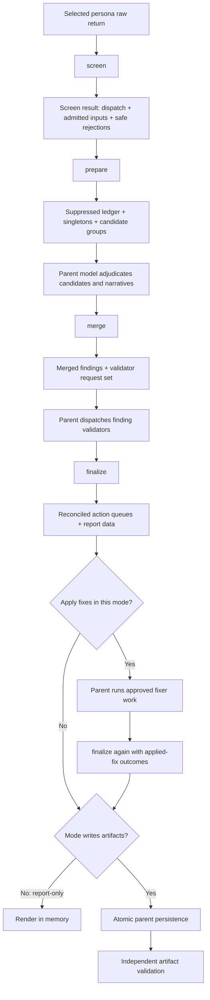
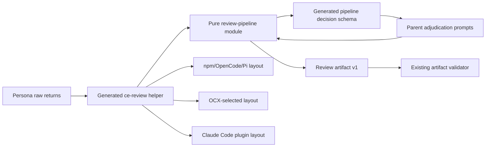

# fix: Make the review synthesis pipeline executable

## Overview

Replace `ce:review`'s prose-executed deterministic merge and synthesis steps
with a strict, side-effect-free TypeScript pipeline that the parent invokes
through the existing skill-local Node helper in every harness.

The executable pipeline will admit structurally valid reviewer returns,
assign parent-owned identities, apply the confidence gate, form candidate
groups, consume explicit model-owned adjudication decisions, derive merged
provenance and conservative routing, reconcile finding-validator outcomes,
build action queues, calculate risk coverage and disposition counts, and return
schema-conforming `review-summary.v1` data in writing modes plus the equivalent
in-memory report projection in report-only mode.

The parent still owns orchestration and persistence. Reviewers still own their
claims. The parent model still owns evidence judgment, merge/dedup decisions,
merged narrative, disagreement explanations, validator interpretation, plan
completeness assessment, and report prose. Code owns only the transformations
whose correct result follows mechanically from those inputs.

Success is operational rather than aesthetic: the same admitted evidence and
judgment envelopes must produce the same synthesized result, and a previously
repair-prone artifact fixture must pass conformance on the first authoritative
finalization (KTD14) without parent-written count or reference repair. The plan
does not claim that
executable bookkeeping makes model judgment better.

---

## Problem Frame

Issue #964 made raw reviewer-return validation executable and bound admitted
returns to the dispatched persona before persistence or synthesis. It also strengthened `ReviewArtifactSchema` so final artifacts reject
ghost finding IDs, duplicate ledger IDs, incomplete provenance, invalid
agreement credit, and unsupported risk-coverage citations.

The producer remains prose-driven. `skills/ce-review/SKILL.md` still instructs
the parent model to implement the confidence thresholds, candidate grouping,
agreement boost, conservative routing, work partitioning, sorting, coverage
union, validator-result bookkeeping, ledger reconciliation, risk-aware verdict,
and artifact assembly by hand. The final validator can reject a malformed
artifact, but it cannot make every producer apply the same deterministic rules
before the artifact exists.

This leaves three defects:

1. Correctness depends on the parent reproducing arithmetic, ordering, and
   cross-field reconciliation from prose.
2. OpenCode, Pi, and Claude Code can produce different results from the same
   validated reviewer returns and adjudication decisions.
3. The workflow can skip deterministic steps and rely on repair after artifact
   validation, rather than constructing a conforming result by design.

The data flow is not one uninterrupted pure pass. Deterministic work occurs
before candidate adjudication, after adjudication but before finding-validator
dispatch, and after validator results return. The implementation therefore
needs explicit phase contracts rather than one opaque "synthesize" function.

---

## Requirements Trace

### Admission and privacy boundary

- R1. Preserve the existing bounded raw-return structural validation contract,
  including the 1 MiB byte cap, EOF framing, exits 0/1/2, safe projected
  diagnostics, and no payload-derived error output.
- R2. Execute reviewer identity binding inside the packaged helper on behalf of
  the parent, before any admitted finding can reach a persisted record or later
  pipeline phase.
- R3. Admission is environment-invariant. No pipeline phase reads the process
  environment, and the same structurally valid return produces byte-identical
  admission regardless of the shell that launched the helper. Never serialize
  environment values, variable names, or dynamic exception text into an input
  envelope, stdout result, diagnostic, artifact, or log; all rejection and
  internal-error paths use fixed reason codes and schema-safe paths only.
- R4. Rejection is whole-return only, because schema failure and identity
  mismatch are the sole remaining triggers and both are properties of the return
  rather than of one finding. The rejected-summary entry, degraded status, and
  risk-critical coverage consequences stay exactly as they are; only their
  environment trigger is gone. Diagnostics remain persona, JSON path, and one
  fixed reason from `schema validation` or `malformed JSON`.
- R5. Assign stable input IDs from the original reviewer finding index and add
  only parent-attested `reviewer`, `harness`, and `dispatch_outcome` metadata;
  never trust those values from a reviewer payload.

### Deterministic preparation and adjudication boundary

- R6. Apply the confidence gate before candidate grouping: suppress findings
  below `0.60`, except that P0 findings at `0.50` or higher survive; retain each
  suppressed input in the ledger with its original confidence and fixed reason.
- R7. Form candidate groups mechanically by normalized repository-relative file
  path, requiring findings from at least two different personas, sorting group
  members by line and stable input ID, and never treating adjacency as proof of
  equivalence.
- R8. Give the parent model every candidate group through one strict,
  generated decision contract. The model must partition each eligible input ID
  exactly once into a singleton or merge, record declined separations, and
  provide only judgment-owned narrative and narrowing decisions.
- R9. Reject malformed adjudication rather than repairing it heuristically:
  unknown, suppressed, duplicated, omitted, cross-group, or wrong-file input
  references must fail with bounded authored diagnostics.

### Deterministic merge and validation reconciliation

- R10. Derive severity, confidence, agreement boost, fingerprint, submitters,
  eligibility of agreement credit, and pre-existing status from admitted inputs
  and adjudication decisions rather than trusting model-supplied arithmetic.
- R11. Enforce conservative routing. Model judgment may narrow a route with a
  bounded reason, but cannot make `autofix_class`, `owner`, or
  `requires_verification` less conservative than the admitted inputs allow.
- R12. Emit the exact finding-validation request set mechanically: every P0/P1
  finding and every finding with `requires_verification: true`; no other finding
  receives a validator request.
- R13. Consume one strict lifecycle result for every requested validator. A
  negative result filters the synthesized finding and all contributing inputs;
  a failed or timed-out validator keeps the finding, records explicit
  uncertainty, leaves `validated` absent, and cannot count as validated
  cross-persona risk coverage. Count only `validated === true` for in-band
  coverage; absent is not a pass.

### Finalization, artifact, and modes

- R14. Derive final dispositions, weighted disposition counts, pre-existing
  separation, action queues, stable sorting, exact-string coverage unions, and
  risk-critical coverage from the reconciled state.
- R15. A failed risk-critical persona or rejected risk-critical finding can
  produce a clean verdict only when another persona owns an eligible finding on
  the recorded selection surface; self-coverage, filtered evidence, validator-
  unavailable evidence, or off-surface evidence cannot satisfy it.
- R16. Route explicit plan-completeness gaps to residual actionable work and
  verdict gating, and inferred gaps to advisory output. Never fabricate persona
  input IDs or place plan-only gaps in `findings`.
- R17. In writing modes, produce an artifact that passes
  `ReviewArtifactSchema` before returning success. Keep `schema_version: 1` and
  the committed
  `review-summary-schema.json` bytes unchanged unless implementation proves a
  reader-visible shape change is unavoidable.
- R18. Preserve report-only as a fully executable, no-write flow. The same
  screen, prepare, merge, and finalize semantics run in memory without creating
  `.context`, changing `.gitignore`, or invoking an artifact write.
- R19. In writing modes, persist the exact successful helper output rather than
  hand-recomputing counts, provenance, routes, or coverage. Artifact validation
  remains an independent post-write check.
- R20. Missing helpers, launch failures, invalid phase envelopes, invalid
  adjudication, or irreconcilable validator results have explicit non-success
  states and never fall back to executing the deterministic rules in prose. A
  side-effect-free helper launch/exit-2 failure may be retried once with the
  exact same input bytes; an invalid model-owned envelope receives one bounded
  correction cycle. Exhaustion stops visibly. Finding-validator task failures
  retain their existing uncertainty path and are not redispatched implicitly.

### Sensitive-evidence policy and failure boundaries

- R24. State plainly, in the contract and in the reviewer template, that review
  artifacts may contain sensitive source-derived information and are not
  certified secret-free. Instruct reviewers to describe credential defects
  without reproducing credential values, and record that a source-level
  environment reference is valid evidence rather than a rejection trigger. These
  are instructions that reduce accidental disclosure, not technical containment;
  the plan must not claim otherwise.
- R25. Terminate every subcommand entry point in one exception boundary that maps
  any unexpected throw to a fixed reason code and safe path list. Cover async
  failure at process scope too — `unhandledRejection` and `uncaughtException`
  otherwise print an untrapped message and stack straight to stderr and defeat
  the whole no-echo contract. No stack trace, exception message, absolute
  filesystem path, or environment detail reaches stdout or stderr on any exit
  path, including bounded-reader failures and internal invariant violations.
- R26. Create the finalization temp file inside the already-created run directory
  with exclusive creation and owner-only permissions, and remove it on every
  non-success exit. Record plainly that a hard process kill can leave one temp
  file behind, and that the accepted worst case is a stale temp file, never a
  truncated or partially written `review-summary.json`.

### Delivery and evidence

- R21. Ship the same executable phases through npm/OpenCode/Pi, OCX-selected,
  and Claude Code plugin layouts by extending the existing generated
  `skills/ce-review/scripts/validate-review.mjs` bundle and `SKILL_DIR`
  invocation convention.
- R22. Generate the intermediate pipeline contract from Zod, commit it beside
  the skill references, include it in reviewer-parent prompt assembly where
  decisions are requested, and gate both schema and helper drift in CI.
- R23. Prove pure transformations with focused unit tests, packaged helper
  behavior under real Node in every shipped layout, and one real scripted
  OpenCode orchestration path. State explicitly that this is package parity plus
  one live host, not live Pi/Claude runtime parity.

---

## Scope Boundaries

- Keep reviewer selection, model assignment, task dispatch, and CE-agent
  selection unchanged.
- Keep raw reviewer-return schemas and public `systematic
  validate-review-return` behavior unchanged.
- Keep reviewer evidence truth, defect equivalence, merge adjudication,
  narrative synthesis, disagreement explanations, validator judgment,
  requirements completeness assessment, and report wording model-owned.
- Do not infer semantic equivalence from matching files, lines, titles, or
  fingerprints. Candidate formation is deterministic; merging is not.
- Do not add an entropy heuristic, a redaction pass, an environment allowlist, a
  revised secret-name list, or any replacement secret scanner. The environment
  screen is removed outright; nothing takes its place inside this pipeline.
- Do not expand the OpenCode-only workflow guard, add receipts, or claim
  provenance that the helper cannot observe.
- Do not add dependencies, a daemon, database state, lock files, or a second
  generated Node bundle.
- Do not require the npm CLI or `dist/` from skill execution.
- Do not make the helper own the review lifecycle or incremental on-disk state.
  The core stays pure and the parent stays responsible for orchestration and
  persistence.
- Keep semantic deduplication of residual risks/testing gaps and human-facing
  report formatting outside the pure pipeline; only exact-string deduplication
  and stable data ordering are executable here.

### Deferred to Separate Tasks

- Sensitive-evidence handling beyond documentation: preserving a finding's
  identity while requesting a rewritten version that carries no credential
  literal, keeping the replacement linked to the original so it is not
  double-counted, and blocking a clean verdict when evidence stays unresolved.
  This is the real replacement for the deleted screen, and it is a feature with
  its own design surface rather than a rider on this one. If a demonstrated need
  later justifies automatic protection, it belongs at the artifact-write boundary
  over explicitly supplied protected values, never at reviewer admission over
  ambient environment contents.

- Real multi-persona inline-transport and synthesis-load characterization.
- Live Pi and Claude Code end-to-end review runs.
- Cryptographic or receipt-backed proof that the parent invoked every helper
  phase.
- Changes to review-artifact retention, cleanup, locking, or run ownership.
- A generic workflow engine or reusable adjudication framework.

---

## Context & Research

### Current ownership

- `skills/ce-review/SKILL.md` owns Stage 4 raw admission, Stage 5 merge rules,
  Stage 5b validator dispatch, Stage 6 presentation, and mode-specific action
  flow.
- `skills/ce-review/references/synthesis-artifact-contract.md` owns dispatch,
  ledger, provenance, sensitive-evidence handling, artifact-validation, and
  risk-coverage semantics.
- `src/lib/review-artifact-schema.ts` is the executable Zod source for raw
  reviewer returns, parent records, and `review-summary.v1`, including global
  referential checks.
- `src/lib/review-return-validator.ts` owns bounded stdin and safe structural
  validation for one raw return.
- `src/ce-review-validator.ts` is the purpose-built skill helper entry point;
  `scripts/generate-ce-review-validator.ts` bundles it into the committed Node
  helper.
- `tests/unit/ce-review-validator-packaging.test.ts` executes the committed
  helper from npm, OCX, and Claude Code package layouts.
- `tests/integration/ce-review-return-validation.test.ts` is the narrow real
  OpenCode scripted-host seam for proving the parent invokes the shipped helper.

### Institutional learnings

- `docs/solutions/best-practices/unvalidated-artifact-contracts-have-no-conforming-producers-2026-08-23.md`
  requires visible parent-invoked enforcement rather than self-enforcing prose.
- `docs/solutions/integration-issues/cross-harness-tools-frontmatter-divergence-2026-08-16.md`
  requires reviewers to return inline data while the parent retains validation
  and persistence capability.
- `docs/solutions/best-practices/cross-harness-adapter-parity-contract-tests-2026-07-14.md`
  separates pure-core, packaged-boundary, and real-host evidence.
- `docs/solutions/best-practices/anchor-bundled-script-paths-in-skill-prose-2026-08-24.md`
  requires one model-filled `SKILL_DIR` assignment per fenced command block,
  terminated with a semicolon.
- `docs/solutions/best-practices/verify-a-no-change-claim-against-the-consumer-2026-09-08.md`
  requires consumer-side proof for behavior-preserving extraction claims.
- `docs/solutions/workflow-issues/registry-drift-on-skill-description-change-2026-05-20.md`
  requires regenerating the registry when a new skill reference file changes
  the declared component file list.

### External research

No external research is required. The plan extends established local Zod,
generated-schema, Node-bundle, package-layout, and scripted-host patterns without
introducing a new dependency or unfamiliar API.

---

## Prior-Art Survey

```json
{
  "schema_version": 2,
  "verdict": "extend",
  "scope": "ce:review pipeline, artifact contracts, generated helper, and review tests",
  "freshness": {
    "vcs_reference": "849afdcb71d0d32a38bf55dfd5a46c460d167a22"
  },
  "budget": {
    "max_search_passes": 3,
    "max_candidate_inspections": 10,
    "exhausted": false
  },
  "candidates": [
    {
      "path_or_symbol": "skills/ce-review/SKILL.md",
      "description": "Owns the parent review stages whose deterministic rules must become helper invocations while judgment and presentation remain model-owned.",
      "disposition": "extend"
    },
    {
      "path_or_symbol": "skills/ce-review/references/synthesis-artifact-contract.md",
      "description": "Owns dispatch, ledger, provenance, sensitive-evidence, validation, and risk-coverage semantics consumed by the executable pipeline.",
      "disposition": "extend"
    },
    {
      "path_or_symbol": "src/lib/review-artifact-schema.ts",
      "description": "Provides the canonical raw, parent, and aggregate Zod schemas and the final referential-integrity boundary.",
      "disposition": "reuse"
    },
    {
      "path_or_symbol": "src/lib/review-return-validator.ts",
      "description": "Provides the bounded stdin and safe structural-validation behavior reused by the screen phase.",
      "disposition": "reuse"
    },
    {
      "path_or_symbol": "src/ce-review-validator.ts",
      "description": "Provides the purpose-built generated-helper entry point that can route the new executable phase subcommands.",
      "disposition": "extend"
    },
    {
      "path_or_symbol": "scripts/generate-review-artifact-schema.ts",
      "description": "Provides deterministic Zod-to-JSON-Schema generation and drift checking for committed ce:review contracts.",
      "disposition": "extend"
    },
    {
      "path_or_symbol": "scripts/generate-ce-review-validator.ts",
      "description": "Provides the single committed skill-local Node bundle and its source-drift gate.",
      "disposition": "reuse"
    },
    {
      "path_or_symbol": "tests/unit/review-artifact-schema.test.ts",
      "description": "Provides aggregate artifact acceptance and referential-integrity fixtures that final pipeline output must satisfy.",
      "disposition": "extend"
    },
    {
      "path_or_symbol": "tests/unit/ce-review-validator-packaging.test.ts",
      "description": "Provides real-Node execution coverage across npm, OCX-selected, and Claude Code package layouts.",
      "disposition": "extend"
    },
    {
      "path_or_symbol": "tests/integration/ce-review-return-validation.test.ts",
      "description": "Provides the existing real OpenCode scripted-host seam for proving parent invocation and report-only no-write behavior.",
      "disposition": "extend"
    }
  ]
}
```

---

## Key Technical Decisions

- KTD1. **Four executable phases across two modules.** Add
  `src/lib/review-pipeline-contract.ts` for the strict schema family and
  `src/lib/review-pipeline.ts` for `screenReviewReturn`,
  `prepareReviewCandidates`, `applyReviewAdjudication`, and `finalizeReview`.
  The phase split follows the real judgment boundaries;
  collapsing phases would either ask the model to adjudicate hidden candidates
  or require finalization before validator results exist. `screen` and `prepare`
  stay separate despite having no model decision between them: `screen` admits
  one raw payload at a time and binds it to its dispatched persona, while
  `prepare` consumes only already-admitted output across all personas. Rejected
  alternative: a single merged pre-adjudication phase, which would blur the
  raw-payload trust boundary and make per-persona admission outcomes harder to
  attribute. The contract/orchestration split keeps either file reviewable;
  promote a phase to `src/lib/review-pipeline-<phase>.ts` if its logic outgrows
  thin routing, and add that file's registration rows in the same unit.
- KTD2. **Extend the existing helper bundle.** Add `screen`, `prepare`, `merge`,
  and `finalize` subcommands to `src/ce-review-validator.ts`, preserving the
  existing `return` and `artifact` subcommands. Do not rename the generated file
  or create another bundle and drift matrix.
- KTD3. **Admit raw text once.** `screen` receives one reviewer payload verbatim
  on stdin and strict non-secret arguments for expected reviewer and invoking
  harness. It reuses raw structural validation internally, binds dispatch
  identity, and emits a strict result envelope. The skill replaces its separate
  `return` invocation with `screen`; the public raw validator and `return`
  subcommand remain unchanged for compatibility.
- KTD4. **The pipeline never reads the environment.** Admission depends only on
  the payload, the expected reviewer, and the harness name. Nothing in any phase
  reads `process.env`, so the same return admits identically on every machine.
  Success output contains only admitted payload data. Rejection output contains
  only authored reason categories and safe JSON paths.

  Rejected alternative, with evidence: keeping the environment screen and
  repairing its keyword list. The control made review completeness a function of
  ambient shell contents, which is incompatible with a pipeline whose purpose is
  deterministic synthesis. It also conflated three distinct things — an
  environment reference in reviewed source is ordinary evidence, an exported
  value is not necessarily sensitive, and a secret is not necessarily exported,
  so a clean screen never meant more than "these patterns did not match." Its
  reach was bounded by whatever the launching shell happened to export, which
  excluded repository secrets, credential stores, and any encoded bypass. The
  cost of that partial reach was destroying real review evidence: with the
  default macOS `KEYTIMEOUT=1`, every finding containing the digit `1` was
  rejected, including on severity `P1`. Underscore-guarding the keyword list,
  adding a length floor, requiring whole-token matches, and matching on entropy
  were each considered and rejected; every one preserves the shell dependency
  while narrowing only the specific collisions already known.
- KTD5. **Every post-screen envelope is strict, bounded, and versioned.** Add a
  `review-pipeline.v1` discriminated Zod schema family for screen results,
  preparation state, adjudication decisions, merge results, validator lifecycle
  results, plan assessment, and finalization input. Keep helper-produced
  intermediate state internal to TypeScript/Zod and its tests; commit JSON
  Schema only for model-authored envelopes consumed by later phases. Aggregate
  input uses a
  byte-counted bounded stdin reader with a documented cap derived from the
  maximum accepted review shapes plus fixed headroom; it stops at cap plus one
  byte and never performs an unbounded read. State the cap as a named constant
  whose derivation is written down: which schema maxima contribute (persona
  count, findings per persona, bounded evidence and reason lengths, ledger rows),
  the serialization assumption used to count bytes, and the explicit headroom
  term. A cap that cannot be recomputed from those inputs is a magic constant and
  fails review.
- KTD6. **Generate the judgment contract.** Extend
  `scripts/generate-review-artifact-schema.ts` to emit
  `skills/ce-review/references/review-pipeline-schema.json` from the Zod source.
  The parent prompt consumes the committed generated decision definitions; no
  hand-maintained JSON duplicate is allowed.
- KTD7. **Confidence precedes adjudication.** `prepare` applies the P0 exception,
  suppresses ineligible inputs, constructs candidate groups from survivors, and
  returns singletons separately. A suppressed input cannot be resurrected by an
  adjudication decision.
- KTD8. **Adjudication is a partition, not a suggestion.** `merge` requires each
  eligible candidate input ID exactly once, rejects cross-group reuse and
  omission, and derives declined-merge records from explicit partition reasons.
  The model owns the merge decision and narrative fields; code owns membership,
  references, arithmetic, and provenance. `merge` is still invoked when
  `prepare` emits zero candidate groups: the decision set must be empty and all
  surviving singletons pass through as a deterministic no-op.
- KTD9. **Routing uses a refusal boundary.** The helper derives the most
  permissive route that *every* contributing input permits — the meet of the
  per-field constraints, never the most permissive route any single input would
  allow on its own. The model may select
  a stricter route with a reason, but the helper rejects any widening of
  `autofix_class`, owner action category, or `requires_verification`. Do not sort
  unrelated enum strings and call that policy. Encode a per-field refusal table
  over the three independent vocabularies in `src/lib/review-artifact-schema.ts`
  — `AutofixClassSchema` (`safe_auto`, `gated_auto`, `manual`, `advisory`),
  `OwnerSchema` (`review-fixer`, `downstream-resolver`, `human`, `release`), and
  boolean `requires_verification`. For each field the table must state what
  counts as widening, what counts as narrowing, and which pairs are
  incomparable and therefore refused. The derived route is the meet of the
  field-specific constraints, never a global enum order.
- KTD10. **Validator failure is uncertainty, not success.** A validator `false`
  result sets `validated: false` and filters all contributing inputs. A timeout,
  task failure, malformed result, or unavailable validator keeps the finding,
  leaves `validated` absent, records the lifecycle failure in Coverage, and
  makes the run degraded. It is never labeled `validated: true` and cannot
  satisfy risk-critical replacement coverage.
- KTD11. **Risk coverage is derived.** For each lost risk-critical persona,
  `finalize` considers only cross-persona, non-filtered findings on its recorded
  selection surface. Findings outside the validation band are eligible;
  validation-band findings are eligible only after an explicit true result.
  Choose the citation deterministically from the final stable finding order.
  The existing artifact refinement at `src/lib/review-artifact-schema.ts:619`
  currently tests `finding.validated !== false`, which admits an absent result
  and contradicts R13 for in-band findings. Tighten it alongside the finalizer so
  the two agree. This is a Zod refinement, not a shape change, so it is not
  projected into JSON Schema and `review-summary-schema.json` stays
  byte-identical.
- KTD12. **Requirements findings do not impersonate reviewer findings.** The
  model supplies a strict plan-assessment envelope. Explicit unmet requirements
  become residual actionable work and gate the verdict; inferred gaps become
  advisory output. Neither receives an `input_finding_id` or enters `findings`.
- KTD13. **Pure output, parent-owned persistence.** Every phase is stdout-only,
  side-effect-free, and deterministic for identical inputs; the helper never
  reads Git identity or the wall clock, so the parent supplies bounded run
  metadata. The output-affecting metadata contract is exactly `run_id`, mode,
  harness, branch, `head_sha`, selected dispatch records, parent-captured
  timestamps, validation status, and applied-fix outcomes. Caller cwd, artifact
  path, temporary filename, and unrelated parent metadata are not envelope
  fields and cannot affect output. `finalize` returns a discriminated result: writing modes include a
  `ReviewArtifactSchema` artifact plus report/action data, while report-only
  includes the equivalent report/action projection without an artifact wrapper
  or persistence-only fields. In writing modes, the parent captures successful
  artifact output into a temporary file inside the already-created run
  directory and atomically renames it to `review-summary.json`; a failed helper
  never truncates the prior artifact.
- KTD14. **Finalization is safely repeatable around fixes, with one authoritative
  call.** The parent first calls `finalize` with no applied-fix outcomes to
  obtain deterministic action queues. If the selected mode applies fixes, it
  calls the same pure finalizer again with the exact applied-fix outcomes to
  produce terminal report/artifact data. Report-only calls it once and never
  enters a write or fix path. Exactly one call is authoritative for persistence:
  in fix-applying modes the first call is an advisory planning pass that must not
  be persisted, and the post-fix call is the terminal result; in report-only and
  non-fix writing modes the single call is authoritative. The second call reuses
  the first call's validator lifecycle results verbatim and does not redispatch
  validators; fix verification belongs to a subsequent review run, not to this
  one.
- KTD15. **Artifact validation remains independent.** In writing modes,
  `finalize` validates the artifact against `ReviewArtifactSchema` before
  returning it. Writing modes still
  invoke the existing `artifact` subcommand against the persisted file and
  record the validation result according to the current contract. Repair means
  correcting the bounded model-owned decision envelope and rerunning the helper,
  never hand-editing derived fields.
- KTD16. **No prose fallback.** `screen` unavailable retains today's
  `validation_unavailable` dispatch semantics. Finalization preserves that
  dispatch entry unchanged with `input_finding_count: 0`, no admitted or
  rejected-summary ledger row naming the persona, degraded status, and lost-
  risk coverage evaluation when the persona is risk-critical. Failure or
  unavailability after admission is an orchestration failure: retry the same
  pure invocation once for launch/exit-2 failures, then stop with visible
  degraded/abnormal state, retain any in-progress artifact, and do not
  reconstruct pipeline output manually.
- KTD17. **Schema version 1 remains.** The final artifact shape and reader
  contract do not change. The new intermediate contract has its own version;
  `review-summary-schema.json` must remain byte-identical or the implementation
  must stop and return to design review. Byte identity is only achievable if the
  pipeline owns computation and not shape: no new artifact fields, no key
  reordering, no serializer or formatting change. Any pressure to carry extra
  state belongs in `review-pipeline.v1`. Rejected alternative: letting the new
  producer reshape the persisted artifact, which would silently break every
  existing v1 reader for no gain inside this issue's scope.
- KTD18. **The stdin phases share one CLI shape; `artifact` is exempt.**
  `screen`, `prepare`, `merge`, and `finalize` join `return` on one stdin framing
  contract, one argument-parsing path, and one exit-code vocabulary. All six
  subcommands share the dispatch table and the exit-code vocabulary. `artifact`
  keeps its existing path-argument contract unchanged and is explicitly exempt
  from the stdin rule — unifying it would be a breaking CLI change this issue
  does not authorize. This is the repository's first multi-phase generated helper
  — `src/ce-review-validator.ts` currently routes two subcommands — so the
  convention is set here. No other per-command special case ships without being
  documented centrally alongside the dispatch table.
- KTD19. **Per-finding derived state crosses the wire; run-level aggregates
  are derived at finalize; both are verified, neither is re-authored.** Landing
  Units 1-4 exposed three contract gaps that blocked artifact assembly,
  confirmed by independent review on 2026-09-14: the merge wire projected away
  `severity`, `confidence`, `fingerprint`, `pre_existing`, and `submitters`
  although `deriveMergedFindingFields` computes them and the phase table
  promised them; the finalize envelope omitted prepared state and screen
  results, so the ledger, rejected weights, coverage notes, and reviewer
  ownership had no source; and the plan-assessment envelope arrived pre-routed
  with a model-authored `run_status`, contradicting KTD12. The fix widens the
  intermediate contract rather than recomputing inside `finalize`, under two
  distinct rules:
  - *Carried per-finding fields.* The merge wire carries every field
    `deriveMergedFindingFields` produces. `finalize` takes prepared state and
    the full screen-result set as inputs. Because every envelope between
    helper calls passes through the parent, carried fields are trust inputs,
    not proof: `finalize` re-runs the same derivation over the carried
    survivors as a verifier and rejects any carried field that differs. The
    derivation is reused, never duplicated, and the artifact is built from the
    verified wire values.
  - *Finalize-only aggregates.* Rejected-payload weights, lost risk-critical
    personas, and run status exist only at finalize. They are derived there
    from carried screen summaries and selected dispatches under the loss rules
    in `skills/ce-review/references/synthesis-artifact-contract.md`
    ("Risk-aware degraded verdict"), never accepted as authored envelope
    fields, which would let a caller omit a loss or disagree with ledger
    counts.
  Rejected severities are extracted at screen time as bounded enum values
  only, so the parent never carries rejected bodies. The plan-assessment
  envelope supplies classified, unrouted results plus a verdict narrative.
  `dispatch_records`, `parent_run_metadata.selected_dispatches`, and
  `screen_results` must form an exact one-to-one join: any missing, duplicate,
  or extra entry rejects before loss or coverage derivation runs. Only
  `review-pipeline-schema.json` regenerates; KTD17 still holds.
- KTD20. **The verdict path is corrected before it is exposed.** The same review
  found six defects in the already-landed finalize steps, all in scope here
  because a `clean` verdict that ignores them defeats the issue. Each maps to
  one sub-unit: a `false` validator result drops its reason although the
  artifact requires `validation_reason` (5.6); `clean` checks only three gates,
  so every non-risk reviewer can fail and `validation_unavailable` never forces
  degraded status per KTD16 (5.13); unconfirmed in-band findings enter action
  queues although the stable derivations exclude them (5.7); a survivor missing
  from the disposition ledger silently defaults to `surviving` instead of
  rejecting (5.7); finding order has no final input-ID tie-breaker, so it is
  not total (5.3); and lost-persona coverage candidates sort by model-owned
  `finding_id` rather than the canonical severity/confidence/path/line order
  (5.8), while the artifact refinement compares paths literally where the
  helper normalizes them (5.9).
- KTD21. **An unknowable rejected count produces no ledger row.** Both the
  pipeline and the artifact rejected-summary shapes require a positive count,
  and KTD17 forbids moving the artifact. A whole-payload rejection whose
  finding count cannot be determined (unparseable JSON, an identity-mismatched
  empty return) therefore yields only the dispatch entry with its outcome,
  `rejection_reason`, and `input_finding_count: 0`, contributes zero rejected
  weight, and creates no rejected-summary row. The loss rule already treats
  that outcome as lost for a risk-critical persona, so nothing is silently
  downgraded; the count is simply not invented.

---

## Open Questions

### Resolved During Planning

- **Can an interrupted run be resumed?** No. The helper is side-effect-free and
  owns no on-disk state, and the parent holds phase state only in context, so a
  parent killed between `merge` and `finalize` cannot resume. An interrupted run
  is abandoned; the next attempt allocates a fresh run ID and starts at `screen`.
  The stale directory remains as read-only diagnostic evidence, consistent with
  `synthesis-artifact-contract.md`: an absent artifact is never evidence of a
  clean run.
- **What happens when every finding is suppressed or every reviewer is
  unavailable?** The empty path is already fully specified. `prepare` yields no
  survivors, `merge` runs as a required empty-decision no-op (KTD8), and
  `finalize` reconciles to zero counts. An all-unavailable run is degraded and
  still requires risk-critical coverage evaluation (AE17), which is not the same
  as a clean run (AE1).
- **Do applied fixes trigger re-validation inside the same run?** No. The second
  `finalize` reuses the first call's validator lifecycle results verbatim
  (KTD14). Verifying that a fix worked, or did not introduce a new defect, is a
  subsequent review run.
- **What does the user see when bounded repair is exhausted?** The workflow stops
  visibly. The parent surfaces the helper's exit-1 diagnostic, records degraded
  or abnormal status, retains any in-progress artifact, and does not attempt a
  third call or fall back to prose synthesis (R20, KTD16).
- **Do existing artifacts need migration?** No. `schema_version: 1` and
  `review-summary-schema.json` are unchanged (KTD17), and artifacts predating the
  contract are already excluded as legacy by the existing validator.
- **Does anything stop a secret reaching the artifact?** No, and the plan must
  not be read as claiming otherwise. The environment screen was removed because
  its reach was set by whatever the launching shell exported, which is neither a
  security boundary nor compatible with deterministic synthesis. What remains is
  guidance: artifacts are not certified secret-free, and reviewers are told not
  to reproduce credential values.

### Accepted Gaps

These are open tradeoffs, not tasks. They are recorded so nobody mistakes the
plan's guarantees for stronger ones than it makes.

- **Determinism is bounded by model-authored input.** The pipeline makes the
  transformations reproducible, but the model still authors the inputs to three
  of the four phases. Identical reviewer evidence can still produce different
  synthesized results if the model partitions, narrows, or narrates differently.
  The claim this plan can support is "identical admitted evidence *and* identical
  judgment envelopes produce identical output" — not "identical reviewer evidence
  produces identical reviews." Decide whether that is enough before implementing,
  because no amount of additional executable bookkeeping closes it.
- **Parent-captured timestamps are inside the output-affecting contract
  (KTD13).** Two runs over identical substantive evidence therefore differ at the
  byte level. Either exclude timestamps from the equivalence contract or
  normalize them before comparison; the plan currently does neither and asserts
  determinism anyway.
- **Cross-harness reproducibility is the goal, but no live Pi or Claude Code run
  is planned.** Evidence is package-layout execution under real Node plus one
  real OpenCode host. The plan states this honestly; it does not close the gap.
  Harness-specific orchestration bugs will surface after release.

### Deferred to Implementation

- The exact shape of the applied-fix outcome envelope: whether an outcome is a
  flag or carries bounded failure states. Settled in Unit 1's contract work and
  pinned by Unit 5's tests.
- Cleanup of an orphaned finalization temp file left by a hard kill. R26 fixes
  permissions and the non-success path; whether run-directory initialization also
  sweeps unrecognized temp files is a Unit 6 detail.
- The concrete cell values of the routing refusal table. KTD9 fixes the shape and
  forbids enum sorting; the per-field entries are authored and tested in Unit 4.

---

## High-Level Technical Design



### Terminology

- **Raw-return validation** means structural `SubAgentReturnSchema` admission of
  one reviewer payload.
- **Pipeline-envelope validation** means strict validation of `screen`,
  `prepare`, `merge`, or `finalize` input/output.
- **Finding validation** means the Stage 5b reviewer judgment returning
  `validated: true|false` or a lifecycle failure.
- **Artifact validation** means the independent post-write
  `ReviewArtifactSchema`/`artifact` subcommand check.

### Phase contracts

| Phase | Deterministic input | Model-owned input | Deterministic output |
|---|---|---|---|
| `screen` | Raw return bytes, expected persona, harness | Reviewer claims | Dispatch outcome, admitted parent findings with stable IDs, safe rejected summary, residual risks/testing gaps |
| `prepare` | All screen results and selected dispatch metadata | None | Confidence dispositions, exact coverage union, stable singletons, complete candidate groups |
| `merge` | Prepared state | Candidate partition, merged narrative, decline reasons, route narrowing, agreement credit | Derived severity/confidence/provenance/routes, merged findings, validator requests, disagreement facts |
| `finalize` | Merge state, prepared state, every screen result, dispatches, validator lifecycle results, parent-attested run metadata | Unrouted plan-assessment results, verdict narrative, applied-fix outcomes | Filtered/surviving findings, ledger, queues, risk coverage, counts, derived run status, stable order, and a writing-mode artifact or report-only projection |

### Stable derivations

- Normalize repository-relative paths with one function used by candidate groups,
  fingerprints, sorting, and risk-surface comparison.
- Preserve original finding index in `<reviewer>#<index>` even when earlier
  findings are rejected.
- Candidate groups contain all surviving findings for one normalized file only
  when at least two distinct reviewers are represented.
- Derive merged severity as the highest severity and merged confidence as the
  highest input confidence plus `0.10` when submitters and eligible agreement
  credit together represent at least two independent reviewers, capped at
  `1.0`.
- Derive provenance submitters from cited admitted input IDs; validate
  agreement-credit uniqueness, eligibility, and disjointness.
- Derive merged `pre_existing` as true only when every contributing input is
  pre-existing; mixed evidence remains actionable.
- Sort findings by severity, confidence descending, normalized path, line, then
  stable fingerprint/input ID tie-breakers.
- Exclude `validated: false` and validator-unavailable in-band findings from
  action queues and risk-replacement coverage as required by their distinct
  uncertainty states.

### Failure semantics

| Condition | Required behavior |
|---|---|
| `screen` structural/schema failure or identity mismatch | Exit 1; map to `malformed`; no payload fields are admitted; diagnostics remain bounded and payload-safe. |
| Reviewer identity mismatch | Exit 1; map to `malformed`; no admitted fields; the diagnostic names the expected persona and nothing from the payload. |
| `screen` launch/read/TTY failure | Exit 2 or launch failure; map to `validation_unavailable`; zero admitted findings; degraded run. |
| Invalid `prepare`/`merge`/`finalize` envelope | Exit 1 with authored path/code diagnostics; fix the model-owned envelope and retry within the existing bounded repair discipline. |
| Aggregate stdin read/usage failure | Exit 2; do not parse partial data or fall back to prose execution. |
| Helper missing or crashes after screen | Visible orchestration failure; retain in-progress evidence and stop without a final verdict. |
| Writing-mode artifact fails `ReviewArtifactSchema` | Exit 1; derived output is not written. Treat as an implementation/input-contract defect, not something to repair by editing counts or references. |
| Post-write artifact validator fails | Preserve the failing artifact, correct the model-owned input or implementation, rerun `finalize`, replace atomically, and revalidate. |

Bounded recovery is exact: retry one side-effect-free launch/exit-2 failure once
with identical bytes; allow one corrected model-owned envelope after exit 1;
then stop. Do not retry finding-validator task failures automatically because
their unavailable lifecycle is itself evidence recorded by finalization.

---

## Implementation Units

Units 2 through 5 each regenerate the committed helper while
`skills/ce-review/SKILL.md` still describes the prose flow. That intermediate
state is deliberate and knowingly non-shippable: the helper gains subcommands no
skill prose calls yet. Treat Units 2-6 as one release train and do not cut a
release between them. If the train has to be interrupted, stop after Unit 1,
which adds only contracts and a generated reference.

- [x] **Unit 1: Define the strict pipeline contract and generated schema**

  **Files:**
  - Add `src/lib/review-pipeline-contract.ts` (schema family). Landed.
    `src/lib/review-pipeline.ts` (phase functions) moves to Unit 2, where the
    first phase implementation gives it real content — an empty module would
    have carried stub bodies that lie about behavior.
  - Add `tests/unit/review-pipeline-contract.test.ts`, mirroring the module name
    per repo convention.
  - Extend `scripts/generate-review-artifact-schema.ts` by adding the new schema
    to `REVIEW_SCHEMA_TARGETS`; `review-schema:generate`, `review-schema:drift`,
    and `postupgrade` then cover it without further script changes.
  - Add generated
    `skills/ce-review/references/review-pipeline-schema.json`.
  - Extend `tests/unit/generate-review-artifact-schema.test.ts`, which asserts
    the exact target list and will fail on a third target until updated.
  - Register both new modules on both gate-enforced surfaces: one `ARCHITECTURE.md`
    codemap entry and one `src/lib/AGENTS.md` module-table row each. Register the
    generated reference in registry output.

  **Behavior:**
  - Define strict `review-pipeline.v1` Zod schemas for every phase input/output
    and model-owned decision envelope.
  - Reuse `SubAgentReturnSchema`, `ParentRecordSchema`, and projections derived
    from `ReviewArtifactSchema`; do not mirror compatible leaf schemas by hand.
  - Bound arrays, strings, evidence, reasons, and aggregate stdin. Derive and
    document the aggregate byte cap from accepted shape maxima rather than an
    arbitrary convenience value.
  - Generate prompt-facing JSON Schema only for model-authored adjudication,
    validator lifecycle, plan assessment, and finalization decisions. Keep
    helper-produced phase state out of the committed schema surface.

  **Test-first proof:**
  - Start with failing tests for unknown keys, duplicate decision IDs, missing
    candidate dispositions, out-of-bound reasons, illegal route widening shape,
    and malformed validator lifecycle states.
  - Pin that the generated pipeline schema changes when the Zod decision
    contract changes, while `review-summary-schema.json` remains byte-identical.

- [x] **Unit 2: Implement side-effect-free return admission**

  **Files:**
  - Extend `src/lib/review-pipeline.ts`.
  - Add `tests/unit/review-pipeline-screen.test.ts`.
  - Extend `src/ce-review-validator.ts` with `screen` routing.
  - Add `tests/unit/ce-review-validator-routing.test.ts` for helper-only
    subcommand routing and subprocess behavior, matching the existing
    facet-specific `ce-review-validator-*` naming.
  - Extend `src/lib/review-pipeline.ts` with the shared exception boundary and
    fixed-reason projection used by every subcommand (R25).
  - Regenerate `skills/ce-review/scripts/validate-review.mjs`.

  **Behavior:**
  - Read one raw return with the existing 1 MiB bounded reader and validate it
    through the existing raw schema behavior.
  - Require strict `--reviewer` and `--harness` arguments; reject duplicate,
    missing, unknown, flag-as-value, and positional arguments.
  - Bind the parsed reviewer to the parent-supplied expected reviewer.
  - Read no environment state at any point. Admission depends only on the
    payload, the expected reviewer, and the harness name.
  - Assign stable input IDs from original positions, produce admitted findings,
    and return safe rejected summaries without any filesystem write.

  **Test-first proof:**
  - Cover conforming/empty/malformed/oversized/multibyte input, transient stdin
    retry behavior, reviewer mismatch, and byte-for-byte no-echo diagnostics.
  - Pin environment invariance both in process and through a real subprocess:
    the same payload admits byte-identically under a clean environment and under
    one carrying `KEYTIMEOUT=1`, `SECURITYSESSIONID`, and a long high-entropy
    value. Admit a finding whose evidence quotes `process.env.API_KEY` from
    reviewed source, and a finding containing the digit `1`.
  - Snapshot the checkout before and after the subprocess to prove no writes.

- [x] **Unit 3: Prepare confidence-gated candidate groups**

  **Files:**
  - Extend `src/lib/review-pipeline.ts`.
  - Add `tests/unit/review-pipeline-prepare.test.ts`.
  - Extend `src/ce-review-validator.ts` with `prepare` routing.
  - Regenerate the generated helper.

  **Behavior:**
  - Validate and combine screen results for every selected persona without
    trusting parent-recomputed counts.
  - Apply the confidence gate and P0 `0.50` exception before grouping.
  - Form complete, stable candidate groups by normalized file and distinct
    reviewer membership; emit singletons separately.
  - Reject duplicate persona outcomes, duplicate input IDs, missing selected
    dispatches, screen results for unselected personas, and aggregate payloads
    over the bound.

  **Test-first proof:**
  - Cover P0/P1 threshold edges, suppressed ledger reasons, same-line different
    defects remaining candidates rather than auto-merges, same-persona-only
    findings not becoming candidate groups, normalized-path grouping, and stable
    output under permuted input order.

- [x] **Unit 4: Apply strict adjudication and derive merged findings**

  **Files:**
  - Extend `src/lib/review-pipeline.ts`.
  - Add `tests/unit/review-pipeline-merge.test.ts`.
  - Extend `src/ce-review-validator.ts` with `merge` routing.
  - Regenerate the generated helper.
  - Update the generated decision-schema tests.

  **Behavior:**
  - Require a complete partition for every candidate group; preserve singletons
    automatically.
  - Accept model-owned title, why-it-matters, bounded evidence selection,
    suggested fix, representative line, declined-separation reason, disagreement
    facts, eligible agreement credit, and route narrowing reason.
  - Derive severity, confidence/boost, fingerprint, submitters, pre-existing
    state, conservative route floor, and `requires_verification` constraints.
  - Produce the exact Stage 5b validator request set and a merge state that no
    later phase can reinterpret.

  **Test-first proof:**
  - Cover singleton, full merge, partial merge, declined same-line defects,
    unknown/suppressed/duplicated/omitted IDs, representative line outside the
    group, agreement credit with no eligible return, +0.10 cap, route widening
    rejection, mixed pre-existing status, zero candidate groups with an empty
    decision set, rejection of a non-empty decision set when no candidates
    exist, and deterministic output under permuted decisions.

  Landed narrower than specified: the wire projection dropped the derived
  severity, confidence, fingerprint, pre-existing state, and submitters. Unit
  5.1-5.3 widen the wire; the derivation itself is unchanged (KTD19).

- [ ] **Unit 5: Finalize validator outcomes, queues, coverage, and artifact**

  Partially landed: validator lifecycle reconciliation, final dispositions and
  weighted counts, action queues, risk-critical replacement coverage,
  plan-assessment routing, and `runReviewPipeline`. The remaining work is split
  into the sub-units below because artifact assembly is blocked by the contract
  gaps in KTD19 and the landed steps carry the defects in KTD20. Each sub-unit
  is one function (or one schema change) with six to nine tests; a delegated
  brief inlines the fields it needs and never sends the implementer to read the
  aggregate artifact schema or this plan.

  Persistence stays with the parent (KTD13): the temp-file creation,
  owner-only permissions, and non-success cleanup in R26 belong to Unit 6's
  orchestration prose, not to the pure finalizer.

  **Files (shared across sub-units):**
  - Extend `src/lib/review-pipeline-contract.ts` and
    `tests/unit/review-pipeline-contract.test.ts`.
  - Extend `src/lib/review-pipeline.ts`; extend
    `tests/unit/review-pipeline-screen.test.ts` and
    `tests/unit/review-pipeline-merge.test.ts` where the amended function is
    already covered there; add `tests/unit/review-pipeline-finalize.test.ts`.
  - Extend `src/lib/review-artifact-schema.ts` and
    `tests/unit/review-artifact-schema.test.ts` for the refinement only.
  - Extend `src/ce-review-validator.ts` and
    `tests/unit/ce-review-validator-routing.test.ts`; regenerate the helper.
  - Regenerate `skills/ce-review/references/review-pipeline-schema.json`.

  - [ ] **5.1 Widen the intermediate contract (schema only)**
    - Merge wire: add `severity`, `confidence`, `pre_existing`, `fingerprint`,
      `submitters` to the merged-finding shape, reusing the artifact's leaves.
    - Finalize input: add `prepared` and `screen_results`, reusing the prepare
      envelope's existing shapes.
    - Screen rejected summary: add `rejected_severities` with the artifact's
      enum and the count-equals-length invariant.
    - Plan assessment: replace the pre-routed fields with `results[]` of
      `{kind, description}`; drop `run_status`; keep `verdict` as narrative.
    - Pipeline parent metadata `mode` gains `report-only`; the artifact's mode
      enum is untouched.
    - Report projection gains `input_dispositions`, `disposition_counts`,
      `queues`, `pre_existing_findings`, and `risk_coverage`.
    - Tests: unknown key on each amended envelope rejects; severity-count
      mismatch rejects; pre-routed plan fields reject; `report-only` accepted in
      pipeline metadata and rejected by the artifact; regenerated pipeline JSON
      Schema changes while both artifact schemas stay byte-identical.

  - [ ] **5.2 Carry pre-existing state and submitters through merge assembly**
    - `assemblyFromDerivation` retains every derived field; nothing is
      recomputed downstream.
    - Tests: each carried field equals the derivation's value; absent agreement
      credit stays absent; a permuted input order yields identical assembly.

  - [ ] **5.3 Emit the complete merge wire and make finding order total**
    - The wire projection emits every carried field.
    - The assembly comparator adds a final stable input-ID tie-breaker so two
      findings sharing severity, confidence, path, line, and fingerprint still
      order deterministically.
    - Tests: round-trip through the amended merge schema; every carried field
      present on singletons and merged groups; identical-key findings order by
      input ID; permuted decisions yield byte-identical output.

  - [ ] **5.4 Extract rejected severities and honest counts at screen time**
    - On finding-level rejection, extract only recognizable `P0`-`P3` values;
      anything else becomes `unknown`. Never copy an offending value.
    - A whole-payload rejection where no finding count is knowable (unparseable
      JSON, identity mismatch on an empty return) emits the dispatch outcome
      and reason with no rejected summary at all, rather than coercing zero to
      one (KTD21).
    - Tests: mixed valid and invalid severities; all unknown; count equals
      length; unparseable payload has no summary; identity-mismatched empty
      return has no summary; no rejected body text in output; environment
      invariance preserved.

  - [ ] **5.5 Validate cross-phase joins and derive loss and rejection inputs**
    - New `deriveFinalizeContext` checks that survivors partition exactly into
      merged-finding inputs, merged IDs are unique, validator requests
      correspond to merged findings, and `dispatch_records`,
      `parent_run_metadata.selected_dispatches`, and `screen_results` form an
      exact one-to-one join; any mismatch rejects with a fixed reason and safe
      path before any derivation runs.
    - Re-runs `deriveMergedFindingFields` over each merged finding's carried
      survivors and rejects when any carried `severity`, `confidence`,
      `fingerprint`, `pre_existing`, `submitters`, or route differs (KTD19).
    - Derives rejected-payload weights from screen summaries (a rejection with
      no summary weighs zero, KTD21), lost risk-critical personas under the
      contract's loss rules (malformed, never returned, unavailable, or a
      partial rejection carrying `P0`, `P1`, or `unknown`), and admitted-input
      ownership from ledger evidence rather than ID parsing.
    - Tests: clean join; survivor missing from merge inputs rejects; duplicate
      merged ID rejects; a selected dispatch with no screen result rejects;
      dispatch copies disagree rejects; a tampered carried severity rejects;
      each loss rule; a `P2`-only partial rejection is not a loss.

  - [ ] **5.6 Preserve the disproving validator's reason**
    - A `false` lifecycle result carries its reason onto the reconciled finding
      so the artifact's `validation_reason` requirement is satisfied at source.
    - Tests: `false` carries reason; `true` carries none; failed and unavailable
      still record a lifecycle failure without a reason on the finding;
      rejection paths unchanged.

  - [ ] **5.7 Partition findings from carried state and exclude the uncertain**
    - `partitionFindings` reads carried `pre_existing` instead of recomputing it
      and keeps unconfirmed in-band findings out of every action queue while
      still reporting them.
    - A survivor absent from the disposition ledger rejects rather than
      defaulting to `surviving`.
    - Tests: queue exclusivity; unconfirmed in-band finding reported but not
      queued; unconfirmed out-of-band finding queued; pre-existing from carried
      state; missing ledger entry rejects; counts still sum to observed.

  - [ ] **5.8 Order coverage candidates canonically and cite an admitted row**
    - `deriveCoverageForLostPersona` selects the first eligible finding in the
      canonical severity/confidence/path/line/tie-breaker order, then cites
      that finding's lowest admitted input ID whose reviewer differs from the
      lost persona. Missing ownership rejects; it never yields a satisfied
      citation.
    - Tests: two eligible findings pick by canonical order not ID; citation is
      a cross-persona admitted row; self-owned-only inputs are not a citation;
      off-surface, filtered, and unconfirmed in-band candidates excluded;
      normalized-path surface match.

  - [ ] **5.9 Tighten the artifact refinement without moving the schema**
    - The risk-coverage refinement requires an explicit true validation for
      in-band findings and compares surfaces through the shared path
      normalizer.
    - Tests: absent `validated` on an in-band finding rejects; explicit true
      passes; out-of-band absent passes; normalized-equal paths pass;
      `review-summary-schema.json` and `findings-schema.json` byte-identical
      after regeneration.

  - [ ] **5.10 Build the input ledger**
    - New `buildInputLedger` emits admitted rows (owner, confidence, final
      disposition, reason) and one rejected-summary row per rejected payload,
      with no row for a `validation_unavailable` persona.
    - Tests: every admitted input has exactly one row; suppressed rows keep
      the gate reason; rejected rows carry the extracted severities; a
      rejection with no summary has no row (KTD21); unavailable persona has
      none; duplicate ID impossible; stable order.

  - [ ] **5.11 Build review coverage**
    - New `buildReviewCoverage` aggregates screen residual risks and testing
      gaps, failed reviewers, validator failures, and disagreement facts into the
      artifact's coverage shape with defined overflow behavior at the array
      bounds, never silent truncation.
    - Tests: aggregation across reviewers; dedupe; overflow rejects with a
      fixed reason; failed reviewer list from dispatch outcomes; validator
      failure reasons carried.

  - [ ] **5.12 Project synthesized findings**
    - New `projectSynthesizedFindings` nests provenance, applies validation
      state and reason, and strips helper-only fields so the result parses
      strictly.
    - Tests: provenance nesting; absent agreement credit projects to an empty
      list; filtered finding carries `validated: false` and reason; helper-only
      keys absent; strict parse of every projected finding.

  - [ ] **5.13 Compose `finalizeReview`**
    - Composes the projections above, derives `run_status` (any
      `validation_unavailable` or lost reviewer degrades; `clean` additionally
      requires no failed reviewer), parses the writing-mode artifact through
      `ReviewArtifactSchema` before returning, and returns the report-only
      projection without an artifact wrapper.
    - Tests: writing and report-only agree on findings, ledger, queues,
      coverage, and verdict; all-reviewer failure is not clean; unavailable
      persona degrades even when coverage is satisfied; artifact parse failure
      surfaces as rejection with no partial output; varying incidental caller
      data yields byte-identical output.

  - [ ] **5.14 Add the `finalize` handler**
    - Bounded stdin at the aggregate cap, no flags, exit 0/1/2 through the
      shared boundary, fixed-reason diagnostics only.
    - Tests: valid envelope exits 0 with parseable output; schema-invalid exits
      1 with path/code only; oversized exits 1; flag or positional argument
      exits 2; synchronous throw and rejected promise both hit the boundary.

  - [ ] **5.15 Route the subcommand and regenerate the helper**
    - Add `finalize` to the dispatch table; regenerate the bundled helper.
    - Tests: routing parity for all six subcommands; drift gate current; helper
      byte ceiling unchanged or explicitly re-justified.

- [ ] **Unit 6: Replace prose execution with packaged helper invocations**

  **Files:**
  - Update `skills/ce-review/SKILL.md` Stages 4-6 and post-review handoff.
  - Update
    `skills/ce-review/references/synthesis-artifact-contract.md`,
    `subagent-template.md`, and `review-output-template.md` only where phase
    inputs/outputs or requirements-gap routing change.
  - Extend `tests/unit/ce-review-acceptance-contract.test.ts`,
    `ce-review-findings-schema.test.ts`, and
    `skill-script-invocation.test.ts` as applicable.
  - Regenerate registry output for the added reference file.

  **Behavior:**
  - Replace the separate skill-level `return` invocation with `screen` and add
    `prepare`, `merge`, and `finalize` calls at their actual decision boundaries.
  - Use a fresh safe heredoc delimiter for raw `screen` input and strict JSON
    stdin envelopes for later phases; never use argv, command substitution, or a
    temp file for untrusted raw reviewer payloads.
  - Preserve parent-owned per-agent persistence from exact screen output.
  - In writing modes, capture successful final output to a same-directory temp
    file, then atomically rename it over `review-summary.json`; clean the temp on
    failure. Report-only never executes this write block.
  - Delete prose that asks the model to recalculate confidence, grouping,
    provenance, routes, queues, sorting, counts, or risk coverage. Retain prose
    that requests adjudication, validator judgment, plan assessment, and report
    rendering.
  - Add explicit never-bypass language: helper failure is not permission to
    manually synthesize an artifact.

  **Contract proof:**
  - Assert the authoritative skill ordering: structural screen and identity
    binding before environment-clean persistence; prepare before adjudication;
    merge before validator dispatch; finalize after validator results and before
    artifact persistence/report rendering.
  - Assert every command block reassigns `SKILL_DIR` with a terminating
    semicolon and uses no Claude-only path substitution, under the existing
    `tests/unit/skill-script-invocation.test.ts` rules: no bare relative script
    path, an assignment in every block that reads the variable, and no
    `CLAUDE_SKILL_DIR` or `CLAUDE_PLUGIN_ROOT`.
  - `skills/ce-review/SKILL.md` is already about 830 lines. Four new invocation
    blocks plus their envelope descriptions belong in
    `skills/ce-review/references/`, with `SKILL.md` keeping the terse call sites.
  - Assert report-only omits ignore preparation, directories, temp files,
    artifact writes, and artifact validation while still invoking every pure
    phase.

- [ ] **Unit 7: Prove package delivery and one real orchestration path**

  **Files:**
  - Extend `tests/unit/ce-review-validator-packaging.test.ts`.
  - Extend `tests/integration/ce-review-return-validation.test.ts` rather than
    adding another integration suite file.
  - Update `HARNESSES.md`, `ARCHITECTURE.md`, and `STRUCTURE.md`.
  - Update `.github/workflows/main.yaml` and `.github/workflows/fro-bot.yaml`
    only if existing named drift commands do not automatically cover the new
    generated outputs.

  **Evidence:**
  - Execute `screen`, `prepare`, `merge`, and `finalize` under real Node from
    the npm package tree, OCX-selected tree, and generated Claude Code bundle,
    with conforming and malformed envelopes plus import-without-execution.
  - Extend the existing real OpenCode scripted-host test through one complete
    Stage 4-6 scenario including partial environment rejection, candidate
    adjudication, one filtered validation result, stable queues/counts, atomic
    writing, and final artifact validation.
  - Add a report-only scenario proving the same deterministic result without any
    filesystem mutation.
  - Include a fixture derived from the recent ghost-reference/omitted-submitter/
    self-covered-risk repair class. The executable path must produce a conforming
    artifact on the first authoritative finalization without parent repair of
    references, counts, provenance, or coverage.
  - Assert a byte ceiling on the committed
    `skills/ce-review/scripts/validate-review.mjs`. It is already about 207 KB
    across roughly 7,200 lines before this work; a size assertion is the only
    thing that will surface unexpected bundle growth reaching the Claude Code
    layout, where the whole plugin directory is copied on install.
  - Prove that both a thrown exception and a rejected promise in each of
    `prepare`, `merge`, and `finalize` exit through the shared boundary with a
    fixed reason code and no stack text (R25), and that a killed process leaves
    at most a stale temp file with `review-summary.json` intact (R26).
  - Reap every OpenCode/bunx process on pass or failure and verify no process
    remains. Do not install or configure anything outside the repository.
  - State in `HARNESSES.md` that evidence is packaged execution in every layout
    plus a real OpenCode host, not a live Pi or Claude Code review run.

---

## Verification Strategy

### Unit-level gates

- New screen, prepare, merge, finalize, and intermediate-schema suites.
- Existing raw-return validator, aggregate artifact schema, generated-schema,
  skill-contract, and packaging suites.
- Bidirectional tests for thresholds, grouping, reference integrity, routing,
  risk coverage, and no-write behavior; tests must fail under the plausible
  pre-extraction/prose-equivalent mistake, not merely when a module is missing.

### Static and generated gates

- `bun run typecheck:all`
- `bun run lint`
- `bun run build`
- `bun scripts/content-integrity.ts`
- `bun run review-schema:drift`
- `bun run ce-review-validator:drift`
- `bun run registry:drift`
- `bun run registry:validate`
- `bun scripts/generate-pi-subagents-personas.ts --check`
- `bun run docs:generate`
- `bun run docs:build`

### Host evidence

- Run only the targeted real OpenCode review-pipeline integration test locally.
- Let the required CI-owned Host Contract job prove the full pinned-host suite.
- Verify no `opencode`, `opencode-ai`, or bunx child remains after the targeted
  run.

### Review gate

- Run `ce:review` over the completed branch with at least correctness, testing,
  project standards, security, reliability, API contract, CLI readiness,
  maintainability, and adversarial lenses selected from the changed surfaces.
- Mechanically validate every structured reviewer return before admission.
- Read the exact-head automatic review body after push; job success alone is not
  approval evidence.

---

## System-Wide Impact



- **Interaction graph:** Review returns cross one structural/privacy boundary,
  deterministic candidates cross one judgment boundary, merged findings cross
  one validator boundary, and final output crosses one persistence boundary.
- **Error propagation:** Raw defects remain malformed or validation unavailable;
  intermediate defects become bounded phase rejection; helper failure after
  screening is a visible orchestration failure, never a prose fallback.
- **State lifecycle:** Report-only remains entirely in memory. Writing modes keep
  the existing run directory and parent-owned persistence, but derived artifact
  bytes come directly from successful finalizer output.
- **API surface:** Public npm CLI behavior remains unchanged. The skill-local
  helper gains internal subcommands and one generated decision reference.
- **Generated surfaces:** every surface below moves in lockstep, each owned by a
  named gate.

  | Surface | Owning gate |
  |---|---|
  | `skills/ce-review/scripts/validate-review.mjs` | `bun run ce-review-validator:drift` |
  | `skills/ce-review/references/review-pipeline-schema.json` (new) | `bun run review-schema:drift` |
  | `skills/ce-review/references/review-summary-schema.json` (must stay byte-identical) | `bun run review-schema:drift` |
  | `registry/registry.jsonc` per-component file list | `bun run registry:drift`, `bun run registry:validate` |
  | `skills/ce-review/SKILL.md` command-block shape | `tests/unit/skill-script-invocation.test.ts` |
  | Generated Claude Code bundle | `scripts/build-claude-code-plugin.ts` in CI |
  | Docs reference mirror under `docs/src/content/docs/reference/` | `bun run docs:generate`, `bun run docs:build` |
  | `src/lib/` module registration in `ARCHITECTURE.md` and `src/lib/AGENTS.md` | `bun scripts/content-integrity.ts` |

- **Schema duplication pressure:** `review-pipeline.v1` must compose the existing
  canonical leaf schemas in `src/lib/review-artifact-schema.ts` rather than
  restate them. The likely drift points are the bounded leaves — title, severity,
  file, line, confidence, evidence strings, reviewer identity, disposition, and
  reason lengths. Add a regression test proving a change to a shared bound moves
  both contracts, so derivation is enforced rather than merely intended.
- **Compatibility:** `review-summary.v1`, historical reader leniency, raw-return
  schema, persona identifiers, and action-route vocabulary remain unchanged.

---

## Acceptance Examples

- AE1. A conforming empty return screens successfully, records `empty` with zero
  findings, and does not imply the reviewer disproved all risk.
- AE2. A malformed return containing a secret-shaped string exits through the
  structural rejection path without parsing or echoing the string.
- AE3. The same structurally valid return is screened under a clean environment
  and under one carrying `KEYTIMEOUT=1`, `SECURITYSESSIONID`, and a long
  high-entropy value. Admission is byte-identical across all of them. A finding
  whose evidence quotes `process.env.API_KEY` from reviewed source is admitted,
  and so is a finding containing the digit `1`.
- AE4. A P0 finding at `0.50` survives preparation while a P1 at `0.59` is
  suppressed; neither result depends on candidate adjudication.
- AE5. Two reviewers report different defects on the same line. `prepare` emits
  a candidate group; the model declines the merge; `merge` preserves both and
  records the declined separation.
- AE6. A model decision cites one input in two merge groups or cites a suppressed
  ID. `merge` rejects the envelope and produces no partial synthesized state.
- AE7. Two eligible independent reviewers merge. The helper derives submitters,
  applies the `+0.10` boost capped at `1.0`, and rejects unsupported agreement
  credit or a widened route.
- AE8. A merged P1 finding validates false. The finding remains in the filtered
  record, every contributing input becomes `filtered`, and it enters no action
  queue or risk-coverage set.
- AE9. A validator times out. The finding remains visible, `validated` is absent,
  Coverage records the failure, the run degrades, and the finding cannot replace
  a lost risk-critical reviewer.
- AE10. Security fails on `src/auth.ts`; correctness supplies a validated finding
  on that surface. Finalization records cross-persona coverage with the stable
  correctness input ID. Self-owned, off-surface, filtered, or unavailable
  evidence fails the same scenario.
- AE11. An explicit plan requirement is unaddressed. The finalizer adds residual
  actionable work and blocks a clean verdict without inventing a synthetic
  persona finding. An inferred gap is advisory and does not block by itself.
- AE12. Interactive and report-only modes receive equivalent synthesis inputs.
  Their findings, ledger, queues, coverage, and verdict projections match before
  persistence-only metadata is added, while report-only leaves the checkout
  unchanged.
- AE13. The finalizer emits a ghost input reference or mismatched disposition
  count under a deliberate mutation. Its own `ReviewArtifactSchema` parse fails
  before success output or file replacement.
- AE14. A post-screen helper is missing or crashes. The workflow stops visibly,
  retains in-progress evidence in writing modes, and never hand-builds a final
  artifact from the prose rules.
- AE15. All packaged layouts execute the same four new subcommands under real
  Node; the real OpenCode scripted-host scenario produces the same final artifact
  contract and leaks no child process.
- AE16. `prepare` emits zero candidate groups. The parent still invokes `merge`
  with an empty decision set; all surviving singletons pass through. Any non-
  empty decision is rejected.
- AE17. One selected risk-critical reviewer records
  `validation_unavailable`. Finalization preserves the dispatch outcome and zero
  count, creates no ledger row for that persona, degrades the run, and requires
  valid cross-persona surface coverage before permitting a clean verdict.
- AE18. A fixture derived from the prior ghost-ID, omitted-submitter, and self-
  coverage repair failures produces a schema-valid artifact on the first
  authoritative finalization with no parent-written repair pass.
- AE19. The contract, the skill, and the reviewer template each state that
  artifacts are not certified secret-free, instruct reviewers not to reproduce
  credential values, and permit source-level environment references as evidence.
  No document claims the pipeline screens for secrets.
- AE20. Each of `prepare`, `merge`, and `finalize` hits an unexpected internal
  error, once as a synchronous throw and once as a rejected promise. Every case
  exits through the shared boundary with a fixed reason code and emits no stack
  trace, exception message, or absolute path.
- AE21. A P2 finding with `requires_verification: false` receives no validator
  request, while a P1 and a `requires_verification: true` P3 both do. The request
  set contains exactly those findings and no others.
- AE22. In a writing mode, the persisted `review-summary.json` bytes are the exact
  successful `finalize` output. A test that re-sorts, re-counts, or re-serializes
  the helper result before writing fails.
- AE23. Every non-risk reviewer returns `never_returned` and no finding exists.
  Finalization reports zero counts and a degraded, non-clean run; the three
  typed blocking reasons alone are not sufficient for `clean`.
- AE24. A P1 finding's validator times out. The finding is reported with
  `validated` absent, appears in no action queue, and cannot cite coverage; the
  same finding with an explicit true result is queued and citable.
- AE25. Two cross-persona findings are eligible to cover one lost security
  surface. The citation is the admitted input row of the finding first in
  canonical severity/confidence/path/line order, never the lower `finding_id`.
- AE26. `finalize` receives a `dispatch_records` entry whose outcome disagrees
  with `parent_run_metadata.selected_dispatches`, or a selected dispatch with no
  screen result. Either call rejects with a fixed reason and safe path and
  produces no partial output.
- AE27. A merged finding arrives at `finalize` with a carried `severity` higher
  than any contributing survivor's. The call rejects rather than persisting the
  tampered value or silently recomputing it.

---

## Risks & Dependencies

| Risk | Mitigation |
|---|---|
| Intermediate schemas become a second artifact vocabulary | Derive projections from the existing Zod contracts, version the decision envelope separately, and generate its JSON Schema from source. |
| The model mutates deterministic state while carrying it between helper calls | Validate every phase envelope strictly, derive counts and references again, reject inconsistent state, and never trust model-supplied arithmetic. No cryptographic invocation proof is claimed. |
| Aggregate pipeline input becomes unbounded | Use byte-counted bounded stdin with a cap justified from schema maxima and stop at cap plus one byte. |
| Environment screening leaks a secret through diagnostics | Keep values process-local and assert diagnostics contain only authored reason categories and safe paths. |
| Candidate formation accidentally becomes auto-deduplication | Emit candidates only; require explicit adjudication for every multi-reviewer file group; pin same-line distinct-defect examples. |
| Route ordering encodes a bogus total order | Use an explicit action-category refusal table and let the model choose only stricter routes with reasons. |
| Validator timeout is mislabeled as successful validation | Leave `validated` absent, record lifecycle failure, degrade the run, and exclude it from replacement coverage. |
| Requirements gaps cannot satisfy persona-ledger references | Route them through residual/advisory fields and verdict gating, never through `findings`. |
| Final helper failure truncates a valid or in-progress artifact | Write successful stdout to a same-directory temporary file and rename only after exit 0; preserve failed artifacts. |
| Helper source and packaged bytes drift | Regenerate the committed bundle and require the existing `ce-review-validator:drift` gate. |
| Added reference is missing from package layouts | Regenerate registry file lists and execute the helper/schema from npm, OCX, and Claude Code layouts. |
| Package parity is overstated as live harness parity | Document the actual evidence: package execution in each layout plus one real OpenCode scripted host. |
| Full integration tests are repeatedly rerun locally | Use targeted unit/subprocess tests per unit, one targeted real-host run after integration, and leave the full pinned suite to CI. |
| Transient helper failures cause either infinite retry or unnecessary abandonment | Retry one side-effect-free launch/exit-2 failure with identical bytes, allow one model-envelope correction, then stop visibly. |
| Caller metadata silently perturbs deterministic output | Admit only the named metadata fields, reject unknown keys, and replay fixtures with varied incidental caller state. |
| A reviewer reproduces a credential literal in a finding | Instruct reviewers not to, state plainly that artifacts are not certified secret-free, and keep raw returns out of logs, caches, and temp files. Accept that this is guidance, not containment (R24). |
| An unexpected exception bypasses the fixed-reason contract | Wrap every subcommand entry point in one exception boundary that projects to reason codes and safe paths (R25). |
| A crashed parent leaves a readable temp artifact | Create the temp file with exclusive creation and owner-only permissions inside the run directory and clean it on non-success exit; the accepted worst case is a stale temp file, never a truncated artifact (R26). |
| Removing the screen is read as a regression in protection | Record what the screen actually reached: only values exported into the helper subprocess, matched literally. It never covered repository secrets, credential stores, or any encoded bypass, and a clean result never meant an artifact was safe to share. |
| Review completeness varies by machine | Assert environment-invariant admission directly: identical payloads admit byte-identically under clean and polluted environments, in-process and through a real subprocess. |
| The two contract families hand-mirror the same bounded leaves | Compose `review-pipeline.v1` from the canonical schemas in `src/lib/review-artifact-schema.ts` and test that a shared bound change moves both. |
| A widened wire lets a tampered carried field reach the artifact | `finalize` re-runs the shared derivation as a verifier and rejects any carried field that differs; finalize-side tests mutate a carried severity, confidence, and `pre_existing` and prove rejection, never silent acceptance (KTD19). |
| Delegated implementation returns empty on an oversized brief | Each Unit 5 sub-unit is one function with six to nine tests; briefs inline needed field lists and forbid reading the aggregate artifact schema or this plan. |

---

## Planning Confidence

**Grade: A**

- Root cause is verified against current `main`: raw admission is executable,
  but deterministic merge/synthesis remains in Stage 5/5b prose.
- The four phases follow unavoidable model-decision boundaries and map to
  existing schemas, helper generation, packaging tests, and real-host seams.
- The plan preserves issue #795's side-effect-free-function requirement while
  still making every harness invoke the same shipped implementation.
- Scope decisions from issue #795 and the confirmed planning checkpoint are
  preserved: no receipt guard, no live inline-load study, no model-owned
  adjudication encoded as heuristics.
- Known uncertainties are bounded implementation details inside named contracts,
  not unresolved architecture forks.

### Environment-screen removal (2026-09-12)

Making the screen executable exposed that it was unshippable, and the defect was
its shape rather than its keyword list. The rule made an environment value
eligible regardless of length whenever its variable name contained a
secret-bearing substring, and matched embedded. With the default macOS
`KEYTIMEOUT=1`, every finding containing the digit `1` was rejected — including
on severity `P1`. Reproduced directly: the same payload admits one finding under
`env -i PATH=$PATH` and zero with `KEYTIMEOUT=1` added.

The history makes the pattern clear. The 16-character floor in `f615006` was
added to fix exactly this false-rejection class, and that commit explicitly
warned that bare `PASS` or `PWD` entries would reinstate it. Four entries were
underscore-guarded for that reason; ten were not. `KEY` is the same failure
arriving through an unguarded entry.

Repairing the list was rejected. The control made review completeness depend on
ambient shell contents, which contradicts the purpose of this plan, and its
reach was bounded by whatever the launching shell exported rather than by any
security boundary. What survives is admission that depends only on the payload:
bounded input, schema validation, identity binding, stable original-index IDs,
allowlisted diagnostics, and unchanged degraded-run accounting. What replaces
the deleted promise is documentation that states artifacts are not certified
secret-free and asks reviewers not to reproduce credential values.

### Deepening disposition (2026-09-12)

A targeted second pass strengthened five sections. Substantive additions:

- Model-authored strings written after `screen` were an open leak path into the
  persisted artifact. R24 closes it; AE19 pins it.
- No requirement covered unexpected exceptions or temp-file permissions. R25 and
  R26 close both; AE20 pins the first.
- KTD5's stdin cap, KTD9's route table, and KTD14's authoritative `finalize` call
  were named but not specified. All three now state the mechanism.
- Unit 1 held one module carrying both the contract family and four phases. It is
  now two modules with explicit registration rows on both gate-enforced surfaces.
- System-Wide Impact listed lockstep surfaces without owners. It now maps each
  surface to its gate, and records the schema-duplication pressure between
  `review-pipeline.v1` and `src/lib/review-artifact-schema.ts`.
- Added an Open Questions section; the plan previously answered every question by
  assumption.

Rejected during deepening:

- Splitting each phase into its own module up front. Two modules match the real
  seam; further splits are conditional on a phase outgrowing thin routing.
- Loosening KTD17's byte-identical requirement to accommodate the new producer.
  The producer changes, the contract does not.

### Document-review disposition

Accepted changes:

- Define zero-candidate `merge` as a required empty-decision no-op.
- Preserve `validation_unavailable` dispatch state, zero count, ledger exclusion,
  degraded status, and risk-critical coverage effects through finalization.
- Name every parent metadata field allowed to affect deterministic output and
  test that incidental caller state does not.
- Bound recovery to one identical retry for side-effect-free launch/exit-2
  failures and one correction cycle for invalid model-owned envelopes.
- Commit generated JSON Schema only for model-authored envelopes; keep internal
  helper state in Zod/TypeScript and tests.
- Add a real prior-failure fixture whose first finalization must be conforming.

Rejected changes:

- Live Pi and Claude Code review runs are not added. The plan promises package-
  layout execution plus one real OpenCode host and states that boundary plainly.
- Packaging, authoritative skill/contract edits, registry regeneration, and
  drift gates are not deferred; the helper and generated reference cannot ship
  across all supported layouts without those surfaces.
- Environment screening does not gain a new deny-by-default policy, allowlist,
  entropy heuristic, or redaction mode. Those are behavior changes outside
  #795; this plan pins the existing eligibility rule and strengthens no-echo
  diagnostics instead.
- Prompt tightening alone is not substituted for the executable pipeline. The
  issue explicitly targets mechanically derivable rules that have repeatedly
  required artifact repair; model judgment remains outside the helper.

---

## Sources & References

- Issue: https://github.com/marcusrbrown/systematic/issues/795
- Related completed issue: https://github.com/marcusrbrown/systematic/issues/964
- `skills/ce-review/SKILL.md`
- `skills/ce-review/references/synthesis-artifact-contract.md`
- `skills/ce-review/references/findings-schema.json`
- `skills/ce-review/references/review-summary-schema.json`
- `src/lib/review-artifact-schema.ts`
- `src/lib/review-return-validator.ts`
- `src/ce-review-validator.ts`
- `scripts/generate-review-artifact-schema.ts`
- `scripts/generate-ce-review-validator.ts`
- `tests/unit/review-artifact-schema.test.ts`
- `tests/unit/ce-review-validator-packaging.test.ts`
- `tests/integration/ce-review-return-validation.test.ts`
- `docs/plans/2026-08-16-002-refactor-review-artifact-contract-plan.md`
- `docs/plans/2026-08-21-001-fix-review-artifact-executable-contract-plan.md`
- `docs/plans/2026-09-10-001-fix-review-return-validation-plan.md`
- `docs/solutions/best-practices/unvalidated-artifact-contracts-have-no-conforming-producers-2026-08-23.md`
- `docs/solutions/integration-issues/cross-harness-tools-frontmatter-divergence-2026-08-16.md`
- `docs/solutions/best-practices/cross-harness-adapter-parity-contract-tests-2026-07-14.md`
- `docs/solutions/best-practices/anchor-bundled-script-paths-in-skill-prose-2026-08-24.md`
- `docs/solutions/best-practices/verify-a-no-change-claim-against-the-consumer-2026-09-08.md`
- `docs/solutions/workflow-issues/registry-drift-on-skill-description-change-2026-05-20.md`
