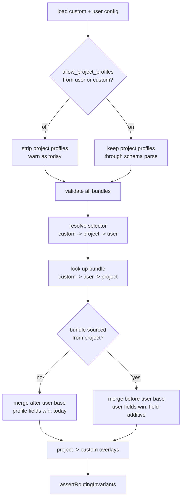

# feat: Opt-in project-defined model profiles

## Overview

A repository that declares its own OpenCode provider cannot ship the routing that consumes it. Project config may select a named profile but never define one, so every teammate hand-installs the same profile into their own user config, and the routing lives in a global file that is dead weight in every other repository.

This adds a user-owned opt-in that lets a repository define profiles. Project-defined bundles are **advisory**: they supply routing only where user-owned config is silent, and can never override or partially clobber a value the user set. The guarantee is structural, not policy — it comes from merge position and merge granularity, not from a check that could be forgotten.

Each user enables this for themselves. That is deliberate: an opt-in a repository could trigger would not be one. The feature removes the need to *author and maintain* repo-specific routing in a global file; it does not, and should not, remove the per-user consent step.

## Problem Frame

`profiles` is in `PROJECT_PROTECTED_FIELDS` (`src/lib/config.ts:301`) and is stripped pre-validation by `stripProjectProtectedFields` (`:870-878`), with a warning emitted from `loadConfigWithSources` (`:1383-1397`). `lookupProfileBundle` (`:1048-1064`) consults only custom then user, so a project-selected name can never resolve to project-defined content.

The boundary exists to stop a cloned repository from binding a named agent to a repo-chosen endpoint the user never authored. That rationale is sound and this plan does not discard it — it makes the binding advisory instead of authoritative, so consent is meaningful rather than total.

Issue #993 originally proposed a second fallback: letting project config set `agents` and `categories` directly. That is discarded. `SECURITY_OVERLAY_FIELDS` carries `skills` and `permission`, so loosening it to solve a routing problem risks loosening capability grants. `ProfileOverlaySchema` (`src/lib/config-schema.ts:303-320`) is `.strict()` over `model`, `variant`, `temperature`, `top_p`, `opencode`, `pi` and rejects `permission`, `skills`, `mode`, `hidden`, `disable`, `steps`, `color` at parse time — a profile bundle is structurally incapable of granting a capability, which makes it the strictly narrower surface.

## Requirements Trace

- R1. User-owned config may enable project-defined profiles with `allow_project_profiles`; default off reproduces today's behaviour exactly.
- R2. The opt-in is readable only from user and `OPENCODE_CONFIG_DIR` config, and is itself project-protected — a repository cannot authorise itself.
- R3. When enabled, project config may define `profiles`, subject to the same schema and load-time validation user-defined bundles receive.
- R4. A project-defined bundle supplies routing only for targets user-owned config does not set. It can never override a user-set field.
- R5. Partial overlap on one agent fills gaps field by field, including inside `opencode` and `pi` blocks — a user setting one qualifier must not erase the project's model for that agent.
- R6. When the same profile name is defined in both user and project config, the user's bundle is the one that resolves. This governs lookup, not selection — a repository may still choose which name is active (see R10 for the user's override).
- R7. Profile provenance is visible: `config show` names the file that defined the active bundle.
- R8. Per-target routing attribution makes the advisory outcome legible — a user can tell whether a project bundle applied, partially applied, or did nothing.
- R9. `systematic capabilities` continues to exit 0 and report accurately.
- R10. A `SYSTEMATIC_PROFILE` environment variable selects the active profile and outranks every config source, so a user can always override a repository's selection without editing a file.

## Scope Boundaries

- The opt-in is a boolean, not a per-repository path allowlist. Advisory semantics mean an enabled repository can only fill gaps, so binding consent to specific paths buys much less than it would under authoritative semantics.
- No new vocabulary: project-defined bundles are ordinary named profiles, not a separate `project:`-prefixed namespace or a parallel "advisory layer" concept.
- `SECURITY_OVERLAY_FIELDS` is unchanged. `profiles` stays in `PROJECT_PROTECTED_FIELDS` and remains stripped when the opt-in is off.
- The repository keeps winning profile *selection* for its own repository. That is the feature, not a defect to engineer around.

### Deferred to Separate Tasks

- Per-repository path allowlist for the opt-in: revisit only if advisory semantics prove insufficient in practice.
- `ARCHITECTURE.md:62` documents config priority as `env > project > user`, contradicting both the code and `AGENTS.md:298-300`. Pre-existing and unrelated to this work; fix as its own docs change.

## Context & Research

### Relevant Code and Patterns

- Merge seam: `resolveOverlayEntryValue(previous, next, source)` (`src/lib/config.ts:2015-2029`), called from `mergeOverlayMap` (`:1969-2005`). Already a per-key policy switch between profile merge, project preserve, and whole-entry replacement — the advisory rule is a branch here, not a new chain.
- `mergeProfileOverlayValue` (`:2086-2120`) already performs field-additive merging including one level into `opencode`/`pi`. It is the right machinery for R5; only the winning side differs.
- `preserveSecurityFields` (`:2063-2074`) is the existing precedent for "carry fields forward across a lower-trust overlay".
- Selection: `resolveProfileSelector` (`:1022-1035`, custom → project → user), `lookupProfileBundle` (`:1048-1064`, custom → user), `resolveActiveProfile` (`:1100-1173`), `ProfileSelectionResult.bundleSource` (`:987-1000`).
- Validation order: `assertAllProfileBundlesAreValid` (`:1895-1906`) runs before selection; `assertRoutingInvariants` (`:1908-1953`) runs after the merge.
- Overlay provenance (`sourcePath`, `keyPath`) survives the merge and is discarded only at `overlayValues` (`:2219-2228`) and `getOverlayValue` (`src/lib/routing-resolver.ts:100-104`).
- Strip order: `loadConfigSource` (`:728-793`) strips project-protected fields, then project security-overlay fields, then runs `SystematicConfigSchema.safeParse`.

### Institutional Learnings

- `docs/solutions/best-practices/layered-trust-boundaries-overlay-config-2026-05-09.md` — new config fields must be classified against the trust boundary first, and a lower-trust overlay must not erase a higher-trust field by same-key replacement. This plan is an explicit, consented relaxation for routing-only content; R4/R5 are how it stays compliant, and U4 is where that is proven.
- `docs/solutions/best-practices/verify-a-no-change-claim-against-the-consumer-2026-09-08.md` — "rejected", "stripped", and "preserved from a previous layer" look identical from a distance. "Does not override explicit user config" must be proven by a test that fails under the wrong semantics, not asserted in prose.
- `docs/solutions/documentation-gaps/opencode-plugin-config-key-is-singular-plugin-not-plugins-2026-07-18.md` — config that appears accepted but has no effect is a serious failure shape. Advisory semantics make full absorption a *normal* outcome, which is exactly why R8 is in scope rather than deferred.
- `docs/solutions/best-practices/content-integrity-mirror-runtime-drop-rules-2026-05-17.md` — when the runtime silently drops a malformed value, gates must enforce the same survival conditions.

Coverage gaps found: no existing solution doc covers the profiles merge chain, `config show` provenance, or the capability-snapshot allowlist.

## Prior-Art Survey

```json
{
  "schema_version": 2,
  "verdict": "build-new-within-scope",
  "scope": "src/lib/config.ts merge chain and adjacent consumers (src/lib/config-schema.ts, src/lib/routing-resolver.ts, src/cli.ts, and profile/config tests)",
  "freshness": {
    "vcs_reference": "main@da7165e",
    "scope_baseline": "HEAD da7165e; surveyed current config merge/selection/CLI/test surface on 2026-09-18"
  },
  "budget": {
    "max_search_passes": 3,
    "max_candidate_inspections": 10,
    "exhausted": false
  },
  "candidates": [
    {
      "path_or_symbol": "src/lib/config.ts::mergeProfileOverlayValue",
      "description": "Field-preserving merge for an active profile bundle over an existing overlay value; it keeps absent fields from the previous value and merges opencode/pi blocks one level deep.",
      "disposition": "insufficient",
      "insufficiency_reason": "It is profile-specific and still lets any field explicitly set by the profile win, so it is not a general lower-trust fill-gaps layer."
    },
    {
      "path_or_symbol": "src/lib/config.ts::preserveSecurityFields",
      "description": "Project-trust overwrite helper that keeps protected routing fields from the previous value while letting the non-protected remainder of the next value through.",
      "disposition": "insufficient",
      "insufficiency_reason": "It only protects the SECURITY_OVERLAY_FIELDS subset on project overlays; it is not a general routing layer that fills only when the higher-trust layer is silent."
    },
    {
      "path_or_symbol": "src/lib/config.ts::resolveOverlayEntryValue",
      "description": "Per-key merge-policy switch that chooses profile merge, project preserve, or replacement for same-key overlay entries.",
      "disposition": "insufficient",
      "insufficiency_reason": "It is a decision point, not a reusable fill-gaps implementation, and its existing branches are keyed to current provenance classes rather than a generic defaults layer."
    }
  ],
  "excluded_scopes": [
    {
      "scope": "src/lib/agent-overlays.ts",
      "reason": "It validates bundled overlay targets and aliases, but it does not own load-time merge policy or provenance retention for config routing."
    },
    {
      "scope": "scripts/generate-config-schema.ts",
      "reason": "It generates and checks schema artifacts, but it does not contain the runtime merge path where a fill-gaps layer would live."
    }
  ]
}
```

## Key Technical Decisions

- **Advisory, not authoritative.** A project-defined bundle fills gaps only. This is modelled on oh-my-opencode-slim, whose preset activation merges the preset as the base and resolved agents as the override (`deepMerge(preset, config.agents)`), so explicit config always wins. That property is why OMO needs no trust gate at all; Systematic keeps the gate as cheap defence-in-depth while borrowing the property that does the real work.

- **Chain position follows provenance, not a new layer.** When the active bundle came from project config it merges *before* user base; when it came from user or custom config it merges after, exactly as today. One conditional at an existing insertion point.

- **Anti-shadowing by lookup order, not namespacing.** `lookupProfileBundle` becomes custom → user → project. A user-defined name always wins, so a repository cannot re-point a selection that already resolves. This achieves what a `project:<name>` prefix would without introducing a second naming vocabulary.

- **Fill gaps field by field.** Whole-entry replacement has a demonstrable hard failure: a user setting only `opencode.variant` on an agent the project also routes would erase the project's model, leaving a qualifier with no model and failing `assertRoutingInvariants` — breaking config load entirely as a consequence of customising one field. Field-additive merging reuses `mergeProfileOverlayValue` with the winning side reversed.

- **Selection and definition stay coupled.** A project-defined bundle is selectable. The use case is a teammate cloning the repository and getting the routing; a bundle the repository cannot activate would not deliver it.

- **The repository owns selection; the merge owns trust.** Who *defines* a bundle is a trust question. Which bundle is *active* is a convenience question, and it has no teeth once activation is advisory. `resolveProfileSelector` already resolves custom → project → user, so a repository already wins selection today and that stays unchanged. oh-my-opencode-slim makes the same split deliberately: its project config overwrites the user's `preset` outright, which is safe there only because the activated preset still loses to explicit `agents` config.

  The consequence to document rather than prevent: inside an opted-in repository that selects its own bundle, your user-defined profile is not the active one. Every `agents` and `categories` value you set at top level still wins over anything the repository's bundle supplies, so you lose your profile's overrides in that repository and keep your explicit routing.

- **`SYSTEMATIC_PROFILE` is the escape hatch that makes repository selection comfortable.** Applied after the config merge, outranking every source, mirroring `OH_MY_OPENCODE_SLIM_PRESET`. Without it, disagreeing with a repository's selection means editing a file; with it, it means exporting a variable.

  This reverses a decision in `docs/brainstorms/2026-09-04-model-config-profiles-requirements.md`, which rejected an environment override as "process-global and a trust escalation". That rejection targeted *defining* config through the environment. This is selection-only: it chooses among bundles that already exist in files the user or repository controls, cannot introduce content, and cannot raise trust. It is strictly more user authority, exercised at the user's own shell.

- **Provenance lands on `SourceAwareConfigResult`, not loader metadata.** `normalizeConfigObservation` allowlists loader-metadata keys and throws on any unknown key (`src/lib/capability-snapshot.ts:639-660`, locked by `tests/unit/capability-snapshot.test.ts:385-409`); `runCapabilities` catches that and prints `Capabilities diagnostic unavailable`, exit 1. Adding the field to loader metadata would take out `systematic capabilities` with a message naming no cause.

- **Print the non-canonical path.** `config show`'s existing location block prints `getConfigPaths` values. Printing `canonicalPath` would disagree with it for anyone whose `~/.config/opencode` is a symlink into a dotfiles repo.

## Open Questions

### Resolved During Planning

- Should project bundles be a named profile or a separate advisory layer? **Named profile.** Definition and selection are coupled — an unselectable bundle cannot deliver the clone-and-go use case.
- Namespaced `project:<name>` or merged? **Neither.** Lookup order with project last gives the same anti-shadowing guarantee without new vocabulary.
- Boolean or path allowlist? **Boolean.** Advisory semantics carry the safety; an allowlist adds consent granularity disproportionate to what an enabled repository can actually do.
- Does an invalid project bundle block the load even when it is not the active profile? **Yes** — matching how user and custom bundles already behave. A malformed bundle in a shared repository is a repository bug and should surface immediately rather than only for whoever selects it.
- Should a user-set `profile` outrank a project-set `profile`? **No.** Document review raised this as a defeat of the advisory guarantee, on the grounds that a repository can deactivate the user's chosen profile. The guarantee holds where it matters: the user's top-level `agents`/`categories` routing still wins over everything the repository's bundle supplies. Selection precedence is unchanged, and `SYSTEMATIC_PROFILE` (R10) provides the override.

### Deferred to Implementation

- Exact signature of the advisory branch in `resolveOverlayEntryValue` — whether the merge direction is expressed as a flag on the profile entry, a distinct source kind, or a separate helper. Decide against the real call site.
- Whether per-target attribution (U6) needs a new field on `SourcedOverlayConfig` or can be derived from the `keyPath` already recorded for profile bundles (`profiles.<name>...`).
- Whether the existing `missing-profile` fallback warning needs new wording when the missing name would have resolved had the opt-in been enabled.

## High-Level Technical Design

> *This illustrates the intended approach and is directional guidance for review, not implementation specification. The implementing agent should treat it as context, not code to reproduce.*



The advisory guarantee is the `H -> J` edge combined with field-additive granularity. Nothing else enforces it, and nothing else needs to.

## Implementation Units

- [ ] **Unit 1: Add the opt-in field**

**Goal:** `allow_project_profiles` exists, is user-owned, and is inert.

**Requirements:** R1, R2

**Dependencies:** None

**Files:**
- Modify: `src/lib/config-schema.ts`
- Modify: `src/lib/config.ts`
- Test: `tests/unit/config.test.ts`
- Test: `tests/unit/config-schema.test.ts`

**Approach:**
- Declare the field on the top-level schema with the established `.meta({ trust: ... })` convention; default `false`.
- Add the name to `PROJECT_PROTECTED_FIELDS` so `stripProjectProtectedFields` removes it from a project source before validation.
- No behavioural wiring in this unit — the flag is read but nothing consumes it yet.

**Patterns to follow:** the existing `workflow_guard` entry in `PROJECT_PROTECTED_FIELDS`; `createSystematicConfigSchema` field declarations.

**Test scenarios:**
- Happy path: user config sets the flag true; the loaded config reports it true.
- Happy path: `OPENCODE_CONFIG_DIR` config sets it true and user config sets it false; custom wins.
- Edge case: neither source sets it; effective value is false.
- Error path: project config sets it true; the value is stripped, the effective value stays false, and a protected-field warning names it.
- Integration: the generated JSON schema includes the field and the schema drift gate passes.

**Verification:** flag resolves from user and custom only; every pre-existing config test stays green.

- [ ] **Unit 2: Gate the strip on the opt-in**

**Goal:** With the opt-in on, project `profiles` survives into the parsed project source.

**Requirements:** R1, R3

**Dependencies:** Unit 1

**Files:**
- Modify: `src/lib/config.ts`
- Test: `tests/unit/config.test.ts`

**Approach:**
- The opt-in is resolved from user and custom sources before the project source is loaded, since it decides how the project source is parsed. This is a reordering, not a clarification: `loadConfigWithSources` currently loads user → project → custom (`src/lib/config.ts:1356-1377`), so a custom-set opt-in is not yet known when the project source is parsed and stripped. Either hoist the opt-in resolution ahead of all three loads or read it in a bounded first pass.
- That reordering lands on the project/custom alias machinery added in #1002, where both paths can resolve to the same canonical file and the project pass buffers its strip warnings pending the custom pass. Re-verify the alias tests rather than assuming the reorder is behaviour-neutral.
- Make the `profiles`-ignored warning conditional. Its current text ends "Its bundles are not selectable even if this project also sets `profile`" — that sentence is false under the opt-in, so this is a wording change, not just a guard.
- Leave the stripping path untouched when the flag is off.

**Execution note:** the opt-in-off path is covered by an existing test that must not change; add the opt-in-on coverage test-first against the unmodified strip so the gate is proven to be what flipped the behaviour.

**Patterns to follow:** the bounded/aliased warning machinery reworked in `loadConfigWithSources`.

**Test scenarios:**
- Happy path: flag off, project defines `profiles` — stripped, warned, not selectable. This is the existing locked behaviour and must stay green unchanged.
- Happy path: flag on, project defines `profiles` — survives schema parse and is present on the project source.
- Edge case: flag on, project defines no `profiles` — no warning, no change.
- Error path: flag on, project `profiles` is malformed — rejected by `safeParse` with the normal schema error, not silently dropped.
- Edge case: flag on and the warning is not emitted; assert on a captured sink that no "not selectable" text appears.

**Verification:** the locked strip test passes unmodified with the flag off, and project bundles are present on the source with it on.

- [ ] **Unit 3: Validate and look up project bundles**

**Goal:** Project-defined bundles are validated with every other bundle and are resolvable by name, ranked last.

**Requirements:** R3, R6

**Dependencies:** Unit 2

**Files:**
- Modify: `src/lib/config.ts`
- Test: `tests/unit/config.test.ts`

**Approach:**
- `assertAllProfileBundlesAreValid` takes the project bundles as a third argument at its existing call site — validate-all-then-select is already the shape, so no reordering is needed.
- `lookupProfileBundle` consults custom → user → project. Project last is the entire anti-shadowing mechanism.
- `ProfileSelectionResult.bundleSource` must attribute a project-sourced bundle to the project file.

**Test scenarios:**
- Happy path: project defines and selects a name that exists nowhere else; it resolves and `bundleSource` names the project file.
- Happy path: the same name exists in user and project config; the user bundle wins and `bundleSource` names the user file.
- Happy path: the name exists in custom and project; custom wins.
- Error path: a project bundle references an unknown agent key; rejected at parse time.
- Error path: a project bundle names an unknown category; rejected by `assertAllProfileBundlesAreValid`.
- Error path: an invalid project bundle that is *not* the selected profile still fails the load.
- Edge case: flag on, project selects a name that exists nowhere; existing missing-name fallback behaviour is unchanged.

**Verification:** a project-only name resolves; a colliding name resolves to the user bundle; invalid bundles fail the load regardless of selection.

- [ ] **Unit 4: Advisory merge**

**Goal:** A project-sourced active bundle supplies routing only where user-owned config is silent, field by field.

**Requirements:** R4, R5

**Dependencies:** Unit 3

**Files:**
- Modify: `src/lib/config.ts`
- Test: `tests/unit/config.test.ts`

**Approach:**
- Insert the active bundle before user base when it is project-sourced, after when it is not.
- Add the advisory branch to `resolveOverlayEntryValue`, reusing `mergeProfileOverlayValue`'s field-additive traversal with the user-owned side winning every field it sets, including one level into `opencode` and `pi`.
- Overlay entry provenance must record that a surviving value came from a project-sourced bundle — Unit 6 depends on it.

**Execution note:** this unit carries the plan's central guarantee. Write the partial-overlap and full-absorption tests first; both must fail under whole-entry replacement before the branch exists.

**Technical design:** *(directional)* the existing merge already distinguishes "profile over base" from "project over previous". The advisory case is "base over profile" with the same traversal — same walk, opposite winner.

**Patterns to follow:** `mergeProfileOverlayValue`, `preserveSecurityFields`.

**Test scenarios:**
- Happy path: project bundle routes an agent the user config never mentions; the project value applies.
- Happy path: user config sets `model` on an agent the project bundle also sets; the user value survives and the project value does not appear.
- Edge case (the load-failure trap): user sets only `opencode.variant` on an agent whose project bundle sets `opencode.model` and `pi.model`; the user qualifier and both project models all survive, and `assertRoutingInvariants` passes.
- Edge case: every target the project bundle sets is already set by user config; the merged result is byte-identical to the result with no project bundle at all.
- Edge case: a user-sourced profile is active while an opted-in project bundle also exists; the user profile retains override semantics over user base.
- Edge case: project bundle sets a category-level value the user sets at agent level, and the reverse.
- Error path: a project bundle sets a qualifier with no model resolvable anywhere; `assertRoutingInvariants` still throws.
- Integration: routing resolved through `resolveRouting` reflects the advisory outcome, not just the overlay map.

**Verification:** no user-set field is ever replaced by a project-sourced bundle, and partial overlap on one agent never erases an unrelated field.

- [ ] **Unit 5: Profile provenance in `config show`**

**Goal:** The file that defined the active profile is visible without opening anything.

**Requirements:** R7, R9

**Dependencies:** Unit 2, Unit 3

**Files:**
- Modify: `src/lib/config.ts`
- Modify: `src/cli.ts`
- Test: `tests/unit/cli.test.ts`
- Test: `tests/unit/capability-snapshot.test.ts`

**Approach:**
- Carry the defining path on `SourceAwareConfigResult`, which is not an input to the capability snapshot. Do not add it to loader metadata.
- Add a `Defined in:` line beside the existing `Selected by:` line, and the same field to the `--json` branch.
- Print `bundleSource.path`, not `canonicalPath`, so it agrees with the configuration-locations block.
- Source it from `profileSelection.bundleSource` only. The merged overlay map's `sourcePath` is last-writer-wins per key and will misattribute.

**Test scenarios:**
- Happy path: a user-defined active profile prints the user config path.
- Happy path: a profile defined only in `OPENCODE_CONFIG_DIR` prints the custom path.
- Happy path: with the opt-in on, a project-defined active profile prints the project config path.
- Edge case: no active profile; the line is absent rather than empty.
- Edge case: the config directory is a symlink; the printed path matches the locations block above it.
- Integration: `systematic capabilities` exits 0 with the new field present — the regression this placement exists to prevent.
- Integration: `--json` output carries the field and stays within the file-paths-only contract.

**Verification:** every definition source prints its own path, and `systematic capabilities` still exits 0.

- [ ] **Unit 6: Per-target routing attribution**

**Goal:** A user can tell whether a project bundle applied, partially applied, or did nothing.

**Requirements:** R8

**Dependencies:** Unit 4, Unit 5

**Files:**
- Modify: `src/lib/routing-resolver.ts`
- Modify: `src/cli.ts`
- Test: `tests/unit/cli.test.ts`
- Test: `tests/unit/routing-resolver.test.ts`

**Approach:**
- `RoutingFieldSource` currently carries `level` and `form` — shape provenance, not file provenance — and `getOverlayValue` discards entry metadata. Carry a source kind through to the routing table.
- Render it in the prose routing table and in `--json`.
- This is what makes full absorption observable. Advisory semantics make "applied nothing" a normal outcome, so without this the feature can be enabled and do nothing with no way to see why.

**Test scenarios:**
- Happy path: a target filled by the project bundle reports a project-profile source kind.
- Happy path: a target set by user config over a project bundle reports a user source kind.
- Edge case (full absorption): every target reports a user source kind while an active project bundle exists — the state that is otherwise indistinguishable from the bundle not existing.
- Edge case (partial): one agent reports a user-sourced qualifier and a project-sourced model on the same row.
- Edge case: a user-sourced active profile reports a profile source kind distinct from user base.
- Integration: `--json` source kinds agree with the prose table for the same load.

**Verification:** all five states below are distinguishable from `config show` output alone.

The five states this surface must separate:

| State | Condition | What the user must be able to see |
|---|---|---|
| Off, bundle present | opt-in off, project defines `profiles` | stripped and warned, as today |
| On, no bundle | opt-in on, project defines nothing | no profile activity at all |
| On, fully absorbed | every project target already set by user config | an active project bundle whose every target reports a user source |
| On, partially applied | user config covers some targets | mixed source kinds, visible per target |
| On, fully applied | user config covers none of them | every target reports a project-profile source |

The third row is the one that is otherwise indistinguishable from the bundle not existing, and is the reason this unit is in scope.

- [ ] **Unit 7: `SYSTEMATIC_PROFILE` environment override**

**Goal:** A user can override the active profile from their shell, outranking every config source.

**Requirements:** R10

**Dependencies:** None — independent of the opt-in and separately shippable; it may land before Unit 1.

**Files:**
- Modify: `src/lib/config.ts`
- Modify: `src/cli.ts`
- Test: `tests/unit/config.test.ts`
- Test: `tests/unit/cli.test.ts`

**Approach:**
- Consult `SYSTEMATIC_PROFILE` in `resolveProfileSelector` ahead of every config source.
- Selection only. The variable names a bundle; it can never supply bundle content, so it introduces no new trust surface.
- An unresolvable name follows the existing missing-name fallback rather than failing the load, matching how a bad project selector already behaves.
- `config show` must report the environment as the selector source so an override is not mistaken for a config setting.

**Patterns to follow:** `OPENCODE_CONFIG_DIR` is the only environment variable the loader reads today (`src/lib/config.ts:1849`); follow its access pattern. `OH_MY_OPENCODE_SLIM_PRESET` is the external precedent for the semantics.

**Test scenarios:**
- Happy path: the variable names a user-defined profile while user config selects a different one; the variable wins.
- Happy path: the variable wins over a project-set selector.
- Happy path: the variable wins over a custom-set selector, which is otherwise the strongest source.
- Edge case: the variable is set to a name that exists nowhere; existing missing-name fallback applies, with a warning naming the environment as the source.
- Edge case: the variable is set but empty; treated as unset rather than as a selection of `""`.
- Edge case: the variable names a project-defined bundle while the opt-in is off; the name does not resolve and the fallback applies.
- Integration: `config show` reports the environment as the selector source, and `--json` agrees.

**Verification:** the variable outranks all three config sources; an unresolvable value degrades rather than failing the load.

- [ ] **Unit 8: Documentation**

**Goal:** The opt-in, the advisory guarantee, the selection consequence, the environment override, and the trust rationale are documented.

**Requirements:** R1, R4, R10

**Dependencies:** Unit 6, Unit 7

**Files:**
- Modify: `ARCHITECTURE.md`
- Modify: `docs/src/content/docs/reference/configuration.mdx`
- Test: `tests/unit/generate-config-reference.test.ts`

**Approach:**
- Document the opt-in, that it is user-owned, and that project bundles fill gaps only and cannot override user-set routing.
- Extend the existing named-model-profiles section in `ARCHITECTURE.md` with the provenance-dependent chain position.
- State the relaxation honestly: this is a deliberate, consented change to a documented trust boundary, not a merge refinement.
- Document that a repository selects the active profile for its own repository, that the user's top-level routing still wins, and that `SYSTEMATIC_PROFILE` overrides the selection.
- State what enabling the opt-in actually grants: an opted-in repository may route agents the user has not routed to endpoints that repository declares. Routing is an endpoint choice, not only a performance knob, and `config show` per-target attribution (Unit 6) is how a user inspects it.
- Record the reversal of the brainstorm's environment-override rejection, with the selection-only reasoning.

**Test scenarios:**
- Integration: `bun run docs:generate` produces no diff against the committed reference page.
- Integration: the config reference includes the new field with its trust level.

**Verification:** docs generation is drift-free and `bun scripts/content-integrity.ts` is clean.

## System-Wide Impact

- **Interaction graph:** `loadConfigWithSources` runs on every plugin activation and on every CLI invocation. Config-loader changes have the widest blast radius in the package.
- **Error propagation:** project bundle errors must surface as ordinary config load errors with the project file named. They must not degrade into the plugin silently contributing nothing — the failure mode #992 just fixed.
- **State lifecycle risks:** the opt-in must be resolved before the project source is parsed, since it changes how that source is parsed. Getting this ordering wrong strips the bundle before the flag is consulted.
- **API surface parity:** `config show` prose, `config show --json`, and `systematic capabilities` must agree. The Pi and Claude Code surfaces consume resolved routing, not the profiles map, so they need no change — but the routing they receive can now include project-sourced values.
- **Integration coverage:** the advisory guarantee must be proven through `resolveRouting`, not only against the overlay map. A merge that is correct internally but projected wrongly is the same bug to a user.
- **Unchanged invariants:** `SECURITY_OVERLAY_FIELDS` is untouched. `ProfileOverlaySchema` stays routing-only, so no project-supplied content can reach `permission` or `skills`. With the opt-in off, every existing behaviour is byte-identical, and the test locking project-profile stripping passes unmodified.

## Risks & Dependencies

| Risk | Mitigation |
|------|------------|
| The advisory guarantee is asserted but implemented as something subtly different | U4 test-first, including a case that fails under whole-entry replacement; full-absorption test asserts byte-identical output versus no project bundle |
| Enabled repository silently does nothing, user cannot tell why | U6 is in scope rather than deferred; full absorption is an explicitly tested, visible state |
| A new loader-metadata field breaks `systematic capabilities` with no diagnostic | Provenance lands on `SourceAwareConfigResult`; U5 carries an explicit exit-0 regression test |
| Opt-in resolved after the project source is parsed, so the strip wins | Ordering is called out in U2 and covered by the flag-on survival test |
| Trust-boundary relaxation is under-documented and later mistaken for a bug | U7 states the relaxation and its consent rationale explicitly |
| Config-loader regression reaches every activation | Opt-in defaults off and the off-path is locked by unmodified existing tests |

## Documentation / Operational Notes

- No migration. The feature is inert until a user opts in.
- Repositories can ship `profiles` today and have them ignored; after this change the same file becomes live for users who opt in. Worth calling out in release notes, since the repo-side artifact does not change — only the consumer-side flag does.

## Sources & References

- Issue: #993 — project config cannot define `profiles`
- Related: #992 (closed by #1002) — unrecognized project-config keys previously failed the whole load, which made project-config edits disproportionately risky and gated this work
- Prior requirements: `docs/brainstorms/2026-09-04-model-config-profiles-requirements.md` (R9 and the "profile definitions are user-only" decision this plan revisits)
- Prior plan: `docs/plans/2026-09-04-002-feat-model-config-profiles-plan.md`
- Trust boundary: `docs/solutions/best-practices/layered-trust-boundaries-overlay-config-2026-05-09.md`
- Reference implementation for advisory semantics: oh-my-opencode-slim preset activation, `deepMerge(preset, config.agents)`
