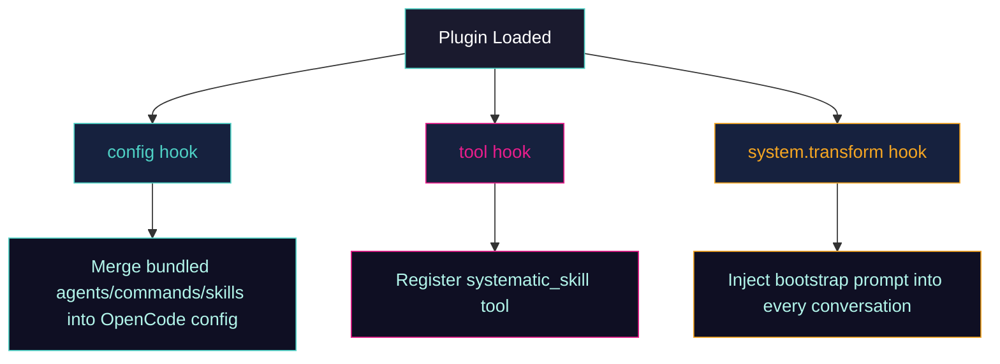

Systematic is designed as a lightweight yet powerful extension for OpenCode. It leverages native plugin hooks to inject structured workflows and specialized agents into your development environment.

## Overview

The plugin is divided into two main parts:
1.  **TypeScript Source (`src/`):** The core logic that handles plugin registration, asset discovery, and conversion.
2.  **Bundled Assets (`skills/`, `agents/`, `commands/`):** Battle-tested engineering content that is automatically discovered and registered by the plugin.

## How It Works

Systematic utilizes three primary OpenCode plugin hooks to integrate seamlessly:

### 1. `config` Hook
The `config` hook is responsible for discovery and merging. It recursively walks the bundled asset directories (`skills/`, `agents/`, `commands/`) and merges their definitions into your active OpenCode configuration. This ensures that agents like `@architecture-strategist` are available without manual setup.

### 2. `tool` Hook
The plugin registers a custom tool called `systematic_skill`. This tool is used by the AI to load the full content of bundled skills on demand. While OpenCode has a native `skill` tool, `systematic_skill` provides optimized access to the plugin's bundled content.

### 3. `system.transform` Hook
This hook allows Systematic to inject a "bootstrap" instruction into the AI's system prompt at the start of every conversation. This instruction (from the `using-systematic` skill) teaches the AI how to:
- Discover available workflows.
- Use the `systematic_skill` tool.
- Follow the "invoke before response" discipline.

## Code Map

For developers looking to contribute or understand the implementation, here are the key modules:

| Symbol | Role | Location |
|--------|------|----------|
| `SystematicPlugin` | Main plugin factory | `src/index.ts` |
| `createConfigHandler` | Implements the `config` hook logic | `src/lib/config-handler.ts` |
| `createSkillTool` | Implements the `systematic_skill` tool | `src/lib/skill-tool.ts` |
| `getBootstrapContent` | Handles system prompt injection | `src/lib/bootstrap.ts` |
| `convertContent` | Handles CEP to OpenCode format conversion | `src/lib/converter.ts` |
| `findSkillsInDir` | Discovers bundled skills | `src/lib/skills.ts` |

## Technical Stack

Systematic is built with modern web technologies:
- **Runtime:** [Bun](https://bun.sh/) (Node.js API compatible)
- **Language:** TypeScript 5.7+ in strict mode
- **Modules:** ESM (`"type": "module"`)
- **Linter:** [Biome](https://biomejs.dev/)
- **Testing:** `bun:test`
