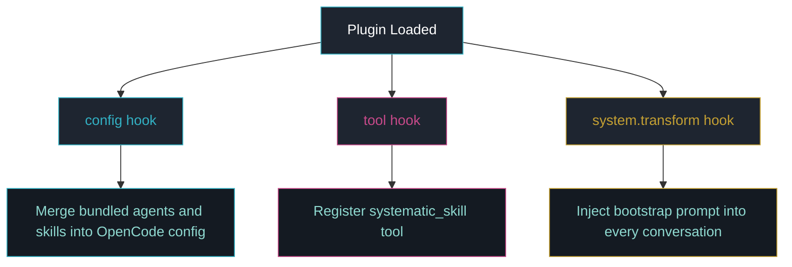

Systematic is designed as a lightweight yet powerful extension for OpenCode. It leverages native plugin hooks to inject structured workflows and specialized agents into your development environment.

## Overview

The plugin is divided into two main parts:
1.  **TypeScript Source (`src/`):** The core logic that handles plugin registration, asset discovery, config validation, and model availability resolution.
2.  **Bundled Assets (`skills/` and `agents/`):** Structured engineering workflows and specialized agent definitions that are automatically discovered and registered by the plugin.

## How It Works

Systematic utilizes three primary OpenCode plugin hooks to integrate seamlessly:

```mermaid
flowchart TB
    A[Plugin Loaded] --> B[config hook]
    A --> C[tool hook]
    A --> D[system.transform hook]

    B --> E[Merge bundled agents and skills into OpenCode config]
    C --> F[Register systematic_skill tool]
    D --> G[Inject bootstrap prompt into every conversation]

    style A fill:#1e2530,stroke:#33b1c4,color:#fff
    style B fill:#1e2530,stroke:#33b1c4,color:#33b1c4
    style C fill:#1e2530,stroke:#c74a8a,color:#c74a8a
    style D fill:#1e2530,stroke:#c4a033,color:#c4a033
    style E fill:#141a22,stroke:#33b1c4,color:#8fd9d0
    style F fill:#141a22,stroke:#c74a8a,color:#8fd9d0
    style G fill:#141a22,stroke:#c4a033,color:#8fd9d0
```

### 1. `config` Hook
The `config` hook is responsible for discovery and merging. It recursively walks the bundled asset directories (`skills/` and `agents/`) and merges their definitions into your active OpenCode configuration. This ensures that agents like `@architecture-strategist` are available without manual setup.

### 2. `tool` Hook
The plugin registers a custom tool called `systematic_skill`. This tool is used by the AI to load the full content of bundled skills on demand. While OpenCode has a native `skill` tool, `systematic_skill` provides optimized access to the plugin's bundled content.

`systematic_skill` takes an optional `arguments` string. If the skill text contains `$ARGUMENTS`, that gets replaced with the whole string. If it contains `$1`, `$2`, and so on, those get replaced with positional values (quoted text counts as one value, and the highest-numbered placeholder takes the rest of the string) — the same rules OpenCode uses for its own slash commands. If the skill has none of these placeholders, the argument text is appended after the skill body instead. Leaving `arguments` out entirely leaves any placeholders in the skill text untouched. This is text substitution only — it never executes anything.

OpenCode truncates plugin tool output at 2,000 lines or 50 KB by default. Systematic restores the full skill text after that cut so large skills still arrive complete. If your own config sets `tool_output.max_lines` or `tool_output.max_bytes`, Systematic honors your limit and skips the restore. One caveat: if you enable OpenCode's `compaction.prune` setting, a `systematic_skill` result can still be cleared later in a long conversation — OpenCode only protects its own built-in `skill` tool from pruning.

### 3. `system.transform` Hook
This hook allows Systematic to inject a "bootstrap" instruction into the AI's system prompt at the start of every conversation. This instruction (from the `using-systematic` skill) teaches the AI how to:
- Discover available workflows.
- Use the `systematic_skill` tool.
- Follow the "invoke before response" discipline.

## Code Map

For developers looking to contribute or understand the implementation, here are the key modules:

| Symbol | Role | Location |
|--------|------|----------|
| `SystematicPlugin` | Main plugin factory | `src/index.ts` |
| `createConfigHandler` | Implements the `config` hook logic | `src/lib/config-handler.ts` |
| `createSkillTool` | Implements the `systematic_skill` tool | `src/lib/skill-tool.ts` |
| `getBootstrapContent` | Handles system prompt injection | `src/lib/bootstrap.ts` |
| `findSkillsInDir` | Discovers bundled skills | `src/lib/skills.ts` |
