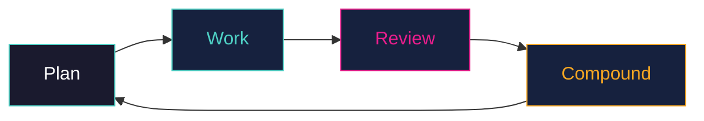

At the heart of Systematic is a four-step loop adapted from battle-tested compound engineering principles:

This loop transforms your AI assistant from a simple code generator into a disciplined engineering collaborator. By following this cycle, you ensure that every change is researched, executed in isolation, rigorously reviewed, and documented for the future.

---

## 1. Plan

The plan phase turns an idea into a blueprint. Before a single line of code is written, the AI researches your codebase, gathers framework documentation, and identifies potential edge cases.

**Command:** [`/workflows:plan`](/systematic/reference/commands/plan/)

### What happens in Plan:
1.  **Requirement Analysis:** The AI clarifies what you're building and why.
2.  **Codebase Research:** Using [`@repo-research-analyst`](/systematic/reference/agents/repo-research-analyst/), it identifies existing patterns and affected files.
3.  **External Research:** Using [`@framework-docs-researcher`](/systematic/reference/agents/framework-docs-researcher/), it consults live documentation for best practices.
4.  **Design Selection:** It proposes an approach, listing files to change and potential risks.
5.  **Validation:** You review the plan and tweak it until it's ready for implementation.

---

## 2. Work

The work phase executes the approved plan. Instead of you typing, you monitor the AI as it implements the solution step-by-step in an isolated environment.

**Command:** [`/workflows:work`](/systematic/reference/commands/work/)

### What happens in Work:
1.  **Isolation:** The AI sets up a git worktree or branch to keep your main workspace clean.
2.  **Execution:** It implements the plan incrementally, following the defined approach.
3.  **Verification:** It runs tests, linters, and type checks after significant changes.
4.  **Handoff:** Once complete, it creates a Pull Request (PR) for you to review.

---

## 3. Review

The review phase catches issues before they ship. Systematic launches multiple specialized agents in parallel to analyze your code from different perspectives.

**Command:** [`/workflows:review`](/systematic/reference/commands/review/)

### What happens in Review:
-   **Multi-Agent Audit:** Agents like [`@security-sentinel`](/systematic/reference/agents/security-sentinel/) and [`@architecture-strategist`](/systematic/reference/agents/architecture-strategist/) scan for vulnerabilities and design flaws.
-   **Prioritization:** Findings are categorized by severity (P1: Critical, P2: Important, P3: Minor).
-   **Resolution:** The AI addresses findings automatically, fixing P1 issues first, then P2.
-   **Validation:** Fixes are verified to ensure they address the feedback without introducing new regressions.

---

## 4. Compound

The compound phase turns today's solutions into tomorrow's advantages. By documenting solved problems, you build "institutional knowledge" that future AI agents can use.

**Command:** [`/workflows:compound`](/systematic/reference/commands/compound/)

### What happens in Compound:
1.  **Solution Capture:** The AI asks what you learned during the implementation.
2.  **Categorization:** It adds YAML frontmatter and tags for searchability.
3.  **Knowledge Base:** The solution is added to your documentation (e.g., `docs/solutions/`).
4.  **Continuous Improvement:** Next time a similar problem arises, agents will find this documentation and avoid repeating the same mistakes.

---

## Quick Reference

| Phase | Command | Primary Agent/Skill |
| :--- | :--- | :--- |
| **Plan** | `/workflows:plan` | `@repo-research-analyst` |
| **Work** | `/workflows:work` | `skill:git-worktree` |
| **Review** | `/workflows:review` | `@architecture-strategist` |
| **Compound** | `/workflows:compound` | `skill:compound-docs` |
| **Full Loop** | `/systematic:lfg` | All of the above (Autonomous) |

---

## Next Steps

Now that you understand the loop, learn how Systematic integrates with your environment in the [Architecture Guide](/systematic/guides/architecture/).
